# sensor-fusion-lab

**Kalman-filter state estimation for robotics — from a DSP engineer's angle.**

Estimation theory is where signal processing meets robotics. A Kalman filter is,
in DSP terms, a *time-varying optimal IIR filter* whose bandwidth adapts to the
ratio of process to measurement noise. This lab builds it from scratch and shows
where it wins — and where it doesn't.

🇰🇷 아래 한국어 병기.

🎮 **[Try the interactive SLAM demo →](https://yeonkyunlee.github.io/sensor-fusion-lab/slam_demo.html)**
Drive a robot, watch odometry drift, then a Gauss-Newton pose-graph optimizer snap the whole
loop shut — live in your browser (`slam_demo.html`, no libraries).

🩺 **[Try the interactive surgical-tremor demo →](https://yeonkyunlee.github.io/sensor-fusion-lab/tremor_demo.html)**
Move your mouse as a "surgeon's hand"; a real-time adaptive Fourier-Linear-Combiner cancels the
injected ~10 Hz physiological tremor so the robot tool tip tracks your intended motion (~6× tremor
suppression, live in-browser, no libraries).

📓 **Write-ups:** a 4-part blog series (incl. an EKF-SLAM debugging journey & medical safe-autonomy) —
see [blog/00_index.md](blog/00_index.md).

## Results at a glance

29 experiments, from scratch (numpy; torch only for the learned front-end), each verified
by a test. The arc: **classical filters → nonlinear → SLAM → graph back-ends → real
benchmarks → learning & systems integration → planning/control → new front-ends & a
medical application → full LiDAR SLAM & mapping → MPC & obstacle avoidance → wearable gait
→ a navigation capstone & 3D LiDAR SLAM.**

| # | experiment | headline result |
|---|------------|-----------------|
| 1–2 | KF tracking · position+IMU fusion | fusion 1.23 m, beats every single sensor; coasts through outage |
| 3 | EKF vs UKF (CTRV) | nonlinear model +22% on turns (EKF≈UKF, honest) |
| 4 | online IMU-bias estimation | outage drift −27%; observability made visible |
| 5 | EKF-SLAM | 17× over odometry (0.19 m traj, 0.11 m map) |
| 6–7 | loop closure → graph SLAM | one loop-closure edge, whole trajectory 5× |
| 8 | visual-inertial odometry (VIO) | IMU+bearing cuts drift 3× |
| 9 | uncertainty-aware safe autonomy | No-Fly-Zone violations 60% → **0%** |
| 10 | VIO front-end + factor-graph back-end | 2-lap drift 16.3 → 0.68 m (24×) |
| 11 | robust SLAM (Huber) | rejects false loop closures |
| 12 | full graph SLAM (pose+landmark BA) | pose 24×, map 20× |
| 13 | 3D SE(3) pose-graph SLAM | Lie-group manifold GN, 3× |
| 14 | **standard g2o benchmarks** | Intel χ² 5.15M→216, parking-garage(3D) 16.7k→1.3 |
| 15 | robust on real Intel + false closures | DCS recovers clean map (χ² 216) vs naive 23k |
| 16 | learned IMU front-end (1D-CNN) | denoise before dead-reckoning, 1.5× (ML+estimation) |
| 17 | online: fixed-lag vs batch | O(1)/step vs O(N) — speed/consistency tradeoff |
| 18 | **full SLAM system** | fixed-lag front-end + robust global back-end, 6× (integration) |
| 19 | planning (A*) + control (pure-pursuit) | reach goal, avoid no-go zone (estimation→action) |
| 20 | dynamic obstacle avoidance (DWA) | reach goal past 3 **moving** obstacles, 0.92 m clearance |
| 21 | ICP scan-matching (LiDAR odometry) | **9.3×** over raw dead-reckoning (0.13 vs 1.17 m) |
| 22 | **surgical tremor cancellation** (medical) | adaptive FLC **10.7×** tremor suppression, 37 µm tracking |
| 23 | **full 2D LiDAR SLAM** (ICP + pose-graph) | 43 loop closures, drift **3.3×** (0.89 → 0.27 m) |
| 24 | model-predictive control (MPC) tracking | **3×** tighter than pure-pursuit, respects actuator limits |
| 25 | occupancy-grid mapping (scan-to-map) | log-odds ray-cast map, IoU **0.72**; scan-to-map sharpens noisy poses |
| 26 | obstacle-avoiding MPC | avoids (clearance +0.46 m) where plain MPC collides (−0.85 m) |
| 27 | **gait-phase estimation** (rehab exo, medical) | stance **96%**, ZUPT stride **~41×** over naive integration |
| 28 | **navigation capstone** (A* + obstacle-MPC) | reaches goal past moving obstacles (+0.62 m) where plain tracker collides |
| 29 | **3D LiDAR SLAM** (point-to-plane ICP + SE(3)) | 62 loop closures, 3D drift **2.0×** (0.33 → 0.17 m) |

## Experiments

### 1. Tracking a maneuvering target (`scripts/01_tracking.py`)
Constant-velocity Kalman filter recovers a curved 2D trajectory from noisy
position measurements.

| method | position RMSE | notes |
|--------|--------------:|-------|
| raw measurement | 2.69 m | — |
| moving average (w=7) | 1.01 m | position only |
| **Kalman filter** | 1.26 m | **+ velocity estimate** |

Honest result: for *dense position-only* data, a tuned moving average is
competitive. The KF's real value is state estimation (velocity, drift-free) and
**multi-sensor fusion** — shown next. Also note the tuning lesson: process noise
`q` had to be raised (0.2 → 10) so the constant-velocity model could track a
target that actually accelerates.

### 2. Position + IMU fusion with sensor outage (`scripts/02_imu_fusion.py`)
Constant-acceleration model fuses a noisy position sensor (GPS-like) with an IMU
(acceleration). Midway, the position sensor drops out for 6 s.

| method | RMSE (all) | RMSE (during outage) |
|--------|-----------:|---------------------:|
| position sensor | 2.69 m | — |
| IMU alone (dead-reckoning) | 167 m | 143 m |
| **Kalman fusion** | **1.23 m** | **2.31 m** |

The canonical result: **fusion beats every single sensor**, and coasts through
the position outage on the IMU (dead-reckoning) while IMU-alone drifts
catastrophically from double integration.


### 3. Nonlinear tracking (CTRV): EKF vs UKF (`scripts/03_ctrv_ekf_ukf.py`)
A target moving with **constant turn rate & velocity** (sin/cos of heading → nonlinear
motion). A linear constant-velocity KF structurally lags on turns; EKF linearizes the
motion via a hand-derived Jacobian; UKF propagates sigma points.

| method | RMSE (all) | RMSE (turning) |
|--------|-----------:|---------------:|
| raw measurement | 2.59 m | — |
| linear CV-KF | 1.60 m | 1.76 m |
| **EKF (CTRV)** | **1.39 m** | **1.38 m** |
| UKF (CTRV) | 1.42 m | 1.40 m |

- The **nonlinear motion model (CTRV) beats linear CV-KF by ~22% on turns** — the model
  matters more than the filter flavor here.
- **EKF ≈ UKF** at this noise level: honest result. UKF's real edge is *practical* — it
  needs no hand-derived Jacobian (I derived the full CTRV Jacobian for the EKF), and it
  degrades more gracefully as nonlinearity/uncertainty grow.


### 4. Online IMU bias estimation (`scripts/04_imu_bias.py`)
An accelerometer has a slowly-varying bias; unestimated, it double-integrates into
position drift. Augment the state with the bias ([p, v, **b**]) and estimate it online
from position fixes. Tested with a GPS-like outage (k=120–200).

| filter | RMSE (all) | RMSE (during outage) |
|--------|-----------:|---------------------:|
| no-bias ([p, v]) | 4.78 m | 9.12 m |
| **bias-augmented ([p, v, b])** | **3.52 m** | **6.65 m** |

- Estimating the bias cuts dead-reckoning drift during the outage by ~27%.
- **Observability made visible:** the bias estimate converges while position fixes
  arrive but **freezes during the outage** (no measurement → bias unobservable) — then
  resumes. Exactly the right behavior.
- Honest limit: on a maneuvering target, bias is partly confounded with true
  acceleration, so convergence is good but not exact.


### 5. EKF-SLAM: localization + mapping at once (`scripts/05_ekf_slam.py`)
The robot drives with noisy odometry and observes landmarks by range-bearing. The state
grows to hold the **robot pose + every landmark** ([x,y,θ, l₁ₓ,l₁ᵧ, …]); each observation
updates pose and map together. A compass aids heading (as real robots fuse a
magnetometer).

| | RMSE |
|--|-----:|
| odometry only | 3.31 m |
| **EKF-SLAM trajectory** | **0.19 m** |
| **EKF-SLAM map (landmarks)** | **0.11 m** |

- SLAM localizes **17× better than dead-reckoning** and recovers the map to ~0.1 m.
- Getting this stable took real debugging — documented honestly in the code comments:
  proper landmark initialization (inverse-observation covariance), **heading
  observability** (a single self-initialized landmark can't correct the pose that
  placed it → needs a heading source), **±π wrap** handling, and innovation gating for
  numerical robustness.


### 6. Loop closure (`scripts/06_loop_closure.py`)
The robot drives a full loop on odometry (heading drifts, no compass here) and returns to
the start. Re-observing the **anchor landmarks** seen first (when the pose was certain)
produces a large, legitimate innovation — a *loop-closure* update — that propagates back
through the covariance and tightens the map. Compared with a run that ignores the revisit:

| | return-phase RMSE |
|--|------------------:|
| no loop closure | 4.80 m |
| **with loop closure** | **3.32 m** |


- Closure cuts return-phase drift ~**1.4×** and visibly re-aligns the map (right panel:
  estimated landmarks snap onto the true ones).
- Loop-closure observations are **exempted from the innovation gate** — a closure is a
  large innovation *by design*, so gating it as an outlier would defeat the purpose.
- **Honest limit:** a filter (EKF) can't re-linearize the whole past trajectory the way
  graph-based SLAM (pose-graph optimization) does, so the correction is partial. That
  gap is exactly why modern SLAM is graph-based — a natural next study.

### 7. Graph SLAM — pose-graph optimization (`scripts/07_pose_graph_slam.py`)
The fix for EKF-SLAM's partial correction: model the trajectory as a **graph** (nodes =
poses, edges = odometry + loop-closure constraints) and optimize all poses jointly with
Gauss-Newton. Unlike a filter, it **re-linearizes the entire past**, so one loop-closure
edge corrects the whole trajectory.

| | trajectory RMSE | end gap |
|--|----------------:|--------:|
| odometry only (open loop) | 4.81 m | 7.57 m |
| **pose-graph optimized** | **0.99 m** | **0.29 m** |

- A single loop-closure edge **snaps the whole loop shut** — 5× error reduction (vs
  EKF-SLAM's 1.4× partial closure). χ² 21271 → 5.9 in 4 iterations.
- SE(2) error/Jacobians derived from scratch (`src/sensor_fusion/posegraph.py`); pose 0
  anchored as the gauge.


This is why modern SLAM is graph-based. The lab now spans the arc: linear KF → EKF/UKF →
IMU bias → EKF-SLAM → EKF loop closure (partial) → **graph SLAM (full)**.

### 8. Visual-Inertial Odometry (VIO) (`scripts/08_vio.py`)
The workhorse of modern robot/AR localization, and a keyword on every state-estimation
JD. A monocular camera gives only **bearing** to features (no range); the IMU gives
high-rate motion but double-integrates into drift. An EKF fuses them tightly.

| | position RMSE |
|--|--------------:|
| IMU only (dead-reckoning) | 3.45 m |
| **VIO (IMU + monocular bearing)** | **1.05 m** |

- Visual bearing updates cut IMU drift **3×**; the estimate stays locked to truth even
  where features are sparse (see the divergence of IMU-only in the upper arc).


### 9. Uncertainty-aware safe autonomy (`scripts/09_safe_autonomy.py`)
The estimation counterpart of a surgical robot's **"No-Fly Zone"**: an autonomous system
approaches a critical boundary while its sensors degrade (position sensor drops out →
covariance grows). Two stop rules, 300-trial Monte-Carlo:

| stop rule | no-fly-zone violation rate |
|-----------|---------------------------:|
| naive (trusts the estimate) | **60%** |
| **uncertainty-aware (estimate + k·σ)** | **0%** |

- The naive rule trusts a drifted estimate and crosses the safety line 60% of the time.
- The uncertainty-aware gate **stops when it doesn't know** (widening covariance → larger
  margin), preventing every violation — at the cost of stopping ~1.3 m earlier.
- This is exactly the *Task-Autonomy-under-supervision* principle driving 2026 surgical
  robotics (FDA PCCP, real-time "No-Fly Zones"): safe autonomy = estimation + a margin
  that respects uncertainty. It reuses this repo's estimation core and the
  [signal-ml-lab](https://github.com/YeonkyunLee/signal-ml-lab) uncertainty-gate theme.


### 10. Modern SLAM — VIO front-end + factor-graph back-end (`scripts/10_vio_graph_slam.py`)
The real architecture of production SLAM, combining experiments 7–8: a **VIO front-end**
produces keyframe-to-keyframe odometry (drifts), and a **factor-graph back-end** fuses it
with loop-closure factors from place recognition. The robot drives **two laps**; the
second lap revisits the first → 42 loop-closure factors.

| | trajectory RMSE |
|--|----------------:|
| VIO front-end only (2-lap drift) | 16.33 m |
| **+ factor-graph back-end** | **0.68 m** |

- The back-end cuts drift **24×** (χ² 1.1M → 135 in 6 iterations). The drifting 2-lap
  spiral collapses onto a single clean circle once loop closures constrain it.
- This is the front-end/back-end split every modern SLAM system (ORB-SLAM, VINS) uses.


The lab now covers the full modern stack: **KF → EKF/UKF → IMU bias → EKF-SLAM →
loop closure → graph SLAM → VIO → VIO+graph → safe autonomy.**

### 11. Robust SLAM — rejecting false loop closures (`scripts/11_robust_slam.py`)
Real place recognition sometimes matches the wrong place (perceptual aliasing). A single
**false loop-closure** can wreck a least-squares map. Robust back-ends handle it — here a
**Huber kernel** (IRLS) downweights outliers, then rejected edges are dropped and the
graph re-optimized.

| | trajectory RMSE |
|--|----------------:|
| naive least-squares (3 false closures injected) | 6.28 m |
| **robust (Huber) + rejection** | **2.40 m** |

- The 3 false loop closures get IRLS weights **0.02–0.05** (rejected); the true one keeps
  weight **1.0**. Error cut **3×**; the distorted map re-forms into a clean circle.
- Perceptual aliasing / outlier rejection is a top real-world SLAM failure mode — this is
  what separates a demo from a deployable back-end.


### 12. Full graph SLAM — joint pose + landmark optimization (`scripts/12_graph_slam_landmarks.py`)
The capstone: put **landmarks in the graph too**. Poses (SE(2)) and landmark points are
both nodes; odometry factors (pose–pose) and range-bearing factors (pose–landmark) are
optimized *jointly* with Gauss-Newton — the batch (bundle-adjustment) counterpart of the
sequential EKF-SLAM in experiment 5.

| | pose RMSE | map RMSE |
|--|----------:|---------:|
| odometry init | 7.29 m | 6.46 m |
| **joint BA (210 poses + 10 landmarks)** | **0.30 m** | **0.33 m** |

- Jointly optimizing 209 odometry + 622 observation factors: **pose 24×, map 20×**
  better (χ² 280k → 1.2k in 6 iterations). The drifted spiral and scattered landmarks
  snap onto the true circle and true landmark positions.
- Range-bearing factor Jacobians (∂/∂pose, ∂/∂landmark) derived from scratch.


### 13. 3D SE(3) pose-graph SLAM (`scripts/13_pose_graph_3d.py`)
Real robots and drones live in **3D**. Poses become SE(3) (rotation + translation); the
optimizer works in the 6-DOF tangent space (se(3)) and retracts via the exp map. SO(3)/
SE(3) exp·log built from scratch (`src/sensor_fusion/se3.py`, verified by log∘exp roundtrip
to 1e-15). A tilted circle is driven twice; the second lap revisits the first → loop closures.

| | 3D position RMSE |
|--|-----------------:|
| odometry only (2-lap drift) | 4.54 m |
| **SE(3) pose-graph optimized** | **1.43 m** |

- 23 loop-closure factors + Gauss-Newton on the manifold cut 3D drift **3×** (χ² 109k → 144).
- Numerical Jacobians with right-perturbation on SE(3) — a robust way to prototype
  manifold optimization without hand-deriving SO(3) Jacobians.

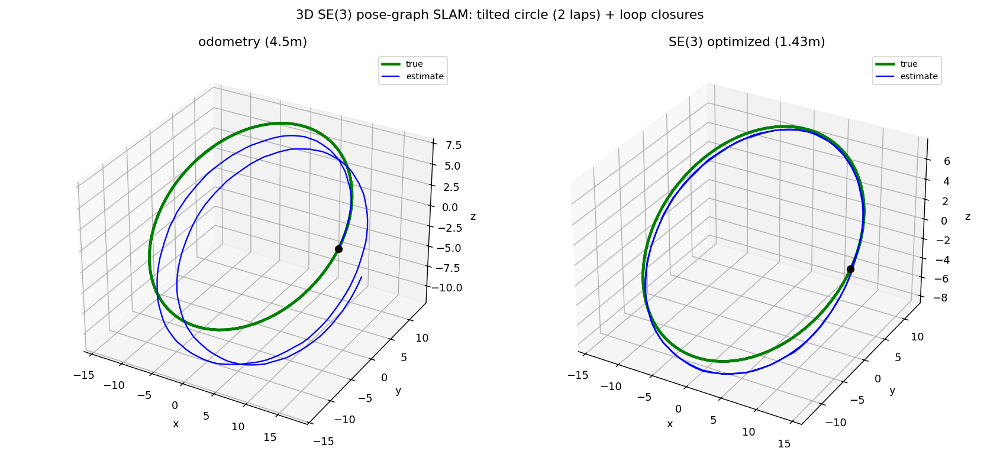

### 14. Standard g2o benchmarks — validation on real datasets (`scripts/14_g2o_benchmark.py`)
Everything above is synthetic. Here the from-scratch optimizers are run on the **community
standard `.g2o` pose-graph benchmarks** (parsed, solved with a sparse `scipy` normal-equation
solver) — the datasets every SLAM paper reports on.

| dataset | poses / edges | χ² before → after |
|---------|--------------:|:------------------|
| **Intel** (2D SE(2)) | 1228 / 1483 | 5,149,721 → **216** |
| **parking-garage** (3D SE(3)) | 1661 / 6275 | 16,727 → **1.3** |

- Both converge in ≤10 iterations to the recognizable canonical maps (Intel's corridors;
  the multi-level parking garage). *Not synthetic circles — the actual benchmarks.*
- Confirms the SE(2)/SE(3) error, Jacobians, and Gauss-Newton back-ends are correct at scale.

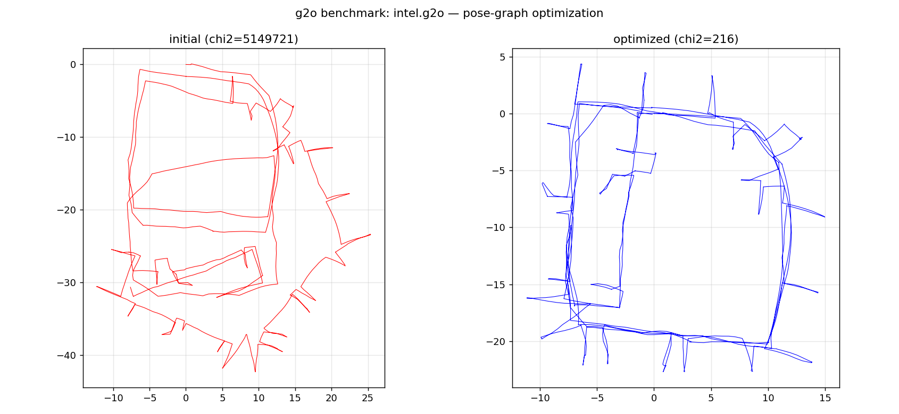
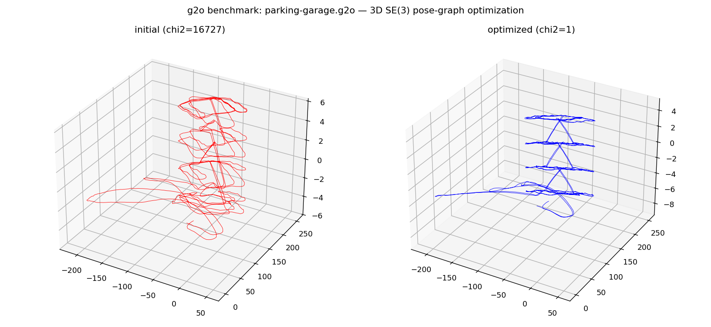

> Datasets aren't committed (redistribution). Fetch, e.g., the Intel/parking-garage `.g2o`
> from public SLAM dataset repos into `data_cache/`, then run the script.

### 15. Robust SLAM on a real benchmark (`scripts/15_robust_g2o.py`)
Combining #11 (robustness) and #14 (real data): inject **30 false loop closures** into the
real Intel g2o and compare robust kernels. Odometry edges stay full-weight (the backbone);
loop-closure edges are robustified.

| kernel | inlier χ² (lower = cleaner map) |
|--------|--------------------------------:|
| none (naive) | 23,220 |
| Huber | 9,836 |
| **DCS (Dynamic Covariance Scaling)** | **216** |

- **DCS fully rejects the outliers** — recovering the clean Intel corridor map (216 ≈ the
  uncorrupted optimum). Huber only partially helps; naive is wrecked.
- Key practical detail: apply the robust kernel **only to loop-closure edges**, not the
  odometry backbone — otherwise large initial residuals downweight everything and the
  optimizer stalls.

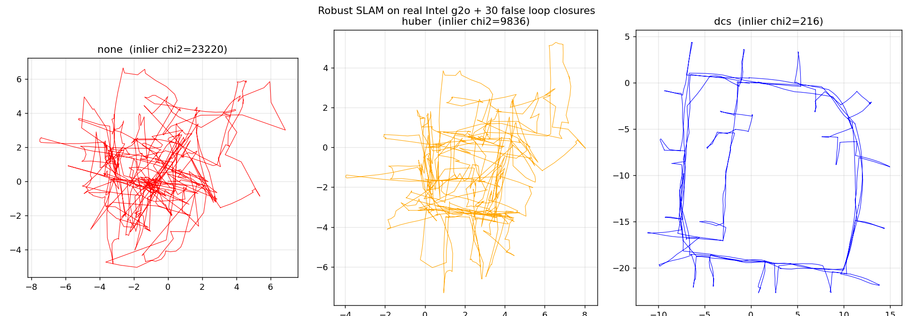

### 16. Learned IMU front-end (ML + estimation) (`scripts/16_learned_imu_frontend.py`)
The 2026 direction is *learning + estimation*. A small **1D-CNN denoiser** cleans raw IMU
before dead-reckoning — the denoising technique from
[signal-ml-lab](https://github.com/YeonkyunLee/signal-ml-lab) entering the robot estimation
pipeline. Noise is realistic: white + random-walk bias + non-Gaussian **spikes**.

| accel front-end | dead-reckon position RMSE |
|-----------------|--------------------------:|
| raw IMU | 9.66 m |
| classical low-pass | 6.65 m |
| **learned 1D-CNN** | **6.28 m** |

- The learned front-end removes spikes and white noise cleanly (see signal panel) and
  beats raw **1.5×**, edging classical low-pass. Requires `torch` (optional dep).
- **Honest limit:** the residual drift is the *integrated random-walk bias* — low-frequency
  and unremovable by any front-end. That's precisely why IMU dead-reckoning needs
  **fusion / SLAM** (experiments 2, 4, 8, 10) — the front-end helps at the margin; the
  architecture is what closes the loop.

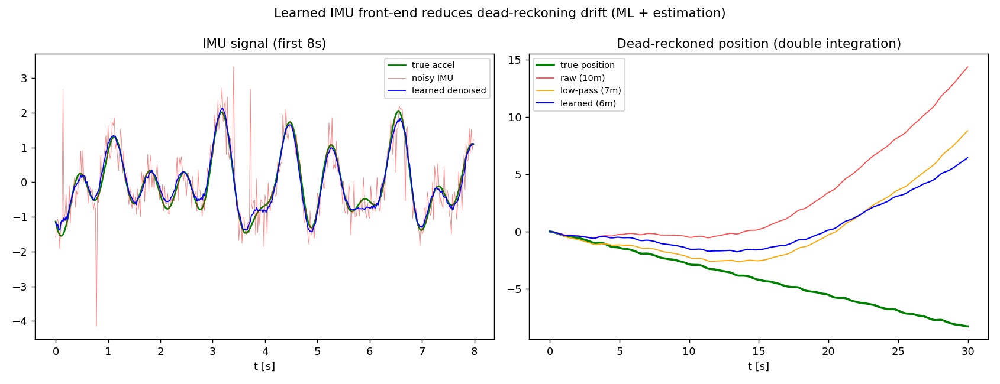

### 17. Online SLAM — fixed-lag smoother vs full batch (`scripts/17_fixed_lag_slam.py`)
Real online estimators (VIO, etc.) can't re-solve the whole trajectory every step. A
**fixed-lag smoother** optimizes only the last *L* poses (older ones fixed) → constant
per-step problem size, i.e. **O(1) per step** vs full batch's growing **O(N)**.

| | per-step solve dimension | final trajectory RMSE |
|--|-------------------------:|----------------------:|
| **fixed-lag (L=15)** | **constant (≤45)** | 5.76 m |
| full batch | grows to 420 | **0.67 m** |

- The tradeoff is the point: fixed-lag is **real-time-constant** but sacrifices **global
  consistency** — a loop closure to a pose *outside* the window can't correct it, so drift
  in the second lap persists (right panel).
- This is exactly why production stacks pair a **fixed-lag front-end** with a **global
  loop-closure back-end** (experiments 7 & 10) — fast local tracking + occasional global
  correction. Speed and consistency are different jobs.

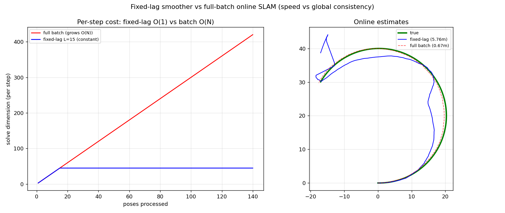

### 18. Full SLAM system — front-end + robust back-end integrated (`scripts/18_full_slam_system.py`)
The capstone that puts the pieces together into the actual production architecture
(ORB-SLAM / VINS style): a **fixed-lag front-end** gives a real-time pose every step
(drifts), while a **global pose-graph back-end** with a **DCS robust kernel** fires on
loop-closure detection — correcting the whole trajectory and rejecting false closures.

| | trajectory RMSE |
|--|----------------:|
| front-end only (fixed-lag, real-time) | 10.76 m |
| **full system (+ robust global back-end)** | **1.68 m** |

- The back-end cuts front-end drift **6×** and **rejects 2 injected false loop closures**
  (DCS) — combining experiments 7, 10, 11/15, 17 into one working system.
- This is the real answer to "speed vs consistency": a fast local front-end *and* an
  occasional global back-end, each doing the job it's good at. **Systems integration, not
  just isolated components.**

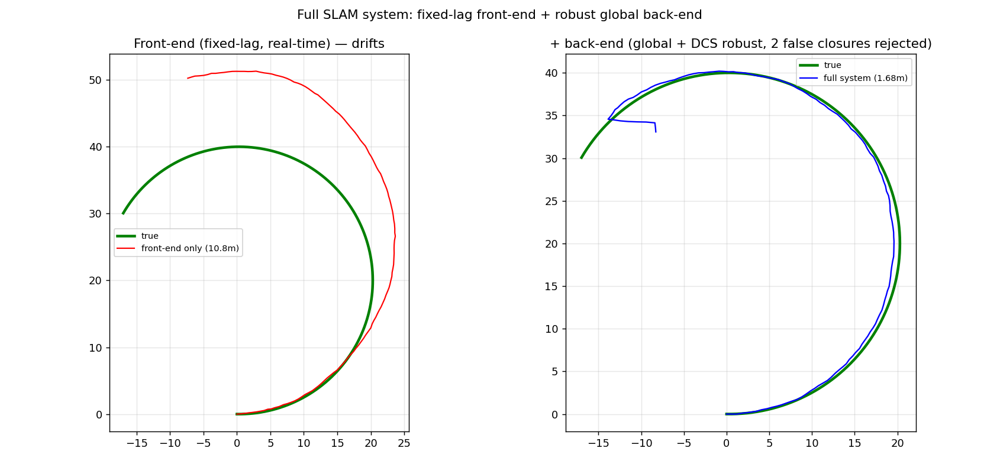

### 19. Beyond estimation — planning + control (`scripts/19_plan_control.py`)
Localization answers *"where am I?"*; to be useful a robot must also *get somewhere*. This
adds the next two layers of the stack on top of the estimator: **A\* path planning** +
**pure-pursuit control** driving a unicycle robot to a goal through a cluttered map — while
respecting a **no-go zone** (a sensitive instrument, the lab/medical-safety analog).

- Robot reaches the goal, min **no-go-zone clearance 1.9 m** (never violates), 59 m driven.
- A\* on an inflated occupancy grid (robot radius) + smooth pure-pursuit tracking.
- Closes the robotics loop **estimation → planning → control** — and the no-go zone ties
  back to the uncertainty-aware safety theme (experiment 9).

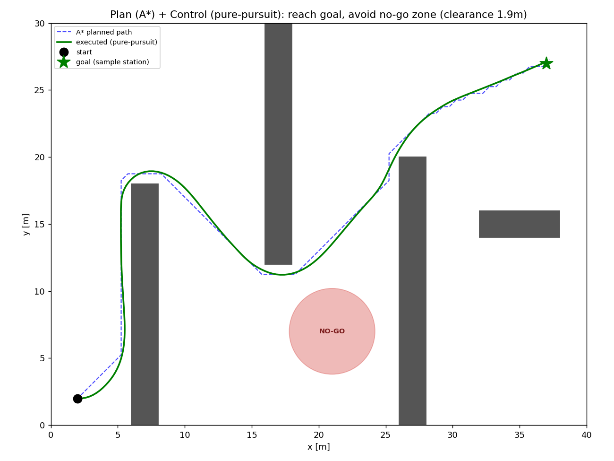

### 20. Dynamic obstacle avoidance (DWA) (`scripts/20_dwa_dynamic.py`)
19번의 A\*는 정적 지도에서 경로를 미리 깔지만, 사람·다른 로봇처럼 움직이는 장애물 앞에선
그 경로가 곧 무효가 된다. **DWA(Dynamic Window Approach)**는 매 스텝 로봇의 속도공간
`(v, w)`에서 가속한계로 도달 가능한 창만 샘플링하고, 각 후보로 짧은 궤적을 예측한 뒤
`heading + goal-distance + clearance + velocity` 점수로 최적 명령을 골라 반응적으로 한 스텝
나아간다. 장애물의 **미래 위치**까지 예측에 반영해 실시간 충돌 회피를 수행한다.

- 유니사이클 로봇이 등속으로 이동하는 장애물 3개를 피해 목표 도달 (15.8 s), 주행 17.5 m.
- 최소 장애물 클리어런스 **0.92 m** (충돌 없음); 장애물의 미래 위치를 예측 궤적 전 구간에 반영.
- **Honest limit:** DWA는 전역 추론이 없는 탐욕적 지역 계획기 — 지역최소 탈출용 goal-distance 항을
  더했지만, 장애물이 통로를 동시에 막는 적대적 배치에선 순수 지역 계획기는 여전히 갇힐 수 있다.
  이것이 실무에서 지역 계획기(DWA)를 전역 계획기(A\*, 19번)와 짝짓는 이유.

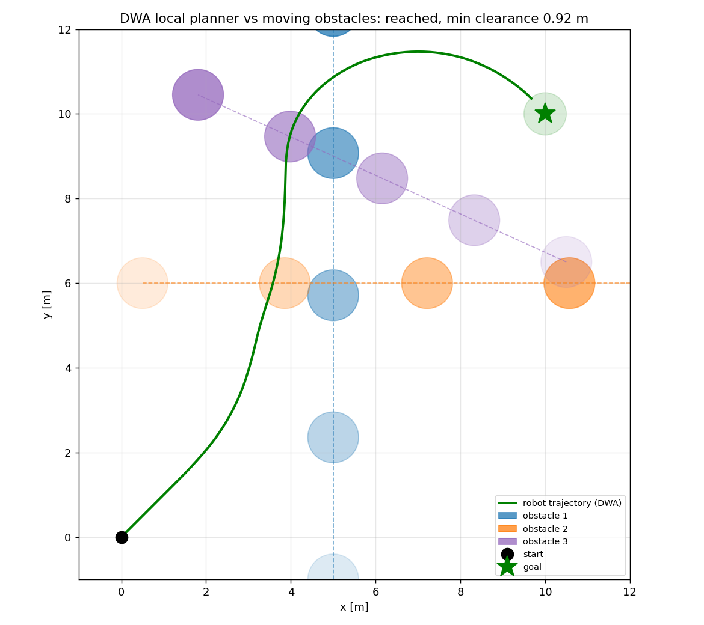

### 21. ICP scan-matching for LiDAR odometry (`scripts/21_icp_scan_matching.py`)
지금까지 오도메트리는 IMU/바퀴 기반이었다. 여기선 **LiDAR 스캔매칭** — 고전적 SLAM 프론트엔드를
밑바닥부터 구현한다. 연속한 두 2D 점군을 정렬해 그 사이 로봇의 상대 이동 SE(2)를 추정하고 누적해
궤적을 복원한다. **점-대-점 ICP**: {최근접 대응(KD-tree) → SVD로 최적 강체변환(Umeyama/Kabsch)
→ 적용 → 수렴까지 반복}. 방 윤곽 벽 + 흩뿌린 기둥 환경에서 잡음 섞인 스캔을 만들고 연속 스캔에
ICP를 걸어 상대 이동을 적분한다.

| | trajectory RMSE |
|--|----------------:|
| raw dead-reckoning (no correction) | 1.17 m |
| **ICP scan-matching odometry** | **0.13 m** |

- ICP 오도메트리가 무보정 대비 약 **9.3×** 정확; 스캔당 평균 정렬 오차 0.057 m로 잡음 수준까지 수렴.
- 흩뿌린 기둥 특징이 벽만 보일 때 생기는 **aperture(벽-미끄러짐) 문제**를 깨 정렬을 유일하게 만듦
  — 실무 스캔매칭의 핵심 조건수 이슈. 최근접 탐색만 `scipy.spatial.cKDTree`, 나머지는 numpy+SVD.
- 우측 인셋: 회전 구간 한 쌍의 스캔이 ICP 전(빨강)→후(파랑)로 목표 스캔(검정)에 정합되는 모습.

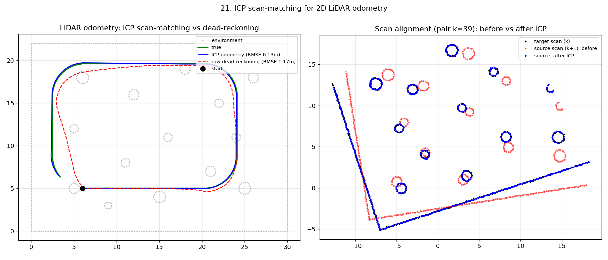

### 22. Surgical tremor cancellation (medical) (`scripts/22_surgical_tremor.py`)
미세수술 로봇은 집도의 손의 **생리적 수전증(~8–12 Hz, 수백 µm)**만 제거하고 의도한 저주파 큰
움직임은 그대로 따라야 한다(steady-hand robot). DSP·추정·의료가 만나는 지점. 500 Hz로 2D 리칭
궤적 + ~10 Hz 수전증 + 센서 잡음을 합성하고 네 기법의 잔여 떨림(대역 RMS)과 추종오차를 비교한다.

| method | 잔여 떨림 | 억제 | 추종오차 | 특성 |
|--------|--------:|-----:|--------:|------|
| low-pass (filtfilt 5 Hz) | 0.9 µm | 212× | 7.8 µm | 영위상 = **비인과**(오프라인) |
| band-stop (filtfilt 7–13 Hz) | 1.1 µm | 175× | 30 µm | 비인과(오프라인) |
| Kalman CV (causal) | 45 µm | 4.1× | 146 µm | 실시간, 전대역 스무딩 → 지연 |
| **adaptive FLC (causal)** | **17.6 µm** | **10.7×** | **37 µm** | 실시간 최적 |

- 실시간 최적은 **적응형 푸리에 선형결합기(FLC, 적응 노치)**: 떨림 188 → 17.6 µm(**10.7× 억제**),
  추종오차 37 µm(의도 30 mm 리칭 대비 미미).
- **Honest trade-off:** filtfilt가 수치는 최고(200×)지만 영위상 = 비인과라 오프라인 후처리 전용;
  Kalman은 전대역 스무딩이라 빠른 동작에서 지연. FLC만 떨림 대역만 노치처럼 제거해 인과성과 의도동작
  보존을 동시에 달성. 순수 LMS는 의도동작(떨림의 ~150배)이 그래디언트를 지배해 불안정 → 오차의
  고역통과 성분으로만 가중치를 갱신해 해결.

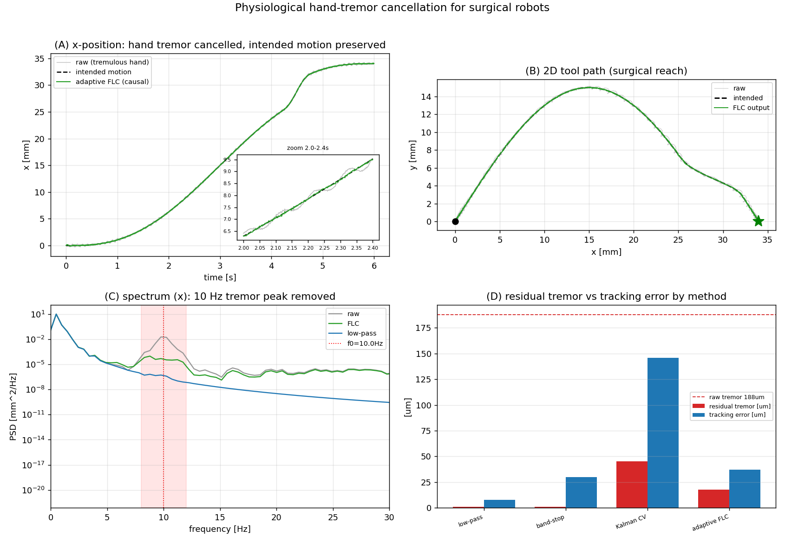

> 🩺 There's a live **[in-browser demo](https://yeonkyunlee.github.io/sensor-fusion-lab/tremor_demo.html)**
> (`tremor_demo.html`) — move your mouse and watch the ~10 Hz tremor get cancelled in real time.

### 23. Full 2D LiDAR SLAM — ICP front-end + pose-graph back-end (`scripts/23_lidar_slam.py`)
The integration piece tying exp 21 (ICP scan-matching odometry) to exp 7 (SE(2) pose-graph). The
**front-end** aligns consecutive LiDAR scans with point-to-point ICP → relative-motion odometry edges;
over two laps the per-scan errors accumulate into visible drift. A **place-recognition** step flags
revisited poses (radius search on the drifting estimate), confirms each with ICP between the current and
past scan (residual + translation-sanity gate), and adds loop-closure edges. The **back-end**
(Gauss-Newton on the SE(2) pose-graph, reusing `src/sensor_fusion/posegraph.py`) optimizes odometry +
loop-closure constraints, re-linearizing the whole trajectory so the loop snaps shut.

| trajectory | RMSE vs truth | end-point drift |
|--|----------:|---------:|
| ICP odometry (front-end only) | 0.890 m | 1.894 m |
| **graph-optimized (front-end + back-end)** | **0.270 m** | **0.019 m** |

- 165 poses, 2-lap loop, 164 odometry + **43 ICP-verified loop-closure** edges. Back-end cuts drift
  **3.3×** (χ² 18,739 → 3.85 in 4 iterations); the drifting spiral snaps onto the true loop.
- This is a **complete LiDAR SLAM pipeline** — a different sensor modality (range scans, not
  bearing/IMU) feeding the same graph back-end proven in exps 7/10/14. Front-end + back-end, again.

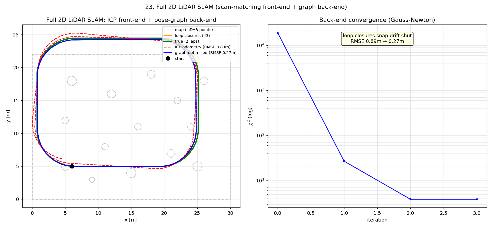

### 24. Model-predictive control (MPC) trajectory tracking (`scripts/24_mpc_tracking.py`)
Pure-pursuit (exp 19) steers off a single lookahead point — simple and fast, but it cuts corners on
tight curves and can't reason about actuator limits. **MPC** instead optimizes a short horizon of control
inputs at every step to minimize tracking error + control effort subject to `|v|,|w|` (and acceleration)
limits, applies the first input, and repeats (receding horizon). The unicycle model is linearized about
the reference into a condensed convex QP; the baseline is exp 19-style pure-pursuit on the same figure-8
(Bernoulli lemniscate).

| controller | cross-track RMSE | max error (corner-cut) | respects `|v|,|w|` limits |
|--|----------:|----------:|:--|
| pure-pursuit | 0.058 m | 0.111 m | — (fixed law) |
| **MPC** | **0.019 m** | **0.036 m** | yes (|v|=2.04≤2.6, |w|=0.84≤1.5) |

- MPC tracks **~3×** tighter in both average and worst-case error, mainly by not chording across the
  lobes, while keeping controls inside the actuator envelope.
- **Honest tradeoff:** on this moderate-curvature track pure-pursuit is already good (cm-scale), and MPC
  pays a real compute cost (a QP solve every step) for its edge — the gap widens as curvature approaches
  the actuator limits.

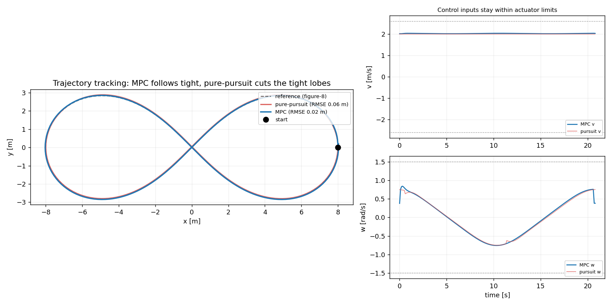

### 25. Occupancy-grid mapping (scan-to-map) (`scripts/25_occupancy_mapping.py`)
The "mapping" half of SLAM, complementing exp 23 (which recovers only the trajectory). Given robot poses
and LiDAR scans, this builds a probabilistic **occupancy grid** with **log-odds ray casting**: for every
scan point a ray is cast from the robot to the hit — cells the ray passes through get a negative (free)
update, the hit cell a positive (occupied) update (vectorized DDA at grid resolution). Log-odds convert to
probability (`p = 1/(1+e⁻ˡ)`) for a grayscale map; over two laps repeated noisy observations sharpen walls
and pillars. When poses are noisy, an optional **scan-to-map** step aligns each new scan (ICP against the
current map's occupied-cell cloud) before integrating.

| map | occupied IoU | pose RMSE |
|--|----------:|---------:|
| true-pose (upper bound) | **0.72** | — |
| noisy-pose naive | 0.13 | 0.45 m |
| **noisy-pose scan-to-map** | **0.18** | **0.35 m** |

- Occupied-cell IoU vs truth **0.72** (1-cell tolerance, observed cells only — occlusion gaps excluded
  honestly). Scan-to-map refinement lifts the noisy-pose map IoU 0.13 → 0.18 and pose RMSE 0.45 → 0.35 m.
- Honest limits: thin walls (1–2 cells) and occlusion leave faint/hollow pillars; naive noisy poses
  double-print the boundary.

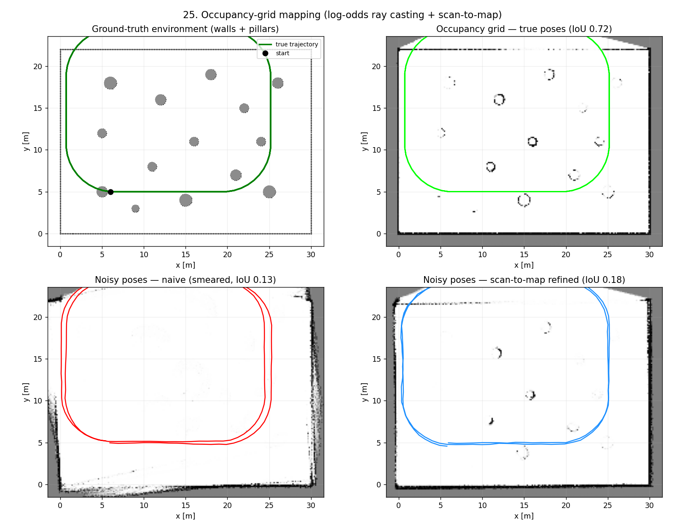

### 26. Obstacle-avoiding MPC (`scripts/26_mpc_obstacle.py`)
Unifies exp 24 (MPC tracking) and exp 20 (reactive avoidance) into one optimizer: the MPC horizon cost
gains a **collision-avoidance term** so the robot tracks its reference while staying outside a safety
radius around each obstacle. The unicycle is rolled out **fully nonlinearly** (accurate even during large
swerves) and avoidance is a **smooth soft barrier** `½·β·max(0, margin − clearance)²` added to the
tracking/effort cost, solved with L-BFGS-B (analytic adjoint gradient) under `|v|,|w|` box + acceleration
bounds. Moving obstacles are predicted forward over the horizon. Same scenario, two controllers:
obstacle-**unaware** MPC (exp 24, β=0) vs obstacle-**aware** MPC, with obstacles placed **on** the figure-8.

| controller | min clearance | outcome | off-obstacle RMSE | limits |
|--|----------:|:--|----------:|:--|
| plain MPC (unaware, exp 24) | **−0.85 m** | collides (drives through all 3) | — | ok |
| **obstacle-aware MPC** | **+0.46 m** | avoids, returns to path | 0.087 m | ok (`|v|≤2.6, |w|≤1.5`) |

- Soft (not hard) constraints: always feasible and smooth, but *attract* rather than *guarantee* clearance
  (tuned by β); as a local optimizer it commits to one side without global reasoning — the honest tradeoff.

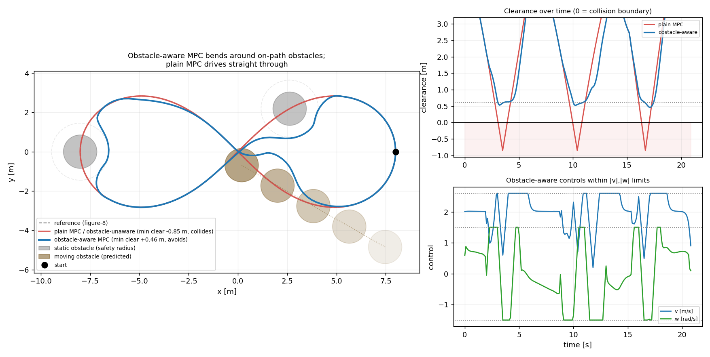

### 27. Gait-phase estimation for a rehab exoskeleton (medical) (`scripts/27_gait_estimation.py`)
A rehabilitation exoskeleton must know *where in the gait cycle* the wearer is — stance vs swing, and the
heel-strike / toe-off instants — to time its assistive torque; mistimed assistance fights the wearer and
raises fall risk. From a single foot-mounted IMU (gyro + accel, 200 Hz, bias + noise) this (1) detects
stance with a **zero-velocity / low-angular-rate detector** (SHOE-style: gyro magnitude + gravity
deviation), extracting heel-strike and toe-off events, and (2) estimates stride length by **ZUPT-aided**
integration — integrating acceleration to velocity, resetting to zero at each stance, then integrating to
distance — versus naive double integration.

- **Stance/swing classification 96.1%**; gait-event timing error **22.5 ms** mean (all events detected).
- **ZUPT stride error 2.2 cm vs naive 90 cm** on a 70 cm stride — **~41×** better; naive drifts
  quadratically as accelerometer bias accumulates. This is the wearable/rehab counterpart of the repo's
  IMU-bias (exp 4) and safe-autonomy (exp 9) medical themes.
- Honest limits: synthetic gait simplifies inter-subject variability, pathological gait, and
  sensor-alignment error.

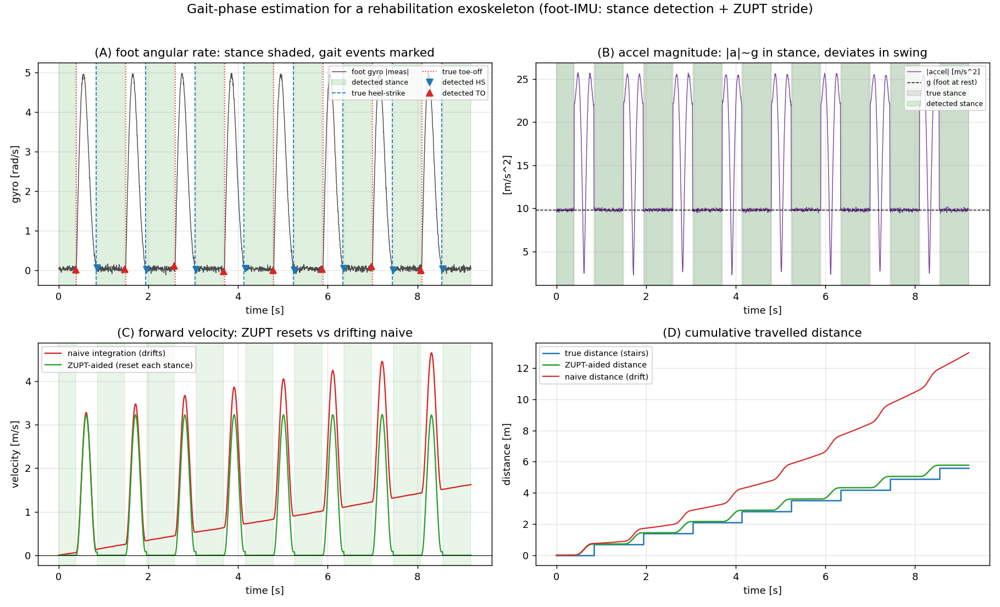

### 28. Full navigation capstone — A* global + obstacle-aware MPC local (`scripts/28_full_navigation.py`)
The integration capstone of the planning/control track. A **global A\*** planner finds a path through the
static map (walls + a no-go zone) on an inflated occupancy grid; the path is smoothed into a constant-speed
reference; then the **obstacle-aware MPC local controller** (from exp 26) tracks it while reactively bending
around **moving obstacles the global plan never knew about** — predicting each over the horizon and
respecting actuator limits. Ablation: following the same A\* path with a plain, obstacle-unaware tracker
drives straight into the moving obstacles.

| system | reaches goal | min moving-obstacle clearance | static-map clearance | limits |
|--|:--|----------:|----------:|:--|
| **full (A\* + obstacle-aware MPC)** | yes | **+0.62 m** (safe) | +0.27 m (safe) | ok |
| plain tracker (obstacle-unaware) | yes | **−0.85 m** (collides ×3) | — | — |

- The point: a global plan alone is not enough in a dynamic world — **local reactivity is what makes it
  safe**. Combines A\* (exp 19), MPC (exp 24) and obstacle-aware MPC (exp 26) into one mission.
- Honest limits: the global path is fixed (no replanning); the soft barrier strongly attracts but does not
  *guarantee* clearance; a moving obstacle sealing a narrow corridor can trap the local controller in a
  local minimum (needs global replanning, not handled here).

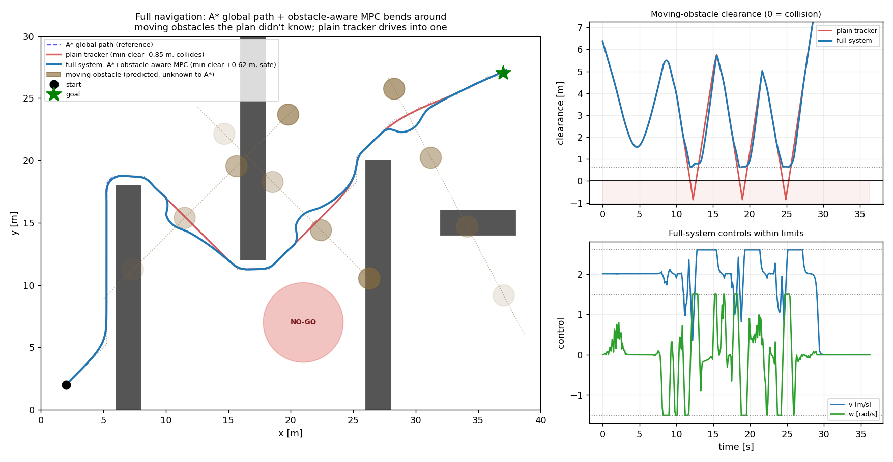

### 29. 3D LiDAR SLAM — point-to-plane ICP + SE(3) pose-graph (`scripts/29_lidar_slam_3d.py`)
Exp 23's 2D LiDAR SLAM lifted to **3D / 6-DOF**. A drone/legged robot moves in 3D; a 3D LiDAR sweeps the
surface points of walls, floor, ceiling and pillars. The **front-end** runs **point-to-plane ICP** (local
normals from k-NN PCA on the target cloud, point-to-plane residual minimized in the se(3) tangent) between
consecutive scans to produce SE(3) odometry that drifts over the loop. The **back-end** verifies revisits
with ICP and optimizes the whole 6-DOF trajectory with the manifold SE(3) Gauss-Newton pose-graph
(reusing `src/sensor_fusion/posegraph3d.py`). Wall/floor normals spanning all three axes make the 6 DOF
observable, so point-to-plane converges fast.

| trajectory | 3D RMSE | end-point error |
|--|----------:|---------:|
| ICP odometry (point-to-plane) | 0.329 m | 0.220 m |
| **SE(3) graph-optimized** | **0.166 m** | **0.093 m** |

- Tilted circle × 3 laps (181 poses), 180 odometry + **62 loop-closure** edges. Back-end cuts 3D drift
  **2.0×** (χ² 1130 → 17.6 in 3 iterations).
- Honest tradeoffs: point-to-plane degrades to sliding if surface normals collapse onto one plane
  (point-to-point SVD is the safer fallback there); k-NN PCA normals are sensitive to curvature/density.

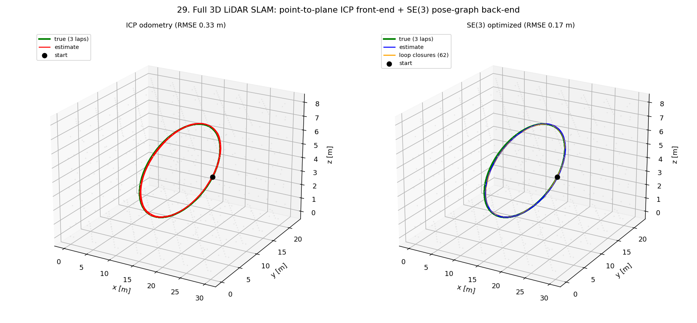

## Why this bridges to robotics (and my background)
- **DSP → estimation**: the KF is optimal linear filtering — the same innovation /
  gain / covariance machinery, now in state space.
- **Embedded → real-time**: the filter is a handful of small matrix ops per step,
  trivially real-time on an MCU.
- **DSP → nonlinear estimation**: EKF (linearize) and UKF (sigma points) extend the same
  machinery to nonlinear robot models — the bridge to real robotics state estimation.

## Quickstart
```bash
pip install numpy matplotlib pytest
python scripts/01_tracking.py       # linear KF tracking
python scripts/02_imu_fusion.py     # position + IMU fusion with outage
python scripts/03_ctrv_ekf_ukf.py   # nonlinear CTRV: EKF vs UKF
python scripts/04_imu_bias.py       # online IMU bias estimation
python scripts/05_ekf_slam.py       # EKF-SLAM: localization + mapping
python scripts/06_loop_closure.py   # loop closure corrects accumulated drift
python scripts/07_pose_graph_slam.py # graph SLAM: pose-graph optimization
python scripts/08_vio.py             # visual-inertial odometry
python scripts/09_safe_autonomy.py   # uncertainty-aware safe-stop (No-Fly-Zone)
python scripts/10_vio_graph_slam.py  # modern SLAM: VIO front-end + graph back-end
python scripts/11_robust_slam.py     # robust SLAM: reject false loop closures
python scripts/12_graph_slam_landmarks.py  # full graph SLAM (joint pose+landmark BA)
python scripts/13_pose_graph_3d.py   # 3D SE(3) pose-graph SLAM
python scripts/14_g2o_benchmark.py --file data_cache/intel.g2o   # real g2o benchmark
python scripts/15_robust_g2o.py      # robust SLAM on real Intel + false loop closures
python scripts/16_learned_imu_frontend.py  # learned IMU denoiser (torch, optional)
python scripts/17_fixed_lag_slam.py   # online SLAM: fixed-lag vs batch
python scripts/18_full_slam_system.py # full system: front-end + robust back-end
python scripts/19_plan_control.py     # planning (A*) + control (pure-pursuit)
python scripts/20_dwa_dynamic.py      # dynamic obstacle avoidance (DWA)
python scripts/21_icp_scan_matching.py  # ICP scan-matching LiDAR odometry
python scripts/22_surgical_tremor.py  # surgical tremor cancellation (medical)
python scripts/23_lidar_slam.py       # full 2D LiDAR SLAM (ICP + pose-graph)
python scripts/24_mpc_tracking.py     # MPC trajectory tracking vs pure-pursuit
python scripts/25_occupancy_mapping.py  # occupancy-grid mapping (scan-to-map)
python scripts/26_mpc_obstacle.py     # obstacle-avoiding MPC
python scripts/27_gait_estimation.py  # gait-phase estimation (rehab exoskeleton)
python scripts/28_full_navigation.py  # navigation capstone: A* + obstacle-aware MPC
python scripts/29_lidar_slam_3d.py    # 3D LiDAR SLAM (point-to-plane ICP + SE(3))
pytest -q
```

## Layout
```
src/sensor_fusion/
  kalman.py   generic linear Kalman filter (multi-sensor update)
  ekf.py      extended KF (Jacobian linearization)
  ukf.py      unscented KF (scaled sigma points, angle-aware hooks)
  sim.py      2D trajectory + noisy position/IMU sensors
scripts/
  01_tracking.py      CV tracking vs raw / moving average
  02_imu_fusion.py    position + IMU fusion with outage
  03_ctrv_ekf_ukf.py  nonlinear turning-target tracking, EKF vs UKF
  04_imu_bias.py      online IMU bias estimation (state augmentation)
  05_ekf_slam.py      EKF-SLAM: joint localization + landmark mapping
  06_loop_closure.py  loop closure: revisiting the start corrects drift
  07_pose_graph_slam.py  graph SLAM: pose-graph (Gauss-Newton) optimization
  08_vio.py           visual-inertial odometry (IMU + monocular bearing)
  09_safe_autonomy.py    uncertainty-aware safe-stop (surgical No-Fly-Zone analog)
  10_vio_graph_slam.py   modern SLAM: VIO front-end + factor-graph back-end
  11_robust_slam.py      robust back-end: Huber kernel rejects false loop closures
  12_graph_slam_landmarks.py  full graph SLAM: joint pose+landmark optimization (2D BA)
  13_pose_graph_3d.py    3D SE(3) pose-graph SLAM (Lie-group manifold optimization)
  14_g2o_benchmark.py    standard g2o benchmark loader + sparse optimizer (2D/3D)
  15_robust_g2o.py       robust kernels (Huber/DCS) on real Intel + false loop closures
  16_learned_imu_frontend.py  learned 1D-CNN IMU denoiser front-end (ML+estimation)
  17_fixed_lag_slam.py   online SLAM: fixed-lag smoother vs full batch (speed/consistency)
  18_full_slam_system.py  integrated: fixed-lag front-end + robust global back-end
  19_plan_control.py     beyond estimation: A* planning + pure-pursuit control (nav)
  20_dwa_dynamic.py      dynamic obstacle avoidance (Dynamic Window Approach)
  21_icp_scan_matching.py  ICP scan-matching LiDAR odometry (classic SLAM front-end)
  22_surgical_tremor.py  surgical physiological-tremor cancellation (medical; DSP+estimation)
  23_lidar_slam.py       full 2D LiDAR SLAM: ICP front-end + pose-graph back-end + loop closure
  24_mpc_tracking.py     model-predictive control trajectory tracking vs pure-pursuit
  25_occupancy_mapping.py  occupancy-grid mapping: log-odds ray casting + scan-to-map
  26_mpc_obstacle.py     obstacle-avoiding MPC (soft-barrier collision avoidance)
  27_gait_estimation.py  gait-phase estimation for a rehab exoskeleton (IMU + ZUPT)
  28_full_navigation.py  navigation capstone: A* global + obstacle-aware MPC local
  29_lidar_slam_3d.py    3D LiDAR SLAM: point-to-plane ICP + SE(3) pose-graph
src/sensor_fusion/se3.py       SO(3)/SE(3) exp·log; posegraph3d.py  SE(3) optimizer
src/sensor_fusion/posegraph.py  SE(2) pose-graph core
tests/
```

## Roadmap
- [x] Linear KF, CV tracking, position+IMU fusion, outage robustness
- [x] EKF + UKF for nonlinear models (CTRV turning target)
- [x] Online IMU bias estimation via state augmentation
- [x] EKF-SLAM (joint localization + landmark mapping, compass-aided)
- [x] Loop closure (revisit anchors corrects drift; gate-exempt closure updates)
- [x] Graph-based SLAM (pose-graph optimization) — full-trajectory loop closure
- [x] Visual-inertial odometry (IMU + monocular bearing fusion)
- [x] Uncertainty-aware safe autonomy (surgical No-Fly-Zone analog)
- [x] Modern SLAM stack: VIO front-end + factor-graph back-end (24x drift reduction)
- [x] Robust back-end (Huber kernel) rejecting false loop closures
- [x] Full graph SLAM: landmarks in the graph, joint pose+landmark BA
- [x] 3D SE(3) pose-graph SLAM (Lie-group manifold optimization)
- [x] Validated on standard g2o benchmarks (Intel 2D, parking-garage 3D)
- [x] Robust kernels (Huber, DCS) on real g2o benchmark with injected outliers
- [x] Learned IMU front-end (1D-CNN denoiser feeding dead-reckoning)
- [x] Online SLAM: fixed-lag smoother (constant per-step cost) vs full batch
- [x] Planning + control: A* + pure-pursuit (reach goal, avoid no-go zone)
- [x] Dynamic obstacle avoidance (DWA local planner, moving obstacles)
- [x] ICP scan-matching for LiDAR odometry (classic SLAM front-end)
- [x] Medical application: surgical physiological-tremor cancellation (DSP+estimation)
- [x] Full 2D LiDAR SLAM: ICP scan-matching front-end + pose-graph back-end + loop closure
- [x] Model-predictive control (MPC) trajectory tracking (vs pure-pursuit, actuator limits)
- [x] Interactive in-browser demos (pose-graph SLAM, surgical-tremor cancellation)
- [x] Occupancy-grid mapping (log-odds ray casting + scan-to-map refinement)
- [x] Obstacle-avoiding MPC (soft-barrier collision avoidance, moving obstacles)
- [x] Wearable/rehab: gait-phase estimation + ZUPT stride length (foot IMU)
- [x] Navigation capstone: A* global plan + obstacle-aware MPC local (dynamic world)
- [x] 3D LiDAR SLAM: point-to-plane ICP front-end + SE(3) pose-graph back-end
- [ ] True incremental factorization (iSAM Bayes tree) for O(1) global updates
- [ ] ROS2 node wrapping the filter

## License
MIT — see [LICENSE](LICENSE). Personal learning project; synthetic data only.
