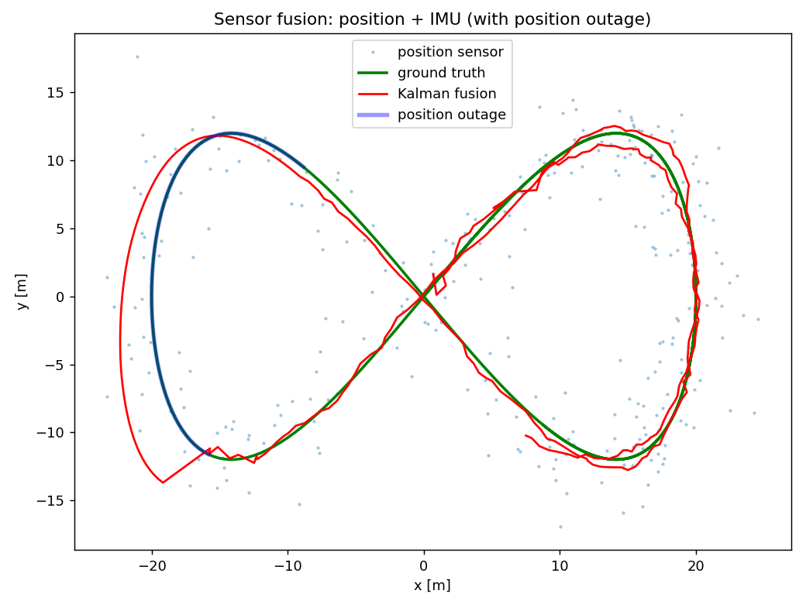
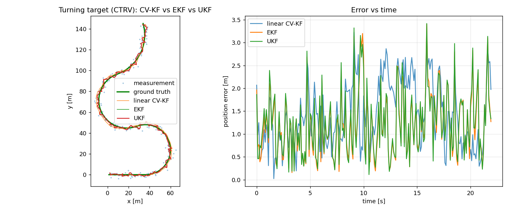
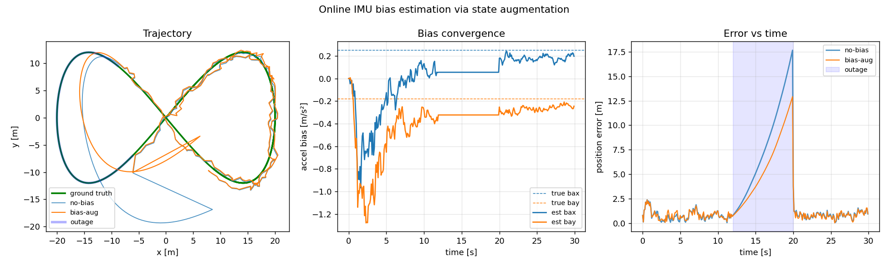
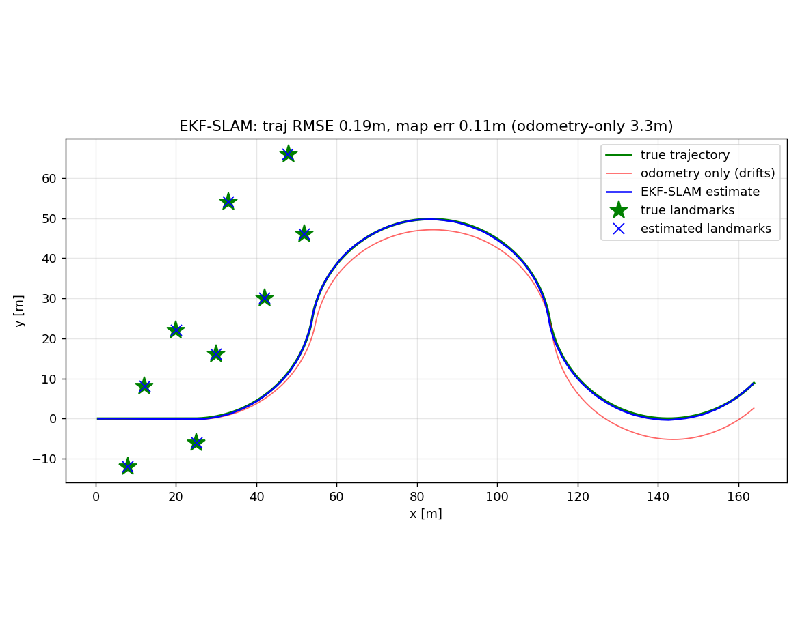
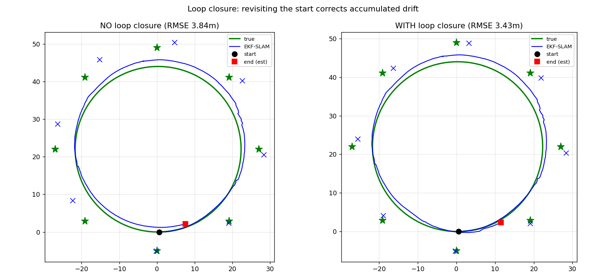
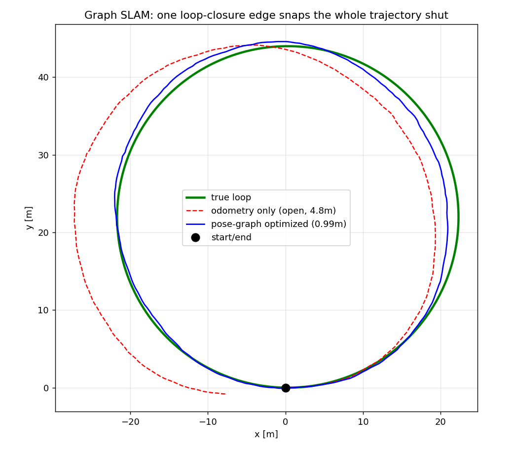
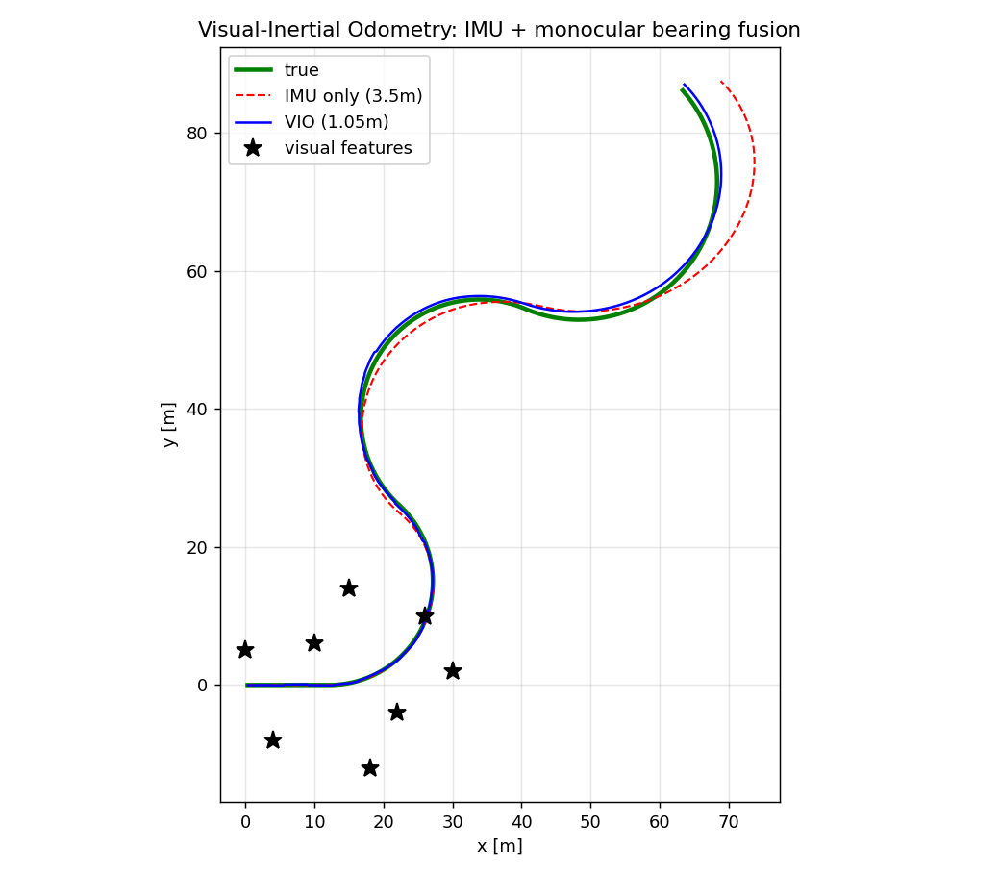
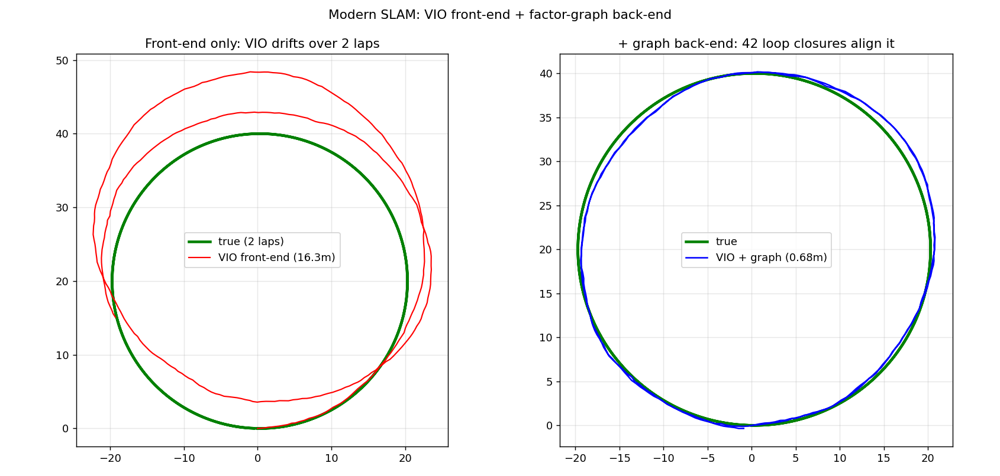
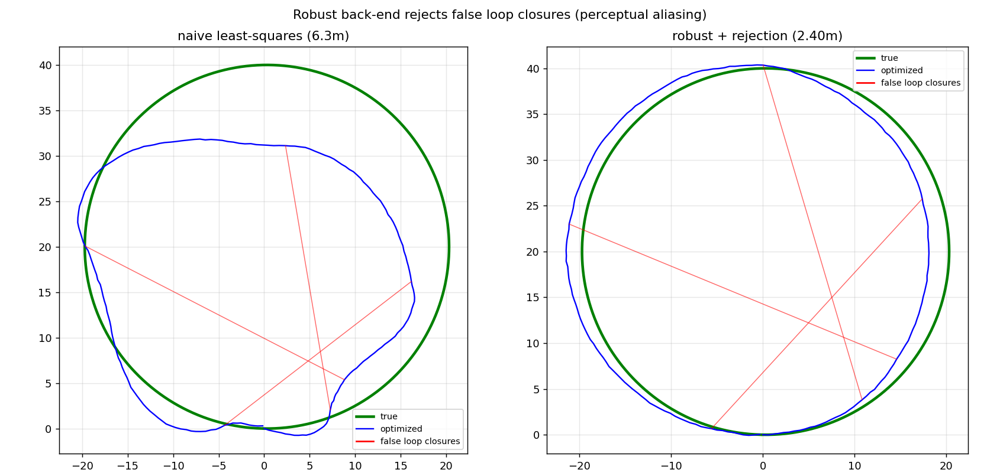
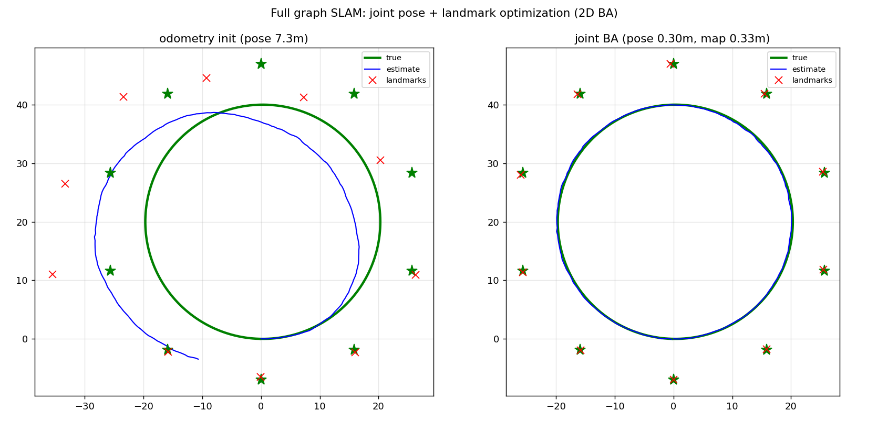

# sensor-fusion-lab

**Kalman-filter state estimation for robotics — from a DSP engineer's angle.**

Estimation theory is where signal processing meets robotics. A Kalman filter is,
in DSP terms, a *time-varying optimal IIR filter* whose bandwidth adapts to the
ratio of process to measurement noise. This lab builds it from scratch and shows
where it wins — and where it doesn't.

🇰🇷 아래 한국어 병기.

📓 **Write-ups:** a 4-part blog series (incl. an EKF-SLAM debugging journey & medical safe-autonomy) —
see [blog/00_index.md](blog/00_index.md).

## Experiments

### 1. Tracking a maneuvering target (`scripts/01_tracking.py`)
Constant-velocity Kalman filter recovers a curved 2D trajectory from noisy
position measurements.

| method | position RMSE | notes |
|--------|--------------:|-------|
| raw measurement | 2.69 m | — |
| moving average (w=7) | 1.01 m | position only |
| **Kalman filter** | 1.26 m | **+ velocity estimate** |

Honest result: for *dense position-only* data, a tuned moving average is
competitive. The KF's real value is state estimation (velocity, drift-free) and
**multi-sensor fusion** — shown next. Also note the tuning lesson: process noise
`q` had to be raised (0.2 → 10) so the constant-velocity model could track a
target that actually accelerates.

### 2. Position + IMU fusion with sensor outage (`scripts/02_imu_fusion.py`)
Constant-acceleration model fuses a noisy position sensor (GPS-like) with an IMU
(acceleration). Midway, the position sensor drops out for 6 s.

| method | RMSE (all) | RMSE (during outage) |
|--------|-----------:|---------------------:|
| position sensor | 2.69 m | — |
| IMU alone (dead-reckoning) | 167 m | 143 m |
| **Kalman fusion** | **1.23 m** | **2.31 m** |

The canonical result: **fusion beats every single sensor**, and coasts through
the position outage on the IMU (dead-reckoning) while IMU-alone drifts
catastrophically from double integration.



### 3. Nonlinear tracking (CTRV): EKF vs UKF (`scripts/03_ctrv_ekf_ukf.py`)
A target moving with **constant turn rate & velocity** (sin/cos of heading → nonlinear
motion). A linear constant-velocity KF structurally lags on turns; EKF linearizes the
motion via a hand-derived Jacobian; UKF propagates sigma points.

| method | RMSE (all) | RMSE (turning) |
|--------|-----------:|---------------:|
| raw measurement | 2.59 m | — |
| linear CV-KF | 1.60 m | 1.76 m |
| **EKF (CTRV)** | **1.39 m** | **1.38 m** |
| UKF (CTRV) | 1.42 m | 1.40 m |

- The **nonlinear motion model (CTRV) beats linear CV-KF by ~22% on turns** — the model
  matters more than the filter flavor here.
- **EKF ≈ UKF** at this noise level: honest result. UKF's real edge is *practical* — it
  needs no hand-derived Jacobian (I derived the full CTRV Jacobian for the EKF), and it
  degrades more gracefully as nonlinearity/uncertainty grow.



### 4. Online IMU bias estimation (`scripts/04_imu_bias.py`)
An accelerometer has a slowly-varying bias; unestimated, it double-integrates into
position drift. Augment the state with the bias ([p, v, **b**]) and estimate it online
from position fixes. Tested with a GPS-like outage (k=120–200).

| filter | RMSE (all) | RMSE (during outage) |
|--------|-----------:|---------------------:|
| no-bias ([p, v]) | 4.78 m | 9.12 m |
| **bias-augmented ([p, v, b])** | **3.52 m** | **6.65 m** |

- Estimating the bias cuts dead-reckoning drift during the outage by ~27%.
- **Observability made visible:** the bias estimate converges while position fixes
  arrive but **freezes during the outage** (no measurement → bias unobservable) — then
  resumes. Exactly the right behavior.
- Honest limit: on a maneuvering target, bias is partly confounded with true
  acceleration, so convergence is good but not exact.



### 5. EKF-SLAM: localization + mapping at once (`scripts/05_ekf_slam.py`)
The robot drives with noisy odometry and observes landmarks by range-bearing. The state
grows to hold the **robot pose + every landmark** ([x,y,θ, l₁ₓ,l₁ᵧ, …]); each observation
updates pose and map together. A compass aids heading (as real robots fuse a
magnetometer).

| | RMSE |
|--|-----:|
| odometry only | 3.31 m |
| **EKF-SLAM trajectory** | **0.19 m** |
| **EKF-SLAM map (landmarks)** | **0.11 m** |

- SLAM localizes **17× better than dead-reckoning** and recovers the map to ~0.1 m.
- Getting this stable took real debugging — documented honestly in the code comments:
  proper landmark initialization (inverse-observation covariance), **heading
  observability** (a single self-initialized landmark can't correct the pose that
  placed it → needs a heading source), **±π wrap** handling, and innovation gating for
  numerical robustness.



### 6. Loop closure (`scripts/06_loop_closure.py`)
The robot drives a full loop on odometry (heading drifts, no compass here) and returns to
the start. Re-observing the **anchor landmarks** seen first (when the pose was certain)
produces a large, legitimate innovation — a *loop-closure* update — that propagates back
through the covariance and tightens the map. Compared with a run that ignores the revisit:

| | return-phase RMSE |
|--|------------------:|
| no loop closure | 4.80 m |
| **with loop closure** | **3.32 m** |



- Closure cuts return-phase drift ~**1.4×** and visibly re-aligns the map (right panel:
  estimated landmarks snap onto the true ones).
- Loop-closure observations are **exempted from the innovation gate** — a closure is a
  large innovation *by design*, so gating it as an outlier would defeat the purpose.
- **Honest limit:** a filter (EKF) can't re-linearize the whole past trajectory the way
  graph-based SLAM (pose-graph optimization) does, so the correction is partial. That
  gap is exactly why modern SLAM is graph-based — a natural next study.

### 7. Graph SLAM — pose-graph optimization (`scripts/07_pose_graph_slam.py`)
The fix for EKF-SLAM's partial correction: model the trajectory as a **graph** (nodes =
poses, edges = odometry + loop-closure constraints) and optimize all poses jointly with
Gauss-Newton. Unlike a filter, it **re-linearizes the entire past**, so one loop-closure
edge corrects the whole trajectory.

| | trajectory RMSE | end gap |
|--|----------------:|--------:|
| odometry only (open loop) | 4.81 m | 7.57 m |
| **pose-graph optimized** | **0.99 m** | **0.29 m** |

- A single loop-closure edge **snaps the whole loop shut** — 5× error reduction (vs
  EKF-SLAM's 1.4× partial closure). χ² 21271 → 5.9 in 4 iterations.
- SE(2) error/Jacobians derived from scratch (`src/sensor_fusion/posegraph.py`); pose 0
  anchored as the gauge.



This is why modern SLAM is graph-based. The lab now spans the arc: linear KF → EKF/UKF →
IMU bias → EKF-SLAM → EKF loop closure (partial) → **graph SLAM (full)**.

### 8. Visual-Inertial Odometry (VIO) (`scripts/08_vio.py`)
The workhorse of modern robot/AR localization, and a keyword on every state-estimation
JD. A monocular camera gives only **bearing** to features (no range); the IMU gives
high-rate motion but double-integrates into drift. An EKF fuses them tightly.

| | position RMSE |
|--|--------------:|
| IMU only (dead-reckoning) | 3.45 m |
| **VIO (IMU + monocular bearing)** | **1.05 m** |

- Visual bearing updates cut IMU drift **3×**; the estimate stays locked to truth even
  where features are sparse (see the divergence of IMU-only in the upper arc).



### 9. Uncertainty-aware safe autonomy (`scripts/09_safe_autonomy.py`)
The estimation counterpart of a surgical robot's **"No-Fly Zone"**: an autonomous system
approaches a critical boundary while its sensors degrade (position sensor drops out →
covariance grows). Two stop rules, 300-trial Monte-Carlo:

| stop rule | no-fly-zone violation rate |
|-----------|---------------------------:|
| naive (trusts the estimate) | **60%** |
| **uncertainty-aware (estimate + k·σ)** | **0%** |

- The naive rule trusts a drifted estimate and crosses the safety line 60% of the time.
- The uncertainty-aware gate **stops when it doesn't know** (widening covariance → larger
  margin), preventing every violation — at the cost of stopping ~1.3 m earlier.
- This is exactly the *Task-Autonomy-under-supervision* principle driving 2026 surgical
  robotics (FDA PCCP, real-time "No-Fly Zones"): safe autonomy = estimation + a margin
  that respects uncertainty. It reuses this repo's estimation core and the
  [signal-ml-lab](https://github.com/YeonkyunLee/signal-ml-lab) uncertainty-gate theme.


### 10. Modern SLAM — VIO front-end + factor-graph back-end (`scripts/10_vio_graph_slam.py`)
The real architecture of production SLAM, combining experiments 7–8: a **VIO front-end**
produces keyframe-to-keyframe odometry (drifts), and a **factor-graph back-end** fuses it
with loop-closure factors from place recognition. The robot drives **two laps**; the
second lap revisits the first → 42 loop-closure factors.

| | trajectory RMSE |
|--|----------------:|
| VIO front-end only (2-lap drift) | 16.33 m |
| **+ factor-graph back-end** | **0.68 m** |

- The back-end cuts drift **24×** (χ² 1.1M → 135 in 6 iterations). The drifting 2-lap
  spiral collapses onto a single clean circle once loop closures constrain it.
- This is the front-end/back-end split every modern SLAM system (ORB-SLAM, VINS) uses.



The lab now covers the full modern stack: **KF → EKF/UKF → IMU bias → EKF-SLAM →
loop closure → graph SLAM → VIO → VIO+graph → safe autonomy.**

### 11. Robust SLAM — rejecting false loop closures (`scripts/11_robust_slam.py`)
Real place recognition sometimes matches the wrong place (perceptual aliasing). A single
**false loop-closure** can wreck a least-squares map. Robust back-ends handle it — here a
**Huber kernel** (IRLS) downweights outliers, then rejected edges are dropped and the
graph re-optimized.

| | trajectory RMSE |
|--|----------------:|
| naive least-squares (3 false closures injected) | 6.28 m |
| **robust (Huber) + rejection** | **2.40 m** |

- The 3 false loop closures get IRLS weights **0.02–0.05** (rejected); the true one keeps
  weight **1.0**. Error cut **3×**; the distorted map re-forms into a clean circle.
- Perceptual aliasing / outlier rejection is a top real-world SLAM failure mode — this is
  what separates a demo from a deployable back-end.



### 12. Full graph SLAM — joint pose + landmark optimization (`scripts/12_graph_slam_landmarks.py`)
The capstone: put **landmarks in the graph too**. Poses (SE(2)) and landmark points are
both nodes; odometry factors (pose–pose) and range-bearing factors (pose–landmark) are
optimized *jointly* with Gauss-Newton — the batch (bundle-adjustment) counterpart of the
sequential EKF-SLAM in experiment 5.

| | pose RMSE | map RMSE |
|--|----------:|---------:|
| odometry init | 7.29 m | 6.46 m |
| **joint BA (210 poses + 10 landmarks)** | **0.30 m** | **0.33 m** |

- Jointly optimizing 209 odometry + 622 observation factors: **pose 24×, map 20×**
  better (χ² 280k → 1.2k in 6 iterations). The drifted spiral and scattered landmarks
  snap onto the true circle and true landmark positions.
- Range-bearing factor Jacobians (∂/∂pose, ∂/∂landmark) derived from scratch.



## Why this bridges to robotics (and my background)
- **DSP → estimation**: the KF is optimal linear filtering — the same innovation /
  gain / covariance machinery, now in state space.
- **Embedded → real-time**: the filter is a handful of small matrix ops per step,
  trivially real-time on an MCU.
- **DSP → nonlinear estimation**: EKF (linearize) and UKF (sigma points) extend the same
  machinery to nonlinear robot models — the bridge to real robotics state estimation.

## Quickstart
```bash
pip install numpy matplotlib pytest
python scripts/01_tracking.py       # linear KF tracking
python scripts/02_imu_fusion.py     # position + IMU fusion with outage
python scripts/03_ctrv_ekf_ukf.py   # nonlinear CTRV: EKF vs UKF
python scripts/04_imu_bias.py       # online IMU bias estimation
python scripts/05_ekf_slam.py       # EKF-SLAM: localization + mapping
python scripts/06_loop_closure.py   # loop closure corrects accumulated drift
python scripts/07_pose_graph_slam.py # graph SLAM: pose-graph optimization
python scripts/08_vio.py             # visual-inertial odometry
python scripts/09_safe_autonomy.py   # uncertainty-aware safe-stop (No-Fly-Zone)
python scripts/10_vio_graph_slam.py  # modern SLAM: VIO front-end + graph back-end
python scripts/11_robust_slam.py     # robust SLAM: reject false loop closures
python scripts/12_graph_slam_landmarks.py  # full graph SLAM (joint pose+landmark BA)
pytest -q
```

## Layout
```
src/sensor_fusion/
  kalman.py   generic linear Kalman filter (multi-sensor update)
  ekf.py      extended KF (Jacobian linearization)
  ukf.py      unscented KF (scaled sigma points, angle-aware hooks)
  sim.py      2D trajectory + noisy position/IMU sensors
scripts/
  01_tracking.py      CV tracking vs raw / moving average
  02_imu_fusion.py    position + IMU fusion with outage
  03_ctrv_ekf_ukf.py  nonlinear turning-target tracking, EKF vs UKF
  04_imu_bias.py      online IMU bias estimation (state augmentation)
  05_ekf_slam.py      EKF-SLAM: joint localization + landmark mapping
  06_loop_closure.py  loop closure: revisiting the start corrects drift
  07_pose_graph_slam.py  graph SLAM: pose-graph (Gauss-Newton) optimization
  08_vio.py           visual-inertial odometry (IMU + monocular bearing)
  09_safe_autonomy.py    uncertainty-aware safe-stop (surgical No-Fly-Zone analog)
  10_vio_graph_slam.py   modern SLAM: VIO front-end + factor-graph back-end
  11_robust_slam.py      robust back-end: Huber kernel rejects false loop closures
  12_graph_slam_landmarks.py  full graph SLAM: joint pose+landmark optimization (2D BA)
src/sensor_fusion/posegraph.py  SE(2) pose-graph core
tests/
```

## Roadmap
- [x] Linear KF, CV tracking, position+IMU fusion, outage robustness
- [x] EKF + UKF for nonlinear models (CTRV turning target)
- [x] Online IMU bias estimation via state augmentation
- [x] EKF-SLAM (joint localization + landmark mapping, compass-aided)
- [x] Loop closure (revisit anchors corrects drift; gate-exempt closure updates)
- [x] Graph-based SLAM (pose-graph optimization) — full-trajectory loop closure
- [x] Visual-inertial odometry (IMU + monocular bearing fusion)
- [x] Uncertainty-aware safe autonomy (surgical No-Fly-Zone analog)
- [x] Modern SLAM stack: VIO front-end + factor-graph back-end (24x drift reduction)
- [x] Robust back-end (Huber kernel) rejecting false loop closures
- [x] Full graph SLAM: landmarks in the graph, joint pose+landmark BA
- [ ] Robust kernels beyond Huber (DCS / switchable constraints)
- [ ] ROS2 node wrapping the filter

## License
MIT — see [LICENSE](LICENSE). Personal learning project; synthetic data only.
