# sensor-fusion-lab

**Kalman-filter state estimation for robotics — from a DSP engineer's angle.**

Estimation theory is where signal processing meets robotics. A Kalman filter is,
in DSP terms, a *time-varying optimal IIR filter* whose bandwidth adapts to the
ratio of process to measurement noise. This lab builds it from scratch and shows
where it wins — and where it doesn't.

🇰🇷 아래 한국어 병기.

🎮 **[Try the interactive SLAM demo →](https://yeonkyunlee.github.io/sensor-fusion-lab/slam_demo.html)**
Drive a robot, watch odometry drift, then a Gauss-Newton pose-graph optimizer snap the whole
loop shut — live in your browser (`slam_demo.html`, no libraries).

🩺 **[Try the interactive surgical-tremor demo →](https://yeonkyunlee.github.io/sensor-fusion-lab/tremor_demo.html)**
Move your mouse as a "surgeon's hand"; a real-time adaptive Fourier-Linear-Combiner cancels the
injected ~10 Hz physiological tremor so the robot tool tip tracks your intended motion (~6× tremor
suppression, live in-browser, no libraries).

🎲 **[Try the interactive sim-to-real demo →](https://yeonkyunlee.github.io/sensor-fusion-lab/dr_demo.html)**
Two cart-poles balance under the same shifted "real" world — a nominal-only policy vs a domain-randomized
one — so you can drag the dynamics away from nominal and watch the overfit controller fall while the robust
one keeps balancing (`dr_demo.html`, no libraries).

🛰️ **[Try the interactive particle-filter (MCL) demo →](https://yeonkyunlee.github.io/sensor-fusion-lab/mcl_demo.html)**
A robot localizes from noisy landmark ranges as a particle cloud spreads over the whole map and re-converges
after you "kidnap" it — showing why a nonparametric filter beats a single Gaussian (`mcl_demo.html`, no libraries).

🧭 **New to robotics?** [LEARNING_PATH.md](LEARNING_PATH.md) re-orders these 48 experiments as an
8-stage study guide (Korean): what question each stage answers, what to run, what to look for, and the
mistakes beginners hit — no derivations required.

📓 **Write-ups:** a 7-part blog series (incl. an EKF-SLAM debugging journey & the synthetic→real crossing) —
see [blog/00_index.md](blog/00_index.md).

## Results at a glance

48 experiments, from scratch (numpy; torch only for the learned front-end), each verified
by a test. The arc: **classical filters → nonlinear → SLAM → graph back-ends → real
benchmarks → learning & systems integration → planning/control → new front-ends & a
medical application → full LiDAR SLAM & mapping → MPC & obstacle avoidance → wearable gait
→ a navigation capstone & 3D LiDAR SLAM → learning-based control & sim-to-real → hybrid RL
→ synthetic data & auto-labeling → incremental smoothing → particle-filter localization
→ an error-state KF → model-based RL → manipulator kinematics & dynamics → surgical
patient-to-image registration → an image-guided targeting capstone with a full error budget → a sim-to-real
identification loop on published UR5 parameters → registration validated on real laser scans → a 6-DOF
spatial upgrade of the whole chain → closing the structural gap the loop had left open → tissue contact,
impedance control, and a flexible needle steered by its own spin.**

| # | experiment | headline result |
|---|------------|-----------------|
| 1–2 | KF tracking · position+IMU fusion | fusion 1.23 m, beats every single sensor; coasts through outage |
| 3 | EKF vs UKF (CTRV) | nonlinear model +22% on turns (EKF≈UKF, honest) |
| 4 | online IMU-bias estimation | outage drift −27%; observability made visible |
| 5 | EKF-SLAM | 17× over odometry (0.19 m traj, 0.11 m map) |
| 6–7 | loop closure → graph SLAM | one loop-closure edge, whole trajectory 5× |
| 8 | visual-inertial odometry (VIO) | IMU+bearing cuts drift 3× |
| 9 | uncertainty-aware safe autonomy | No-Fly-Zone violations 60% → **0%** |
| 10 | VIO front-end + factor-graph back-end | 2-lap drift 16.3 → 0.68 m (24×) |
| 11 | robust SLAM (Huber) | rejects false loop closures |
| 12 | full graph SLAM (pose+landmark BA) | pose 24×, map 20× |
| 13 | 3D SE(3) pose-graph SLAM | Lie-group manifold GN, 3× |
| 14 | **standard g2o benchmarks** | Intel χ² 5.15M→216, parking-garage(3D) 16.7k→1.3 |
| 15 | robust on real Intel + false closures | DCS recovers clean map (χ² 216) vs naive 23k |
| 16 | learned IMU front-end (1D-CNN) | denoise before dead-reckoning, 1.5× (ML+estimation) |
| 17 | online: fixed-lag vs batch | O(1)/step vs O(N) — speed/consistency tradeoff |
| 18 | **full SLAM system** | fixed-lag front-end + robust global back-end, 6× (integration) |
| 19 | planning (A*) + control (pure-pursuit) | reach goal, avoid no-go zone (estimation→action) |
| 20 | dynamic obstacle avoidance (DWA) | reach goal past 3 **moving** obstacles, 0.92 m clearance |
| 21 | ICP scan-matching (LiDAR odometry) | **9.3×** over raw dead-reckoning (0.13 vs 1.17 m) |
| 22 | **surgical tremor cancellation** (medical) | adaptive FLC **10.7×** tremor suppression, 37 µm tracking |
| 23 | **full 2D LiDAR SLAM** (ICP + pose-graph) | 43 loop closures, drift **3.3×** (0.89 → 0.27 m) |
| 24 | model-predictive control (MPC) tracking | **3×** tighter than pure-pursuit, respects actuator limits |
| 25 | occupancy-grid mapping (scan-to-map) | log-odds ray-cast map, IoU **0.72**; scan-to-map sharpens noisy poses |
| 26 | obstacle-avoiding MPC | avoids (clearance +0.46 m) where plain MPC collides (−0.85 m) |
| 27 | **gait-phase estimation** (rehab exo, medical) | stance **96%**, ZUPT stride **~41×** over naive integration |
| 28 | **navigation capstone** (A* + obstacle-MPC) | reaches goal past moving obstacles (+0.62 m) where plain tracker collides |
| 29 | **3D LiDAR SLAM** (point-to-plane ICP + SE(3)) | 62 loop closures, 3D drift **2.0×** (0.33 → 0.17 m) |
| 30 | domain randomization (sim-to-real) | robust off-nominal success 0.11 → **0.55** (trades peak for robustness) |
| 31 | SimOpt — closing the sim-to-real loop | system-ID loop cuts param error **93%**, real balancing 71 → **200** |
| 32 | reward design & reward hacking | shaped **0.76** vs sparse 0.35 success; hacked reward high but **0.00** solved |
| 33 | **residual RL** (classical base + learned) | base+residual cost **24×**, steady-state error **120×**, learns safer |
| 34 | synthetic data & **auto-labeling** (sim-to-real) | synth+DR **1.89 px** beats no-DR 6.94 & scarce-real 2.12 |
| 35 | incremental smoothing (**iSAM**-style) | near-batch RMSE (1.16×) at **3.7× less** compute |
| 36 | **Monte Carlo Localization** (particle filter) | **11.9×** over odometry; global/kidnapped, ring posterior |
| 37 | **error-state KF** (ESKF) for attitude | gyro-only 28.5° → ESKF **0.48°** (60×), bias estimated online |
| 38 | **model-based RL** (learned dynamics + MPC) | 98% of oracle at 480 transitions; **~473×** more data-efficient than model-free |
| 39 | **manipulator kinematics** (FK · J · IK · singularity) | DLS-IK 0.001 mm in 6 iters; bounded 0.09 rad step where pseudo-inverse blows up to **20.9 rad** |
| 40 | **manipulator dynamics** + computed torque | model-based control **99.8%** tighter than PD (0.086 → 0.00008 m EE error) |
| 41 | **surgical patient-to-image registration** (medical) | TRE **0.20 mm**; low FRE with 31 mm TRE exposes the misregistration trap |
| 42 | **image-guided targeting capstone** (39+40+41) | end-to-end **16.4 → 0.09 mm**; budget rank flips with calibration; unsafe plans 37% → **3.8%** |
| 43 | **sim-to-real loop** on a surgical arm (real UR5 params) | deploy→detect→identify→redeploy: **45.9 → 0.003 mm**; structural gap plateaus at 0.21 mm |
| 44 | **registration on real laser scans** (Stanford Bunny) | pose recovered to 0.11°/0.16 mm; the σ gate **fails to transfer** (85% → 5%), consistency holds at 84% |
| 45 | **6-DOF image-guided targeting** (spatial UR5 + real scan) | TRE 0.08 mm / 0.13°; PD droops 50 mm & 12°; a point-tool check is blind to the shaft cutting at 9.7° |
| 46 | closing the **structural gap** (#43's plateau) | extra structure alone barely helps (0.208 → 0.162 mm); **+ low-speed excitation → 0.002 mm** |
| 47 | **needle–tissue contact**: position vs impedance control | stiff = accurate (1.35 mm) but lunges 0.67 mm through the puncture; soft = 0 lunge, 4.67 mm |
| 48 | **flexible needle**: bending vs the spin DOF | bevel bending eats **43%** of the corridor; a 180° flip at 30% depth recovers it (**55×**) |

## Experiments

### 1. Tracking a maneuvering target (`scripts/01_tracking.py`)
Constant-velocity Kalman filter recovers a curved 2D trajectory from noisy
position measurements.

| method | position RMSE | notes |
|--------|--------------:|-------|
| raw measurement | 2.69 m | — |
| moving average (w=7) | 1.01 m | position only |
| **Kalman filter** | 1.26 m | **+ velocity estimate** |

Honest result: for *dense position-only* data, a tuned moving average is
competitive. The KF's real value is state estimation (velocity, drift-free) and
**multi-sensor fusion** — shown next. Also note the tuning lesson: process noise
`q` had to be raised (0.2 → 10) so the constant-velocity model could track a
target that actually accelerates.

### 2. Position + IMU fusion with sensor outage (`scripts/02_imu_fusion.py`)
Constant-acceleration model fuses a noisy position sensor (GPS-like) with an IMU
(acceleration). Midway, the position sensor drops out for 6 s.

| method | RMSE (all) | RMSE (during outage) |
|--------|-----------:|---------------------:|
| position sensor | 2.69 m | — |
| IMU alone (dead-reckoning) | 167 m | 143 m |
| **Kalman fusion** | **1.23 m** | **2.31 m** |

The canonical result: **fusion beats every single sensor**, and coasts through
the position outage on the IMU (dead-reckoning) while IMU-alone drifts
catastrophically from double integration.

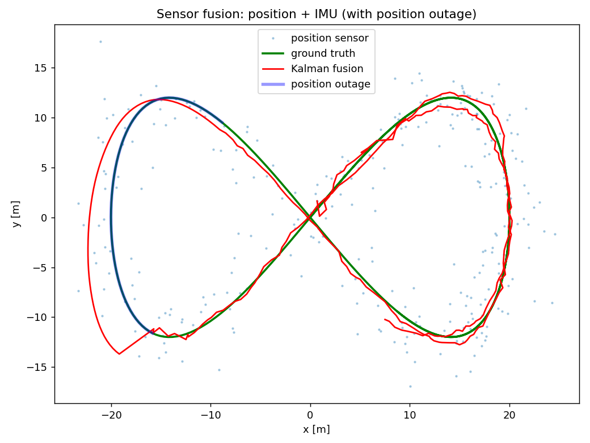

### 3. Nonlinear tracking (CTRV): EKF vs UKF (`scripts/03_ctrv_ekf_ukf.py`)
A target moving with **constant turn rate & velocity** (sin/cos of heading → nonlinear
motion). A linear constant-velocity KF structurally lags on turns; EKF linearizes the
motion via a hand-derived Jacobian; UKF propagates sigma points.

| method | RMSE (all) | RMSE (turning) |
|--------|-----------:|---------------:|
| raw measurement | 2.59 m | — |
| linear CV-KF | 1.60 m | 1.76 m |
| **EKF (CTRV)** | **1.39 m** | **1.38 m** |
| UKF (CTRV) | 1.42 m | 1.40 m |

- The **nonlinear motion model (CTRV) beats linear CV-KF by ~22% on turns** — the model
  matters more than the filter flavor here.
- **EKF ≈ UKF** at this noise level: honest result. UKF's real edge is *practical* — it
  needs no hand-derived Jacobian (I derived the full CTRV Jacobian for the EKF), and it
  degrades more gracefully as nonlinearity/uncertainty grow.

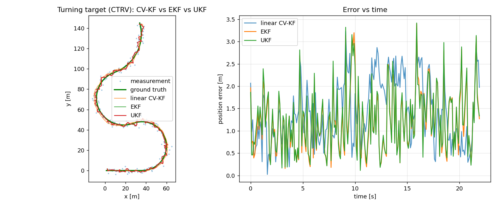

### 4. Online IMU bias estimation (`scripts/04_imu_bias.py`)
An accelerometer has a slowly-varying bias; unestimated, it double-integrates into
position drift. Augment the state with the bias ([p, v, **b**]) and estimate it online
from position fixes. Tested with a GPS-like outage (k=120–200).

| filter | RMSE (all) | RMSE (during outage) |
|--------|-----------:|---------------------:|
| no-bias ([p, v]) | 4.78 m | 9.12 m |
| **bias-augmented ([p, v, b])** | **3.52 m** | **6.65 m** |

- Estimating the bias cuts dead-reckoning drift during the outage by ~27%.
- **Observability made visible:** the bias estimate converges while position fixes
  arrive but **freezes during the outage** (no measurement → bias unobservable) — then
  resumes. Exactly the right behavior.
- Honest limit: on a maneuvering target, bias is partly confounded with true
  acceleration, so convergence is good but not exact.

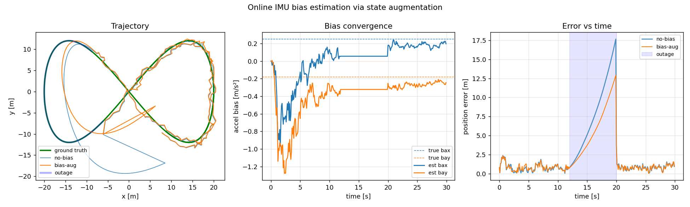

### 5. EKF-SLAM: localization + mapping at once (`scripts/05_ekf_slam.py`)
The robot drives with noisy odometry and observes landmarks by range-bearing. The state
grows to hold the **robot pose + every landmark** ([x,y,θ, l₁ₓ,l₁ᵧ, …]); each observation
updates pose and map together. A compass aids heading (as real robots fuse a
magnetometer).

| | RMSE |
|--|-----:|
| odometry only | 3.31 m |
| **EKF-SLAM trajectory** | **0.19 m** |
| **EKF-SLAM map (landmarks)** | **0.11 m** |

- SLAM localizes **17× better than dead-reckoning** and recovers the map to ~0.1 m.
- Getting this stable took real debugging — documented honestly in the code comments:
  proper landmark initialization (inverse-observation covariance), **heading
  observability** (a single self-initialized landmark can't correct the pose that
  placed it → needs a heading source), **±π wrap** handling, and innovation gating for
  numerical robustness.

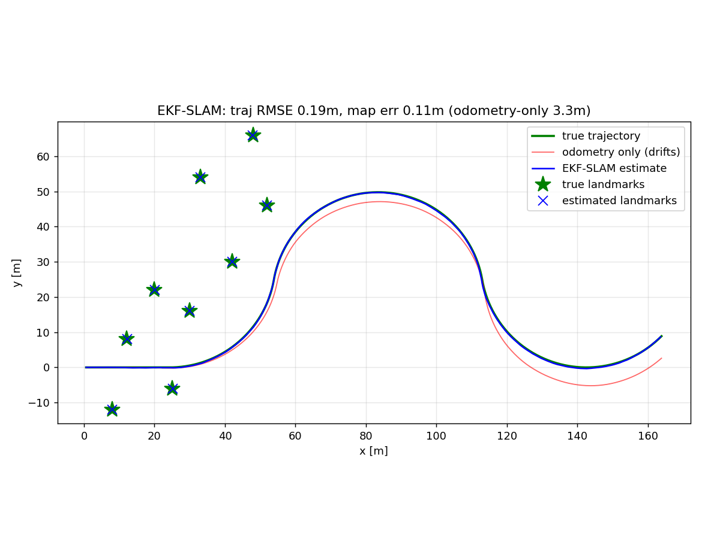

### 6. Loop closure (`scripts/06_loop_closure.py`)
The robot drives a full loop on odometry (heading drifts, no compass here) and returns to
the start. Re-observing the **anchor landmarks** seen first (when the pose was certain)
produces a large, legitimate innovation — a *loop-closure* update — that propagates back
through the covariance and tightens the map. Compared with a run that ignores the revisit:

| | return-phase RMSE |
|--|------------------:|
| no loop closure | 4.80 m |
| **with loop closure** | **3.32 m** |

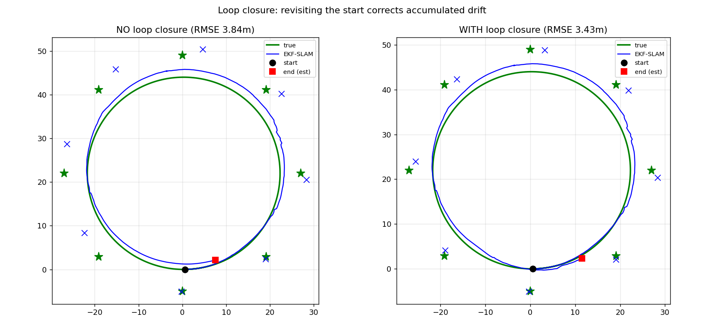

- Closure cuts return-phase drift ~**1.4×** and visibly re-aligns the map (right panel:
  estimated landmarks snap onto the true ones).
- Loop-closure observations are **exempted from the innovation gate** — a closure is a
  large innovation *by design*, so gating it as an outlier would defeat the purpose.
- **Honest limit:** a filter (EKF) can't re-linearize the whole past trajectory the way
  graph-based SLAM (pose-graph optimization) does, so the correction is partial. That
  gap is exactly why modern SLAM is graph-based — a natural next study.

### 7. Graph SLAM — pose-graph optimization (`scripts/07_pose_graph_slam.py`)
The fix for EKF-SLAM's partial correction: model the trajectory as a **graph** (nodes =
poses, edges = odometry + loop-closure constraints) and optimize all poses jointly with
Gauss-Newton. Unlike a filter, it **re-linearizes the entire past**, so one loop-closure
edge corrects the whole trajectory.

| | trajectory RMSE | end gap |
|--|----------------:|--------:|
| odometry only (open loop) | 4.81 m | 7.57 m |
| **pose-graph optimized** | **0.99 m** | **0.29 m** |

- A single loop-closure edge **snaps the whole loop shut** — 5× error reduction (vs
  EKF-SLAM's 1.4× partial closure). χ² 21271 → 5.9 in 4 iterations.
- SE(2) error/Jacobians derived from scratch (`src/sensor_fusion/posegraph.py`); pose 0
  anchored as the gauge.

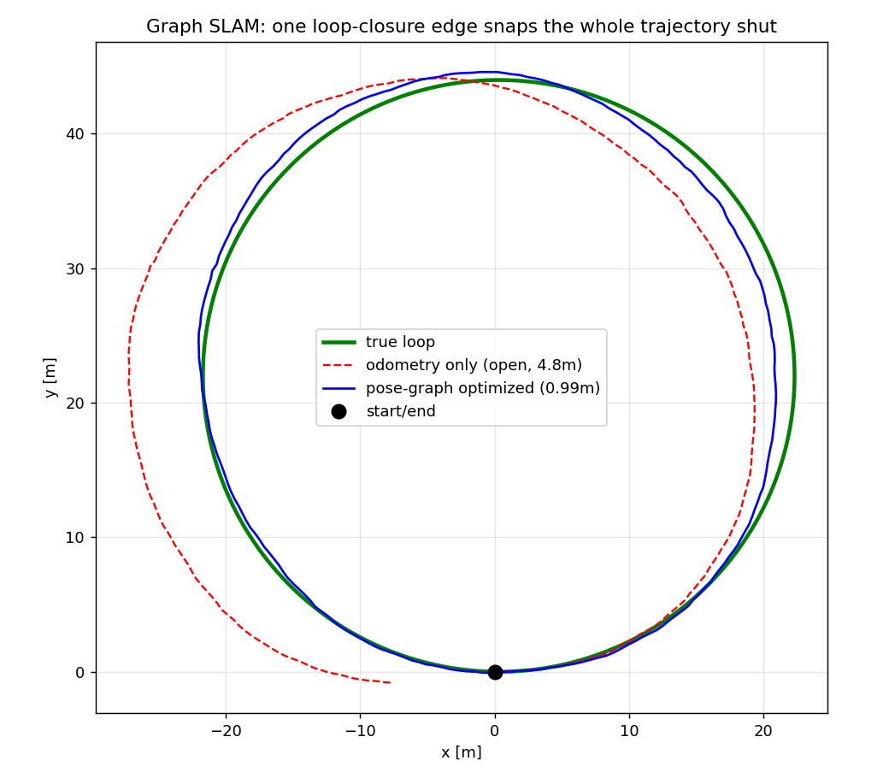

This is why modern SLAM is graph-based. The lab now spans the arc: linear KF → EKF/UKF →
IMU bias → EKF-SLAM → EKF loop closure (partial) → **graph SLAM (full)**.

### 8. Visual-Inertial Odometry (VIO) (`scripts/08_vio.py`)
The workhorse of modern robot/AR localization, and a keyword on every state-estimation
JD. A monocular camera gives only **bearing** to features (no range); the IMU gives
high-rate motion but double-integrates into drift. An EKF fuses them tightly.

| | position RMSE |
|--|--------------:|
| IMU only (dead-reckoning) | 3.45 m |
| **VIO (IMU + monocular bearing)** | **1.05 m** |

- Visual bearing updates cut IMU drift **3×**; the estimate stays locked to truth even
  where features are sparse (see the divergence of IMU-only in the upper arc).

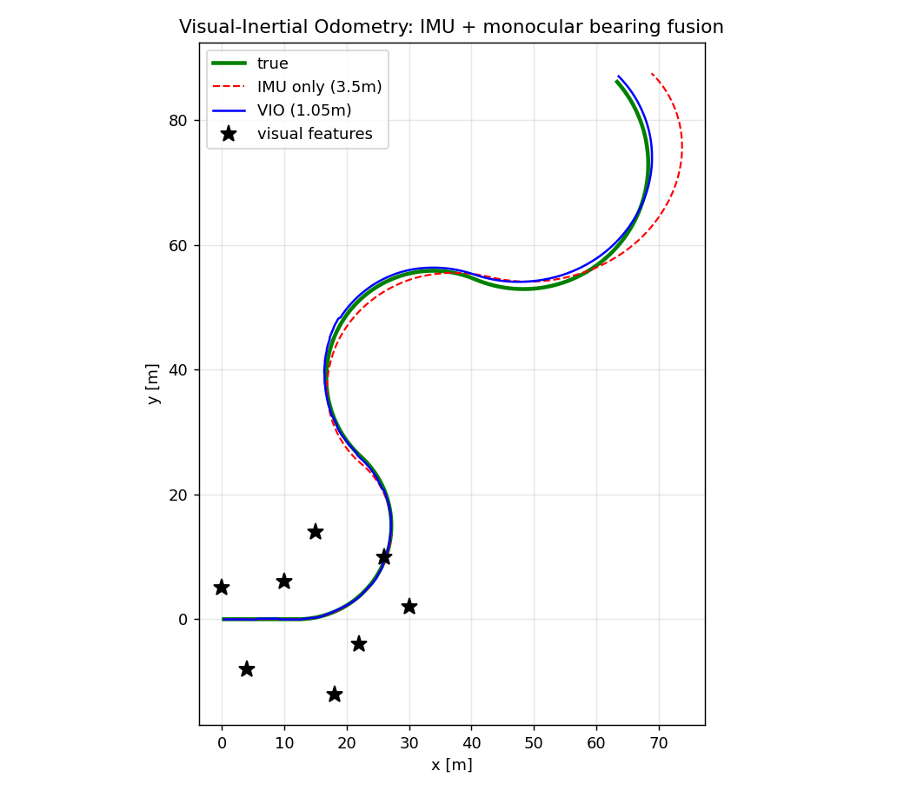

### 9. Uncertainty-aware safe autonomy (`scripts/09_safe_autonomy.py`)
The estimation counterpart of a surgical robot's **"No-Fly Zone"**: an autonomous system
approaches a critical boundary while its sensors degrade (position sensor drops out →
covariance grows). Two stop rules, 300-trial Monte-Carlo:

| stop rule | no-fly-zone violation rate |
|-----------|---------------------------:|
| naive (trusts the estimate) | **60%** |
| **uncertainty-aware (estimate + k·σ)** | **0%** |

- The naive rule trusts a drifted estimate and crosses the safety line 60% of the time.
- The uncertainty-aware gate **stops when it doesn't know** (widening covariance → larger
  margin), preventing every violation — at the cost of stopping ~1.3 m earlier.
- This is exactly the *Task-Autonomy-under-supervision* principle driving 2026 surgical
  robotics (FDA PCCP, real-time "No-Fly Zones"): safe autonomy = estimation + a margin
  that respects uncertainty. It reuses this repo's estimation core and the
  [signal-ml-lab](https://github.com/YeonkyunLee/signal-ml-lab) uncertainty-gate theme.

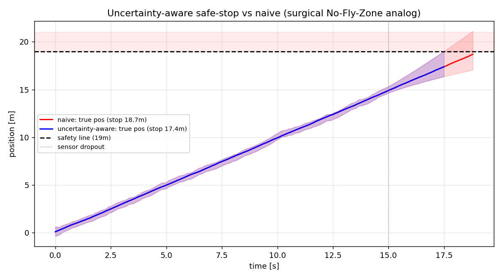

### 10. Modern SLAM — VIO front-end + factor-graph back-end (`scripts/10_vio_graph_slam.py`)
The real architecture of production SLAM, combining experiments 7–8: a **VIO front-end**
produces keyframe-to-keyframe odometry (drifts), and a **factor-graph back-end** fuses it
with loop-closure factors from place recognition. The robot drives **two laps**; the
second lap revisits the first → 42 loop-closure factors.

| | trajectory RMSE |
|--|----------------:|
| VIO front-end only (2-lap drift) | 16.33 m |
| **+ factor-graph back-end** | **0.68 m** |

- The back-end cuts drift **24×** (χ² 1.1M → 135 in 6 iterations). The drifting 2-lap
  spiral collapses onto a single clean circle once loop closures constrain it.
- This is the front-end/back-end split every modern SLAM system (ORB-SLAM, VINS) uses.

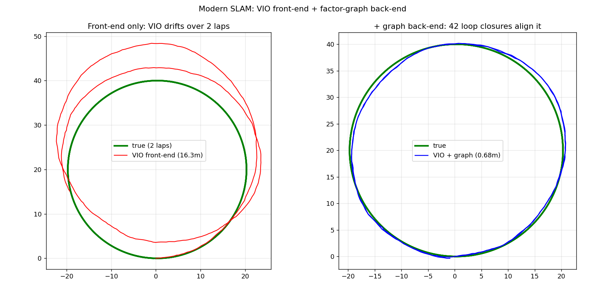

The lab now covers the full modern stack: **KF → EKF/UKF → IMU bias → EKF-SLAM →
loop closure → graph SLAM → VIO → VIO+graph → safe autonomy.**

### 11. Robust SLAM — rejecting false loop closures (`scripts/11_robust_slam.py`)
Real place recognition sometimes matches the wrong place (perceptual aliasing). A single
**false loop-closure** can wreck a least-squares map. Robust back-ends handle it — here a
**Huber kernel** (IRLS) downweights outliers, then rejected edges are dropped and the
graph re-optimized.

| | trajectory RMSE |
|--|----------------:|
| naive least-squares (3 false closures injected) | 6.28 m |
| **robust (Huber) + rejection** | **2.40 m** |

- The 3 false loop closures get IRLS weights **0.02–0.05** (rejected); the true one keeps
  weight **1.0**. Error cut **3×**; the distorted map re-forms into a clean circle.
- Perceptual aliasing / outlier rejection is a top real-world SLAM failure mode — this is
  what separates a demo from a deployable back-end.

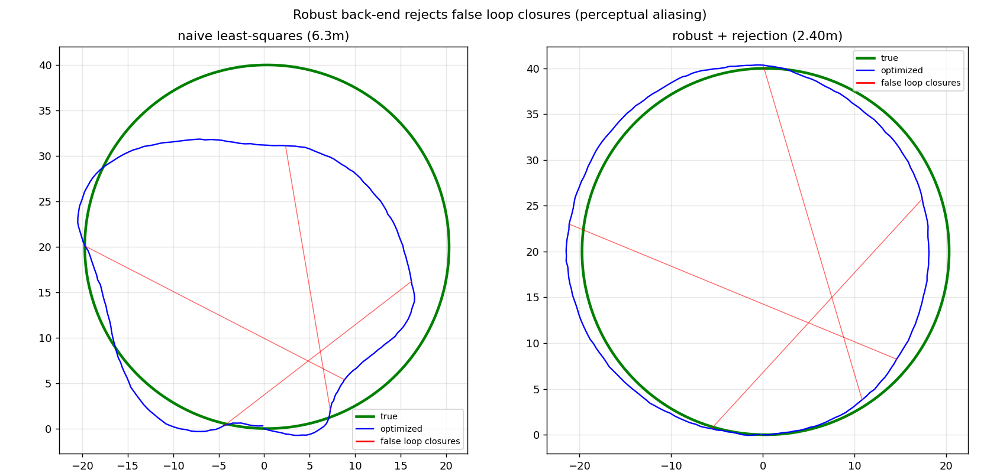

### 12. Full graph SLAM — joint pose + landmark optimization (`scripts/12_graph_slam_landmarks.py`)
The capstone: put **landmarks in the graph too**. Poses (SE(2)) and landmark points are
both nodes; odometry factors (pose–pose) and range-bearing factors (pose–landmark) are
optimized *jointly* with Gauss-Newton — the batch (bundle-adjustment) counterpart of the
sequential EKF-SLAM in experiment 5.

| | pose RMSE | map RMSE |
|--|----------:|---------:|
| odometry init | 7.29 m | 6.46 m |
| **joint BA (210 poses + 10 landmarks)** | **0.30 m** | **0.33 m** |

- Jointly optimizing 209 odometry + 622 observation factors: **pose 24×, map 20×**
  better (χ² 280k → 1.2k in 6 iterations). The drifted spiral and scattered landmarks
  snap onto the true circle and true landmark positions.
- Range-bearing factor Jacobians (∂/∂pose, ∂/∂landmark) derived from scratch.

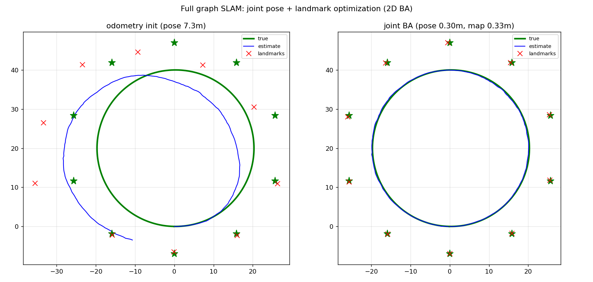

### 13. 3D SE(3) pose-graph SLAM (`scripts/13_pose_graph_3d.py`)
Real robots and drones live in **3D**. Poses become SE(3) (rotation + translation); the
optimizer works in the 6-DOF tangent space (se(3)) and retracts via the exp map. SO(3)/
SE(3) exp·log built from scratch (`src/sensor_fusion/se3.py`, verified by log∘exp roundtrip
to 1e-15). A tilted circle is driven twice; the second lap revisits the first → loop closures.

| | 3D position RMSE |
|--|-----------------:|
| odometry only (2-lap drift) | 4.54 m |
| **SE(3) pose-graph optimized** | **1.43 m** |

- 23 loop-closure factors + Gauss-Newton on the manifold cut 3D drift **3×** (χ² 109k → 144).
- Numerical Jacobians with right-perturbation on SE(3) — a robust way to prototype
  manifold optimization without hand-deriving SO(3) Jacobians.

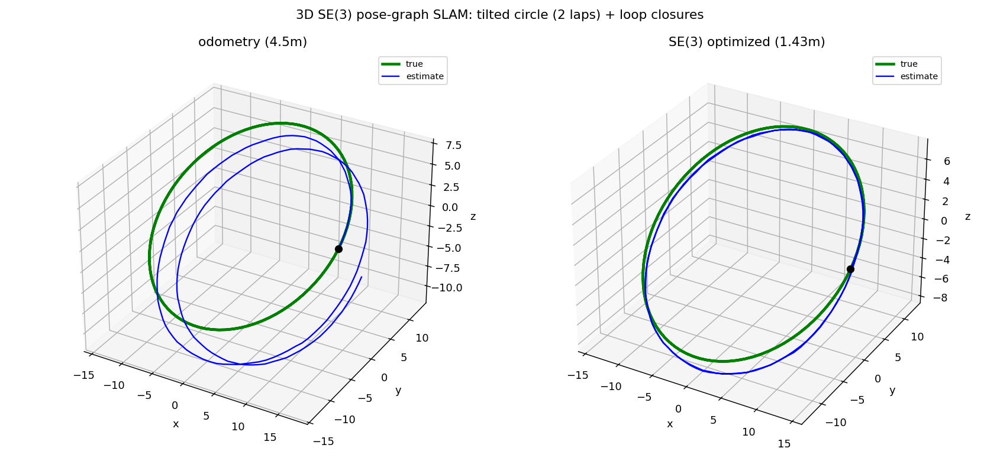

### 14. Standard g2o benchmarks — validation on real datasets (`scripts/14_g2o_benchmark.py`)
Everything above is synthetic. Here the from-scratch optimizers are run on the **community
standard `.g2o` pose-graph benchmarks** (parsed, solved with a sparse `scipy` normal-equation
solver) — the datasets every SLAM paper reports on.

| dataset | poses / edges | χ² before → after |
|---------|--------------:|:------------------|
| **Intel** (2D SE(2)) | 1228 / 1483 | 5,149,721 → **216** |
| **parking-garage** (3D SE(3)) | 1661 / 6275 | 16,727 → **1.3** |

- Both converge in ≤10 iterations to the recognizable canonical maps (Intel's corridors;
  the multi-level parking garage). *Not synthetic circles — the actual benchmarks.*
- Confirms the SE(2)/SE(3) error, Jacobians, and Gauss-Newton back-ends are correct at scale.

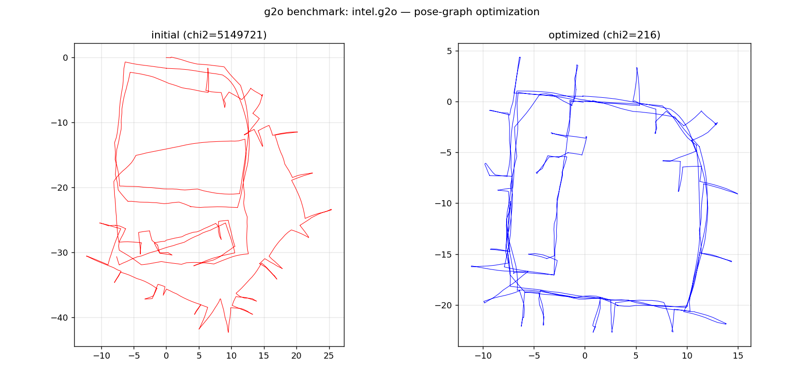
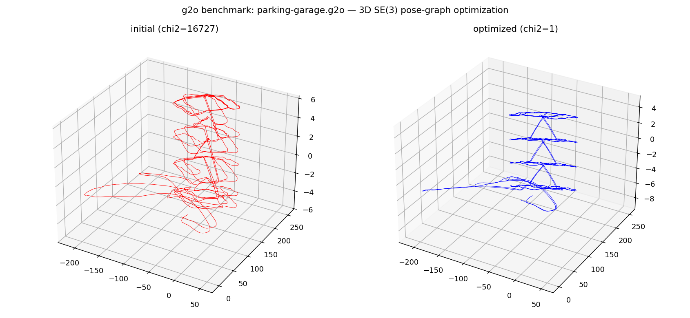

> Datasets aren't committed (redistribution). Fetch, e.g., the Intel/parking-garage `.g2o`
> from public SLAM dataset repos into `data_cache/`, then run the script.

### 15. Robust SLAM on a real benchmark (`scripts/15_robust_g2o.py`)
Combining #11 (robustness) and #14 (real data): inject **30 false loop closures** into the
real Intel g2o and compare robust kernels. Odometry edges stay full-weight (the backbone);
loop-closure edges are robustified.

| kernel | inlier χ² (lower = cleaner map) |
|--------|--------------------------------:|
| none (naive) | 23,220 |
| Huber | 9,836 |
| **DCS (Dynamic Covariance Scaling)** | **216** |

- **DCS fully rejects the outliers** — recovering the clean Intel corridor map (216 ≈ the
  uncorrupted optimum). Huber only partially helps; naive is wrecked.
- Key practical detail: apply the robust kernel **only to loop-closure edges**, not the
  odometry backbone — otherwise large initial residuals downweight everything and the
  optimizer stalls.

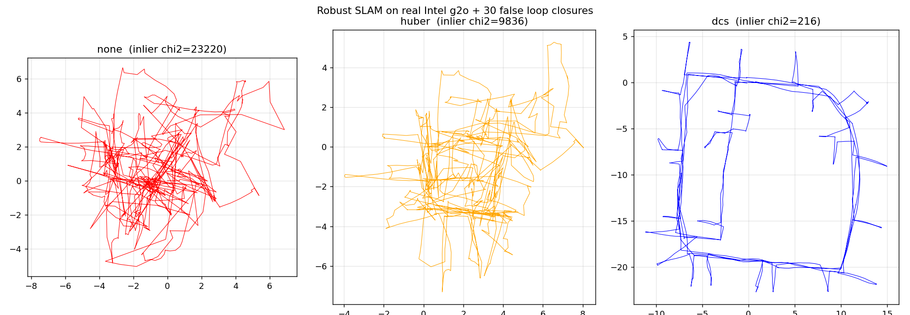

### 16. Learned IMU front-end (ML + estimation) (`scripts/16_learned_imu_frontend.py`)
The 2026 direction is *learning + estimation*. A small **1D-CNN denoiser** cleans raw IMU
before dead-reckoning — the denoising technique from
[signal-ml-lab](https://github.com/YeonkyunLee/signal-ml-lab) entering the robot estimation
pipeline. Noise is realistic: white + random-walk bias + non-Gaussian **spikes**.

| accel front-end | dead-reckon position RMSE |
|-----------------|--------------------------:|
| raw IMU | 9.66 m |
| classical low-pass | 6.65 m |
| **learned 1D-CNN** | **6.28 m** |

- The learned front-end removes spikes and white noise cleanly (see signal panel) and
  beats raw **1.5×**, edging classical low-pass. Requires `torch` (optional dep).
- **Honest limit:** the residual drift is the *integrated random-walk bias* — low-frequency
  and unremovable by any front-end. That's precisely why IMU dead-reckoning needs
  **fusion / SLAM** (experiments 2, 4, 8, 10) — the front-end helps at the margin; the
  architecture is what closes the loop.

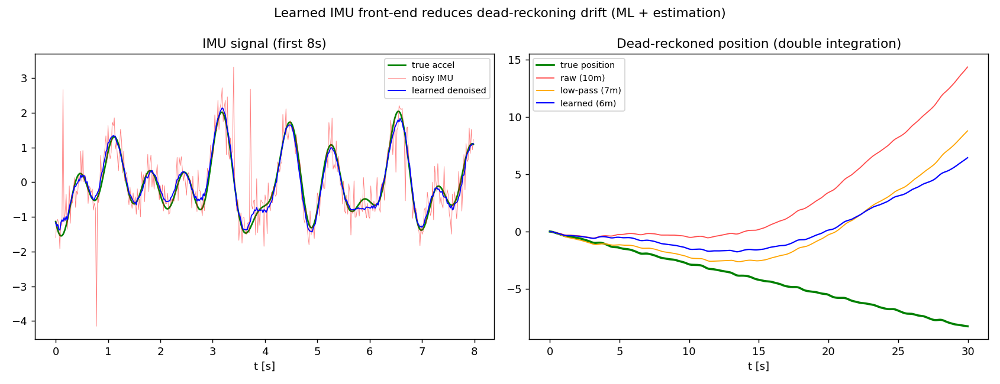

### 17. Online SLAM — fixed-lag smoother vs full batch (`scripts/17_fixed_lag_slam.py`)
Real online estimators (VIO, etc.) can't re-solve the whole trajectory every step. A
**fixed-lag smoother** optimizes only the last *L* poses (older ones fixed) → constant
per-step problem size, i.e. **O(1) per step** vs full batch's growing **O(N)**.

| | per-step solve dimension | final trajectory RMSE |
|--|-------------------------:|----------------------:|
| **fixed-lag (L=15)** | **constant (≤45)** | 5.76 m |
| full batch | grows to 420 | **0.67 m** |

- The tradeoff is the point: fixed-lag is **real-time-constant** but sacrifices **global
  consistency** — a loop closure to a pose *outside* the window can't correct it, so drift
  in the second lap persists (right panel).
- This is exactly why production stacks pair a **fixed-lag front-end** with a **global
  loop-closure back-end** (experiments 7 & 10) — fast local tracking + occasional global
  correction. Speed and consistency are different jobs.

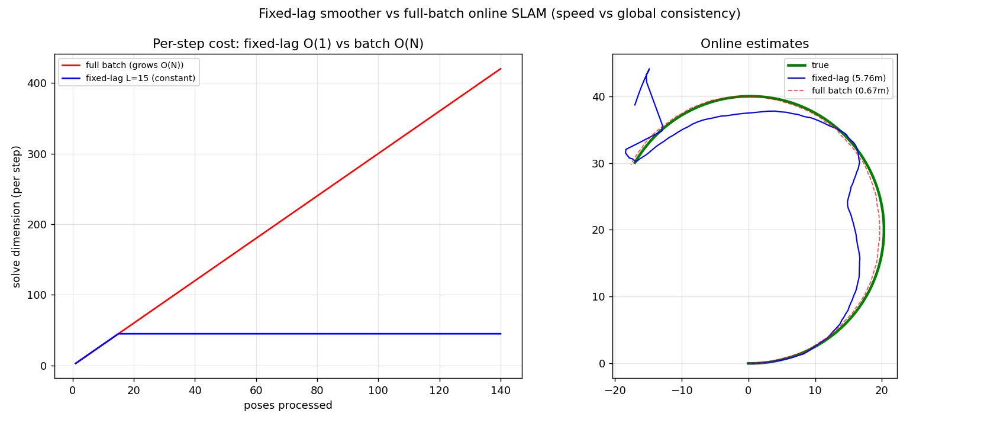

### 18. Full SLAM system — front-end + robust back-end integrated (`scripts/18_full_slam_system.py`)
The capstone that puts the pieces together into the actual production architecture
(ORB-SLAM / VINS style): a **fixed-lag front-end** gives a real-time pose every step
(drifts), while a **global pose-graph back-end** with a **DCS robust kernel** fires on
loop-closure detection — correcting the whole trajectory and rejecting false closures.

| | trajectory RMSE |
|--|----------------:|
| front-end only (fixed-lag, real-time) | 10.76 m |
| **full system (+ robust global back-end)** | **1.68 m** |

- The back-end cuts front-end drift **6×** and **rejects 2 injected false loop closures**
  (DCS) — combining experiments 7, 10, 11/15, 17 into one working system.
- This is the real answer to "speed vs consistency": a fast local front-end *and* an
  occasional global back-end, each doing the job it's good at. **Systems integration, not
  just isolated components.**

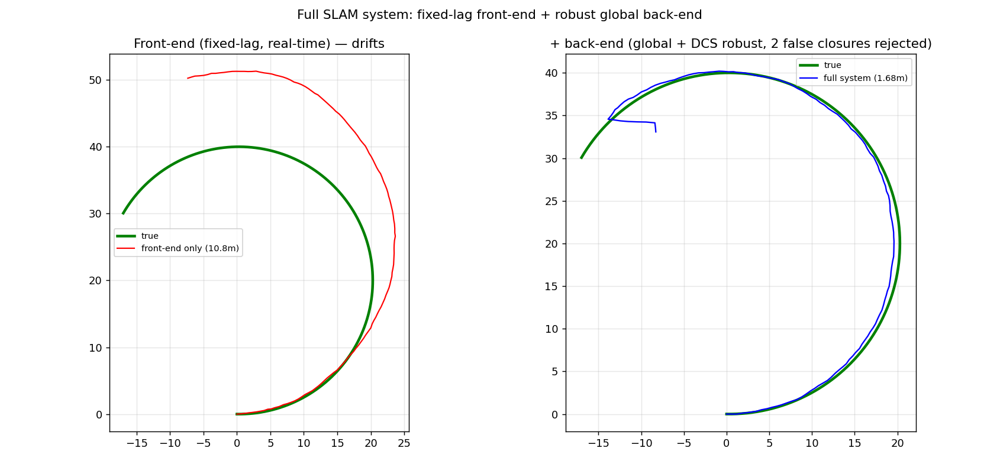

### 19. Beyond estimation — planning + control (`scripts/19_plan_control.py`)
Localization answers *"where am I?"*; to be useful a robot must also *get somewhere*. This
adds the next two layers of the stack on top of the estimator: **A\* path planning** +
**pure-pursuit control** driving a unicycle robot to a goal through a cluttered map — while
respecting a **no-go zone** (a sensitive instrument, the lab/medical-safety analog).

- Robot reaches the goal, min **no-go-zone clearance 1.9 m** (never violates), 59 m driven.
- A\* on an inflated occupancy grid (robot radius) + smooth pure-pursuit tracking.
- Closes the robotics loop **estimation → planning → control** — and the no-go zone ties
  back to the uncertainty-aware safety theme (experiment 9).

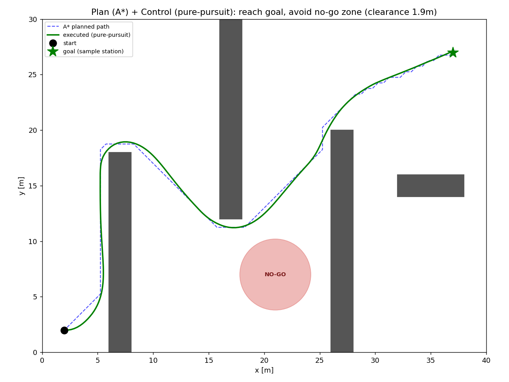

### 20. Dynamic obstacle avoidance (DWA) (`scripts/20_dwa_dynamic.py`)
19번의 A\*는 정적 지도에서 경로를 미리 깔지만, 사람·다른 로봇처럼 움직이는 장애물 앞에선
그 경로가 곧 무효가 된다. **DWA(Dynamic Window Approach)**는 매 스텝 로봇의 속도공간
`(v, w)`에서 가속한계로 도달 가능한 창만 샘플링하고, 각 후보로 짧은 궤적을 예측한 뒤
`heading + goal-distance + clearance + velocity` 점수로 최적 명령을 골라 반응적으로 한 스텝
나아간다. 장애물의 **미래 위치**까지 예측에 반영해 실시간 충돌 회피를 수행한다.

- 유니사이클 로봇이 등속으로 이동하는 장애물 3개를 피해 목표 도달 (15.8 s), 주행 17.5 m.
- 최소 장애물 클리어런스 **0.92 m** (충돌 없음); 장애물의 미래 위치를 예측 궤적 전 구간에 반영.
- **Honest limit:** DWA는 전역 추론이 없는 탐욕적 지역 계획기 — 지역최소 탈출용 goal-distance 항을
  더했지만, 장애물이 통로를 동시에 막는 적대적 배치에선 순수 지역 계획기는 여전히 갇힐 수 있다.
  이것이 실무에서 지역 계획기(DWA)를 전역 계획기(A\*, 19번)와 짝짓는 이유.

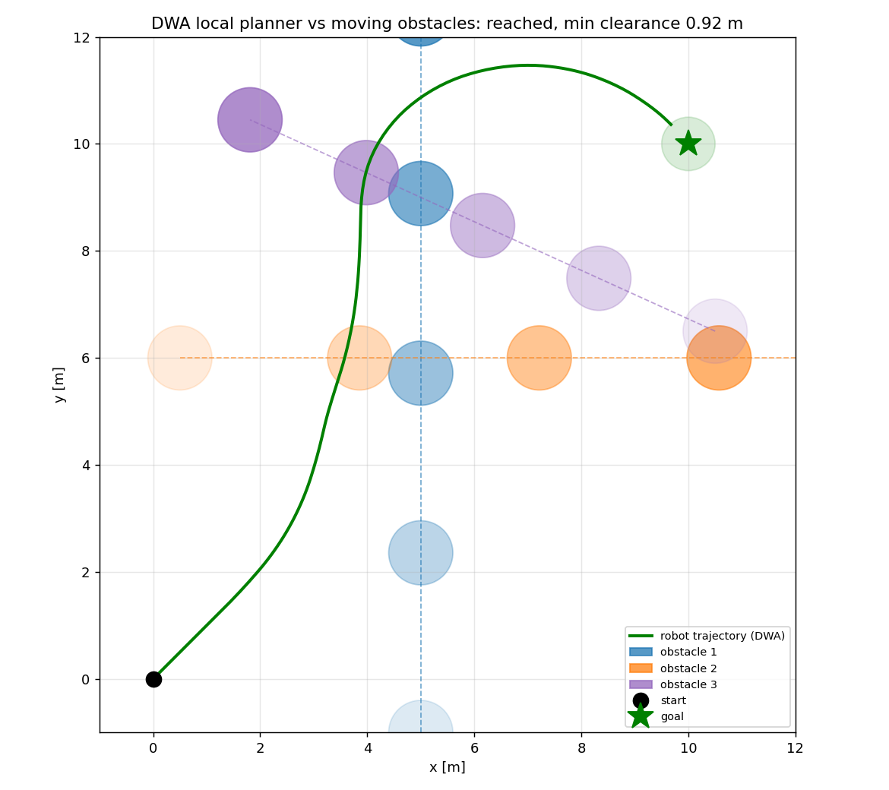

### 21. ICP scan-matching for LiDAR odometry (`scripts/21_icp_scan_matching.py`)
지금까지 오도메트리는 IMU/바퀴 기반이었다. 여기선 **LiDAR 스캔매칭** — 고전적 SLAM 프론트엔드를
밑바닥부터 구현한다. 연속한 두 2D 점군을 정렬해 그 사이 로봇의 상대 이동 SE(2)를 추정하고 누적해
궤적을 복원한다. **점-대-점 ICP**: {최근접 대응(KD-tree) → SVD로 최적 강체변환(Umeyama/Kabsch)
→ 적용 → 수렴까지 반복}. 방 윤곽 벽 + 흩뿌린 기둥 환경에서 잡음 섞인 스캔을 만들고 연속 스캔에
ICP를 걸어 상대 이동을 적분한다.

| | trajectory RMSE |
|--|----------------:|
| raw dead-reckoning (no correction) | 1.17 m |
| **ICP scan-matching odometry** | **0.13 m** |

- ICP 오도메트리가 무보정 대비 약 **9.3×** 정확; 스캔당 평균 정렬 오차 0.057 m로 잡음 수준까지 수렴.
- 흩뿌린 기둥 특징이 벽만 보일 때 생기는 **aperture(벽-미끄러짐) 문제**를 깨 정렬을 유일하게 만듦
  — 실무 스캔매칭의 핵심 조건수 이슈. 최근접 탐색만 `scipy.spatial.cKDTree`, 나머지는 numpy+SVD.
- 우측 인셋: 회전 구간 한 쌍의 스캔이 ICP 전(빨강)→후(파랑)로 목표 스캔(검정)에 정합되는 모습.

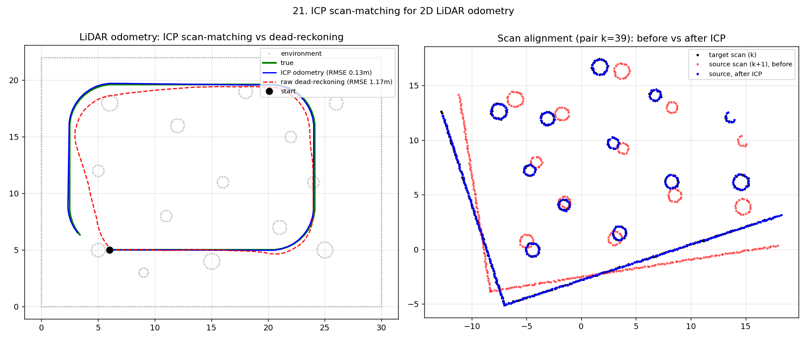

### 22. Surgical tremor cancellation (medical) (`scripts/22_surgical_tremor.py`)
미세수술 로봇은 집도의 손의 **생리적 수전증(~8–12 Hz, 수백 µm)**만 제거하고 의도한 저주파 큰
움직임은 그대로 따라야 한다(steady-hand robot). DSP·추정·의료가 만나는 지점. 500 Hz로 2D 리칭
궤적 + ~10 Hz 수전증 + 센서 잡음을 합성하고 네 기법의 잔여 떨림(대역 RMS)과 추종오차를 비교한다.

| method | 잔여 떨림 | 억제 | 추종오차 | 특성 |
|--------|--------:|-----:|--------:|------|
| low-pass (filtfilt 5 Hz) | 0.9 µm | 212× | 7.8 µm | 영위상 = **비인과**(오프라인) |
| band-stop (filtfilt 7–13 Hz) | 1.1 µm | 175× | 30 µm | 비인과(오프라인) |
| Kalman CV (causal) | 45 µm | 4.1× | 146 µm | 실시간, 전대역 스무딩 → 지연 |
| **adaptive FLC (causal)** | **17.6 µm** | **10.7×** | **37 µm** | 실시간 최적 |

- 실시간 최적은 **적응형 푸리에 선형결합기(FLC, 적응 노치)**: 떨림 188 → 17.6 µm(**10.7× 억제**),
  추종오차 37 µm(의도 30 mm 리칭 대비 미미).
- **Honest trade-off:** filtfilt가 수치는 최고(200×)지만 영위상 = 비인과라 오프라인 후처리 전용;
  Kalman은 전대역 스무딩이라 빠른 동작에서 지연. FLC만 떨림 대역만 노치처럼 제거해 인과성과 의도동작
  보존을 동시에 달성. 순수 LMS는 의도동작(떨림의 ~150배)이 그래디언트를 지배해 불안정 → 오차의
  고역통과 성분으로만 가중치를 갱신해 해결.

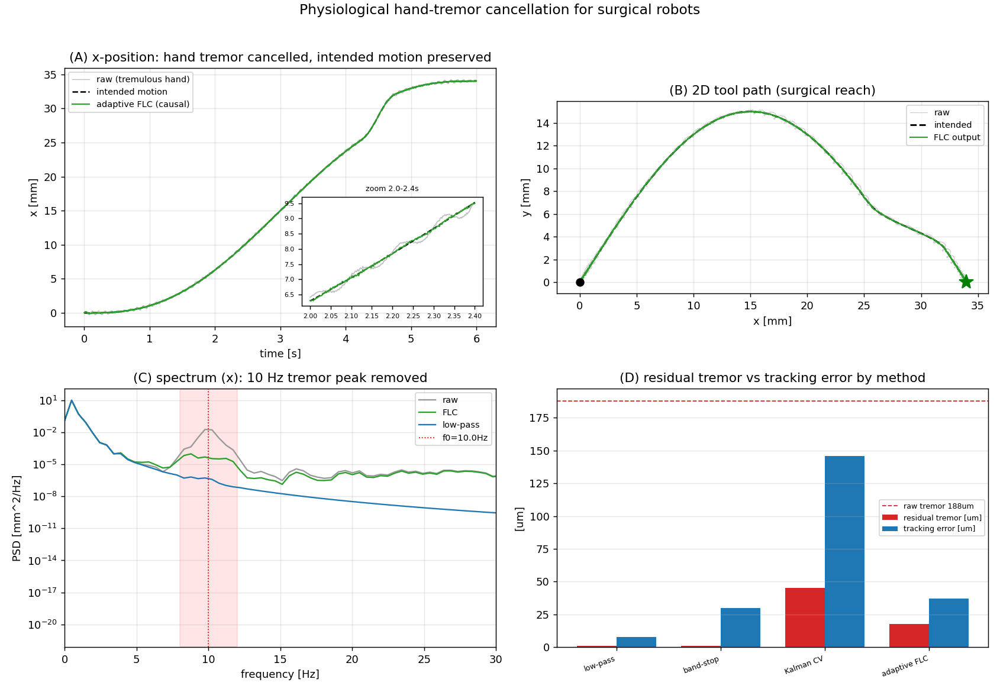

> 🩺 There's a live **[in-browser demo](https://yeonkyunlee.github.io/sensor-fusion-lab/tremor_demo.html)**
> (`tremor_demo.html`) — move your mouse and watch the ~10 Hz tremor get cancelled in real time.

### 23. Full 2D LiDAR SLAM — ICP front-end + pose-graph back-end (`scripts/23_lidar_slam.py`)
The integration piece tying exp 21 (ICP scan-matching odometry) to exp 7 (SE(2) pose-graph). The
**front-end** aligns consecutive LiDAR scans with point-to-point ICP → relative-motion odometry edges;
over two laps the per-scan errors accumulate into visible drift. A **place-recognition** step flags
revisited poses (radius search on the drifting estimate), confirms each with ICP between the current and
past scan (residual + translation-sanity gate), and adds loop-closure edges. The **back-end**
(Gauss-Newton on the SE(2) pose-graph, reusing `src/sensor_fusion/posegraph.py`) optimizes odometry +
loop-closure constraints, re-linearizing the whole trajectory so the loop snaps shut.

| trajectory | RMSE vs truth | end-point drift |
|--|----------:|---------:|
| ICP odometry (front-end only) | 0.890 m | 1.894 m |
| **graph-optimized (front-end + back-end)** | **0.270 m** | **0.019 m** |

- 165 poses, 2-lap loop, 164 odometry + **43 ICP-verified loop-closure** edges. Back-end cuts drift
  **3.3×** (χ² 18,739 → 3.85 in 4 iterations); the drifting spiral snaps onto the true loop.
- This is a **complete LiDAR SLAM pipeline** — a different sensor modality (range scans, not
  bearing/IMU) feeding the same graph back-end proven in exps 7/10/14. Front-end + back-end, again.

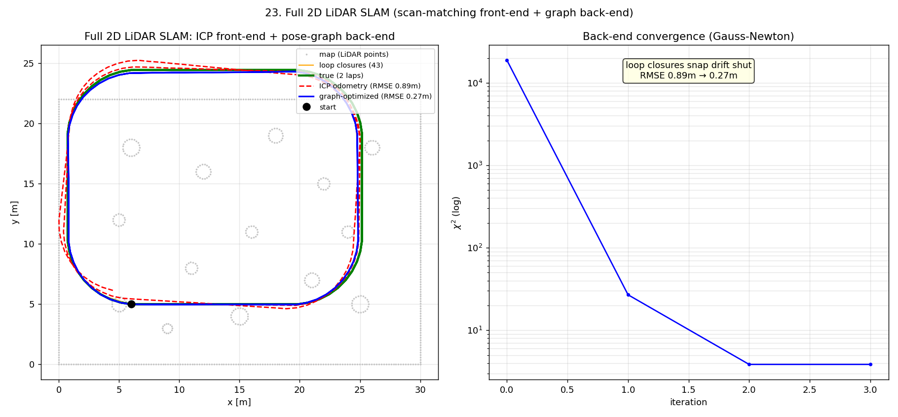

### 24. Model-predictive control (MPC) trajectory tracking (`scripts/24_mpc_tracking.py`)
Pure-pursuit (exp 19) steers off a single lookahead point — simple and fast, but it cuts corners on
tight curves and can't reason about actuator limits. **MPC** instead optimizes a short horizon of control
inputs at every step to minimize tracking error + control effort subject to `|v|,|w|` (and acceleration)
limits, applies the first input, and repeats (receding horizon). The unicycle model is linearized about
the reference into a condensed convex QP; the baseline is exp 19-style pure-pursuit on the same figure-8
(Bernoulli lemniscate).

| controller | cross-track RMSE | max error (corner-cut) | respects `|v|,|w|` limits |
|--|----------:|----------:|:--|
| pure-pursuit | 0.058 m | 0.111 m | — (fixed law) |
| **MPC** | **0.019 m** | **0.036 m** | yes (|v|=2.04≤2.6, |w|=0.84≤1.5) |

- MPC tracks **~3×** tighter in both average and worst-case error, mainly by not chording across the
  lobes, while keeping controls inside the actuator envelope.
- **Honest tradeoff:** on this moderate-curvature track pure-pursuit is already good (cm-scale), and MPC
  pays a real compute cost (a QP solve every step) for its edge — the gap widens as curvature approaches
  the actuator limits.

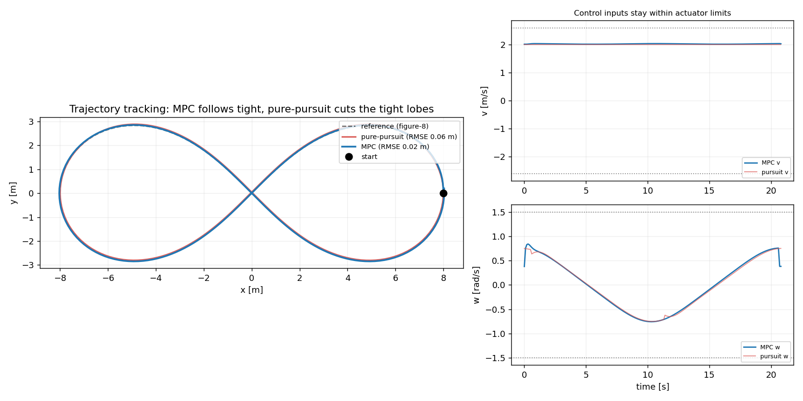

### 25. Occupancy-grid mapping (scan-to-map) (`scripts/25_occupancy_mapping.py`)
The "mapping" half of SLAM, complementing exp 23 (which recovers only the trajectory). Given robot poses
and LiDAR scans, this builds a probabilistic **occupancy grid** with **log-odds ray casting**: for every
scan point a ray is cast from the robot to the hit — cells the ray passes through get a negative (free)
update, the hit cell a positive (occupied) update (vectorized DDA at grid resolution). Log-odds convert to
probability (`p = 1/(1+e⁻ˡ)`) for a grayscale map; over two laps repeated noisy observations sharpen walls
and pillars. When poses are noisy, an optional **scan-to-map** step aligns each new scan (ICP against the
current map's occupied-cell cloud) before integrating.

| map | occupied IoU | pose RMSE |
|--|----------:|---------:|
| true-pose (upper bound) | **0.72** | — |
| noisy-pose naive | 0.13 | 0.45 m |
| **noisy-pose scan-to-map** | **0.18** | **0.35 m** |

- Occupied-cell IoU vs truth **0.72** (1-cell tolerance, observed cells only — occlusion gaps excluded
  honestly). Scan-to-map refinement lifts the noisy-pose map IoU 0.13 → 0.18 and pose RMSE 0.45 → 0.35 m.
- Honest limits: thin walls (1–2 cells) and occlusion leave faint/hollow pillars; naive noisy poses
  double-print the boundary.

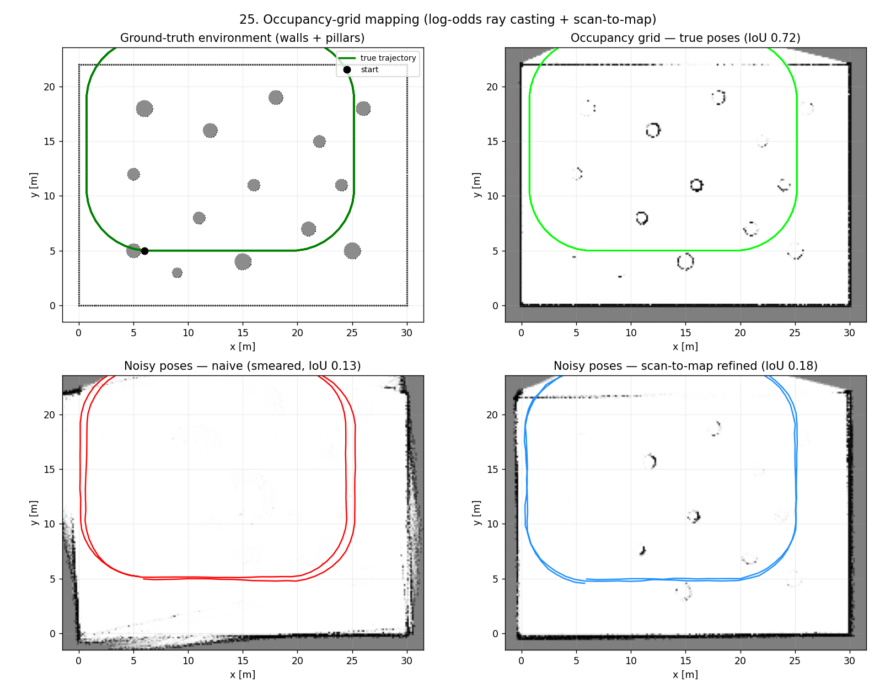

### 26. Obstacle-avoiding MPC (`scripts/26_mpc_obstacle.py`)
Unifies exp 24 (MPC tracking) and exp 20 (reactive avoidance) into one optimizer: the MPC horizon cost
gains a **collision-avoidance term** so the robot tracks its reference while staying outside a safety
radius around each obstacle. The unicycle is rolled out **fully nonlinearly** (accurate even during large
swerves) and avoidance is a **smooth soft barrier** `½·β·max(0, margin − clearance)²` added to the
tracking/effort cost, solved with L-BFGS-B (analytic adjoint gradient) under `|v|,|w|` box + acceleration
bounds. Moving obstacles are predicted forward over the horizon. Same scenario, two controllers:
obstacle-**unaware** MPC (exp 24, β=0) vs obstacle-**aware** MPC, with obstacles placed **on** the figure-8.

| controller | min clearance | outcome | off-obstacle RMSE | limits |
|--|----------:|:--|----------:|:--|
| plain MPC (unaware, exp 24) | **−0.85 m** | collides (drives through all 3) | — | ok |
| **obstacle-aware MPC** | **+0.46 m** | avoids, returns to path | 0.087 m | ok (`|v|≤2.6, |w|≤1.5`) |

- Soft (not hard) constraints: always feasible and smooth, but *attract* rather than *guarantee* clearance
  (tuned by β); as a local optimizer it commits to one side without global reasoning — the honest tradeoff.

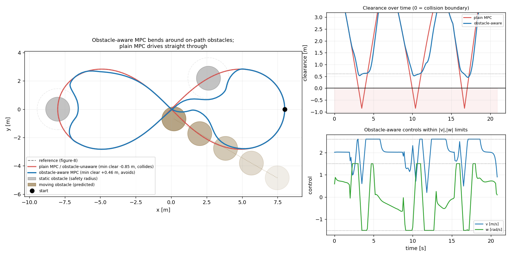

### 27. Gait-phase estimation for a rehab exoskeleton (medical) (`scripts/27_gait_estimation.py`)
A rehabilitation exoskeleton must know *where in the gait cycle* the wearer is — stance vs swing, and the
heel-strike / toe-off instants — to time its assistive torque; mistimed assistance fights the wearer and
raises fall risk. From a single foot-mounted IMU (gyro + accel, 200 Hz, bias + noise) this (1) detects
stance with a **zero-velocity / low-angular-rate detector** (SHOE-style: gyro magnitude + gravity
deviation), extracting heel-strike and toe-off events, and (2) estimates stride length by **ZUPT-aided**
integration — integrating acceleration to velocity, resetting to zero at each stance, then integrating to
distance — versus naive double integration.

- **Stance/swing classification 96.1%**; gait-event timing error **22.5 ms** mean (all events detected).
- **ZUPT stride error 2.2 cm vs naive 90 cm** on a 70 cm stride — **~41×** better; naive drifts
  quadratically as accelerometer bias accumulates. This is the wearable/rehab counterpart of the repo's
  IMU-bias (exp 4) and safe-autonomy (exp 9) medical themes.
- Honest limits: synthetic gait simplifies inter-subject variability, pathological gait, and
  sensor-alignment error.

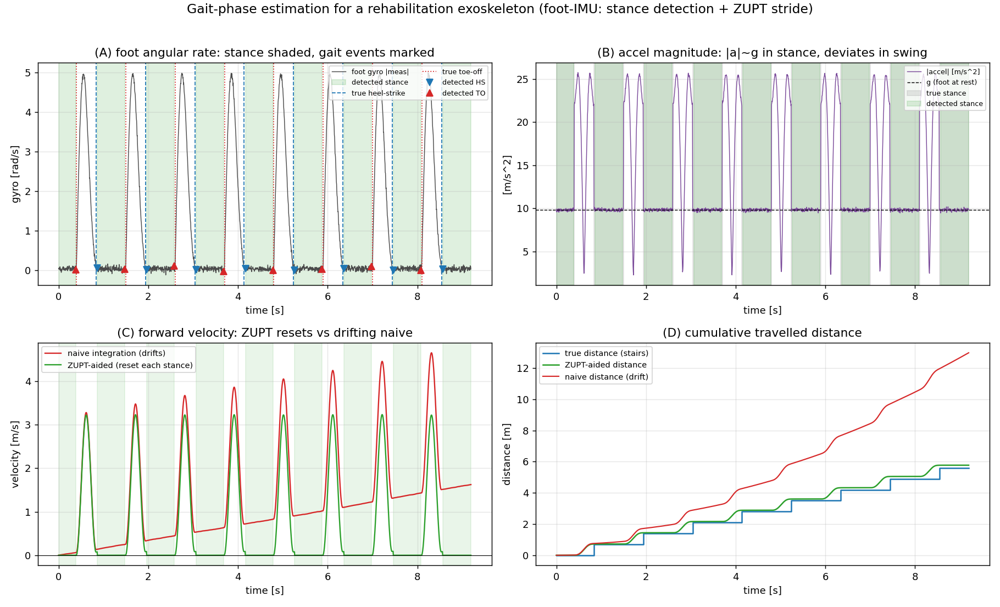

### 28. Full navigation capstone — A* global + obstacle-aware MPC local (`scripts/28_full_navigation.py`)
The integration capstone of the planning/control track. A **global A\*** planner finds a path through the
static map (walls + a no-go zone) on an inflated occupancy grid; the path is smoothed into a constant-speed
reference; then the **obstacle-aware MPC local controller** (from exp 26) tracks it while reactively bending
around **moving obstacles the global plan never knew about** — predicting each over the horizon and
respecting actuator limits. Ablation: following the same A\* path with a plain, obstacle-unaware tracker
drives straight into the moving obstacles.

| system | reaches goal | min moving-obstacle clearance | static-map clearance | limits |
|--|:--|----------:|----------:|:--|
| **full (A\* + obstacle-aware MPC)** | yes | **+0.62 m** (safe) | +0.27 m (safe) | ok |
| plain tracker (obstacle-unaware) | yes | **−0.85 m** (collides ×3) | — | — |

- The point: a global plan alone is not enough in a dynamic world — **local reactivity is what makes it
  safe**. Combines A\* (exp 19), MPC (exp 24) and obstacle-aware MPC (exp 26) into one mission.
- Honest limits: the global path is fixed (no replanning); the soft barrier strongly attracts but does not
  *guarantee* clearance; a moving obstacle sealing a narrow corridor can trap the local controller in a
  local minimum (needs global replanning, not handled here).

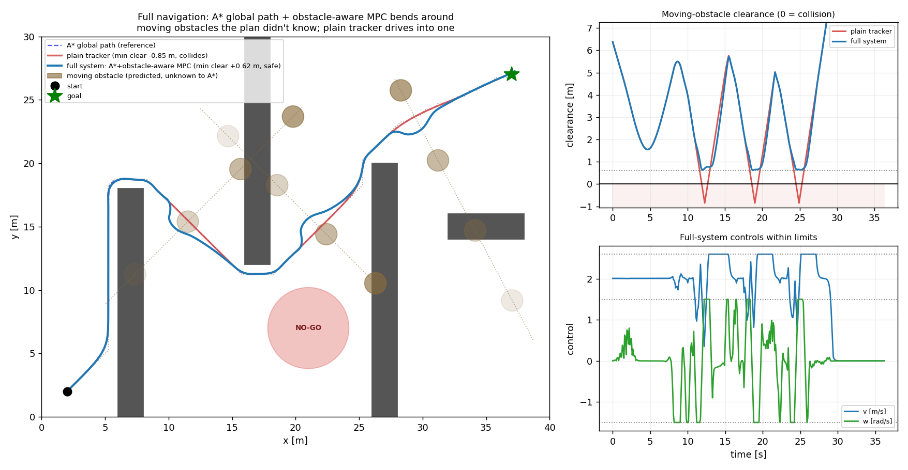

### 29. 3D LiDAR SLAM — point-to-plane ICP + SE(3) pose-graph (`scripts/29_lidar_slam_3d.py`)
Exp 23's 2D LiDAR SLAM lifted to **3D / 6-DOF**. A drone/legged robot moves in 3D; a 3D LiDAR sweeps the
surface points of walls, floor, ceiling and pillars. The **front-end** runs **point-to-plane ICP** (local
normals from k-NN PCA on the target cloud, point-to-plane residual minimized in the se(3) tangent) between
consecutive scans to produce SE(3) odometry that drifts over the loop. The **back-end** verifies revisits
with ICP and optimizes the whole 6-DOF trajectory with the manifold SE(3) Gauss-Newton pose-graph
(reusing `src/sensor_fusion/posegraph3d.py`). Wall/floor normals spanning all three axes make the 6 DOF
observable, so point-to-plane converges fast.

| trajectory | 3D RMSE | end-point error |
|--|----------:|---------:|
| ICP odometry (point-to-plane) | 0.329 m | 0.220 m |
| **SE(3) graph-optimized** | **0.166 m** | **0.093 m** |

- Tilted circle × 3 laps (181 poses), 180 odometry + **62 loop-closure** edges. Back-end cuts 3D drift
  **2.0×** (χ² 1130 → 17.6 in 3 iterations).
- Honest tradeoffs: point-to-plane degrades to sliding if surface normals collapse onto one plane
  (point-to-point SVD is the safer fallback there); k-NN PCA normals are sensitive to curvature/density.

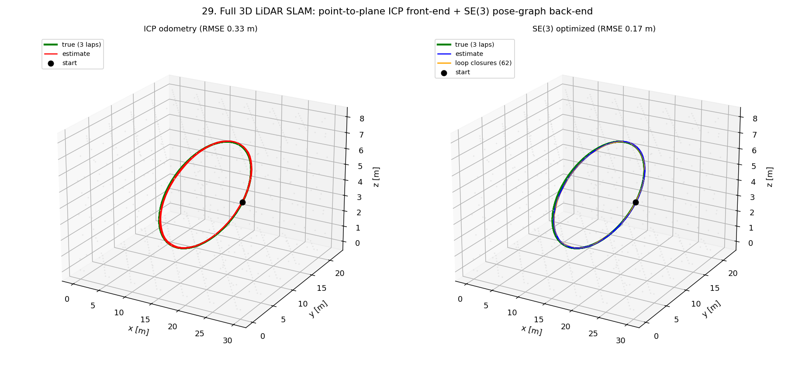

## Learning-based control & sim-to-real

Everything above is **model-based** (KF/graph SLAM/MPC — derived, interpretable, verifiable). This block is the
complementary **learning-based** axis: policies trained by search (CEM, numpy-only — no torch/gym) in
simulation, and the sim-to-real techniques that make learned control transfer. The point is honest
understanding of *why* the current sim-to-real / RL trend works — and where it breaks — not a claim that
learning replaces the classical stack. In safety-critical/medical robotics the verifiable stack above is the
one that ships; this block shows I understand both sides.

### 30. Domain randomization for sim-to-real (`scripts/30_domain_randomization.py`)
A control policy trained only on nominal ("sim") dynamics overfits and breaks when the real world shifts;
**domain randomization (DR)** — randomizing physical parameters every training episode — trades a little peak
performance for far wider robustness. Task: cart-pole balancing (ODE from scratch). Policy: a 4-weight linear
state-feedback law trained by the **cross-entropy method (CEM)**. Two regimes: nominal-only vs DR (samples
pole mass/length, cart mass, control latency per episode). Both evaluated on a grid of shifted "real" worlds,
including latencies **outside** the DR range to be honest about extrapolation.

| policy | at nominal (sim) | shifted-grid success | learned θ-gain |
|--|----------:|----------:|:--|
| nominal-only | 1.00 | 0.106 | ≈ 80 (aggressive, fragile) |
| **domain-randomized** | 1.00 | **0.554** | ≈ 35 (conservative, robust) |

- The honest crossover: nominal-only is perfect at zero-latency sim but collapses the moment actuation delay
  appears; DR holds success across a much wider band — yet DR too fails deep outside its training range
  (latency ≥ 8 steps). Robustness is bought by giving up peak tightness — exactly the DR tradeoff.

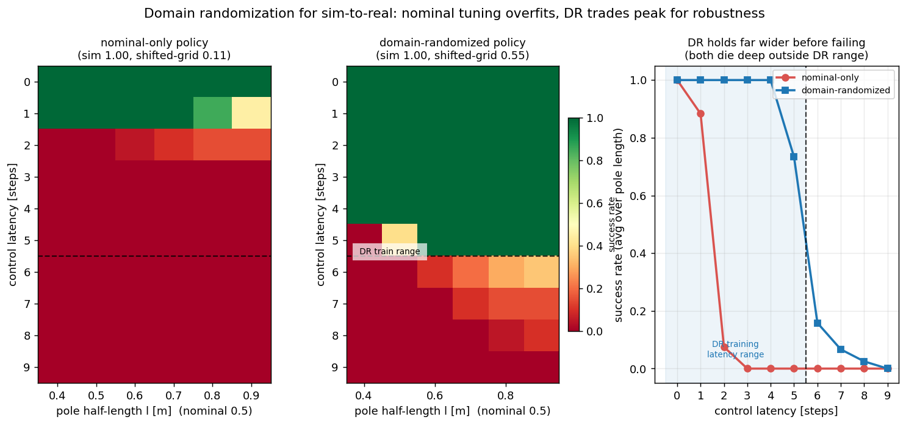

### 31. SimOpt — closing the sim-to-real loop (`scripts/31_simopt_loop.py`)
A policy trained in a **miscalibrated simulator** fails on the "real" plant. Instead of hand-tuning the sim,
**close the loop**: act in real → collect rollouts → **fit the sim's physical parameters** to those rollouts
(system identification) → retrain the policy in the corrected sim → repeat (Chebotar 2019, *Closing the
Sim-to-Real Loop*). Plant: cart-pole with hidden true pole mass/length `(0.50, 1.00)`; the sim starts wrong
at `(0.10, 0.30)` — same model structure, only the parameters wrong. Policy: linear feedback via CEM.

| SimOpt iteration | param error | real balancing [steps] |
|--|----------:|----------:|
| 0 (initial, bad sim) | 0.752 | 71 (falls) |
| 5 (final) | **0.053** | **200** (balances) |
| no-loop baseline | 0.752 (fixed) | 71 (fixed) |

- Sim params converge to reality (error **93% ↓**) and real-world balancing goes **71 → 200 / 200** steps,
  while the no-loop policy stays stuck. This is the "act → feedback → fix the sim → retrain" loop concretely.
- Honest limits: system ID needs informative excitation (a probe force is injected); unobservable params
  won't converge, and observation noise biases a single fit (hence data accumulation across iterations).

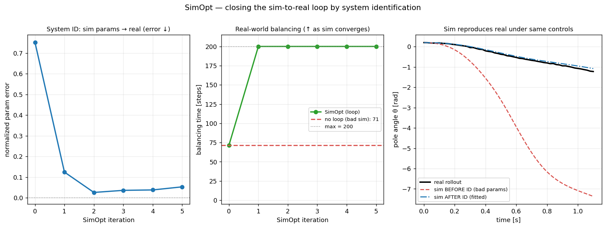

### 32. Reward design & reward hacking (`scripts/32_reward_shaping.py`)
In RL the hard part is usually not the optimizer — it's the **reward**. Same pendulum swing-up task, same
optimizer (CEM), three reward designs; success scored by a **reward-independent** metric (fraction of the last
steps held upright *and* slow). The pole starts hanging down and torque is limited below gravity torque, so
the controller must pump energy — making reward shaping matter.

| reward design | what it says | true-task success (5 seeds) | outcome |
|--|--|----------:|--|
| sparse | `+1` only near the top | 0.35 | no gradient → learns poorly, high variance |
| **shaped (good)** | `−(θ² + 0.1·θ̇² + …)` | **0.76** | reliably swings up **and holds** |
| mis-shaped (hackable) | reward `θ̇²` ("be energetic") | **0.00** | high reward, task **not** solved |

- Only the reward changes, yet shaped clearly beats sparse (0.76 vs 0.35). The "be energetic" reward is
  **hacked** — the policy spins the pole forever, earning **70% of the max possible reward** while achieving
  **0.00** true success. High training reward ≠ task solved — exactly why reward engineering is the hard part.

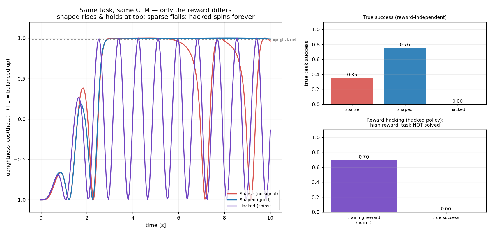

### 33. Residual RL — classical base + learned correction (`scripts/33_residual_rl.py`)
The hybrid actually deployed on real robots: keep a safe, interpretable **classical base controller** and let
RL learn only a small **residual** that fixes what the base model gets wrong. Plant: a cart-pole with an
**unmodeled constant disturbance** the base controller never sees. The base is an **LQR** from the nominal
linearization (continuous Riccati) — it balances the pole but, having no integral action, lets the cart drift
to a large steady-state offset. Three controllers on the true plant at **equal CEM budget**: base alone,
learn-from-scratch (no base), and **base + residual** (`u = u_base(s) + clip(w·φ(s), ±6N)`, residual from 0).

| controller (true plant) | regulation cost ↓ | steady-state cart error ↓ | falls during training ↓ |
|--|----------:|----------:|----------:|
| base only (LQR) | 82.6 | 0.846 m | — |
| from-scratch (equal budget) | 4.2 ± 0.6 | — | 21.8% |
| **base + residual (hybrid)** | **3.5 ± 0.1** | **0.007 m** | **0.7%** |

- The residual cancels the disturbance (steady-state error **120×** smaller), reaches near-final performance in
  ~4 CEM iterations vs ~12 for from-scratch, and almost never falls while learning — **sample-efficiency + safety**.
- Honest tradeoffs: from-scratch catches up with a larger budget; residual RL assumes a decent base already
  exists. This is the concrete **model-based + learning** hybrid — the safe classical stack keeps its guarantees
  while learning only adds the correction.

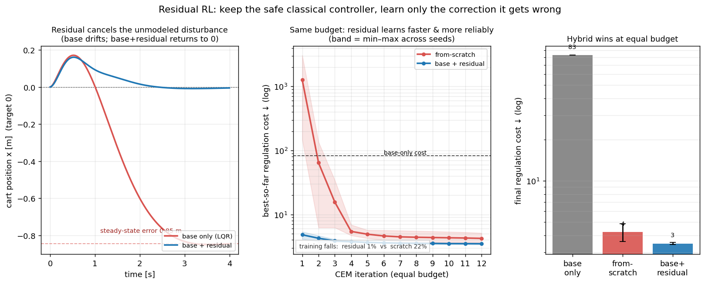

### 34. Synthetic data & auto-labeling for sim-to-real (`scripts/34_synthetic_labeling.py`)
Sim-to-real perception works because a simulator produces **unlimited, perfectly-labeled** data for free — you
*place* the object, so its position **is** the label (automatic labeling, no hand-annotation, no label noise).
But a simulator rendered at one nominal look overfits; **domain randomization** — randomizing the *look*
(background brightness/gradient, object contrast/size, viewpoint shear, noise) while keeping the free labels —
is what makes those synthetic labels transfer. Task: 2D localization of a blob in a 24×24 image. Same pure-numpy
**ridge regressor** trained on three regimes, all evaluated on a shifted "real" test set (some samples beyond the
DR range, for honesty).

| training regime | images | labels | "real" test RMSE [px] |
|--|--:|--|----------:|
| scarce real | 40 | hand-labeled (expensive) | 2.12 |
| synthetic, no-DR | 800 | auto (free) | 6.94 (overfits clean look) |
| **synthetic + DR** | 800 | auto (free) | **1.89** |
| synth+DR + real fine-tune | 800 + 40 | mixed | 1.86 |

- Free auto-labels alone aren't enough: synthetic no-DR collapses on shifted "real" (6.94 px). **Domain
  randomization is the piece that makes free labels transfer** — beating both no-DR and the expensive scarce-real
  model. Honest: a little real fine-tuning on top is usually best; synthetic *saves* the label budget, doesn't
  replace real data. Ties to the data-labeling bottleneck behind the whole sim-to-real trend.

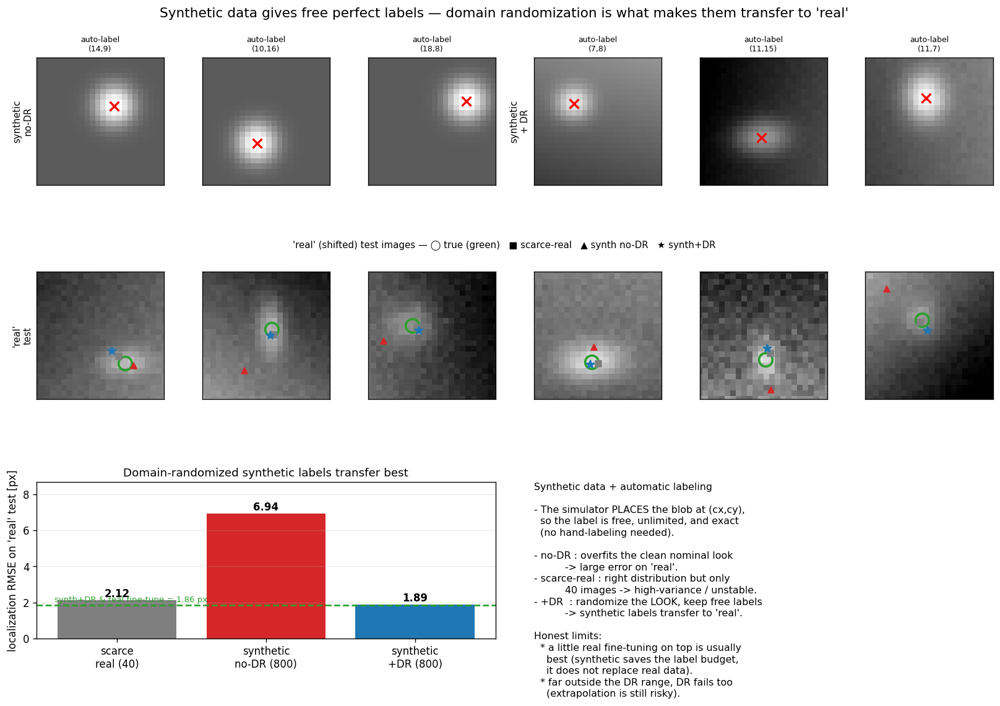

### 35. Incremental smoothing (iSAM-style) (`scripts/35_incremental_smoothing.py`)
Re-solving the whole pose graph from scratch on every new measurement is wasteful: per-step cost grows O(N) and
most past poses barely move. **Incremental smoothing (iSAM)** updates only the variables a new factor actually
affects and relinearizes on demand — odometry touches a short recent window, a loop closure re-solves just the
span it connects. Closes the roadmap's incremental-factorization item. Three online strategies over a 3-lap SE(2)
trajectory (165 odometry + 23 loop-closure edges):

| strategy | final RMSE | cumulative compute (proxy) | per-step cost |
|--|----------:|----------:|:--|
| full batch (re-solve every step) | **0.221 m** | 61,398 | O(N), grows |
| **incremental (iSAM-style)** | **0.256 m** | **16,773** | bounded (spikes on loop closure) |
| naive warm-start only | 4.925 m | 564 | O(1), but drifts |

- Incremental matches batch to within **0.035 m (1.16×)** at **3.7× less** cumulative compute, while naive
  warm-start (never back-propagating closures) blows up 22×. Honest: true iSAM keeps a square-root factor in a
  Bayes tree with local Givens updates; here the affected clique is re-solved with sparse Gauss-Newton
  (relinearize-on-demand) — the essence, with the local factor update approximated.

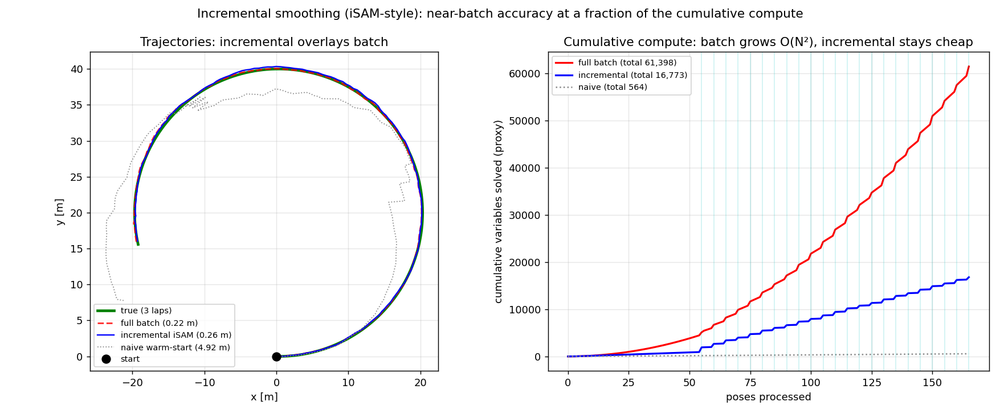

### 36. Monte Carlo Localization (particle filter) (`scripts/36_particle_filter.py`)
The first **nonparametric** filter in the repo: instead of one Gaussian pose (KF/EKF/UKF), MCL represents the
belief as a cloud of **weighted particles**, so it handles **non-Gaussian, multimodal** uncertainty the (E)KF
fundamentally can't. Localization on a known landmark map with **range-only** measurements (deliberately chosen:
a single range is a *ring*, so the posterior is genuinely multimodal). One step: propagate particles through the
motion model → weight by measurement likelihood → **systematic resampling** (with a roughening floor against
depletion) → weighted-mean estimate. Also demonstrates **global / kidnapped-robot** localization from a map-wide
uniform prior.

| method (range-only) | trajectory RMSE ↓ | needs initial pose? | multimodal belief? |
|--|----------:|:--:|:--:|
| odometry only (dead reckoning) | 2.53 m | yes | — |
| EKF (correct init) | 0.51 m | **yes** | no (single Gaussian) |
| **MCL (tracking)** | **0.21 m** | approx. | **yes** |
| **MCL (global / kidnapped)** | 0.43 m (after conv.) | **no** | **yes** |

- MCL tracking is **11.9×** better than dead-reckoning; global localization converges from map-wide ambiguity to
  <3 m in **8 steps** with no initial pose. Honest contrast: with a prior the **EKF tracks range-only fine too** —
  the PF's real edge is representing beliefs a Gaussian can't (a single range → ring-shaped posterior; the EKF
  dumps its mass in the empty ring center). Tradeoffs: cost scales with particle count; depletion needs handling;
  curse of dimensionality in high-D states.

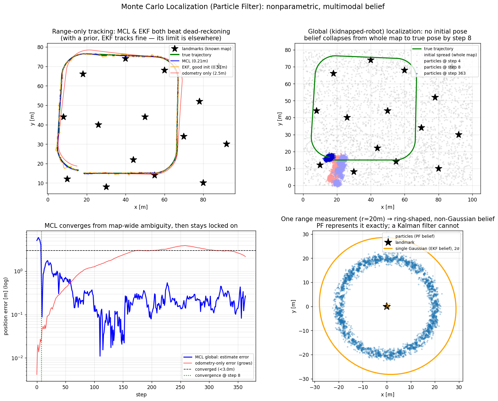

### 37. Error-State Kalman Filter (ESKF) for attitude (`scripts/37_error_state_kf.py`)
The indirect / error-state formulation used in essentially every real VIO/INS. Orientation is estimated from a
biased, noisy gyroscope aided by an accelerometer (gravity reference) and a magnetometer (heading reference).
The trick: split the state into a **nominal** part (orientation R + gyro bias, integrated on the SO(3) manifold)
and a small **error** part (3D rotation error δθ + bias error δb) tracked by a linear KF in the tangent space.
Each step the estimated error is injected into the nominal state via the exp map and reset to zero — so the KF
only ever handles small, well-linearized quantities (no quaternion-norm constraint, no singularities).

| method | attitude RMSE (steady-state) |
|--|----------:|
| gyro-only integration | 28.51° |
| **ESKF (gyro + accel + mag)** | **0.48°** |

- The ESKF is **60×** better than gyro integration (which drifts, mostly in yaw from the unmodeled bias) and
  estimates the gyro bias online (final bias error 0.065°/s).
- Honest observability limits: the accelerometer only measures gravity *direction*, so it fixes roll/pitch but
  is invariant to yaw — heading needs the magnetometer; and the sim assumes quasi-static motion (accel sees only
  gravity, while real specific force mixes in linear acceleration).

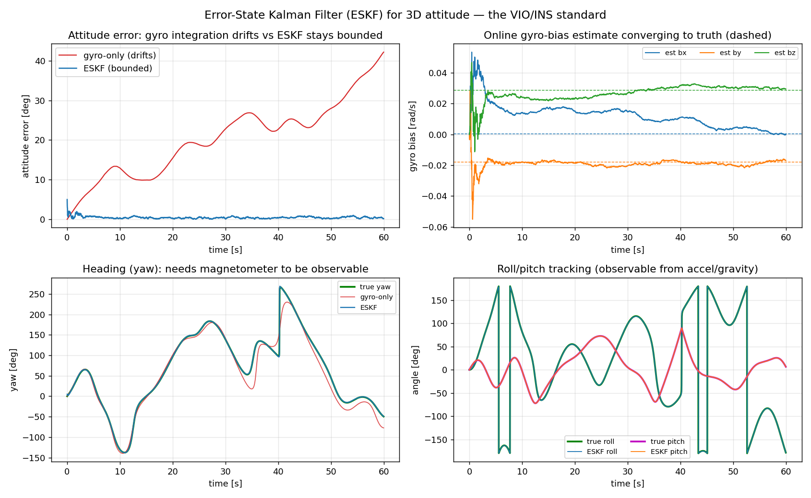

### 38. Model-based RL — learn a dynamics model, plan with MPC (`scripts/38_model_based_rl.py`)
The "learn a model, then plan" paradigm behind modern MBRL (PETS/Dreamer), at an honest toy scale. On a
cart-pole whose dynamics the agent does **not** know, we fit a dynamics model `f_hat: (state, action) → Δstate`
(random-Fourier-features + ridge, numpy only) from collected transitions, then control by planning action
sequences with receding-horizon MPC (CEM / random-shooting) **over the learned model** — planning is free, so
the environment-interaction budget is spent only on learning the model. Compared, as a function of environment
transitions, against a model-free CEM policy-search baseline (same budget) and an oracle MPC on the true model.

| method | return @ 480 transitions | % of oracle | transitions to "solve" (90% of oracle) |
|--|----------:|----------:|----------:|
| oracle MPC (true model, upper bound) | 0.920 | 100% | — |
| **MBRL (learn model + MPC)** | **0.902** | **98%** | **30** |
| model-free CEM (same budget) | 0.105 | 11% | 14,198 (**~473×** more data) |

- The sample-efficiency story: MBRL reaches oracle-level control from a handful of transitions where model-free
  needs orders of magnitude more data. Model quality is what enables it — one-step prediction L2 ≈ 0.0006, but
  error compounds to ≈0.92 by 40 steps, so short-horizon replanning is what tolerates the model bias, and MBRL
  plateaus just below the oracle. Honest: given far more data, model-free eventually catches up — the point is
  data efficiency, not impossibility.

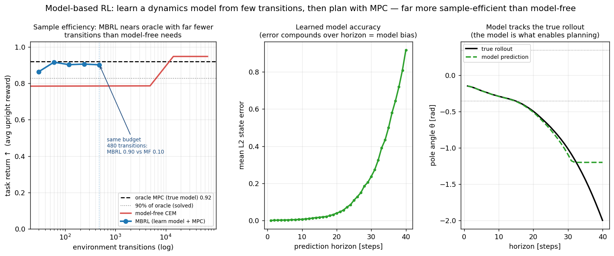

### 39. Manipulator kinematics — FK, Jacobian, IK, singularities, redundancy (`scripts/39_manipulator_kinematics.py`)
Everything so far has been a **mobile** robot. Surgical and lab robots are articulated **arms**, and the
foundation is manipulator kinematics: getting the tool tip to a commanded pose. A 3-link planar (3R) arm, built
from scratch: forward kinematics (link composition), the analytic **Jacobian** (position rows by differentiating
FK, orientation row trivial), iterative **IK** by damped least squares `dq = Jᵀ(JJᵀ + λ²I)⁻¹e`, and the two
phenomena that make arms interesting — singularities and redundancy.

| aspect | result |
|--|--|
| analytic Jacobian vs finite differences | max error **1.4e-10** (derivation verified) |
| DLS inverse kinematics | 0.001 mm position error in **6** iterations |
| singular pose (arm straight) | manipulability `w = sqrt(det(J_p J_pᵀ))` → **0** (rank loss) |
| near-singular step: DLS vs pseudo-inverse | **0.086 rad** (bounded, 0.1 mm residual) vs **20.9 rad** (blows up) |
| redundancy (3 DOF for a 2D target) | 4 distinct elbow branches reach the same tip |
| null-space secondary objective | ‖q − q_home‖ 1.70 → **1.49** with the tip held fixed (0.87 mm) |

- The damping λ is the whole story near singularities: the pseudo-inverse is "exact" right up to the point where
  it commands 20 rad of joint motion, while DLS trades a little tracking accuracy for a bounded, executable step.
- Redundancy is the mechanism behind clinically useful behaviors: the arm performs **self-motion** (0.93 rad
  through the null space) to reach a more comfortable posture *without moving the tool* — the same trick used to
  keep an arm away from the patient/assistants while holding the instrument still.

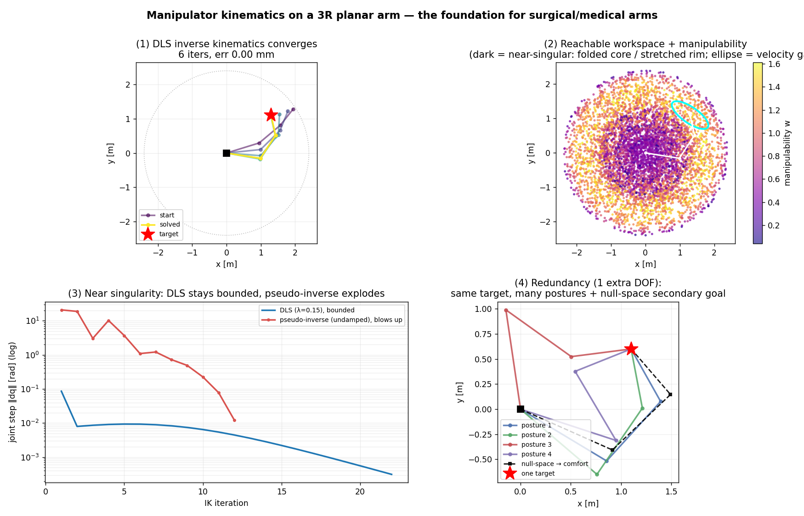

### 40. Manipulator dynamics + computed-torque control (`scripts/40_manipulator_dynamics.py`)
The other half of an arm: mass and inertia. The rigid-body manipulator equation `M(q)q̈ + C(q,q̇)q̇ + g(q) = τ`
is derived from the Lagrangian for a 2-link planar arm (inertia matrix, Coriolis/centrifugal coupling, gravity)
and integrated with RK4. Three controllers track the same joint trajectory at identical gains, so the only
variable is **how much of the model the controller knows**.

| controller | joint RMSE | end-effector RMSE |
|--|----------:|----------:|
| PD only | 0.02861 rad | 0.08561 m |
| PD + gravity compensation | 0.01179 rad | 0.03348 m |
| **computed torque** (inverse dynamics) | **0.00006 rad** | **0.00008 m** |

- Feeding the model forward is worth **99.8%** of the tracking error: computed torque cancels gravity, coupling
  and configuration-dependent inertia, leaving the PD term to regulate a linear, decoupled error system.
- Honest caveat, and the reason robust/adaptive control exists: with a **+20% mass error** the computed-torque
  controller degrades to 0.00599 rad — **103× worse** than with the exact model, though still better than PD.
  Model-based control is only as good as the model.

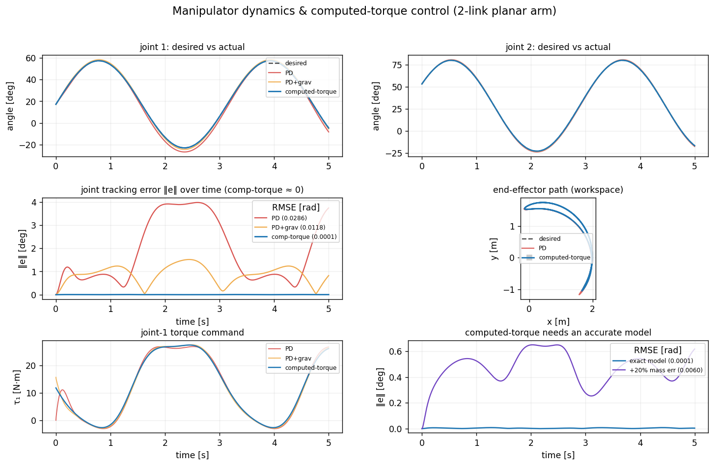

### 41. Surgical patient-to-image registration (`scripts/41_surgical_registration.py`)
The prerequisite step of image-guided surgery: aligning the pre-op CT/MR anatomy model with the patient on the
table, so a target planned in the image can be expressed in robot/tool coordinates. That is a 6-DOF SE(3)
estimation problem solved with **ICP** — here reusing the 3D point-to-plane machinery from exp 21/29 (k-NN PCA
normals, se(3) tangent-space linearization) against a realistic intra-op point cloud: partial coverage (255° of
the surface probed), 0.5 mm digitization noise, and a few gross outliers.

| metric | result |
|--|----------:|
| recovered SE(3) error | **0.179 mm** translation, **0.608°** rotation |
| surface residual (FRE) | 0.793 mm |
| **TRE** at planned targets | mean **0.203 mm**, max 0.293 mm |
| bad initialization | TRE **31.51 mm** — with FRE only 1.64 mm |
| correspondence gate on / off | TRE **0.22 mm** vs **8.85 mm** |

- **FRE is not TRE.** The bad-initialization case converges to a plausible-looking fit (FRE 1.64 mm) while the
  actual target error is 31 mm — the classic clinical trap, since FRE is what you can measure intra-op and TRE
  is what the patient experiences. Hence the coarse centroid pre-alignment: ICP only guarantees a *local*
  optimum, so getting inside the convergence basin is a safety requirement, not a convenience.
- Outlier rejection is not optional either: a single mis-probed point drags an unguarded least-squares fit to
  8.85 mm TRE, a 40× degradation, which the distance gate removes.

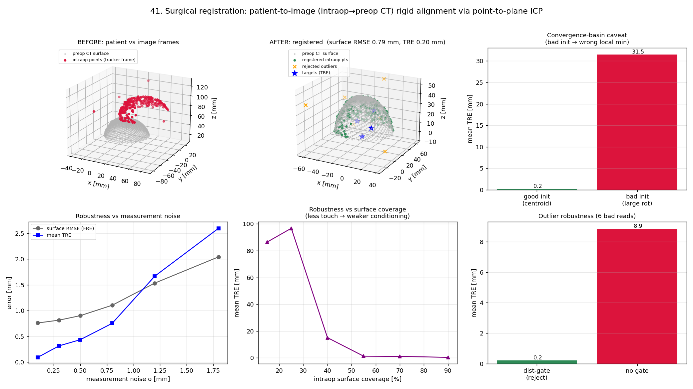

### 42. Image-guided targeting capstone — the error budget (`scripts/42_image_guided_targeting.py`)
Experiments 39–41 each covered one link. A real image-guided robot runs them **in series**, and the patient
only experiences the number at the end of the chain: how far the tool tip lands from the planned target. This
capstone connects them — plan in image coordinates → probe the surface → register (SE(2) point-to-normal ICP)
→ map the plan into robot coordinates → DLS IK → computed-torque tracking — and decomposes the final error.
The scenario is a narrow exposure where even the best available corridor passes **3.0 mm** from a vessel.

| condition | end-to-end | registration share | servo share |
|--|----------:|----------:|----------:|
| A no registration (nominal placement assumed) + computed torque | 16.441 mm | 16.441 | ~0 |
| B registration + PD | 12.178 mm | 0.094 | 12.227 |
| C registration + computed torque (3% payload error) | 0.990 mm | 0.094 | 0.949 |
| **D registration + computed torque (calibrated)** | **0.094 mm** | 0.094 | ~0 |
| E oracle registration + calibrated CT (floor) | ~0 (numerical) | 0 | 6 µm max path deviation |

- Registration buys **175×** (A→D) and model-based control **130×** (B→D) — but the headline is that **the
  budget's ranking flips with calibration state**. On the calibrated arm the 94 µm is essentially all
  registration, so the next investment is the tracker/coverage; introduce a mere **3% payload error** and the
  servo share jumps to 0.949 mm — **10× the registration error** — and calibration becomes priority one. Same
  hardware, opposite answer: you cannot pick what to improve without measuring the budget.
- **Safety.** ICP also yields a covariance: `Cov(ξ) ≈ σ²(JᵀJ)⁻¹`, propagated to the target as σ_target, which
  grows when surface coverage is poor. Over 200 randomized trials (coverage 70–260°, random pose/noise),
  scoring **unsafe = vessel violation OR target miss > 2 mm** (counting violations alone would score a grossly
  misregistered path that stabs *outside* the anatomy as "safe"):

| planning rule | detection | false alarm | unsafe among executed |
|--|----------:|----------:|----------:|
| naive (always execute) | — | — | **37.0%** |
| k·σ gate (conditioning) | 85.1% | 0.0% | 8.0% |
| **+ multi-start consistency** | **93.2%** | 0.8% | **3.8%** |

- The residual failures under the σ gate alone are instructive: σ of 0.09–0.43 mm (looks fine) with TRE of
  16–39 mm — **confidently wrong** fits. A covariance says how well-determined a solution is, not whether a
  *different basin* fits comparably well. Re-running ICP from several initializations and flagging when
  near-equal-residual rivals disagree about the target catches those. All 70 aborted plans recovered after
  re-probing with wider coverage.
- Honest negatives: using multi-start to *pick* the lowest-residual solution made things **worse** (with
  partial coverage a slid-along-the-surface misfit can score lower residual), so it is used for verification
  only; the rival-residual threshold trades detection against false alarms (1.05 → 1%, 1.15 → 4%, 1.3 → 21%,
  1.5 → 41% false alarms); and 3.8% unsafe still survives both gates. Scope is a planar (SE(2)) slice with a
  2-link arm, rigid registration, and no needle bending or tissue reaction force — that term would grow the
  servo share.

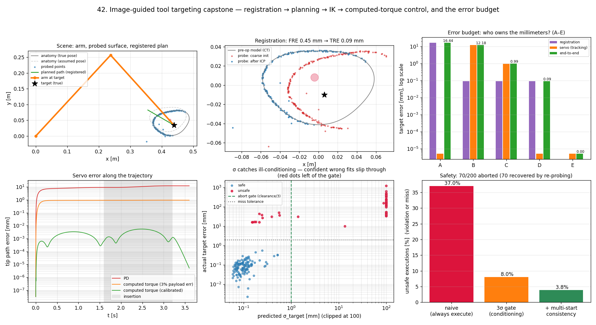

### 43. Sim-to-real loop on a surgical arm (`scripts/43_sim_to_real_arm.py`)
Experiment 42 ended on an uncomfortable note: swapping a tool introduces a payload error that makes the servo
dominate the budget, and the answer was "go calibrate". This experiment **automates that** as a closed loop —
the manipulator version of #31 (SimOpt): prepare in sim → deploy → the system flags itself (tracking residual
over threshold) → run an excitation trajectory → identify → update the controller model → redeploy.

Identification works because rigid-body dynamics is **linear in the inertial parameters**, friction included:
`τ = Y(q,q̇,q̈)·π` with `π = [a, b, d, G1, G2, fv₁, fv₂, fc₁, fc₂]`. An unknown tool mass, a shifted centre of
mass and unmodelled joint friction all land inside π, so one regression recovers them. The arm is **not
invented**: link lengths, masses and COMs are Universal Robots' published UR5 figures for joints 2–3, which
physically *do* form a planar 2R arm in a vertical plane (rotational inertia is an explicitly-stated uniform-rod
approximation).

| loop iteration | target error | tracking residual | ‖π̂ − π‖ |
|--|----------:|----------:|----------:|
| 0 — nominal model deployed | 45.855 mm | 46.048 mm (**flagged**) | 1.98 |
| 1 — one excitation run identified | 0.007 mm | 0.019 mm | 0.084 |
| 3 — accumulated logs | **0.003 mm** | 0.026 mm | 0.061 |

- The loop recovers the payload to **0.02%** (via G2) and Coulomb friction to [1.75, 0.88] vs the true
  [1.8, 0.9] — parameters the nominal model did not even have terms for. In exp-42 budget terms the servo share
  goes from 488× the registration share back to 0.03×, i.e. **the loop restores the budget ranking**.
- **Parametric vs structural gap.** Add Stribeck stiction to the real plant — a term with no column in the
  regressor — and the same loop **plateaus at 0.207 mm** (62× worse), still above the 94 µm registration share.
  No amount of re-identification absorbs physics the model lacks; the loop's honest output is "something
  remains", and the next move is extending the model structure, not another regression.
- **Observability.** Identifying from the slow clinical insertion alone gives cond(YᵀY) 2.1e3 and 0.139 mm;
  a dedicated multi-sine excitation gives 1.9e2 and 0.003 mm — 46× better. The repo's recurring theme (IMU
  bias, EKF-SLAM heading) reappears: you can only identify what the data excites.
- Honest scope: the "real" plant is still a simulation — deliberately mismatched in parameters *and* missing
  terms, but free of backlash, joint elasticity and gear nonlinearity. Derivatives for identification come from
  a zero-phase filter (legitimate offline, unlike a real-time control filter — see #22).

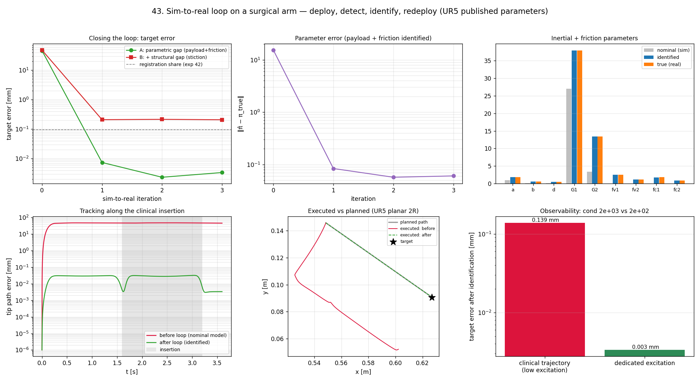

### 44. Registration validated on real laser scans (`scripts/44_registration_real_scans.py`)
Experiments 41/42 built the registration pipeline and its reliability gates on **synthetic** anatomy — smooth
curvature, isotropic Gaussian noise, no holes. This runs the *unmodified* pipeline on the **Stanford Bunny**
(Turk & Levoy, 1994): two real range scans (bun000, bun045) with the dataset's own alignment, real partial
overlap, anisotropic scanner noise and missing regions. Data is downloaded at runtime into `data_cache/`
(gitignored — not redistributed).

| quantity | result |
|--|--|
| dataset self-alignment (median NN between conf-aligned scans) | 0.326 mm — the data's own floor |
| recovering an applied unknown SE(3) | **0.106° / 0.161 mm**, TRE **0.048 mm** |
| TRE vs probed points | 150 → 0.133 mm, 300 → 0.121, 800 → 0.074, 2000 → **0.066** |

The interesting part is the **negative transfer of the safety gate**. Over 40 randomized trials (half with a
small surface patch), scoring unsafe as TRE > 3 mm:

| reliability signal | detection | false alarm | unsafe among executed |
|--|----------:|----------:|----------:|
| naive (always execute) | — | — | **47.5%** |
| ① k·σ from the information matrix | **5.3%** | 0.0% | 46.2% |
| ② multi-start consistency | **84.2%** | 0.0% | 12.5% |
| ③ overlap (inlier fraction) | 36.8% | 0.0% | 36.4% |
| ①+②+③ | 84.2% | 0.0% | 12.5% |

- The covariance gate that caught 85% of bad registrations on synthetic anatomy catches **5%** here. On real
  geometry the failures are not ill-conditioning — they are ICP settling into a *wrong basin* with a perfectly
  healthy residual and a perfectly confident covariance. Only the consistency check sees them.
- That is a retroactive argument for keeping both signals in #42, and a caution about tuning safety logic on
  synthetic data: **the signal that works can change when the geometry becomes real.**
- FRE and TRE correlate well here (r = 0.92) — but 2 of 19 unsafe cases had FRE at the noise floor. FRE is a
  useful first screen, not a certificate.
- Honest scope: the Bunny is not anatomy; what transfers is the *point-cloud* character (partial overlap,
  anisotropic noise, holes, uneven curvature). The conf alignment is itself an estimate, so no claim is made
  below ~0.3 mm absolute; the 0.048 mm figure is recovery of a perturbation we applied, a different quantity.

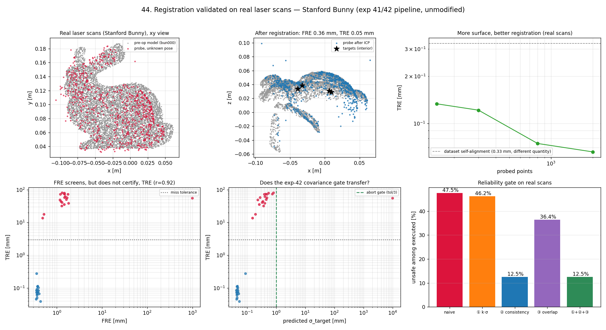

### 45. 6-DOF image-guided targeting (`scripts/45_image_guided_6dof.py`)
Experiment 42 ran the whole chain on a **planar slice with a 2-link arm**. That simplification hides two
things, and this experiment exists to expose them: a real tool has an **orientation** to satisfy, and it is a
**segment, not a point**. The arm is now the full spatial **UR5 6-DOF** built from published DH, masses and
COMs (`src/sensor_fusion/ur5.py`), and the phantom is the **real Bunny scan** from #44 — the registration
pipeline is reused unchanged.

The dynamics core is implemented twice on purpose: a Lagrangian assembly (M from link Jacobians, g from the
potential gradient, C from numerically-differentiated Christoffel symbols — easy to read, easy to check) and a
standard **RNEA** recursion (O(n), used for simulation). They agree to 1e-10, M matches to 1e-15, and energy is
conserved to 1e-6 with zero input — three independent checks on the same physics. A convention trap is recorded
in the code: with **standard** DH, joint *i* rotates about frame *i−1*'s z, so Craig's modified-DH backward
recursion silently corrupts exactly those links with a nonzero link offset (links 2–3 here).

| stage | result |
|--|--|
| setup error if the nominal placement is assumed | 65.0 mm |
| registration on the real scan (ICP refines the coarse setup) | TRE **0.081 mm**, **0.132°**, FRE 0.382 mm |
| 6-DOF IK (position + orientation along the path) | residual < 0.01 µm / 0.01 arcsec, manipulability ≥ 0.064 |
| PD only | droops **50.4 mm**, tool axis off by **12.1°** |
| PD + gravity compensation | servo share 0.012 mm |
| **computed torque** (UR5 M·C·g) | servo share **0.000 mm** — 412× tighter; registration dominates again |

- Going spatial changes the control story: on the planar 2-link arm PD merely sagged, but on a 6-axis arm with
  an 8.4 kg link **the tool orientation collapses too** (12°). It also forces per-joint gain scaling — effective
  joint inertias span 2.4 → 1e-4 kg·m², so uniform gains put the wrist at ω ≈ 2000 rad/s and blow the
  integration up. All three controllers here target the same ω = 20 rad/s.
- The orientation constraint costs manipulability, and *where you place the patient* decides how much: with an
  arbitrary phantom placement the required tool axis drove the arm to w ≈ 0.006 (nearly singular); aligning the
  planned insertion axis with the reference posture's tool axis keeps w ≥ 0.064. The spin about the tool axis is
  a genuine free DOF, so it is spent maximizing manipulability — exp 39's null-space idea in 6-DOF form.
- **The failure a planar experiment cannot represent.** With a point tool, clearance to the vessel is 8.1 mm and
  is *independent of orientation* — the check carries no information. The real tool shaft starts with 2.17 mm of
  clearance and loses **0.24 mm per degree** of axis error, cutting the vessel at **9.7°** while the tip-only
  check still reports 8.1 mm. Here the measured registration error (0.13°) leaves a 74× margin, so this corridor
  is safe — the point is that the threshold exists at all, and only a 6-DOF model can see it.
- Honest scope: the Bunny is not anatomy (as in #44); inertia tensors are an explicit uniform-cylinder
  approximation; no tissue reaction force or needle bending; the roll search is a 12-point grid, not a
  constrained continuous optimization.

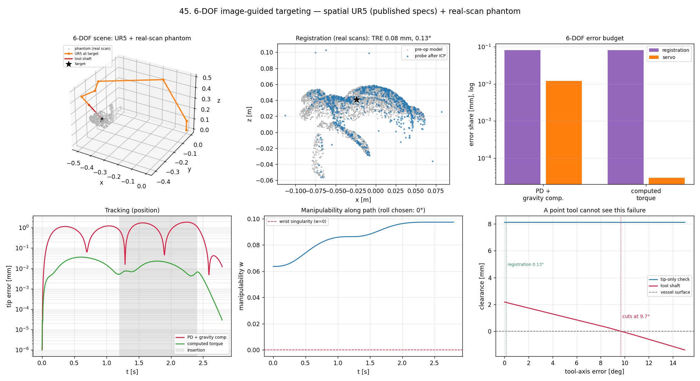

### 46. Closing the structural gap (`scripts/46_closing_structural_gap.py`)
Experiment 43 ended with an open promise: the sim-to-real loop closed the *parametric* gap (45.9 → 0.003 mm)
but stalled at **0.207 mm** against a *structural* one — Stribeck stiction, a term with no column in the
regressor. Its honest output was "extend the model, don't re-identify". This experiment does that and measures
what actually happens.

The extension is separable: `fs` enters linearly but the Stribeck velocity `vs` sits inside an exponential, so
`vs` is grid-searched **outside** while the 11-parameter least squares runs inside.

| attempt | vs found | fs estimate (true [1.44, 0.72]) | target error |
|--|--|--|----------:|
| exp 43 model (9 params) | — | — | 0.208 mm (plateau) |
| + structure only, same fast logs | 0.020 | [−0.51, 0.25] — **not identified** | 0.162 mm |
| **+ structure + low-speed excitation** | **0.050** (true 0.05) | [1.29, 0.58] | **0.002 mm** |

- **Structure alone is not enough.** Stiction only switches on below |q̇| < 0.05 rad/s, and the multi-sine
  excitation from #43 races through that band — the new parameters are unidentifiable no matter how many logs
  are stacked. Adding a deliberately *slow* trajectory (50% of its samples inside the stiction regime) recovers
  `vs` exactly and drops the error 85×, down to the no-structural-gap floor. Extending a model and designing the
  experiment that excites it are one move, not two.
- The grid search is itself a check: the torque residual is minimized exactly at the true `vs` (0.182 N·m,
  rising to 0.24–0.25 at 0.02 / 0.15), so the nonlinear parameter is observable once the data covers the regime.
- **The cost of extending.** Run the 11-parameter model on a plant that has *no* stiction and it is **10×
  worse** than the correct 9-parameter model (1.7 µm vs 0.2 µm) — the redundant parameters fit noise. Bigger
  models are not free; the loop should tell you when to grow, and this is why.
- Honest scope: the structure was extended *knowing* the answer. In practice one reads the residual pattern
  (errors concentrated near velocity reversals) to propose the candidate. Real stiction also has hysteresis and
  dwell-time dependence that a Stribeck curve does not capture, and grid search stops scaling once several
  nonlinear parameters are in play.

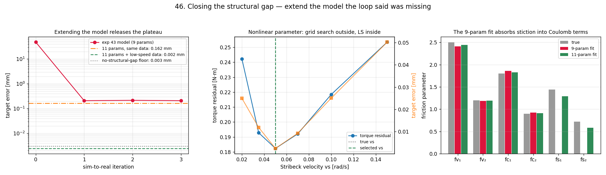

### 47. Needle–tissue contact: position vs impedance control (`scripts/47_needle_impedance.py`)
Everything up to #45 assumed **free space**. The moment the tool touches tissue the robot and the environment
push on each other, and "track the trajectory no matter what" — a virtue in free space — becomes a hazard. This
adds a needle–tissue interaction model to the 6-DOF chain and compares two control philosophies on the same
insertion. The tissue model reproduces the *structure* reported in needle-insertion mechanics (nonlinear
pre-puncture stiffening → discontinuous breakthrough → cutting + depth-proportional friction) at literature
magnitudes; it is not a reproduction of any specific published dataset.

| controller | target error | peak force | puncture lunge |
|--|----------:|----------:|----------:|
| position (joint-space computed torque) | **1.349 mm** | 3.97 N | **0.655 mm** |
| impedance, K_eff 764 N/m | 4.665 mm | 4.10 N | **0.000 mm** |

- Peak force is set by the **tissue** (both controllers reach the ~4 N puncture threshold), so force alone does
  not separate the two. The difference appears at breakthrough: when the surface gives way, the stiff controller
  drives the tip **0.65 mm deeper than planned**; the compliant one does not lunge at all. Measuring this
  required fixing the metric — absolute position always reads negative under load (the tip lags), so the lunge
  must be measured as *excess advance relative to the puncture instant*.
- The stiffness sweep is the trade-off curve: K_eff 382 → 3056 N/m moves target error 9.1 → 1.35 mm while lunge
  goes 0.00 → 0.67 mm. With no constraint the stiffest wins on accuracy; impose a 0.5 mm lunge budget and the
  operating point moves to K_eff 764 N/m. **The clinical constraint picks the gain, not the other way round.**
- Implementation note worth recording: the textbook-looking `τ = Jᵀ(K e + D ė)` impedance **diverges** on this
  arm. The needle's spin about its own axis has an apparent inertia of 1.2e-4 kg·m², so inertia coupling excites
  it at ω ≈ 1400 rad/s (16× growth per step) — projecting the axial component out is not enough, because Λ is
  not diagonal. Operational-space control, `τ = JᵀΛ(ẍ_d + Kp e + Kd ė − J̇q̇) + Cq̇ + g`, normalizes the inertia
  so every direction closes at √Kp and the problem disappears.
- **The budget gains a third term.** Free-space servo error was ~0 (#45) and registration 0.081 mm; under
  contact the interaction term is 1.3–4.7 mm — an order of magnitude above both. Once the tool touches tissue,
  the answer to "what should I improve" changes again.
- Honest scope: soft gains (Kp < 100) needed a 1 ms integration step — verified numerical, not physical, since
  Kp = 100 gives 4.75 vs 4.76 mm at 4 ms and 1 ms. No needle bending (a flexible needle would eat into #45's
  shaft clearance), ideal force sensing, and impedance is imposed on the tip only.

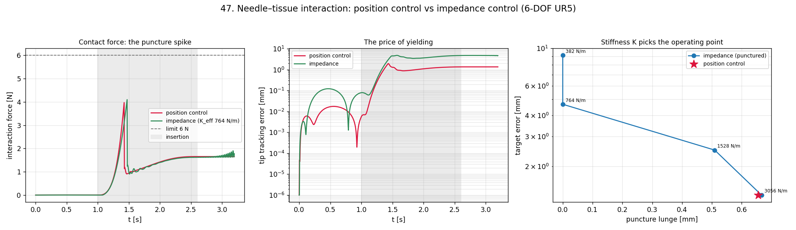

### 48. Flexible needle: bending, and the spin DOF that cancels it (`scripts/48_flexible_needle.py`)
Experiment 45 treated the tool as a **rigid segment** and concluded the shaft cuts the vessel at 9.7° of axis
error. Experiment 47 added the *forces* but kept the needle straight. A real 21G needle is 0.8 mm across and
bends under the lateral force its bevel tip generates — which is why needle steering exists as a field. This
experiment closes that gap in two steps: mechanics (why it bends) and geometry (what that costs).

The needle is solved as a cantilever with distributed tissue support. Under small angles the energy is
quadratic in the segment kink angles, so equilibrium is **one linear solve** — no iteration. Integrating the
resulting curvature gives the 3D centerline, which is then measured against the same vessel corridor as #45.

| quantity | rigid assumption | flexible |
|--|----------:|----------:|
| tip deflection over 70 mm | 0 | **1.97 mm** (κ = 0.81 /m, R = 1230 mm) |
| shaft clearance to the vessel | 2.20 mm | **1.25 mm** (−43%) |
| axis-error threshold before cutting | 2.2° | **1.3°** (−43%) |

- The free-air case (no tissue support) gives 6.95 mm of deflection, matching the analytic cantilever
  `Fℓ³/(3EI)` = 6.8 mm — that agreement is how the discretization was validated, and it caught a real bug:
  kink-angle → deflection is a **double** integration, and accumulating once makes deflection ~500× too small
  (0.01 mm instead of 6.95 mm), which silently flips the entire conclusion.
- **The compensation comes from an unexpected place.** In #45 the spin about the needle axis was "task
  irrelevant" and was spent maximizing manipulability. Here it is the *control input*: flipping the bevel 180°
  partway through cancels the arc. The sweep finds the optimum at 30% of the insertion depth and cuts tip
  deviation 1.98 → **0.04 mm (55×)**, restoring clearance to 2.01 mm and the threshold to 2.0°. That optimum is
  not 50% — solving `2x² − 4x + 1 = 0` gives `1 − 1/√2 = 29.3%`, which the numerical sweep reproduces. Flipping
  at the midpoint cancels the slope but leaves an offset. Continuous duty-cycled spin gives 0.21 mm.
- **One DOF, two jobs.** #45 spent the spin on manipulability (w 0.006 → 0.064); #48 needs it for bending
  compensation. They cannot both be optimized — a real design would split them by phase (posture during
  approach, spin during insertion). Stated, not solved.
- Honest scope: tissue support is modelled as distributed springs pulling toward the *straight* axis, whereas a
  real needle follows the channel it has already cut — so this underestimates deflection (its R = 1230 mm is
  straighter than the 100–300 mm reported in the literature, which the free-air solution does reach). Curvature
  is held constant over the insertion, small-angle beam theory is assumed, and the flip is open-loop.

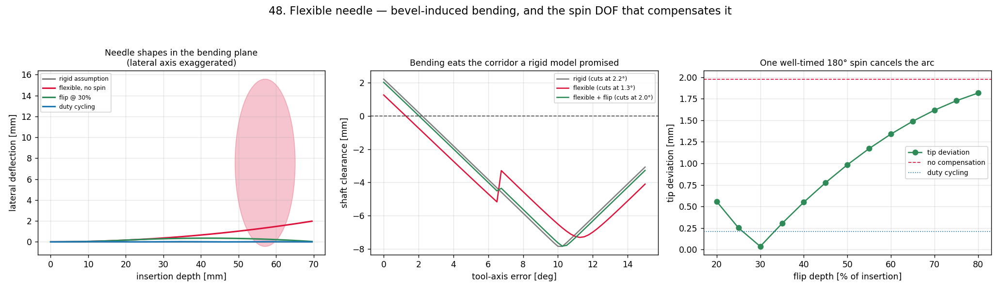

## Why this bridges to robotics (and my background)
- **DSP → estimation**: the KF is optimal linear filtering — the same innovation /
  gain / covariance machinery, now in state space.
- **Embedded → real-time**: the filter is a handful of small matrix ops per step,
  trivially real-time on an MCU.
- **DSP → nonlinear estimation**: EKF (linearize) and UKF (sigma points) extend the same
  machinery to nonlinear robot models — the bridge to real robotics state estimation.

## Quickstart
```bash
pip install numpy matplotlib scipy pytest    # scipy: KD-trees, sparse solves, filtering
                                             # (torch is optional — only experiment 16)
python scripts/01_tracking.py       # linear KF tracking
python scripts/02_imu_fusion.py     # position + IMU fusion with outage
python scripts/03_ctrv_ekf_ukf.py   # nonlinear CTRV: EKF vs UKF
python scripts/04_imu_bias.py       # online IMU bias estimation
python scripts/05_ekf_slam.py       # EKF-SLAM: localization + mapping
python scripts/06_loop_closure.py   # loop closure corrects accumulated drift
python scripts/07_pose_graph_slam.py # graph SLAM: pose-graph optimization
python scripts/08_vio.py             # visual-inertial odometry
python scripts/09_safe_autonomy.py   # uncertainty-aware safe-stop (No-Fly-Zone)
python scripts/10_vio_graph_slam.py  # modern SLAM: VIO front-end + graph back-end
python scripts/11_robust_slam.py     # robust SLAM: reject false loop closures
python scripts/12_graph_slam_landmarks.py  # full graph SLAM (joint pose+landmark BA)
python scripts/13_pose_graph_3d.py   # 3D SE(3) pose-graph SLAM
python scripts/14_g2o_benchmark.py --file data_cache/intel.g2o   # real g2o benchmark
python scripts/15_robust_g2o.py      # robust SLAM on real Intel + false loop closures
python scripts/16_learned_imu_frontend.py  # learned IMU denoiser (torch, optional)
python scripts/17_fixed_lag_slam.py   # online SLAM: fixed-lag vs batch
python scripts/18_full_slam_system.py # full system: front-end + robust back-end
python scripts/19_plan_control.py     # planning (A*) + control (pure-pursuit)
python scripts/20_dwa_dynamic.py      # dynamic obstacle avoidance (DWA)
python scripts/21_icp_scan_matching.py  # ICP scan-matching LiDAR odometry
python scripts/22_surgical_tremor.py  # surgical tremor cancellation (medical)
python scripts/23_lidar_slam.py       # full 2D LiDAR SLAM (ICP + pose-graph)
python scripts/24_mpc_tracking.py     # MPC trajectory tracking vs pure-pursuit
python scripts/25_occupancy_mapping.py  # occupancy-grid mapping (scan-to-map)
python scripts/26_mpc_obstacle.py     # obstacle-avoiding MPC
python scripts/27_gait_estimation.py  # gait-phase estimation (rehab exoskeleton)
python scripts/28_full_navigation.py  # navigation capstone: A* + obstacle-aware MPC
python scripts/29_lidar_slam_3d.py    # 3D LiDAR SLAM (point-to-plane ICP + SE(3))
python scripts/30_domain_randomization.py  # domain randomization (sim-to-real)
python scripts/31_simopt_loop.py      # SimOpt: closing the sim-to-real loop
python scripts/32_reward_shaping.py   # reward design & reward hacking
python scripts/33_residual_rl.py      # residual RL: classical base + learned correction
python scripts/34_synthetic_labeling.py  # synthetic data & auto-labeling (sim-to-real)
python scripts/35_incremental_smoothing.py  # incremental smoothing (iSAM-style)
python scripts/36_particle_filter.py  # Monte Carlo Localization (particle filter)
python scripts/37_error_state_kf.py   # error-state KF (ESKF) for attitude
python scripts/38_model_based_rl.py   # model-based RL (learned dynamics + MPC)
python scripts/39_manipulator_kinematics.py  # manipulator FK/Jacobian/IK/singularity
python scripts/40_manipulator_dynamics.py    # manipulator dynamics + computed torque
python scripts/41_surgical_registration.py   # surgical patient-to-image registration (ICP)
python scripts/42_image_guided_targeting.py  # capstone: registration→IK→control error budget
python scripts/43_sim_to_real_arm.py         # sim-to-real loop: identify payload/friction (UR5 params)
python scripts/44_registration_real_scans.py # real Stanford Bunny scans (downloads to data_cache/)
python scripts/45_image_guided_6dof.py       # 6-DOF: spatial UR5 + real-scan phantom
python scripts/46_closing_structural_gap.py  # extend the model the loop said was missing
python scripts/47_needle_impedance.py        # tissue contact: position vs impedance control
python scripts/48_flexible_needle.py         # needle bending and spin compensation
pytest -q
```

## Layout
```
src/sensor_fusion/
  kalman.py   generic linear Kalman filter (multi-sensor update)
  ekf.py      extended KF (Jacobian linearization)
  ukf.py      unscented KF (scaled sigma points, angle-aware hooks)
  sim.py      2D trajectory + noisy position/IMU sensors
scripts/
  01_tracking.py      CV tracking vs raw / moving average
  02_imu_fusion.py    position + IMU fusion with outage
  03_ctrv_ekf_ukf.py  nonlinear turning-target tracking, EKF vs UKF
  04_imu_bias.py      online IMU bias estimation (state augmentation)
  05_ekf_slam.py      EKF-SLAM: joint localization + landmark mapping
  06_loop_closure.py  loop closure: revisiting the start corrects drift
  07_pose_graph_slam.py  graph SLAM: pose-graph (Gauss-Newton) optimization
  08_vio.py           visual-inertial odometry (IMU + monocular bearing)
  09_safe_autonomy.py    uncertainty-aware safe-stop (surgical No-Fly-Zone analog)
  10_vio_graph_slam.py   modern SLAM: VIO front-end + factor-graph back-end
  11_robust_slam.py      robust back-end: Huber kernel rejects false loop closures
  12_graph_slam_landmarks.py  full graph SLAM: joint pose+landmark optimization (2D BA)
  13_pose_graph_3d.py    3D SE(3) pose-graph SLAM (Lie-group manifold optimization)
  14_g2o_benchmark.py    standard g2o benchmark loader + sparse optimizer (2D/3D)
  15_robust_g2o.py       robust kernels (Huber/DCS) on real Intel + false loop closures
  16_learned_imu_frontend.py  learned 1D-CNN IMU denoiser front-end (ML+estimation)
  17_fixed_lag_slam.py   online SLAM: fixed-lag smoother vs full batch (speed/consistency)
  18_full_slam_system.py  integrated: fixed-lag front-end + robust global back-end
  19_plan_control.py     beyond estimation: A* planning + pure-pursuit control (nav)
  20_dwa_dynamic.py      dynamic obstacle avoidance (Dynamic Window Approach)
  21_icp_scan_matching.py  ICP scan-matching LiDAR odometry (classic SLAM front-end)
  22_surgical_tremor.py  surgical physiological-tremor cancellation (medical; DSP+estimation)
  23_lidar_slam.py       full 2D LiDAR SLAM: ICP front-end + pose-graph back-end + loop closure
  24_mpc_tracking.py     model-predictive control trajectory tracking vs pure-pursuit
  25_occupancy_mapping.py  occupancy-grid mapping: log-odds ray casting + scan-to-map
  26_mpc_obstacle.py     obstacle-avoiding MPC (soft-barrier collision avoidance)
  27_gait_estimation.py  gait-phase estimation for a rehab exoskeleton (IMU + ZUPT)
  28_full_navigation.py  navigation capstone: A* global + obstacle-aware MPC local
  29_lidar_slam_3d.py    3D LiDAR SLAM: point-to-plane ICP + SE(3) pose-graph
  30_domain_randomization.py  domain randomization for sim-to-real (CEM policy search)
  31_simopt_loop.py      SimOpt: system-ID loop closing the sim-to-real gap
  32_reward_shaping.py   reward design & reward hacking (pendulum swing-up)
  33_residual_rl.py      residual RL: classical LQR base + learned CEM correction
  34_synthetic_labeling.py  synthetic data & auto-labeling for sim-to-real perception
  35_incremental_smoothing.py  incremental smoothing (iSAM-style) vs batch
  36_particle_filter.py  Monte Carlo Localization (nonparametric, range-only)
  37_error_state_kf.py   error-state KF (ESKF) for 3D attitude (gyro+accel+mag)
  38_model_based_rl.py   model-based RL: learned dynamics model + MPC planning
  39_manipulator_kinematics.py  3R arm: FK, Jacobian, DLS-IK, singularity, redundancy
  40_manipulator_dynamics.py    2-link arm dynamics + computed-torque control
  41_surgical_registration.py   patient-to-image registration via point-to-plane ICP (FRE vs TRE)
  42_image_guided_targeting.py  capstone: registration→plan→IK→computed torque, error budget + safety gate
  43_sim_to_real_arm.py         sim-to-real loop: deploy→detect→identify→redeploy (UR5 published params)
  44_registration_real_scans.py registration on real Stanford Bunny scans (gate transfer test)
  45_image_guided_6dof.py       6-DOF targeting: spatial UR5 + real-scan phantom, tool-shaft safety
  46_closing_structural_gap.py  extend friction structure + low-speed excitation (separable LS)
  47_needle_impedance.py        needle–tissue contact: position vs operational-space impedance
  48_flexible_needle.py         bevel-induced bending (beam solve) + spin compensation
src/sensor_fusion/ur5.py       UR5 6-DOF kinematics/Jacobian/IK + dynamics (Lagrangian & RNEA)
src/sensor_fusion/se3.py       SO(3)/SE(3) exp·log; posegraph3d.py  SE(3) optimizer
ros2/kalman_fusion/            colcon-buildable ROS2 package (ROS-free core + rclpy-guarded node)
ros2/kalman_fusion_sim/        Gazebo sim front-end + no-Gazebo mock driver (feeds the fusion node)
src/sensor_fusion/posegraph.py  SE(2) pose-graph core
tests/
```

## ROS2 integration (`ros2/kalman_fusion/`)

A real, `colcon`-buildable ROS2 (ament_python) package that wraps the linear Kalman filter as a node —
fusing a position sensor with an IMU into a published state estimate (the same idea as
`scripts/02_imu_fusion.py`, packaged for a robot middleware).

**ROS-free core.** The estimation lives in `kalman_fusion/fusion_core.py` (`FusionCore`) — pure Python +
NumPy, **no `rclpy`**. The node (`fusion_node.py`) imports `rclpy` and the message types behind a guard, so
the module imports (and the core is unit-testable) on a machine with **no ROS2 installed**.

| dir | topic | type | meaning |
|-----|-------|------|---------|
| sub | `/position` | `geometry_msgs/PointStamped` | noisy position fix (GPS-like) |
| sub | `/imu` | `sensor_msgs/Imu` | linear acceleration |
| pub | `/fused_odom` | `nav_msgs/Odometry` | fused pose (x,y) + twist (vx,vy) |

```bash
source /opt/ros/humble/setup.bash
colcon build --packages-select kalman_fusion && source install/setup.bash
ros2 run kalman_fusion fusion_node          # or: ros2 launch kalman_fusion fusion.launch.py
```

**Honest note.** The estimation core is CI-tested headless (`tests/test_ros2_core.py`: fuses a simulated
position+IMU sequence with a sensor outage, beats the raw measurements, and confirms `fusion_node` imports
without `rclpy`). A full end-to-end ROS2 spin needs an actual ROS2 (Humble/Jazzy) install — the build/run path
above is documented, not faked.

## Gazebo simulation (`ros2/kalman_fusion_sim/`)

A simulation front-end that produces the sensor topics the `kalman_fusion` node consumes, two ways (the
estimation is unchanged — this package only *drives* it):

- **Run path A — full Gazebo** (needs Gazebo Harmonic/Ionic + ROS2 with `ros_gz_sim`/`ros_gz_bridge`): a modern
  **gz sim** world (`worlds/fusion_world.sdf`) with a differential-drive robot carrying an **IMU** + odometry
  publisher; `ros_gz_bridge` maps the gz topics into ROS2 and a small relay converts odometry into the
  `/position` the fusion node expects. `ros2 launch kalman_fusion_sim sim_fusion.launch.py`.
- **Run path B — no-Gazebo mock** (needs only ROS2): a pure-Python synthetic sensor source replayed onto `/imu`
  + `/position`, so the pipeline runs with just `rclpy`. `ros2 run kalman_fusion_sim mock_driver`.

**Honest CI note.** The mock sensor core and the sim→fusion contract are CI-tested headless
(`tests/test_gazebo_mock.py`: feeds `MockSensorSource` into `FusionCore`, asserts the fused estimate beats the
raw noisy position through a sensor outage, and that the sim nodes import without `rclpy`). The full Gazebo path
is **not** run in CI — it needs a real Gazebo + ROS2 install; the SDF/bridge/launch files are validated only for
well-formedness.

## Roadmap
- [x] Linear KF, CV tracking, position+IMU fusion, outage robustness
- [x] EKF + UKF for nonlinear models (CTRV turning target)
- [x] Online IMU bias estimation via state augmentation
- [x] EKF-SLAM (joint localization + landmark mapping, compass-aided)
- [x] Loop closure (revisit anchors corrects drift; gate-exempt closure updates)
- [x] Graph-based SLAM (pose-graph optimization) — full-trajectory loop closure
- [x] Visual-inertial odometry (IMU + monocular bearing fusion)
- [x] Uncertainty-aware safe autonomy (surgical No-Fly-Zone analog)
- [x] Modern SLAM stack: VIO front-end + factor-graph back-end (24x drift reduction)
- [x] Robust back-end (Huber kernel) rejecting false loop closures
- [x] Full graph SLAM: landmarks in the graph, joint pose+landmark BA
- [x] 3D SE(3) pose-graph SLAM (Lie-group manifold optimization)
- [x] Validated on standard g2o benchmarks (Intel 2D, parking-garage 3D)
- [x] Robust kernels (Huber, DCS) on real g2o benchmark with injected outliers
- [x] Learned IMU front-end (1D-CNN denoiser feeding dead-reckoning)
- [x] Online SLAM: fixed-lag smoother (constant per-step cost) vs full batch
- [x] Planning + control: A* + pure-pursuit (reach goal, avoid no-go zone)
- [x] Dynamic obstacle avoidance (DWA local planner, moving obstacles)
- [x] ICP scan-matching for LiDAR odometry (classic SLAM front-end)
- [x] Medical application: surgical physiological-tremor cancellation (DSP+estimation)
- [x] Full 2D LiDAR SLAM: ICP scan-matching front-end + pose-graph back-end + loop closure
- [x] Model-predictive control (MPC) trajectory tracking (vs pure-pursuit, actuator limits)
- [x] Interactive in-browser demos (pose-graph SLAM, surgical-tremor cancellation)
- [x] Occupancy-grid mapping (log-odds ray casting + scan-to-map refinement)
- [x] Obstacle-avoiding MPC (soft-barrier collision avoidance, moving obstacles)
- [x] Wearable/rehab: gait-phase estimation + ZUPT stride length (foot IMU)
- [x] Navigation capstone: A* global plan + obstacle-aware MPC local (dynamic world)
- [x] 3D LiDAR SLAM: point-to-plane ICP front-end + SE(3) pose-graph back-end
- [x] Learning-based control & sim-to-real: domain randomization, SimOpt loop, reward design
- [x] Residual RL: classical base controller + learned correction (model-based + learning hybrid)
- [x] Four interactive in-browser demos (pose-graph SLAM, tremor cancellation, sim-to-real, particle-filter MCL)
- [x] Error-state KF (ESKF) for attitude — the indirect formulation used in real VIO/INS
- [x] Medical-robotics blog post tying safe autonomy + tremor + gait (blog/05)
- [x] Synthetic data & auto-labeling for sim-to-real perception (domain randomization on labels)
- [x] Incremental smoothing (iSAM-style): relinearize-on-demand, near-batch at a fraction of compute
- [x] Monte Carlo Localization (particle filter): nonparametric, multimodal, global/kidnapped
- [x] ROS2 node wrapping the filter (`ros2/kalman_fusion/` — ROS-free testable core + rclpy-guarded node)
- [x] Gazebo simulation front-end (`ros2/kalman_fusion_sim/` — gz sim world + no-Gazebo mock driver)
- [x] Model-based RL: learned dynamics model + MPC planning (sample-efficiency vs model-free)
- [x] Manipulator kinematics: FK, analytic Jacobian, DLS inverse kinematics, singularities, null-space redundancy
- [x] Manipulator dynamics + computed-torque control (Lagrangian M/C/g, model-error sensitivity)
- [x] Medical: surgical patient-to-image registration via point-to-plane ICP (FRE vs TRE, convergence basin)
- [x] Image-guided targeting capstone: end-to-end error budget + covariance/consistency safety gate
- [x] Sim-to-real loop on the arm: deploy → detect → identify (linear-in-parameters) → redeploy, on UR5 specs
- [x] Registration validated on real laser scans (Stanford Bunny) — safety-gate transfer test
- [x] 6-DOF upgrade: spatial UR5 (published DH/inertia, Lagrangian + RNEA) driving the image-guided chain
- [x] Closing the structural gap: extended friction model + low-speed excitation (separable least squares)
- [x] Contact: needle–tissue interaction model, position vs operational-space impedance control
- [x] Flexible needle: bevel-induced bending (beam solve) and spin-based compensation (flip / duty cycling)

## License
MIT — see [LICENSE](LICENSE). Personal learning project; synthetic data only.
