# sensor-fusion-lab

**Kalman-filter state estimation for robotics — from a DSP engineer's angle.**

Estimation theory is where signal processing meets robotics. A Kalman filter is,
in DSP terms, a *time-varying optimal IIR filter* whose bandwidth adapts to the
ratio of process to measurement noise. This lab builds it from scratch and shows
where it wins — and where it doesn't.

🇰🇷 아래 한국어 병기.

🎮 **[Try the interactive SLAM demo →](https://yeonkyunlee.github.io/sensor-fusion-lab/slam_demo.html)**
Drive a robot, watch odometry drift, then a Gauss-Newton pose-graph optimizer snap the whole
loop shut — live in your browser (`slam_demo.html`, no libraries).

🩺 **[Try the interactive surgical-tremor demo →](https://yeonkyunlee.github.io/sensor-fusion-lab/tremor_demo.html)**
Move your mouse as a "surgeon's hand"; a real-time adaptive Fourier-Linear-Combiner cancels the
injected ~10 Hz physiological tremor so the robot tool tip tracks your intended motion (~6× tremor
suppression, live in-browser, no libraries).

🎲 **[Try the interactive sim-to-real demo →](https://yeonkyunlee.github.io/sensor-fusion-lab/dr_demo.html)**
Two cart-poles balance under the same shifted "real" world — a nominal-only policy vs a domain-randomized
one — so you can drag the dynamics away from nominal and watch the overfit controller fall while the robust
one keeps balancing (`dr_demo.html`, no libraries).

🩺 **[Try the interactive image-guided registration demo →](https://yeonkyunlee.github.io/sensor-fusion-lab/guided_demo.html)**
Drag to digitize the patient's surface and watch where you probe decide the deep-target error: probe only the
smooth region and the fit slides along the surface; include the distinctive one and it locks. An independent
verification point catches the failures the covariance misses (`guided_demo.html`, no libraries).

🛰️ **[Try the interactive particle-filter (MCL) demo →](https://yeonkyunlee.github.io/sensor-fusion-lab/mcl_demo.html)**
A robot localizes from noisy landmark ranges as a particle cloud spreads over the whole map and re-converges
after you "kidnap" it — showing why a nonparametric filter beats a single Gaussian (`mcl_demo.html`, no libraries).

🧭 **New to robotics?** [LEARNING_PATH.md](LEARNING_PATH.md) re-orders these 49 experiments as an
8-stage study guide (Korean): what question each stage answers, what to run, what to look for, and the
mistakes beginners hit — no derivations required.

🛡️ **Safety engineering view:** [VERIFICATION.md](VERIFICATION.md) applies medical-device practice to
the image-guided chain — 8 verifiable requirements, 10 hazards with mitigations traced to the tests that
evidence them, and an explicit residual-risk statement. (An engineering exercise, not a regulatory
submission.)

🎯 **What is this for, and how is it different?** → [WHAT_THIS_IS_FOR.md](WHAT_THIS_IS_FOR.md)`n(what the chain is good for, how it differs from the usual portfolio / paper code / product code,`nthe five negatives, and the honest limits).`n`n📓 **Write-ups:** a 7-part blog series (incl. an EKF-SLAM debugging journey & the synthetic→real crossing) —
see [blog/00_index.md](blog/00_index.md).

## Results at a glance

64 experiments, from scratch (numpy; torch only for the learned front-end), each verified
by a test. The arc: **classical filters → nonlinear → SLAM → graph back-ends → real
benchmarks → learning & systems integration → planning/control → new front-ends & a
medical application → full LiDAR SLAM & mapping → MPC & obstacle avoidance → wearable gait
→ a navigation capstone & 3D LiDAR SLAM → learning-based control & sim-to-real → hybrid RL
→ synthetic data & auto-labeling → incremental smoothing → particle-filter localization
→ an error-state KF → model-based RL → manipulator kinematics & dynamics → surgical
patient-to-image registration → an image-guided targeting capstone with a full error budget → a sim-to-real
identification loop on published UR5 parameters → registration validated on real laser scans → a 6-DOF
spatial upgrade of the whole chain → closing the structural gap the loop had left open → tissue contact,
impedance control, a flexible needle steered by its own spin → registration on a real human
MR scan → teleoperation under delay → deformable registration, where the rigid assumption
finally breaks → probing that assumption with an observation it cannot fake → and making that
observation honest, since measuring the tissue also moves it → and closing the last open loop in the
chain, where the answer turned out not to be the sensor → removing the last thing every
one of those experiments was given for free: the correspondences themselves → and lifting the
teleoperation channel's constant-delay assumption, where the proof held and it turned out never to have
covered the part doing the work → and putting a heavy tail and bursty loss on that same channel, where the prediction that it would break was wrong and the reason was more useful than the prediction → and then designing the stop that finding showed was missing, because the bound protecting the patient turned out to be an accident of this plant → and asking whether stopping is even a safe state, which turned out to need a better model before a better controller → and then, before going out to measure the tissue parameter that answer hinged on, computing whether that measurement would change any decision — it would not, and the same product that makes the parameter unmeasurable is what makes it harmless → and then putting back the one physics that analysis said it was missing, which broke neither prediction I made about it but did reveal that the metric the analysis ran on was measuring the controller, not the patient → and finally giving the surgeon the force the chain had been transmitting to them for twelve experiments without their being able to feel it → and finally opening the one axis the chain's own checks could not reach, where every harm number it had ever produced turned out to be a force → and closing the oldest open item in the chain by discovering it had been left open by an overstated sentence rather than by a number.**

| # | experiment | headline result |
|---|------------|-----------------|
| 1–2 | KF tracking · position+IMU fusion | fusion 1.23 m, beats every single sensor; coasts through outage |
| 3 | EKF vs UKF (CTRV) | nonlinear model +22% on turns (EKF≈UKF, honest) |
| 4 | online IMU-bias estimation | outage drift −27%; observability made visible |
| 5 | EKF-SLAM | 17× over odometry (0.19 m traj, 0.11 m map) |
| 6–7 | loop closure → graph SLAM | one loop-closure edge, whole trajectory 5× |
| 8 | visual-inertial odometry (VIO) | IMU+bearing cuts drift 3× |
| 9 | uncertainty-aware safe autonomy | No-Fly-Zone violations 60% → **0%** |
| 10 | VIO front-end + factor-graph back-end | 2-lap drift 16.3 → 0.68 m (24×) |
| 11 | robust SLAM (Huber) | rejects false loop closures |
| 12 | full graph SLAM (pose+landmark BA) | pose 24×, map 20× |
| 13 | 3D SE(3) pose-graph SLAM | Lie-group manifold GN, 3× |
| 14 | **standard g2o benchmarks** | Intel χ² 5.15M→216, parking-garage(3D) 16.7k→1.3 |
| 15 | robust on real Intel + false closures | DCS recovers clean map (χ² 216) vs naive 23k |
| 16 | learned IMU front-end (1D-CNN) | denoise before dead-reckoning, 1.5× (ML+estimation) |
| 17 | online: fixed-lag vs batch | O(1)/step vs O(N) — speed/consistency tradeoff |
| 18 | **full SLAM system** | fixed-lag front-end + robust global back-end, 6× (integration) |
| 19 | planning (A*) + control (pure-pursuit) | reach goal, avoid no-go zone (estimation→action) |
| 20 | dynamic obstacle avoidance (DWA) | reach goal past 3 **moving** obstacles, 0.92 m clearance |
| 21 | ICP scan-matching (LiDAR odometry) | **9.3×** over raw dead-reckoning (0.13 vs 1.17 m) |
| 22 | **surgical tremor cancellation** (medical) | adaptive FLC **10.7×** tremor suppression, 37 µm tracking |
| 23 | **full 2D LiDAR SLAM** (ICP + pose-graph) | 43 loop closures, drift **3.3×** (0.89 → 0.27 m) |
| 24 | model-predictive control (MPC) tracking | **3×** tighter than pure-pursuit, respects actuator limits |
| 25 | occupancy-grid mapping (scan-to-map) | log-odds ray-cast map, IoU **0.72**; scan-to-map sharpens noisy poses |
| 26 | obstacle-avoiding MPC | avoids (clearance +0.46 m) where plain MPC collides (−0.85 m) |
| 27 | **gait-phase estimation** (rehab exo, medical) | stance **96%**, ZUPT stride **~41×** over naive integration |
| 28 | **navigation capstone** (A* + obstacle-MPC) | reaches goal past moving obstacles (+0.62 m) where plain tracker collides |
| 29 | **3D LiDAR SLAM** (point-to-plane ICP + SE(3)) | 62 loop closures, 3D drift **2.0×** (0.33 → 0.17 m) |
| 30 | domain randomization (sim-to-real) | robust off-nominal success 0.11 → **0.55** (trades peak for robustness) |
| 31 | SimOpt — closing the sim-to-real loop | system-ID loop cuts param error **93%**, real balancing 71 → **200** |
| 32 | reward design & reward hacking | shaped **0.76** vs sparse 0.35 success; hacked reward high but **0.00** solved |
| 33 | **residual RL** (classical base + learned) | base+residual cost **24×**, steady-state error **120×**, learns safer |
| 34 | synthetic data & **auto-labeling** (sim-to-real) | synth+DR **1.89 px** beats no-DR 6.94 & scarce-real 2.12 |
| 35 | incremental smoothing (**iSAM**-style) | near-batch RMSE (1.16×) at **3.7× less** compute |
| 36 | **Monte Carlo Localization** (particle filter) | **11.9×** over odometry; global/kidnapped, ring posterior |
| 37 | **error-state KF** (ESKF) for attitude | gyro-only 28.5° → ESKF **0.48°** (60×), bias estimated online |
| 38 | **model-based RL** (learned dynamics + MPC) | 98% of oracle at 480 transitions; **~473×** more data-efficient than model-free |
| 39 | **manipulator kinematics** (FK · J · IK · singularity) | DLS-IK 0.001 mm in 6 iters; bounded 0.09 rad step where pseudo-inverse blows up to **20.9 rad** |
| 40 | **manipulator dynamics** + computed torque | model-based control **99.8%** tighter than PD (0.086 → 0.00008 m EE error) |
| 41 | **surgical patient-to-image registration** (medical) | TRE **0.20 mm**; low FRE with 31 mm TRE exposes the misregistration trap |
| 42 | **image-guided targeting capstone** (39+40+41) | end-to-end **16.4 → 0.09 mm**; budget rank flips with calibration; unsafe plans 37% → **3.8%** |
| 43 | **sim-to-real loop** on a surgical arm (real UR5 params) | deploy→detect→identify→redeploy: **45.9 → 0.003 mm**; structural gap plateaus at 0.21 mm |
| 44 | **registration on real laser scans** (Stanford Bunny) | pose recovered to 0.11°/0.16 mm; the σ gate **fails to transfer** (85% → 5%), consistency holds at 84% |
| 45 | **6-DOF image-guided targeting** (spatial UR5 + real scan) | TRE 0.08 mm / 0.13°; PD droops 50 mm & 12°; a point-tool check is blind to the shaft cutting at 9.7° |
| 46 | closing the **structural gap** (#43's plateau) | extra structure alone barely helps (0.208 → 0.162 mm); **+ low-speed excitation → 0.002 mm** |
| 47 | **needle–tissue contact**: position vs impedance control | stiff = accurate (1.35 mm) but lunges 0.67 mm through the puncture; soft = 0 lunge, 4.67 mm |
| 48 | **flexible needle**: bending vs the spin DOF | bevel bending eats **43%** of the corridor; a 180° flip at 30% depth recovers it (**55×**) |
| 49 | **registration on a real human MR scan** | where you probe matters (**2.6×**); the clinical verification point detects 100% of failures where the covariance gate gets 44% |
| 50 | **teleoperation under delay** (bilateral, passivity, virtual fixtures) | P-P chatters from 50 ms; wave variables hold at 200 ms with 15× better force fidelity; a safety wall must be rendered **locally** |
| 51 | **deformable registration** (brain shift on the real MR head) | rigid leaves the full 5.7 mm shift; through a 4% window the **prior**, not the interpolator, wins (3.3 → 0.6 mm); refining the physics grid makes it **worse** |
| 52 | **probing the prior** (sub-surface observation) | a deformation mode leaving 0.03 mm at the surface costs 3.5 mm at depth; the surface gate is chance (AUROC 0.52), one depth check is 0.81 — the first observations buy knowing, not fixing |
| 53 | **when measuring changes what you measure** | probe pressure is a bias, so 32× more data does not remove it (its share grows 13% → 31%); with the check made by the same sensor the gate falls 0.73 → 0.61 and no remedy lifts it |
| 54 | **closed-loop needle steering** (closes #48's open loop) | an ablation shows the tip measurement buys **nothing** — the gain was a better default; switching actuation so you can correct *again* is what works (p90 0.98 → 0.37 mm) |
| 55 | **correspondence search** (removes #51–54's last given) | tangential slide leaves **almost no surface residual** (0.92 → 1.17 mm while the correspondence error triples), so finding correspondences costs 2.6× (0.54 → 1.41 mm) and none of point-to-plane, landmarks or robust kernels recovers it. *(#64 corrects the original wording, "no trace at all": 27% is not zero, and scored as a detector the residual reaches AUROC 0.94)* |
| 56 | **a jittery, lossy channel** (removes #50's constant delay) | nothing happened — because the configuration could not finish the task; once it could, the same jitter created **860×** the energy, in the drift-correction term the passivity proof never covered |
| 57 | **bursty loss + a heavy delay tail** (removes #56's symmetry) | my prediction was wrong: holding a stale command is **self-limiting**, and the term #56 called a defect is the **brake**. What actually broke is buffer sizing — a playout deadline manufactures loss the network never had (41% at p50) |
| 58 | **stop when the link is lost** (fixes what #57 exposed) | ablation shows the bound was accidental — blind travel spreads **2.1 → 28.9 mm** depending on which term survives. A local stop triggered by the *declared clinical margin* collapses that to **1.2 → 2.8 mm** and the task still completes; then #57's failed remedy stops being harmful (**R20 verified**) |
| 59 | **is stopping a safe state?** (#58's two admissions) | both were **model** problems, not control problems: the chain's tissue model has no post-puncture elasticity, so "holding while the patient moves" produces 0.12 N of force swing where a stick-slip grip term produces 1.62 N (**14×**) — you cannot compare policies a model cannot express. And locking the master makes resumption **worse** because it hides the very cue the operator would react to |
| 60 | **is that measurement worth making?** (before going to measure it) | **no** — across every plausible clinical exchange rate the decision is unchanged, so the binding unknown was never the tissue. Worse, #59's stated flip condition was **backwards**: retraction drags against the same grip, so a stronger grip makes retracting worse. And the grip **saturates at K_grip × relative motion** — above that the parameter is neither harmful nor identifiable, so **the reason it cannot be measured is the reason it does not matter** |
| 61 | **tissue relaxes** (the physics #60 admitted it was missing) | **both my predictions were wrong**, which is the result. Dose did not flip #60's verdict, and the amplitude ladder cannot falsely converge — at fixed frequency more amplitude is also more velocity, so every ceiling but `F_slip` rises with it. What relaxation actually breaks is the *intercept*: `F_cut + min(F_slip, K·v·τ)`, so a slow insertion measures the **speed**. And the control found that #60's peak metric reads **2.17 N with the patient perfectly still**, identical for every tissue — it was measuring the stop controller |
| 62 | **an operator who feels, learns and backs off** (#59's three admissions) | #50 built wave variables to *transmit* force and then modelled an operator who never used it — twelve experiments sending force to someone who could not feel it. At the chain's usual 4 s the tier ladder looks like a clean win (resume 120 → 41 mm/s) but **depth falls 50.3 → 34.7 mm**: my own operator model broke **R18**, the rule #56 wrote at almost exactly that number. Given time to finish, force perception buys **reliability, not magnitude** — improving seeds 8/12 → **11/12**, rescuing 3 of the 4 seeds visual reaction alone lost |
| 63 | **harm is not force** (the gap #61 said the chain could not see) | every harm number this chain ever produced was a **force** — increment, peak swing, dose, three swaps on one axis. Scoring irrecoverable **tissue drag** instead: my prediction that retracting would win was **wrong** (it drags 5 mm itself), but **#60's verdict turns out to be axis-conditional**. Force swing is flat at 2.125 N across the whole slip-limit range while drag falls 9.18 → 6.49 mm, and on that axis **the policy winner flips with `F_slip`** — a stronger grip is *protective*, the opposite sign |
| 64 | **can anything see what the residual cannot?** (#55's open item, 9 experiments old) | the item was open because of **a sentence, not a number**. #55's own table shows the residual rising 0.92 → 1.17 mm — insensitive, not blind — while the prose said "no trace at all". Scored properly as a detector across a realistic mix, the **residual reaches AUROC 0.94** and the proposed replacement (independently fitted patches) reaches **0.76**, with ρ = 0.47 between them: not even a separate axis. **A negative result that closes the item** |

## Experiments

### 1. Tracking a maneuvering target (`scripts/01_tracking.py`)
Constant-velocity Kalman filter recovers a curved 2D trajectory from noisy
position measurements.

| method | position RMSE | notes |
|--------|--------------:|-------|
| raw measurement | 2.69 m | — |
| moving average (w=7) | 1.01 m | position only |
| **Kalman filter** | 1.26 m | **+ velocity estimate** |

Honest result: for *dense position-only* data, a tuned moving average is
competitive. The KF's real value is state estimation (velocity, drift-free) and
**multi-sensor fusion** — shown next. Also note the tuning lesson: process noise
`q` had to be raised (0.2 → 10) so the constant-velocity model could track a
target that actually accelerates.

### 2. Position + IMU fusion with sensor outage (`scripts/02_imu_fusion.py`)
Constant-acceleration model fuses a noisy position sensor (GPS-like) with an IMU
(acceleration). Midway, the position sensor drops out for 6 s.

| method | RMSE (all) | RMSE (during outage) |
|--------|-----------:|---------------------:|
| position sensor | 2.69 m | — |
| IMU alone (dead-reckoning) | 167 m | 143 m |
| **Kalman fusion** | **1.23 m** | **2.31 m** |

The canonical result: **fusion beats every single sensor**, and coasts through
the position outage on the IMU (dead-reckoning) while IMU-alone drifts
catastrophically from double integration.


### 3. Nonlinear tracking (CTRV): EKF vs UKF (`scripts/03_ctrv_ekf_ukf.py`)
A target moving with **constant turn rate & velocity** (sin/cos of heading → nonlinear
motion). A linear constant-velocity KF structurally lags on turns; EKF linearizes the
motion via a hand-derived Jacobian; UKF propagates sigma points.

| method | RMSE (all) | RMSE (turning) |
|--------|-----------:|---------------:|
| raw measurement | 2.59 m | — |
| linear CV-KF | 1.60 m | 1.76 m |
| **EKF (CTRV)** | **1.39 m** | **1.38 m** |
| UKF (CTRV) | 1.42 m | 1.40 m |

- The **nonlinear motion model (CTRV) beats linear CV-KF by ~22% on turns** — the model
  matters more than the filter flavor here.
- **EKF ≈ UKF** at this noise level: honest result. UKF's real edge is *practical* — it
  needs no hand-derived Jacobian (I derived the full CTRV Jacobian for the EKF), and it
  degrades more gracefully as nonlinearity/uncertainty grow.


### 4. Online IMU bias estimation (`scripts/04_imu_bias.py`)
An accelerometer has a slowly-varying bias; unestimated, it double-integrates into
position drift. Augment the state with the bias ([p, v, **b**]) and estimate it online
from position fixes. Tested with a GPS-like outage (k=120–200).

| filter | RMSE (all) | RMSE (during outage) |
|--------|-----------:|---------------------:|
| no-bias ([p, v]) | 4.78 m | 9.12 m |
| **bias-augmented ([p, v, b])** | **3.52 m** | **6.65 m** |

- Estimating the bias cuts dead-reckoning drift during the outage by ~27%.
- **Observability made visible:** the bias estimate converges while position fixes
  arrive but **freezes during the outage** (no measurement → bias unobservable) — then
  resumes. Exactly the right behavior.
- Honest limit: on a maneuvering target, bias is partly confounded with true
  acceleration, so convergence is good but not exact.


### 5. EKF-SLAM: localization + mapping at once (`scripts/05_ekf_slam.py`)
The robot drives with noisy odometry and observes landmarks by range-bearing. The state
grows to hold the **robot pose + every landmark** ([x,y,θ, l₁ₓ,l₁ᵧ, …]); each observation
updates pose and map together. A compass aids heading (as real robots fuse a
magnetometer).

| | RMSE |
|--|-----:|
| odometry only | 3.31 m |
| **EKF-SLAM trajectory** | **0.19 m** |
| **EKF-SLAM map (landmarks)** | **0.11 m** |

- SLAM localizes **17× better than dead-reckoning** and recovers the map to ~0.1 m.
- Getting this stable took real debugging — documented honestly in the code comments:
  proper landmark initialization (inverse-observation covariance), **heading
  observability** (a single self-initialized landmark can't correct the pose that
  placed it → needs a heading source), **±π wrap** handling, and innovation gating for
  numerical robustness.


### 6. Loop closure (`scripts/06_loop_closure.py`)
The robot drives a full loop on odometry (heading drifts, no compass here) and returns to
the start. Re-observing the **anchor landmarks** seen first (when the pose was certain)
produces a large, legitimate innovation — a *loop-closure* update — that propagates back
through the covariance and tightens the map. Compared with a run that ignores the revisit:

| | return-phase RMSE |
|--|------------------:|
| no loop closure | 4.80 m |
| **with loop closure** | **3.32 m** |


- Closure cuts return-phase drift ~**1.4×** and visibly re-aligns the map (right panel:
  estimated landmarks snap onto the true ones).
- Loop-closure observations are **exempted from the innovation gate** — a closure is a
  large innovation *by design*, so gating it as an outlier would defeat the purpose.
- **Honest limit:** a filter (EKF) can't re-linearize the whole past trajectory the way
  graph-based SLAM (pose-graph optimization) does, so the correction is partial. That
  gap is exactly why modern SLAM is graph-based — a natural next study.

### 7. Graph SLAM — pose-graph optimization (`scripts/07_pose_graph_slam.py`)
The fix for EKF-SLAM's partial correction: model the trajectory as a **graph** (nodes =
poses, edges = odometry + loop-closure constraints) and optimize all poses jointly with
Gauss-Newton. Unlike a filter, it **re-linearizes the entire past**, so one loop-closure
edge corrects the whole trajectory.

| | trajectory RMSE | end gap |
|--|----------------:|--------:|
| odometry only (open loop) | 4.81 m | 7.57 m |
| **pose-graph optimized** | **0.99 m** | **0.29 m** |

- A single loop-closure edge **snaps the whole loop shut** — 5× error reduction (vs
  EKF-SLAM's 1.4× partial closure). χ² 21271 → 5.9 in 4 iterations.
- SE(2) error/Jacobians derived from scratch (`src/sensor_fusion/posegraph.py`); pose 0
  anchored as the gauge.


This is why modern SLAM is graph-based. The lab now spans the arc: linear KF → EKF/UKF →
IMU bias → EKF-SLAM → EKF loop closure (partial) → **graph SLAM (full)**.

### 8. Visual-Inertial Odometry (VIO) (`scripts/08_vio.py`)
The workhorse of modern robot/AR localization, and a keyword on every state-estimation
JD. A monocular camera gives only **bearing** to features (no range); the IMU gives
high-rate motion but double-integrates into drift. An EKF fuses them tightly.

| | position RMSE |
|--|--------------:|
| IMU only (dead-reckoning) | 3.45 m |
| **VIO (IMU + monocular bearing)** | **1.05 m** |

- Visual bearing updates cut IMU drift **3×**; the estimate stays locked to truth even
  where features are sparse (see the divergence of IMU-only in the upper arc).


### 9. Uncertainty-aware safe autonomy (`scripts/09_safe_autonomy.py`)
The estimation counterpart of a surgical robot's **"No-Fly Zone"**: an autonomous system
approaches a critical boundary while its sensors degrade (position sensor drops out →
covariance grows). Two stop rules, 300-trial Monte-Carlo:

| stop rule | no-fly-zone violation rate |
|-----------|---------------------------:|
| naive (trusts the estimate) | **60%** |
| **uncertainty-aware (estimate + k·σ)** | **0%** |

- The naive rule trusts a drifted estimate and crosses the safety line 60% of the time.
- The uncertainty-aware gate **stops when it doesn't know** (widening covariance → larger
  margin), preventing every violation — at the cost of stopping ~1.3 m earlier.
- This is exactly the *Task-Autonomy-under-supervision* principle driving 2026 surgical
  robotics (FDA PCCP, real-time "No-Fly Zones"): safe autonomy = estimation + a margin
  that respects uncertainty. It reuses this repo's estimation core and the
  [signal-ml-lab](https://github.com/YeonkyunLee/signal-ml-lab) uncertainty-gate theme.


### 10. Modern SLAM — VIO front-end + factor-graph back-end (`scripts/10_vio_graph_slam.py`)
The real architecture of production SLAM, combining experiments 7–8: a **VIO front-end**
produces keyframe-to-keyframe odometry (drifts), and a **factor-graph back-end** fuses it
with loop-closure factors from place recognition. The robot drives **two laps**; the
second lap revisits the first → 42 loop-closure factors.

| | trajectory RMSE |
|--|----------------:|
| VIO front-end only (2-lap drift) | 16.33 m |
| **+ factor-graph back-end** | **0.68 m** |

- The back-end cuts drift **24×** (χ² 1.1M → 135 in 6 iterations). The drifting 2-lap
  spiral collapses onto a single clean circle once loop closures constrain it.
- This is the front-end/back-end split every modern SLAM system (ORB-SLAM, VINS) uses.


The lab now covers the full modern stack: **KF → EKF/UKF → IMU bias → EKF-SLAM →
loop closure → graph SLAM → VIO → VIO+graph → safe autonomy.**

### 11. Robust SLAM — rejecting false loop closures (`scripts/11_robust_slam.py`)
Real place recognition sometimes matches the wrong place (perceptual aliasing). A single
**false loop-closure** can wreck a least-squares map. Robust back-ends handle it — here a
**Huber kernel** (IRLS) downweights outliers, then rejected edges are dropped and the
graph re-optimized.

| | trajectory RMSE |
|--|----------------:|
| naive least-squares (3 false closures injected) | 6.28 m |
| **robust (Huber) + rejection** | **2.40 m** |

- The 3 false loop closures get IRLS weights **0.02–0.05** (rejected); the true one keeps
  weight **1.0**. Error cut **3×**; the distorted map re-forms into a clean circle.
- Perceptual aliasing / outlier rejection is a top real-world SLAM failure mode — this is
  what separates a demo from a deployable back-end.


### 12. Full graph SLAM — joint pose + landmark optimization (`scripts/12_graph_slam_landmarks.py`)
The capstone: put **landmarks in the graph too**. Poses (SE(2)) and landmark points are
both nodes; odometry factors (pose–pose) and range-bearing factors (pose–landmark) are
optimized *jointly* with Gauss-Newton — the batch (bundle-adjustment) counterpart of the
sequential EKF-SLAM in experiment 5.

| | pose RMSE | map RMSE |
|--|----------:|---------:|
| odometry init | 7.29 m | 6.46 m |
| **joint BA (210 poses + 10 landmarks)** | **0.30 m** | **0.33 m** |

- Jointly optimizing 209 odometry + 622 observation factors: **pose 24×, map 20×**
  better (χ² 280k → 1.2k in 6 iterations). The drifted spiral and scattered landmarks
  snap onto the true circle and true landmark positions.
- Range-bearing factor Jacobians (∂/∂pose, ∂/∂landmark) derived from scratch.


### 13. 3D SE(3) pose-graph SLAM (`scripts/13_pose_graph_3d.py`)
Real robots and drones live in **3D**. Poses become SE(3) (rotation + translation); the
optimizer works in the 6-DOF tangent space (se(3)) and retracts via the exp map. SO(3)/
SE(3) exp·log built from scratch (`src/sensor_fusion/se3.py`, verified by log∘exp roundtrip
to 1e-15). A tilted circle is driven twice; the second lap revisits the first → loop closures.

| | 3D position RMSE |
|--|-----------------:|
| odometry only (2-lap drift) | 4.54 m |
| **SE(3) pose-graph optimized** | **1.43 m** |

- 23 loop-closure factors + Gauss-Newton on the manifold cut 3D drift **3×** (χ² 109k → 144).
- Numerical Jacobians with right-perturbation on SE(3) — a robust way to prototype
  manifold optimization without hand-deriving SO(3) Jacobians.


### 14. Standard g2o benchmarks — validation on real datasets (`scripts/14_g2o_benchmark.py`)
Everything above is synthetic. Here the from-scratch optimizers are run on the **community
standard `.g2o` pose-graph benchmarks** (parsed, solved with a sparse `scipy` normal-equation
solver) — the datasets every SLAM paper reports on.

| dataset | poses / edges | χ² before → after |
|---------|--------------:|:------------------|
| **Intel** (2D SE(2)) | 1228 / 1483 | 5,149,721 → **216** |
| **parking-garage** (3D SE(3)) | 1661 / 6275 | 16,727 → **1.3** |

- Both converge in ≤10 iterations to the recognizable canonical maps (Intel's corridors;
  the multi-level parking garage). *Not synthetic circles — the actual benchmarks.*
- Confirms the SE(2)/SE(3) error, Jacobians, and Gauss-Newton back-ends are correct at scale.


> Datasets aren't committed (redistribution). Fetch, e.g., the Intel/parking-garage `.g2o`
> from public SLAM dataset repos into `data_cache/`, then run the script.

### 15. Robust SLAM on a real benchmark (`scripts/15_robust_g2o.py`)
Combining #11 (robustness) and #14 (real data): inject **30 false loop closures** into the
real Intel g2o and compare robust kernels. Odometry edges stay full-weight (the backbone);
loop-closure edges are robustified.

| kernel | inlier χ² (lower = cleaner map) |
|--------|--------------------------------:|
| none (naive) | 23,220 |
| Huber | 9,836 |
| **DCS (Dynamic Covariance Scaling)** | **216** |

- **DCS fully rejects the outliers** — recovering the clean Intel corridor map (216 ≈ the
  uncorrupted optimum). Huber only partially helps; naive is wrecked.
- Key practical detail: apply the robust kernel **only to loop-closure edges**, not the
  odometry backbone — otherwise large initial residuals downweight everything and the
  optimizer stalls.


### 16. Learned IMU front-end (ML + estimation) (`scripts/16_learned_imu_frontend.py`)
The 2026 direction is *learning + estimation*. A small **1D-CNN denoiser** cleans raw IMU
before dead-reckoning — the denoising technique from
[signal-ml-lab](https://github.com/YeonkyunLee/signal-ml-lab) entering the robot estimation
pipeline. Noise is realistic: white + random-walk bias + non-Gaussian **spikes**.

| accel front-end | dead-reckon position RMSE |
|-----------------|--------------------------:|
| raw IMU | 9.66 m |
| classical low-pass | 6.65 m |
| **learned 1D-CNN** | **6.28 m** |

- The learned front-end removes spikes and white noise cleanly (see signal panel) and
  beats raw **1.5×**, edging classical low-pass. Requires `torch` (optional dep).
- **Honest limit:** the residual drift is the *integrated random-walk bias* — low-frequency
  and unremovable by any front-end. That's precisely why IMU dead-reckoning needs
  **fusion / SLAM** (experiments 2, 4, 8, 10) — the front-end helps at the margin; the
  architecture is what closes the loop.


### 17. Online SLAM — fixed-lag smoother vs full batch (`scripts/17_fixed_lag_slam.py`)
Real online estimators (VIO, etc.) can't re-solve the whole trajectory every step. A
**fixed-lag smoother** optimizes only the last *L* poses (older ones fixed) → constant
per-step problem size, i.e. **O(1) per step** vs full batch's growing **O(N)**.

| | per-step solve dimension | final trajectory RMSE |
|--|-------------------------:|----------------------:|
| **fixed-lag (L=15)** | **constant (≤45)** | 5.76 m |
| full batch | grows to 420 | **0.67 m** |

- The tradeoff is the point: fixed-lag is **real-time-constant** but sacrifices **global
  consistency** — a loop closure to a pose *outside* the window can't correct it, so drift
  in the second lap persists (right panel).
- This is exactly why production stacks pair a **fixed-lag front-end** with a **global
  loop-closure back-end** (experiments 7 & 10) — fast local tracking + occasional global
  correction. Speed and consistency are different jobs.


### 18. Full SLAM system — front-end + robust back-end integrated (`scripts/18_full_slam_system.py`)
The capstone that puts the pieces together into the actual production architecture
(ORB-SLAM / VINS style): a **fixed-lag front-end** gives a real-time pose every step
(drifts), while a **global pose-graph back-end** with a **DCS robust kernel** fires on
loop-closure detection — correcting the whole trajectory and rejecting false closures.

| | trajectory RMSE |
|--|----------------:|
| front-end only (fixed-lag, real-time) | 10.76 m |
| **full system (+ robust global back-end)** | **1.68 m** |

- The back-end cuts front-end drift **6×** and **rejects 2 injected false loop closures**
  (DCS) — combining experiments 7, 10, 11/15, 17 into one working system.
- This is the real answer to "speed vs consistency": a fast local front-end *and* an
  occasional global back-end, each doing the job it's good at. **Systems integration, not
  just isolated components.**


### 19. Beyond estimation — planning + control (`scripts/19_plan_control.py`)
Localization answers *"where am I?"*; to be useful a robot must also *get somewhere*. This
adds the next two layers of the stack on top of the estimator: **A\* path planning** +
**pure-pursuit control** driving a unicycle robot to a goal through a cluttered map — while
respecting a **no-go zone** (a sensitive instrument, the lab/medical-safety analog).

- Robot reaches the goal, min **no-go-zone clearance 1.9 m** (never violates), 59 m driven.
- A\* on an inflated occupancy grid (robot radius) + smooth pure-pursuit tracking.
- Closes the robotics loop **estimation → planning → control** — and the no-go zone ties
  back to the uncertainty-aware safety theme (experiment 9).


### 20. Dynamic obstacle avoidance (DWA) (`scripts/20_dwa_dynamic.py`)
19번의 A\*는 정적 지도에서 경로를 미리 깔지만, 사람·다른 로봇처럼 움직이는 장애물 앞에선
그 경로가 곧 무효가 된다. **DWA(Dynamic Window Approach)**는 매 스텝 로봇의 속도공간
`(v, w)`에서 가속한계로 도달 가능한 창만 샘플링하고, 각 후보로 짧은 궤적을 예측한 뒤
`heading + goal-distance + clearance + velocity` 점수로 최적 명령을 골라 반응적으로 한 스텝
나아간다. 장애물의 **미래 위치**까지 예측에 반영해 실시간 충돌 회피를 수행한다.

- 유니사이클 로봇이 등속으로 이동하는 장애물 3개를 피해 목표 도달 (15.8 s), 주행 17.5 m.
- 최소 장애물 클리어런스 **0.92 m** (충돌 없음); 장애물의 미래 위치를 예측 궤적 전 구간에 반영.
- **Honest limit:** DWA는 전역 추론이 없는 탐욕적 지역 계획기 — 지역최소 탈출용 goal-distance 항을
  더했지만, 장애물이 통로를 동시에 막는 적대적 배치에선 순수 지역 계획기는 여전히 갇힐 수 있다.
  이것이 실무에서 지역 계획기(DWA)를 전역 계획기(A\*, 19번)와 짝짓는 이유.


### 21. ICP scan-matching for LiDAR odometry (`scripts/21_icp_scan_matching.py`)
지금까지 오도메트리는 IMU/바퀴 기반이었다. 여기선 **LiDAR 스캔매칭** — 고전적 SLAM 프론트엔드를
밑바닥부터 구현한다. 연속한 두 2D 점군을 정렬해 그 사이 로봇의 상대 이동 SE(2)를 추정하고 누적해
궤적을 복원한다. **점-대-점 ICP**: {최근접 대응(KD-tree) → SVD로 최적 강체변환(Umeyama/Kabsch)
→ 적용 → 수렴까지 반복}. 방 윤곽 벽 + 흩뿌린 기둥 환경에서 잡음 섞인 스캔을 만들고 연속 스캔에
ICP를 걸어 상대 이동을 적분한다.

| | trajectory RMSE |
|--|----------------:|
| raw dead-reckoning (no correction) | 1.17 m |
| **ICP scan-matching odometry** | **0.13 m** |

- ICP 오도메트리가 무보정 대비 약 **9.3×** 정확; 스캔당 평균 정렬 오차 0.057 m로 잡음 수준까지 수렴.
- 흩뿌린 기둥 특징이 벽만 보일 때 생기는 **aperture(벽-미끄러짐) 문제**를 깨 정렬을 유일하게 만듦
  — 실무 스캔매칭의 핵심 조건수 이슈. 최근접 탐색만 `scipy.spatial.cKDTree`, 나머지는 numpy+SVD.
- 우측 인셋: 회전 구간 한 쌍의 스캔이 ICP 전(빨강)→후(파랑)로 목표 스캔(검정)에 정합되는 모습.


### 22. Surgical tremor cancellation (medical) (`scripts/22_surgical_tremor.py`)
미세수술 로봇은 집도의 손의 **생리적 수전증(~8–12 Hz, 수백 µm)**만 제거하고 의도한 저주파 큰
움직임은 그대로 따라야 한다(steady-hand robot). DSP·추정·의료가 만나는 지점. 500 Hz로 2D 리칭
궤적 + ~10 Hz 수전증 + 센서 잡음을 합성하고 네 기법의 잔여 떨림(대역 RMS)과 추종오차를 비교한다.

| method | 잔여 떨림 | 억제 | 추종오차 | 특성 |
|--------|--------:|-----:|--------:|------|
| low-pass (filtfilt 5 Hz) | 0.9 µm | 212× | 7.8 µm | 영위상 = **비인과**(오프라인) |
| band-stop (filtfilt 7–13 Hz) | 1.1 µm | 175× | 30 µm | 비인과(오프라인) |
| Kalman CV (causal) | 45 µm | 4.1× | 146 µm | 실시간, 전대역 스무딩 → 지연 |
| **adaptive FLC (causal)** | **17.6 µm** | **10.7×** | **37 µm** | 실시간 최적 |

- 실시간 최적은 **적응형 푸리에 선형결합기(FLC, 적응 노치)**: 떨림 188 → 17.6 µm(**10.7× 억제**),
  추종오차 37 µm(의도 30 mm 리칭 대비 미미).
- **Honest trade-off:** filtfilt가 수치는 최고(200×)지만 영위상 = 비인과라 오프라인 후처리 전용;
  Kalman은 전대역 스무딩이라 빠른 동작에서 지연. FLC만 떨림 대역만 노치처럼 제거해 인과성과 의도동작
  보존을 동시에 달성. 순수 LMS는 의도동작(떨림의 ~150배)이 그래디언트를 지배해 불안정 → 오차의
  고역통과 성분으로만 가중치를 갱신해 해결.


> 🩺 There's a live **[in-browser demo](https://yeonkyunlee.github.io/sensor-fusion-lab/tremor_demo.html)**
> (`tremor_demo.html`) — move your mouse and watch the ~10 Hz tremor get cancelled in real time.

### 23. Full 2D LiDAR SLAM — ICP front-end + pose-graph back-end (`scripts/23_lidar_slam.py`)
The integration piece tying exp 21 (ICP scan-matching odometry) to exp 7 (SE(2) pose-graph). The
**front-end** aligns consecutive LiDAR scans with point-to-point ICP → relative-motion odometry edges;
over two laps the per-scan errors accumulate into visible drift. A **place-recognition** step flags
revisited poses (radius search on the drifting estimate), confirms each with ICP between the current and
past scan (residual + translation-sanity gate), and adds loop-closure edges. The **back-end**
(Gauss-Newton on the SE(2) pose-graph, reusing `src/sensor_fusion/posegraph.py`) optimizes odometry +
loop-closure constraints, re-linearizing the whole trajectory so the loop snaps shut.

| trajectory | RMSE vs truth | end-point drift |
|--|----------:|---------:|
| ICP odometry (front-end only) | 0.890 m | 1.894 m |
| **graph-optimized (front-end + back-end)** | **0.270 m** | **0.019 m** |

- 165 poses, 2-lap loop, 164 odometry + **43 ICP-verified loop-closure** edges. Back-end cuts drift
  **3.3×** (χ² 18,739 → 3.85 in 4 iterations); the drifting spiral snaps onto the true loop.
- This is a **complete LiDAR SLAM pipeline** — a different sensor modality (range scans, not
  bearing/IMU) feeding the same graph back-end proven in exps 7/10/14. Front-end + back-end, again.


### 24. Model-predictive control (MPC) trajectory tracking (`scripts/24_mpc_tracking.py`)
Pure-pursuit (exp 19) steers off a single lookahead point — simple and fast, but it cuts corners on
tight curves and can't reason about actuator limits. **MPC** instead optimizes a short horizon of control
inputs at every step to minimize tracking error + control effort subject to `|v|,|w|` (and acceleration)
limits, applies the first input, and repeats (receding horizon). The unicycle model is linearized about
the reference into a condensed convex QP; the baseline is exp 19-style pure-pursuit on the same figure-8
(Bernoulli lemniscate).

| controller | cross-track RMSE | max error (corner-cut) | respects `|v|,|w|` limits |
|--|----------:|----------:|:--|
| pure-pursuit | 0.058 m | 0.111 m | — (fixed law) |
| **MPC** | **0.019 m** | **0.036 m** | yes (|v|=2.04≤2.6, |w|=0.84≤1.5) |

- MPC tracks **~3×** tighter in both average and worst-case error, mainly by not chording across the
  lobes, while keeping controls inside the actuator envelope.
- **Honest tradeoff:** on this moderate-curvature track pure-pursuit is already good (cm-scale), and MPC
  pays a real compute cost (a QP solve every step) for its edge — the gap widens as curvature approaches
  the actuator limits.


### 25. Occupancy-grid mapping (scan-to-map) (`scripts/25_occupancy_mapping.py`)
The "mapping" half of SLAM, complementing exp 23 (which recovers only the trajectory). Given robot poses
and LiDAR scans, this builds a probabilistic **occupancy grid** with **log-odds ray casting**: for every
scan point a ray is cast from the robot to the hit — cells the ray passes through get a negative (free)
update, the hit cell a positive (occupied) update (vectorized DDA at grid resolution). Log-odds convert to
probability (`p = 1/(1+e⁻ˡ)`) for a grayscale map; over two laps repeated noisy observations sharpen walls
and pillars. When poses are noisy, an optional **scan-to-map** step aligns each new scan (ICP against the
current map's occupied-cell cloud) before integrating.

| map | occupied IoU | pose RMSE |
|--|----------:|---------:|
| true-pose (upper bound) | **0.72** | — |
| noisy-pose naive | 0.13 | 0.45 m |
| **noisy-pose scan-to-map** | **0.18** | **0.35 m** |

- Occupied-cell IoU vs truth **0.72** (1-cell tolerance, observed cells only — occlusion gaps excluded
  honestly). Scan-to-map refinement lifts the noisy-pose map IoU 0.13 → 0.18 and pose RMSE 0.45 → 0.35 m.
- Honest limits: thin walls (1–2 cells) and occlusion leave faint/hollow pillars; naive noisy poses
  double-print the boundary.


### 26. Obstacle-avoiding MPC (`scripts/26_mpc_obstacle.py`)
Unifies exp 24 (MPC tracking) and exp 20 (reactive avoidance) into one optimizer: the MPC horizon cost
gains a **collision-avoidance term** so the robot tracks its reference while staying outside a safety
radius around each obstacle. The unicycle is rolled out **fully nonlinearly** (accurate even during large
swerves) and avoidance is a **smooth soft barrier** `½·β·max(0, margin − clearance)²` added to the
tracking/effort cost, solved with L-BFGS-B (analytic adjoint gradient) under `|v|,|w|` box + acceleration
bounds. Moving obstacles are predicted forward over the horizon. Same scenario, two controllers:
obstacle-**unaware** MPC (exp 24, β=0) vs obstacle-**aware** MPC, with obstacles placed **on** the figure-8.

| controller | min clearance | outcome | off-obstacle RMSE | limits |
|--|----------:|:--|----------:|:--|
| plain MPC (unaware, exp 24) | **−0.85 m** | collides (drives through all 3) | — | ok |
| **obstacle-aware MPC** | **+0.46 m** | avoids, returns to path | 0.087 m | ok (`|v|≤2.6, |w|≤1.5`) |

- Soft (not hard) constraints: always feasible and smooth, but *attract* rather than *guarantee* clearance
  (tuned by β); as a local optimizer it commits to one side without global reasoning — the honest tradeoff.


### 27. Gait-phase estimation for a rehab exoskeleton (medical) (`scripts/27_gait_estimation.py`)
A rehabilitation exoskeleton must know *where in the gait cycle* the wearer is — stance vs swing, and the
heel-strike / toe-off instants — to time its assistive torque; mistimed assistance fights the wearer and
raises fall risk. From a single foot-mounted IMU (gyro + accel, 200 Hz, bias + noise) this (1) detects
stance with a **zero-velocity / low-angular-rate detector** (SHOE-style: gyro magnitude + gravity
deviation), extracting heel-strike and toe-off events, and (2) estimates stride length by **ZUPT-aided**
integration — integrating acceleration to velocity, resetting to zero at each stance, then integrating to
distance — versus naive double integration.

- **Stance/swing classification 96.1%**; gait-event timing error **22.5 ms** mean (all events detected).
- **ZUPT stride error 2.2 cm vs naive 90 cm** on a 70 cm stride — **~41×** better; naive drifts
  quadratically as accelerometer bias accumulates. This is the wearable/rehab counterpart of the repo's
  IMU-bias (exp 4) and safe-autonomy (exp 9) medical themes.
- Honest limits: synthetic gait simplifies inter-subject variability, pathological gait, and
  sensor-alignment error.


### 28. Full navigation capstone — A* global + obstacle-aware MPC local (`scripts/28_full_navigation.py`)
The integration capstone of the planning/control track. A **global A\*** planner finds a path through the
static map (walls + a no-go zone) on an inflated occupancy grid; the path is smoothed into a constant-speed
reference; then the **obstacle-aware MPC local controller** (from exp 26) tracks it while reactively bending
around **moving obstacles the global plan never knew about** — predicting each over the horizon and
respecting actuator limits. Ablation: following the same A\* path with a plain, obstacle-unaware tracker
drives straight into the moving obstacles.

| system | reaches goal | min moving-obstacle clearance | static-map clearance | limits |
|--|:--|----------:|----------:|:--|
| **full (A\* + obstacle-aware MPC)** | yes | **+0.62 m** (safe) | +0.27 m (safe) | ok |
| plain tracker (obstacle-unaware) | yes | **−0.85 m** (collides ×3) | — | — |

- The point: a global plan alone is not enough in a dynamic world — **local reactivity is what makes it
  safe**. Combines A\* (exp 19), MPC (exp 24) and obstacle-aware MPC (exp 26) into one mission.
- Honest limits: the global path is fixed (no replanning); the soft barrier strongly attracts but does not
  *guarantee* clearance; a moving obstacle sealing a narrow corridor can trap the local controller in a
  local minimum (needs global replanning, not handled here).


### 29. 3D LiDAR SLAM — point-to-plane ICP + SE(3) pose-graph (`scripts/29_lidar_slam_3d.py`)
Exp 23's 2D LiDAR SLAM lifted to **3D / 6-DOF**. A drone/legged robot moves in 3D; a 3D LiDAR sweeps the
surface points of walls, floor, ceiling and pillars. The **front-end** runs **point-to-plane ICP** (local
normals from k-NN PCA on the target cloud, point-to-plane residual minimized in the se(3) tangent) between
consecutive scans to produce SE(3) odometry that drifts over the loop. The **back-end** verifies revisits
with ICP and optimizes the whole 6-DOF trajectory with the manifold SE(3) Gauss-Newton pose-graph
(reusing `src/sensor_fusion/posegraph3d.py`). Wall/floor normals spanning all three axes make the 6 DOF
observable, so point-to-plane converges fast.

| trajectory | 3D RMSE | end-point error |
|--|----------:|---------:|
| ICP odometry (point-to-plane) | 0.329 m | 0.220 m |
| **SE(3) graph-optimized** | **0.166 m** | **0.093 m** |

- Tilted circle × 3 laps (181 poses), 180 odometry + **62 loop-closure** edges. Back-end cuts 3D drift
  **2.0×** (χ² 1130 → 17.6 in 3 iterations).
- Honest tradeoffs: point-to-plane degrades to sliding if surface normals collapse onto one plane
  (point-to-point SVD is the safer fallback there); k-NN PCA normals are sensitive to curvature/density.


## Learning-based control & sim-to-real

Everything above is **model-based** (KF/graph SLAM/MPC — derived, interpretable, verifiable). This block is the
complementary **learning-based** axis: policies trained by search (CEM, numpy-only — no torch/gym) in
simulation, and the sim-to-real techniques that make learned control transfer. The point is honest
understanding of *why* the current sim-to-real / RL trend works — and where it breaks — not a claim that
learning replaces the classical stack. In safety-critical/medical robotics the verifiable stack above is the
one that ships; this block shows I understand both sides.

### 30. Domain randomization for sim-to-real (`scripts/30_domain_randomization.py`)
A control policy trained only on nominal ("sim") dynamics overfits and breaks when the real world shifts;
**domain randomization (DR)** — randomizing physical parameters every training episode — trades a little peak
performance for far wider robustness. Task: cart-pole balancing (ODE from scratch). Policy: a 4-weight linear
state-feedback law trained by the **cross-entropy method (CEM)**. Two regimes: nominal-only vs DR (samples
pole mass/length, cart mass, control latency per episode). Both evaluated on a grid of shifted "real" worlds,
including latencies **outside** the DR range to be honest about extrapolation.

| policy | at nominal (sim) | shifted-grid success | learned θ-gain |
|--|----------:|----------:|:--|
| nominal-only | 1.00 | 0.106 | ≈ 80 (aggressive, fragile) |
| **domain-randomized** | 1.00 | **0.554** | ≈ 35 (conservative, robust) |

- The honest crossover: nominal-only is perfect at zero-latency sim but collapses the moment actuation delay
  appears; DR holds success across a much wider band — yet DR too fails deep outside its training range
  (latency ≥ 8 steps). Robustness is bought by giving up peak tightness — exactly the DR tradeoff.


### 31. SimOpt — closing the sim-to-real loop (`scripts/31_simopt_loop.py`)
A policy trained in a **miscalibrated simulator** fails on the "real" plant. Instead of hand-tuning the sim,
**close the loop**: act in real → collect rollouts → **fit the sim's physical parameters** to those rollouts
(system identification) → retrain the policy in the corrected sim → repeat (Chebotar 2019, *Closing the
Sim-to-Real Loop*). Plant: cart-pole with hidden true pole mass/length `(0.50, 1.00)`; the sim starts wrong
at `(0.10, 0.30)` — same model structure, only the parameters wrong. Policy: linear feedback via CEM.

| SimOpt iteration | param error | real balancing [steps] |
|--|----------:|----------:|
| 0 (initial, bad sim) | 0.752 | 71 (falls) |
| 5 (final) | **0.053** | **200** (balances) |
| no-loop baseline | 0.752 (fixed) | 71 (fixed) |

- Sim params converge to reality (error **93% ↓**) and real-world balancing goes **71 → 200 / 200** steps,
  while the no-loop policy stays stuck. This is the "act → feedback → fix the sim → retrain" loop concretely.
- Honest limits: system ID needs informative excitation (a probe force is injected); unobservable params
  won't converge, and observation noise biases a single fit (hence data accumulation across iterations).


### 32. Reward design & reward hacking (`scripts/32_reward_shaping.py`)
In RL the hard part is usually not the optimizer — it's the **reward**. Same pendulum swing-up task, same
optimizer (CEM), three reward designs; success scored by a **reward-independent** metric (fraction of the last
steps held upright *and* slow). The pole starts hanging down and torque is limited below gravity torque, so
the controller must pump energy — making reward shaping matter.

| reward design | what it says | true-task success (5 seeds) | outcome |
|--|--|----------:|--|
| sparse | `+1` only near the top | 0.35 | no gradient → learns poorly, high variance |
| **shaped (good)** | `−(θ² + 0.1·θ̇² + …)` | **0.76** | reliably swings up **and holds** |
| mis-shaped (hackable) | reward `θ̇²` ("be energetic") | **0.00** | high reward, task **not** solved |

- Only the reward changes, yet shaped clearly beats sparse (0.76 vs 0.35). The "be energetic" reward is
  **hacked** — the policy spins the pole forever, earning **70% of the max possible reward** while achieving
  **0.00** true success. High training reward ≠ task solved — exactly why reward engineering is the hard part.


### 33. Residual RL — classical base + learned correction (`scripts/33_residual_rl.py`)
The hybrid actually deployed on real robots: keep a safe, interpretable **classical base controller** and let
RL learn only a small **residual** that fixes what the base model gets wrong. Plant: a cart-pole with an
**unmodeled constant disturbance** the base controller never sees. The base is an **LQR** from the nominal
linearization (continuous Riccati) — it balances the pole but, having no integral action, lets the cart drift
to a large steady-state offset. Three controllers on the true plant at **equal CEM budget**: base alone,
learn-from-scratch (no base), and **base + residual** (`u = u_base(s) + clip(w·φ(s), ±6N)`, residual from 0).

| controller (true plant) | regulation cost ↓ | steady-state cart error ↓ | falls during training ↓ |
|--|----------:|----------:|----------:|
| base only (LQR) | 82.6 | 0.846 m | — |
| from-scratch (equal budget) | 4.2 ± 0.6 | — | 21.8% |
| **base + residual (hybrid)** | **3.5 ± 0.1** | **0.007 m** | **0.7%** |

- The residual cancels the disturbance (steady-state error **120×** smaller), reaches near-final performance in
  ~4 CEM iterations vs ~12 for from-scratch, and almost never falls while learning — **sample-efficiency + safety**.
- Honest tradeoffs: from-scratch catches up with a larger budget; residual RL assumes a decent base already
  exists. This is the concrete **model-based + learning** hybrid — the safe classical stack keeps its guarantees
  while learning only adds the correction.


### 34. Synthetic data & auto-labeling for sim-to-real (`scripts/34_synthetic_labeling.py`)
Sim-to-real perception works because a simulator produces **unlimited, perfectly-labeled** data for free — you
*place* the object, so its position **is** the label (automatic labeling, no hand-annotation, no label noise).
But a simulator rendered at one nominal look overfits; **domain randomization** — randomizing the *look*
(background brightness/gradient, object contrast/size, viewpoint shear, noise) while keeping the free labels —
is what makes those synthetic labels transfer. Task: 2D localization of a blob in a 24×24 image. Same pure-numpy
**ridge regressor** trained on three regimes, all evaluated on a shifted "real" test set (some samples beyond the
DR range, for honesty).

| training regime | images | labels | "real" test RMSE [px] |
|--|--:|--|----------:|
| scarce real | 40 | hand-labeled (expensive) | 2.12 |
| synthetic, no-DR | 800 | auto (free) | 6.94 (overfits clean look) |
| **synthetic + DR** | 800 | auto (free) | **1.89** |
| synth+DR + real fine-tune | 800 + 40 | mixed | 1.86 |

- Free auto-labels alone aren't enough: synthetic no-DR collapses on shifted "real" (6.94 px). **Domain
  randomization is the piece that makes free labels transfer** — beating both no-DR and the expensive scarce-real
  model. Honest: a little real fine-tuning on top is usually best; synthetic *saves* the label budget, doesn't
  replace real data. Ties to the data-labeling bottleneck behind the whole sim-to-real trend.


### 35. Incremental smoothing (iSAM-style) (`scripts/35_incremental_smoothing.py`)
Re-solving the whole pose graph from scratch on every new measurement is wasteful: per-step cost grows O(N) and
most past poses barely move. **Incremental smoothing (iSAM)** updates only the variables a new factor actually
affects and relinearizes on demand — odometry touches a short recent window, a loop closure re-solves just the
span it connects. Closes the roadmap's incremental-factorization item. Three online strategies over a 3-lap SE(2)
trajectory (165 odometry + 23 loop-closure edges):

| strategy | final RMSE | cumulative compute (proxy) | per-step cost |
|--|----------:|----------:|:--|
| full batch (re-solve every step) | **0.221 m** | 61,398 | O(N), grows |
| **incremental (iSAM-style)** | **0.256 m** | **16,773** | bounded (spikes on loop closure) |
| naive warm-start only | 4.925 m | 564 | O(1), but drifts |

- Incremental matches batch to within **0.035 m (1.16×)** at **3.7× less** cumulative compute, while naive
  warm-start (never back-propagating closures) blows up 22×. Honest: true iSAM keeps a square-root factor in a
  Bayes tree with local Givens updates; here the affected clique is re-solved with sparse Gauss-Newton
  (relinearize-on-demand) — the essence, with the local factor update approximated.


### 36. Monte Carlo Localization (particle filter) (`scripts/36_particle_filter.py`)
The first **nonparametric** filter in the repo: instead of one Gaussian pose (KF/EKF/UKF), MCL represents the
belief as a cloud of **weighted particles**, so it handles **non-Gaussian, multimodal** uncertainty the (E)KF
fundamentally can't. Localization on a known landmark map with **range-only** measurements (deliberately chosen:
a single range is a *ring*, so the posterior is genuinely multimodal). One step: propagate particles through the
motion model → weight by measurement likelihood → **systematic resampling** (with a roughening floor against
depletion) → weighted-mean estimate. Also demonstrates **global / kidnapped-robot** localization from a map-wide
uniform prior.

| method (range-only) | trajectory RMSE ↓ | needs initial pose? | multimodal belief? |
|--|----------:|:--:|:--:|
| odometry only (dead reckoning) | 2.53 m | yes | — |
| EKF (correct init) | 0.51 m | **yes** | no (single Gaussian) |
| **MCL (tracking)** | **0.21 m** | approx. | **yes** |
| **MCL (global / kidnapped)** | 0.43 m (after conv.) | **no** | **yes** |

- MCL tracking is **11.9×** better than dead-reckoning; global localization converges from map-wide ambiguity to
  <3 m in **8 steps** with no initial pose. Honest contrast: with a prior the **EKF tracks range-only fine too** —
  the PF's real edge is representing beliefs a Gaussian can't (a single range → ring-shaped posterior; the EKF
  dumps its mass in the empty ring center). Tradeoffs: cost scales with particle count; depletion needs handling;
  curse of dimensionality in high-D states.


### 37. Error-State Kalman Filter (ESKF) for attitude (`scripts/37_error_state_kf.py`)
The indirect / error-state formulation used in essentially every real VIO/INS. Orientation is estimated from a
biased, noisy gyroscope aided by an accelerometer (gravity reference) and a magnetometer (heading reference).
The trick: split the state into a **nominal** part (orientation R + gyro bias, integrated on the SO(3) manifold)
and a small **error** part (3D rotation error δθ + bias error δb) tracked by a linear KF in the tangent space.
Each step the estimated error is injected into the nominal state via the exp map and reset to zero — so the KF
only ever handles small, well-linearized quantities (no quaternion-norm constraint, no singularities).

| method | attitude RMSE (steady-state) |
|--|----------:|
| gyro-only integration | 28.51° |
| **ESKF (gyro + accel + mag)** | **0.48°** |

- The ESKF is **60×** better than gyro integration (which drifts, mostly in yaw from the unmodeled bias) and
  estimates the gyro bias online (final bias error 0.065°/s).
- Honest observability limits: the accelerometer only measures gravity *direction*, so it fixes roll/pitch but
  is invariant to yaw — heading needs the magnetometer; and the sim assumes quasi-static motion (accel sees only
  gravity, while real specific force mixes in linear acceleration).


### 38. Model-based RL — learn a dynamics model, plan with MPC (`scripts/38_model_based_rl.py`)
The "learn a model, then plan" paradigm behind modern MBRL (PETS/Dreamer), at an honest toy scale. On a
cart-pole whose dynamics the agent does **not** know, we fit a dynamics model `f_hat: (state, action) → Δstate`
(random-Fourier-features + ridge, numpy only) from collected transitions, then control by planning action
sequences with receding-horizon MPC (CEM / random-shooting) **over the learned model** — planning is free, so
the environment-interaction budget is spent only on learning the model. Compared, as a function of environment
transitions, against a model-free CEM policy-search baseline (same budget) and an oracle MPC on the true model.

| method | return @ 480 transitions | % of oracle | transitions to "solve" (90% of oracle) |
|--|----------:|----------:|----------:|
| oracle MPC (true model, upper bound) | 0.920 | 100% | — |
| **MBRL (learn model + MPC)** | **0.902** | **98%** | **30** |
| model-free CEM (same budget) | 0.105 | 11% | 14,198 (**~473×** more data) |

- The sample-efficiency story: MBRL reaches oracle-level control from a handful of transitions where model-free
  needs orders of magnitude more data. Model quality is what enables it — one-step prediction L2 ≈ 0.0006, but
  error compounds to ≈0.92 by 40 steps, so short-horizon replanning is what tolerates the model bias, and MBRL
  plateaus just below the oracle. Honest: given far more data, model-free eventually catches up — the point is
  data efficiency, not impossibility.


### 39. Manipulator kinematics — FK, Jacobian, IK, singularities, redundancy (`scripts/39_manipulator_kinematics.py`)
Everything so far has been a **mobile** robot. Surgical and lab robots are articulated **arms**, and the
foundation is manipulator kinematics: getting the tool tip to a commanded pose. A 3-link planar (3R) arm, built
from scratch: forward kinematics (link composition), the analytic **Jacobian** (position rows by differentiating
FK, orientation row trivial), iterative **IK** by damped least squares `dq = Jᵀ(JJᵀ + λ²I)⁻¹e`, and the two
phenomena that make arms interesting — singularities and redundancy.

| aspect | result |
|--|--|
| analytic Jacobian vs finite differences | max error **1.4e-10** (derivation verified) |
| DLS inverse kinematics | 0.001 mm position error in **6** iterations |
| singular pose (arm straight) | manipulability `w = sqrt(det(J_p J_pᵀ))` → **0** (rank loss) |
| near-singular step: DLS vs pseudo-inverse | **0.086 rad** (bounded, 0.1 mm residual) vs **20.9 rad** (blows up) |
| redundancy (3 DOF for a 2D target) | 4 distinct elbow branches reach the same tip |
| null-space secondary objective | ‖q − q_home‖ 1.70 → **1.49** with the tip held fixed (0.87 mm) |

- The damping λ is the whole story near singularities: the pseudo-inverse is "exact" right up to the point where
  it commands 20 rad of joint motion, while DLS trades a little tracking accuracy for a bounded, executable step.
- Redundancy is the mechanism behind clinically useful behaviors: the arm performs **self-motion** (0.93 rad
  through the null space) to reach a more comfortable posture *without moving the tool* — the same trick used to
  keep an arm away from the patient/assistants while holding the instrument still.


### 40. Manipulator dynamics + computed-torque control (`scripts/40_manipulator_dynamics.py`)
The other half of an arm: mass and inertia. The rigid-body manipulator equation `M(q)q̈ + C(q,q̇)q̇ + g(q) = τ`
is derived from the Lagrangian for a 2-link planar arm (inertia matrix, Coriolis/centrifugal coupling, gravity)
and integrated with RK4. Three controllers track the same joint trajectory at identical gains, so the only
variable is **how much of the model the controller knows**.

| controller | joint RMSE | end-effector RMSE |
|--|----------:|----------:|
| PD only | 0.02861 rad | 0.08561 m |
| PD + gravity compensation | 0.01179 rad | 0.03348 m |
| **computed torque** (inverse dynamics) | **0.00006 rad** | **0.00008 m** |

- Feeding the model forward is worth **99.8%** of the tracking error: computed torque cancels gravity, coupling
  and configuration-dependent inertia, leaving the PD term to regulate a linear, decoupled error system.
- Honest caveat, and the reason robust/adaptive control exists: with a **+20% mass error** the computed-torque
  controller degrades to 0.00599 rad — **103× worse** than with the exact model, though still better than PD.
  Model-based control is only as good as the model.


### 41. Surgical patient-to-image registration (`scripts/41_surgical_registration.py`)
The prerequisite step of image-guided surgery: aligning the pre-op CT/MR anatomy model with the patient on the
table, so a target planned in the image can be expressed in robot/tool coordinates. That is a 6-DOF SE(3)
estimation problem solved with **ICP** — here reusing the 3D point-to-plane machinery from exp 21/29 (k-NN PCA
normals, se(3) tangent-space linearization) against a realistic intra-op point cloud: partial coverage (255° of
the surface probed), 0.5 mm digitization noise, and a few gross outliers.

| metric | result |
|--|----------:|
| recovered SE(3) error | **0.179 mm** translation, **0.608°** rotation |
| surface residual (FRE) | 0.793 mm |
| **TRE** at planned targets | mean **0.203 mm**, max 0.293 mm |
| bad initialization | TRE **31.51 mm** — with FRE only 1.64 mm |
| correspondence gate on / off | TRE **0.22 mm** vs **8.85 mm** |

- **FRE is not TRE.** The bad-initialization case converges to a plausible-looking fit (FRE 1.64 mm) while the
  actual target error is 31 mm — the classic clinical trap, since FRE is what you can measure intra-op and TRE
  is what the patient experiences. Hence the coarse centroid pre-alignment: ICP only guarantees a *local*
  optimum, so getting inside the convergence basin is a safety requirement, not a convenience.
- Outlier rejection is not optional either: a single mis-probed point drags an unguarded least-squares fit to
  8.85 mm TRE, a 40× degradation, which the distance gate removes.


### 42. Image-guided targeting capstone — the error budget (`scripts/42_image_guided_targeting.py`)
Experiments 39–41 each covered one link. A real image-guided robot runs them **in series**, and the patient
only experiences the number at the end of the chain: how far the tool tip lands from the planned target. This
capstone connects them — plan in image coordinates → probe the surface → register (SE(2) point-to-normal ICP)
→ map the plan into robot coordinates → DLS IK → computed-torque tracking — and decomposes the final error.
The scenario is a narrow exposure where even the best available corridor passes **3.0 mm** from a vessel.

| condition | end-to-end | registration share | servo share |
|--|----------:|----------:|----------:|
| A no registration (nominal placement assumed) + computed torque | 16.441 mm | 16.441 | ~0 |
| B registration + PD | 12.178 mm | 0.094 | 12.227 |
| C registration + computed torque (3% payload error) | 0.990 mm | 0.094 | 0.949 |
| **D registration + computed torque (calibrated)** | **0.094 mm** | 0.094 | ~0 |
| E oracle registration + calibrated CT (floor) | ~0 (numerical) | 0 | 6 µm max path deviation |

- Registration buys **175×** (A→D) and model-based control **130×** (B→D) — but the headline is that **the
  budget's ranking flips with calibration state**. On the calibrated arm the 94 µm is essentially all
  registration, so the next investment is the tracker/coverage; introduce a mere **3% payload error** and the
  servo share jumps to 0.949 mm — **10× the registration error** — and calibration becomes priority one. Same
  hardware, opposite answer: you cannot pick what to improve without measuring the budget.
- **Safety.** ICP also yields a covariance: `Cov(ξ) ≈ σ²(JᵀJ)⁻¹`, propagated to the target as σ_target, which
  grows when surface coverage is poor. Over 200 randomized trials (coverage 70–260°, random pose/noise),
  scoring **unsafe = vessel violation OR target miss > 2 mm** (counting violations alone would score a grossly
  misregistered path that stabs *outside* the anatomy as "safe"):

| planning rule | detection | false alarm | unsafe among executed |
|--|----------:|----------:|----------:|
| naive (always execute) | — | — | **37.0%** |
| k·σ gate (conditioning) | 85.1% | 0.0% | 8.0% |
| **+ multi-start consistency** | **93.2%** | 0.8% | **3.8%** |

- The residual failures under the σ gate alone are instructive: σ of 0.09–0.43 mm (looks fine) with TRE of
  16–39 mm — **confidently wrong** fits. A covariance says how well-determined a solution is, not whether a
  *different basin* fits comparably well. Re-running ICP from several initializations and flagging when
  near-equal-residual rivals disagree about the target catches those. All 70 aborted plans recovered after
  re-probing with wider coverage.
- Honest negatives: using multi-start to *pick* the lowest-residual solution made things **worse** (with
  partial coverage a slid-along-the-surface misfit can score lower residual), so it is used for verification
  only; the rival-residual threshold trades detection against false alarms (1.05 → 1%, 1.15 → 4%, 1.3 → 21%,
  1.5 → 41% false alarms); and 3.8% unsafe still survives both gates. Scope is a planar (SE(2)) slice with a
  2-link arm, rigid registration, and no needle bending or tissue reaction force — that term would grow the
  servo share.


### 43. Sim-to-real loop on a surgical arm (`scripts/43_sim_to_real_arm.py`)
Experiment 42 ended on an uncomfortable note: swapping a tool introduces a payload error that makes the servo
dominate the budget, and the answer was "go calibrate". This experiment **automates that** as a closed loop —
the manipulator version of #31 (SimOpt): prepare in sim → deploy → the system flags itself (tracking residual
over threshold) → run an excitation trajectory → identify → update the controller model → redeploy.

Identification works because rigid-body dynamics is **linear in the inertial parameters**, friction included:
`τ = Y(q,q̇,q̈)·π` with `π = [a, b, d, G1, G2, fv₁, fv₂, fc₁, fc₂]`. An unknown tool mass, a shifted centre of
mass and unmodelled joint friction all land inside π, so one regression recovers them. The arm is **not
invented**: link lengths, masses and COMs are Universal Robots' published UR5 figures for joints 2–3, which
physically *do* form a planar 2R arm in a vertical plane (rotational inertia is an explicitly-stated uniform-rod
approximation).

| loop iteration | target error | tracking residual | ‖π̂ − π‖ |
|--|----------:|----------:|----------:|
| 0 — nominal model deployed | 45.860 mm | 46.048 mm (**flagged**) | 1.98 |
| 1 — one excitation run identified | 0.007 mm | 0.019 mm | 0.084 |
| 3 — accumulated logs | **0.003 mm** | 0.026 mm | 0.061 |

- The loop recovers the payload to **0.02%** (via G2) and Coulomb friction to [1.75, 0.88] vs the true
  [1.8, 0.9] — parameters the nominal model did not even have terms for. In exp-42 budget terms the servo share
  goes from 488× the registration share back to 0.03×, i.e. **the loop restores the budget ranking**.
- **Parametric vs structural gap.** Add Stribeck stiction to the real plant — a term with no column in the
  regressor — and the same loop **plateaus at 0.207 mm** (62× worse), still above the 94 µm registration share.
  No amount of re-identification absorbs physics the model lacks; the loop's honest output is "something
  remains", and the next move is extending the model structure, not another regression.
- **Observability.** Identifying from the slow clinical insertion alone gives cond(YᵀY) 2.1e3 and 0.139 mm;
  a dedicated multi-sine excitation gives 1.9e2 and 0.003 mm — 46× better. The repo's recurring theme (IMU
  bias, EKF-SLAM heading) reappears: you can only identify what the data excites.
- Honest scope: the "real" plant is still a simulation — deliberately mismatched in parameters *and* missing
  terms, but free of backlash, joint elasticity and gear nonlinearity. Derivatives for identification come from
  a zero-phase filter (legitimate offline, unlike a real-time control filter — see #22).


### 44. Registration validated on real laser scans (`scripts/44_registration_real_scans.py`)
Experiments 41/42 built the registration pipeline and its reliability gates on **synthetic** anatomy — smooth
curvature, isotropic Gaussian noise, no holes. This runs the *unmodified* pipeline on the **Stanford Bunny**
(Turk & Levoy, 1994): two real range scans (bun000, bun045) with the dataset's own alignment, real partial
overlap, anisotropic scanner noise and missing regions. Data is downloaded at runtime into `data_cache/`
(gitignored — not redistributed).

| quantity | result |
|--|--|
| dataset self-alignment (median NN between conf-aligned scans) | 0.326 mm — the data's own floor |
| recovering an applied unknown SE(3) | **0.106° / 0.161 mm**, TRE **0.048 mm** |
| TRE vs probed points | 150 → 0.133 mm, 300 → 0.121, 800 → 0.074, 2000 → **0.066** |

The interesting part is the **negative transfer of the safety gate**. Over 40 randomized trials (half with a
small surface patch), scoring unsafe as TRE > 3 mm:

| reliability signal | detection | false alarm | unsafe among executed |
|--|----------:|----------:|----------:|
| naive (always execute) | — | — | **47.5%** |
| ① k·σ from the information matrix | **5.3%** | 0.0% | 46.2% |
| ② multi-start consistency | **84.2%** | 0.0% | 12.5% |
| ③ overlap (inlier fraction) | 36.8% | 0.0% | 36.4% |
| ①+②+③ | 84.2% | 0.0% | 12.5% |

- The covariance gate that caught 85% of bad registrations on synthetic anatomy catches **5%** here. On real
  geometry the failures are not ill-conditioning — they are ICP settling into a *wrong basin* with a perfectly
  healthy residual and a perfectly confident covariance. Only the consistency check sees them.
- That is a retroactive argument for keeping both signals in #42, and a caution about tuning safety logic on
  synthetic data: **the signal that works can change when the geometry becomes real.**
- FRE and TRE correlate well here (r = 0.92) — but 2 of 19 unsafe cases had FRE at the noise floor. FRE is a
  useful first screen, not a certificate.
- Honest scope: the Bunny is not anatomy; what transfers is the *point-cloud* character (partial overlap,
  anisotropic noise, holes, uneven curvature). The conf alignment is itself an estimate, so no claim is made
  below ~0.3 mm absolute; the 0.048 mm figure is recovery of a perturbation we applied, a different quantity.


### 45. 6-DOF image-guided targeting (`scripts/45_image_guided_6dof.py`)
Experiment 42 ran the whole chain on a **planar slice with a 2-link arm**. That simplification hides two
things, and this experiment exists to expose them: a real tool has an **orientation** to satisfy, and it is a
**segment, not a point**. The arm is now the full spatial **UR5 6-DOF** built from published DH, masses and
COMs (`src/sensor_fusion/ur5.py`), and the phantom is the **real Bunny scan** from #44 — the registration
pipeline is reused unchanged.

The dynamics core is implemented twice on purpose: a Lagrangian assembly (M from link Jacobians, g from the
potential gradient, C from numerically-differentiated Christoffel symbols — easy to read, easy to check) and a
standard **RNEA** recursion (O(n), used for simulation). They agree to 1e-10, M matches to 1e-15, and energy is
conserved to 1e-6 with zero input — three independent checks on the same physics. A convention trap is recorded
in the code: with **standard** DH, joint *i* rotates about frame *i−1*'s z, so Craig's modified-DH backward
recursion silently corrupts exactly those links with a nonzero link offset (links 2–3 here).

| stage | result |
|--|--|
| setup error if the nominal placement is assumed | 65.0 mm |
| registration on the real scan (ICP refines the coarse setup) | TRE **0.081 mm**, **0.132°**, FRE 0.382 mm |
| 6-DOF IK (position + orientation along the path) | residual < 0.01 µm / 0.01 arcsec, manipulability ≥ 0.064 |
| PD only | droops **50.4 mm**, tool axis off by **12.1°** |
| PD + gravity compensation | servo share 0.012 mm |
| **computed torque** (UR5 M·C·g) | servo share **0.000 mm** — 412× tighter; registration dominates again |

- Going spatial changes the control story: on the planar 2-link arm PD merely sagged, but on a 6-axis arm with
  an 8.4 kg link **the tool orientation collapses too** (12°). It also forces per-joint gain scaling — effective
  joint inertias span 2.4 → 1e-4 kg·m², so uniform gains put the wrist at ω ≈ 2000 rad/s and blow the
  integration up. All three controllers here target the same ω = 20 rad/s.
- The orientation constraint costs manipulability, and *where you place the patient* decides how much: with an
  arbitrary phantom placement the required tool axis drove the arm to w ≈ 0.006 (nearly singular); aligning the
  planned insertion axis with the reference posture's tool axis keeps w ≥ 0.064. The spin about the tool axis is
  a genuine free DOF, so it is spent maximizing manipulability — exp 39's null-space idea in 6-DOF form.
- **The failure a planar experiment cannot represent.** With a point tool, clearance to the vessel is 8.1 mm and
  is *independent of orientation* — the check carries no information. The real tool shaft starts with 2.17 mm of
  clearance and loses **0.24 mm per degree** of axis error, cutting the vessel at **9.7°** while the tip-only
  check still reports 8.1 mm. Here the measured registration error (0.13°) leaves a 74× margin, so this corridor
  is safe — the point is that the threshold exists at all, and only a 6-DOF model can see it.
- Honest scope: the Bunny is not anatomy (as in #44); inertia tensors are an explicit uniform-cylinder
  approximation; no tissue reaction force or needle bending; the roll search is a 12-point grid, not a
  constrained continuous optimization.


### 46. Closing the structural gap (`scripts/46_closing_structural_gap.py`)
Experiment 43 ended with an open promise: the sim-to-real loop closed the *parametric* gap (45.9 → 0.003 mm)
but stalled at **0.207 mm** against a *structural* one — Stribeck stiction, a term with no column in the
regressor. Its honest output was "extend the model, don't re-identify". This experiment does that and measures
what actually happens.

The extension is separable: `fs` enters linearly but the Stribeck velocity `vs` sits inside an exponential, so
`vs` is grid-searched **outside** while the 11-parameter least squares runs inside.

| attempt | vs found | fs estimate (true [1.44, 0.72]) | target error |
|--|--|--|----------:|
| exp 43 model (9 params) | — | — | 0.208 mm (plateau) |
| + structure only, same fast logs | 0.020 | [−0.51, 0.25] — **not identified** | 0.162 mm |
| **+ structure + low-speed excitation** | **0.050** (true 0.05) | [1.29, 0.58] | **0.002 mm** |

- **Structure alone is not enough.** Stiction only switches on below |q̇| < 0.05 rad/s, and the multi-sine
  excitation from #43 races through that band — the new parameters are unidentifiable no matter how many logs
  are stacked. Adding a deliberately *slow* trajectory (50% of its samples inside the stiction regime) recovers
  `vs` exactly and drops the error 85×, down to the no-structural-gap floor. Extending a model and designing the
  experiment that excites it are one move, not two.
- The grid search is itself a check: the torque residual is minimized exactly at the true `vs` (0.182 N·m,
  rising to 0.24–0.25 at 0.02 / 0.15), so the nonlinear parameter is observable once the data covers the regime.
- **The cost of extending.** Run the 11-parameter model on a plant that has *no* stiction and it is **10×
  worse** than the correct 9-parameter model (1.7 µm vs 0.2 µm) — the redundant parameters fit noise. Bigger
  models are not free; the loop should tell you when to grow, and this is why.
- Honest scope: the structure was extended *knowing* the answer. In practice one reads the residual pattern
  (errors concentrated near velocity reversals) to propose the candidate. Real stiction also has hysteresis and
  dwell-time dependence that a Stribeck curve does not capture, and grid search stops scaling once several
  nonlinear parameters are in play.


### 47. Needle–tissue contact: position vs impedance control (`scripts/47_needle_impedance.py`)
Everything up to #45 assumed **free space**. The moment the tool touches tissue the robot and the environment
push on each other, and "track the trajectory no matter what" — a virtue in free space — becomes a hazard. This
adds a needle–tissue interaction model to the 6-DOF chain and compares two control philosophies on the same
insertion. The tissue model reproduces the *structure* reported in needle-insertion mechanics (nonlinear
pre-puncture stiffening → discontinuous breakthrough → cutting + depth-proportional friction) at literature
magnitudes; it is not a reproduction of any specific published dataset.

| controller | target error | peak force | puncture lunge |
|--|----------:|----------:|----------:|
| position (joint-space computed torque) | **1.349 mm** | 3.97 N | **0.655 mm** |
| impedance, K_eff 764 N/m | 4.665 mm | 4.10 N | **0.000 mm** |

- Peak force is set by the **tissue** (both controllers reach the ~4 N puncture threshold), so force alone does
  not separate the two. The difference appears at breakthrough: when the surface gives way, the stiff controller
  drives the tip **0.65 mm deeper than planned**; the compliant one does not lunge at all. Measuring this
  required fixing the metric — absolute position always reads negative under load (the tip lags), so the lunge
  must be measured as *excess advance relative to the puncture instant*.
- The stiffness sweep is the trade-off curve: K_eff 382 → 3056 N/m moves target error 9.1 → 1.35 mm while lunge
  goes 0.00 → 0.67 mm. With no constraint the stiffest wins on accuracy; impose a 0.5 mm lunge budget and the
  operating point moves to K_eff 764 N/m. **The clinical constraint picks the gain, not the other way round.**
- Implementation note worth recording: the textbook-looking `τ = Jᵀ(K e + D ė)` impedance **diverges** on this
  arm. The needle's spin about its own axis has an apparent inertia of 1.2e-4 kg·m², so inertia coupling excites
  it at ω ≈ 1400 rad/s (16× growth per step) — projecting the axial component out is not enough, because Λ is
  not diagonal. Operational-space control, `τ = JᵀΛ(ẍ_d + Kp e + Kd ė − J̇q̇) + Cq̇ + g`, normalizes the inertia
  so every direction closes at √Kp and the problem disappears.
- **The budget gains a third term.** Free-space servo error was ~0 (#45) and registration 0.081 mm; under
  contact the interaction term is 1.3–4.7 mm — an order of magnitude above both. Once the tool touches tissue,
  the answer to "what should I improve" changes again.
- Honest scope: soft gains (Kp < 100) needed a 1 ms integration step — verified numerical, not physical, since
  Kp = 100 gives 4.75 vs 4.76 mm at 4 ms and 1 ms. No needle bending (a flexible needle would eat into #45's
  shaft clearance), ideal force sensing, and impedance is imposed on the tip only.


### 48. Flexible needle: bending, and the spin DOF that cancels it (`scripts/48_flexible_needle.py`)
Experiment 45 treated the tool as a **rigid segment** and concluded the shaft cuts the vessel at 9.7° of axis
error. Experiment 47 added the *forces* but kept the needle straight. A real 21G needle is 0.8 mm across and
bends under the lateral force its bevel tip generates — which is why needle steering exists as a field. This
experiment closes that gap in two steps: mechanics (why it bends) and geometry (what that costs).

The needle is solved as a cantilever with distributed tissue support. Under small angles the energy is
quadratic in the segment kink angles, so equilibrium is **one linear solve** — no iteration. Integrating the
resulting curvature gives the 3D centerline, which is then measured against the same vessel corridor as #45.

| quantity | rigid assumption | flexible |
|--|----------:|----------:|
| tip deflection over 70 mm | 0 | **1.97 mm** (κ = 0.81 /m, R = 1230 mm) |
| shaft clearance to the vessel | 2.20 mm | **1.25 mm** (−43%) |
| axis-error threshold before cutting | 2.2° | **1.3°** (−43%) |

- The free-air case (no tissue support) gives 6.95 mm of deflection, matching the analytic cantilever
  `Fℓ³/(3EI)` = 6.8 mm — that agreement is how the discretization was validated, and it caught a real bug:
  kink-angle → deflection is a **double** integration, and accumulating once makes deflection ~500× too small
  (0.01 mm instead of 6.95 mm), which silently flips the entire conclusion.
- **The compensation comes from an unexpected place.** In #45 the spin about the needle axis was "task
  irrelevant" and was spent maximizing manipulability. Here it is the *control input*: flipping the bevel 180°
  partway through cancels the arc. The sweep finds the optimum at 30% of the insertion depth and cuts tip
  deviation 1.98 → **0.04 mm (55×)**, restoring clearance to 2.01 mm and the threshold to 2.0°. That optimum is
  not 50% — solving `2x² − 4x + 1 = 0` gives `1 − 1/√2 = 29.3%`, which the numerical sweep reproduces. Flipping
  at the midpoint cancels the slope but leaves an offset. Continuous duty-cycled spin gives 0.21 mm.
- **One DOF, two jobs.** #45 spent the spin on manipulability (w 0.006 → 0.064); #48 needs it for bending
  compensation. They cannot both be optimized — a real design would split them by phase (posture during
  approach, spin during insertion). Stated, not solved.
- Honest scope: tissue support is modelled as distributed springs pulling toward the *straight* axis, whereas a
  real needle follows the channel it has already cut — so this underestimates deflection (its R = 1230 mm is
  straighter than the 100–300 mm reported in the literature, which the free-air solution does reach). Curvature
  is held constant over the insertion, small-angle beam theory is assumed, and the flip is open-loop.


### 49. Surface registration on a real human MR scan (`scripts/49_registration_real_anatomy.py`)
Experiment 44 moved the registration pipeline onto real measured points (Stanford Bunny) — real geometry, but
not anatomy. This is the last data anchor: a **real human head MR** (3D Slicer's public `MRHead` sample,
256×256×130), read with numpy alone (NRRD is a text header + gzipped raw), surface extracted by thresholding +
largest connected component. The scenario is neuronavigation's surface registration: digitize part of the
scalp/face, then reach a deep target planned in the image.

**Coarse alignment is not optional.** Centroid alignment — which sufficed in #44, where the probe covered the
whole object — fails outright here, because the centroid of a 6% surface patch has nothing to do with the
centroid of a head:

| coarse alignment (same probe patch) | TRE |
|--|----------:|
| centroid (the #44 approach) | 92.94 mm |
| **4 anatomical landmarks → surface ICP** (the clinical workflow) | **0.68 mm** — 136× |

**Where you probe decides the accuracy.** Holding the condition fixed and only moving the probed region across
12 sites: regions in the smooth-scalp half give a median TRE of **1.26 mm**, feature-rich regions **0.49 mm**
(2.6×), with correlation −0.60 between the region's local surface variation and log TRE. A near-spherical patch
can slide along the surface — rotation is simply not constrained by the data. That is the geometric reason
behind the clinical instruction to include the nose, brow and ears. Same story from the other side: with the
**same total point count**, spreading the probe over 4 regions instead of 1 improves TRE 0.68 → **0.31 mm**.

**And the reliability gate gets demoted again.** Over 20 trials (half under a rushed condition: 250 points, a
2.4% patch, 4 mm landmark noise), scored against a clinical tolerance of 2 mm:

| reliability signal | detection | false alarm | unsafe among executed |
|--|----------:|----------:|----------:|
| naive (always execute) | — | — | **45%** |
| ① k·σ from the information matrix | 44% | 46% | 45% |
| ② multi-start consistency | 67% | 27% | 27% |
| ③ overlap (inlier fraction) | 0% | 0% | 45% |
| ④ **independent verification point** (what clinicians actually do) | **100%** | 46% | **0%** |

The covariance gate that scored 85% on synthetic anatomy and 5% on the Bunny lands at 44% here — and at this
tolerance the dominant error is no longer conditioning but landmark bias and where the surface was sampled,
which the covariance does not model. What does work is the boring clinical procedure: digitize one extra point
that was **not** used in the registration and check it (residual ↔ TRE correlation +0.90). Across #42 → #44 →
#49, every step toward reality demoted the elegant signal and promoted the independent check.

- Honest scope: the image is a real human MR, but the *probing* is still simulated (no probe-tip calibration
  error, no line-of-sight anisotropy, no operator habit). Registration is rigid, while scalp is deformable —
  which is exactly why clinical practice leans on bony landmarks or deformable registration. The surface comes
  from thresholding, not a segmentation algorithm. A surface verification point also **underestimates** deep
  TRE through leverage, so it is a check, not a guarantee.

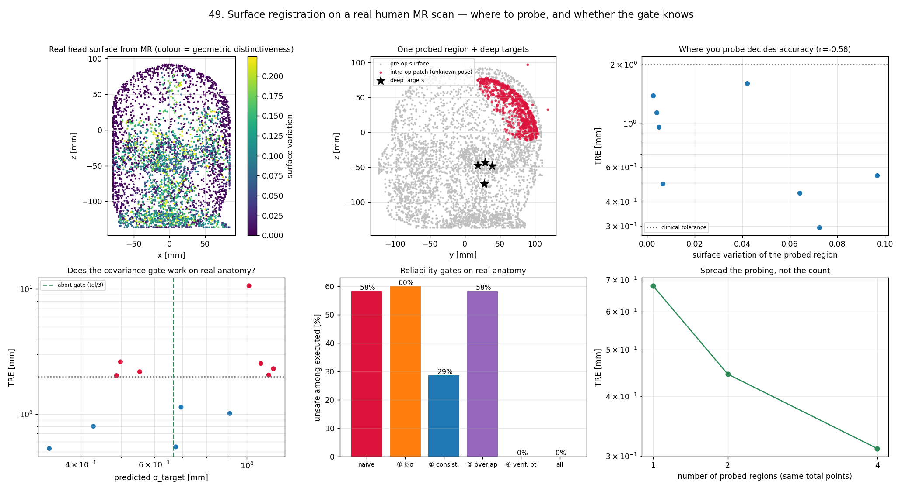

### 50. Teleoperation under delay (`scripts/50_teleoperation_delay.py`)
The chain so far has been autonomous: a plan goes in, the arm executes. Real surgical robots are
**teleoperated** — a surgeon moves a master, the arm follows, and tissue forces come back to the hand. That
force path is where delay becomes dangerous, because a delayed channel can *generate* energy. This is a 1-DOF
study along the insertion axis (reusing the needle–tissue model from #47) comparing four architectures at
one-way delays from 0 to 200 ms.

| architecture | stability vs delay | force fidelity (felt vs actual) | position error |
|--|--|----------:|----------:|
| unilateral (no force feedback) | stable to 200 ms | **1.08 N** (feels nothing) | 1.45 mm |
| P-P direct force reflection | chatters from **50 ms** | **4.01 N** — *worse than nothing* | 1.05 mm |
| wave variables | stable to 200 ms | 0.26 N | 12.09 mm (drifts) |
| **wave + position correction** | stable to 200 ms | **0.19 N** | 7.43 mm |

- **Why wave variables work:** transmit `u = (b·v + F)/√(2b)` instead of raw velocity/force and the channel
  becomes passive for any constant delay. The experiment doesn't take that on faith — it integrates the channel
  energy (in − out) and checks it stays ≥ 0, which it does for both wave variants (0.028–0.032 J) while P-P
  accumulates 0.185 J of channel-injected energy.
- **P-P's failure is not only instability.** The hand feels the *coupling spring*, not the tissue: 4.01 N of
  force error against a ~1.3 N tissue force. Force feedback done wrong is worse than none.
- **The price of passivity** is transparency and correspondence: wave variables add apparent damping (the hand
  feels heavier, the tool advances less) and, because they transmit velocity, **position drifts** — 12 mm of
  master–slave mismatch. A small position-correction channel cuts that to 7.4 mm while staying passive. The
  wave impedance `b` is the knob: b = 5 is light and reaches deeper but oscillates at some delays; b = 10 is the
  smallest value stable across 20–200 ms.
- **Virtual fixtures (active constraints)** — a forbidden-zone wall rendered to the hand, i.e. experiment 9's
  "stop when unsure" moved into a human-in-the-loop system. Where it is computed decides everything:

| K_vf [N/m] | penetration, rendered **locally** | penetration, rendered **through the delay** |
|--|----------:|----------:|
| 0 (no wall) | 17.08 mm | 17.08 mm |
| 800 | 4.64 mm | 44.63 mm (297 µm chatter) |
| 12 000 | 0.41 mm | diverges |
| 50 000 | **0.10 mm** (168× less) | diverges |

  A local wall can be made stiff enough to be a real constraint; the same wall rendered over a 50 ms path
  destabilises above ~800 N/m — **the safety feature becomes the hazard.** This is why constraints are rendered
  on the master side in practice.
- Honest scope: 1-DOF, constant delay (real networks have jitter and loss, which is why time-domain passivity
  control exists), and the operator is a fixed linear impedance — a real surgeon adapts, and closing the human's
  visual loop through the same delay destabilises *the human loop* regardless of architecture (checked while
  building this: with visual closure everything oscillated, which is why the comparison holds the hand's
  reference fixed and scores transparency/stability instead of task completion).

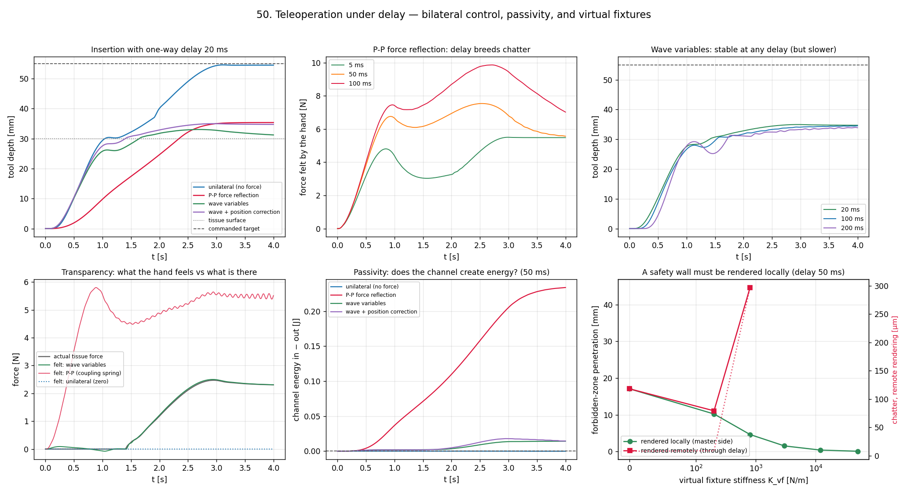

### 51. Deformable registration (`scripts/51_deformable_registration.py`)
Every registration so far (#41, #44, #45, #49) assumed the patient is **rigid**. Tissue is not. After a
craniotomy the brain sags under gravity and CSF loss and a retractor pushes locally — *brain shift*, reported
in the literature at millimetres to ~2 cm. Whatever shift exists at the target is error that a rigid transform
**cannot** remove, no matter how well it fits.

The setup follows the clinical workflow: register rigidly on the **intact scalp before opening** (0.23 mm
target error, #49 territory), then open, digitize only the exposed surface, and try to recover the deformation
from it. A synthetic-but-plausible field is applied to the real MR head so ground truth at depth is known
(12 mm sag decaying over 45 mm + a 5 mm retraction bulge). Targets sit 20/35/50/70 mm **below** the window.

| method | what it assumes | narrow window (4% of surface) | wide (62%) |
|--|--|----------:|----------:|
| rigid ICP | patient does not deform | 5.69 mm | 5.69 mm |
| free-form warp (TPS) | surface data only | 3.31 mm | 1.43 mm |
| **TPS + skull prior** | + "scalp outside the window doesn't move" | **0.60 mm** | 1.44 mm |
| harmonic extension | + ∇²u = 0 through the volume | 1.54 mm | 2.56 mm |

- **What wins is the prior, not the interpolator.** Through a 4% window the same TPS goes 3.31 → 0.60 mm
  (5.5×) when zero-displacement anchors encode one physical fact: the skull holds the scalp outside the
  craniotomy. At 62% exposure that gain vanishes (1.43 vs 1.44 mm) — when the data constrains the field, the
  prior has nothing left to do. Regularization is not a free improvement; it is **buying an assumption**, and
  a patient whose shift violates it (wide resection, bilateral opening) pays for it instead.
- **Refining the physics model made it worse.** The harmonic extension went 1.12 → 1.79 → 2.38 mm as the grid
  went 34³ → 44³ → 54³. That is not discretization error — it is **model bias**: ∇²u = 0 decays faster than the
  real field, under-predicting the shift at depth (80% → 67% → 57% of truth). The coarse grid looked better only
  because its Dirichlet boundary sat a cell *inside* the true surface and pushed the surface displacement
  deeper — cancelling error, not correcting it. A grid-convergence study proves you solved the equation;
  it says nothing about whether it was the right equation.
- **The right number of degrees of freedom moves with the data.** The best TPS control-point count is 170 at
  45° exposure and 600 at 110° — the same knob as λ, and no measurable quantity tells you where it sits. This
  is why TPS *degrades* from 0.65 to 1.43 mm in the sweep above: a fixed budget spread over more surface
  under-samples the region that actually varies.
- **Depth is the limit.** At 70° exposure the shallowest target (20 mm, 9.9 mm of true shift) still keeps
  1.7–2.1 mm of error while the 50 mm target lands at 0.22 mm. Surface data reaches inward only as far as the
  model carries it.
- **FRE ≠ TRE returns, harder.** At 110° the method with the smallest surface residual (harmonic, 1.00 mm) has
  the *largest* deep error of the deformable three. The measurable quantity ranks the methods wrong.
- Honest scope: the deformation field is synthetic (ground truth at depth is unobtainable otherwise) and
  correspondences are given, so the absolute numbers are optimistic — read the **relative** comparison. The
  harmonic extension is a simplified cousin of a linear-elastic FEM, and this experiment shows it behaving as
  a *biased* one.

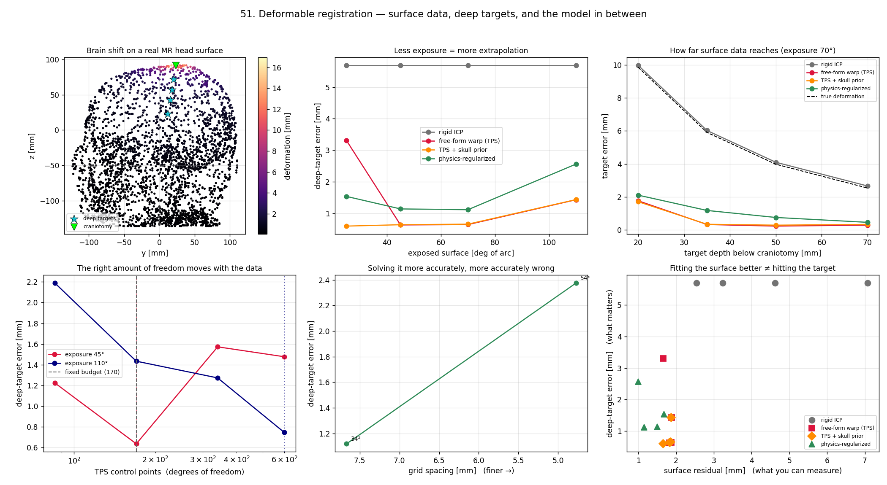

### 52. Probing the prior (`scripts/52_probing_the_prior.py`)
#51 ended on an uncomfortable note: the assumption that bought 5.5× accuracy is never checked against the
patient it is applied to. This experiment attacks that directly by adding a deformation mode the surface
**cannot** see and an observation that can — intraoperative ultrasound measuring displacement at a few
points below the craniotomy (σ 1.5 mm, worse than the optical tracker).

The hidden mode is a lateral displacement localized around 45 mm depth. It leaves **0.03 mm mean trace on
the exposed surface** (below the 1.0 mm probe noise) while costing 2–6 mm at the targets. Half the
simulated patients have it, half do not.

| | surface-explained patient | patient with the hidden mode |
|--|----------:|----------:|
| surface residual (what you can measure) | 1.74 mm | **1.74 mm** |
| target error, surface + prior | 0.64 mm | **3.51 mm** |
| target error, surface + depth data, no prior | 0.97 mm | 3.77 mm |

- **This is an observability problem, not an algorithm problem.** With zero depth observations, prior and
  no-prior land in the same place on the hidden-mode patient (3.77 vs 3.77 mm) — there is nothing in the
  surface data to be clever with. It is the same failure as the IMU bias without measurements (#4, #37)
  and stiction without low-speed excitation (#43, #46): *what is not observed is not estimated.*
- **The only quantity we can currently measure is exactly useless here.** Gating on the surface residual
  scores **AUROC 0.52** — chance. Over 300 simulated patients, 88% of hidden-mode cases exceed the 2 mm
  tolerance and none of them are flagged.
- **One depth observation, held out of the fit, changes that: AUROC 0.81** (two → 0.85, three → 0.90).
  Placing it near the planned target beats placing it anywhere in the ultrasound cone (0.81 vs 0.71),
  though the gap is modest here because the synthetic mode is wide — a more localized violation would
  widen it.
- **The first observations buy knowing rather than fixing.** Spent on checking, one observation takes
  discrimination 0.52 → 0.81; spent on correcting, it takes the error only 3.10 → 2.49 mm, still outside
  tolerance. Four gets to 1.84, eight to 1.50.
- **The gate has a ceiling set by the modality, not the maths.** The check cannot resolve violations much
  below its own noise (σ 1.5 mm) against a 2 mm tolerance. No better statistic fixes that.
- **Honest negative:** the gated policy (check with 2, escalate to 4 if refuted) does **not** beat simply
  taking 4 observations always (1.38 vs 1.47 mm median, but 33% vs 28% unsafe). If observations are cheap,
  take them. The gate earns its keep when they are expensive — and, more importantly, when the error
  cannot be fixed at all, because it converts a silent failure into a stated one.
- Honest scope: ultrasound is modelled as ground-truth displacement plus isotropic noise; real iUS
  degrades with depth, mismatches features, and *changes the deformation by pressing on it*. The
  violation is a single Gaussian mode; one that falls outside the imaging cone would not be refutable at
  all by this setup.

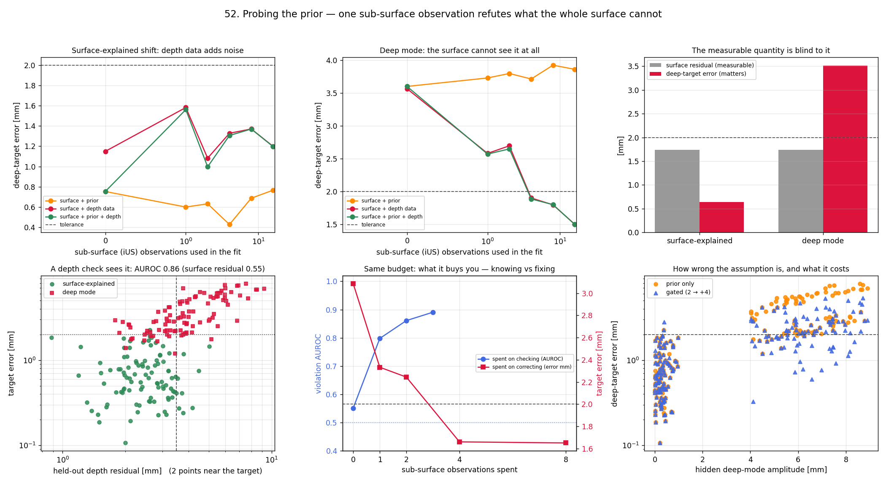

### 53. When measuring changes what you measure (`scripts/53_measurement_changes_it.py`)
#52's ultrasound was ideal: ground-truth displacement plus isotropic noise, and — more importantly —
the *check* was ideal too. Real iUS differs in three ways, and each breaks a different thing.

**(a) The probe presses on the tissue it is measuring.** A 2–5 mm indentation propagates inward, biasing
the reading by 2.73 mm at 20 mm depth and 0.99 mm at 45 mm. The direction is always inward, so it is a
**bias, not noise**:

| depth observations | 1 | 2 | 4 | 8 | 16 | 32 |
|--|--:|--:|--:|--:|--:|--:|
| ideal sensor | 3.00 | 2.80 | 2.05 | 1.67 | 1.44 | **1.16** |
| + probe indentation | 3.46 | 2.85 | 2.30 | 1.80 | 1.64 | **1.68** |

The two curves run parallel — the gap is +0.46 mm at one observation and +0.52 mm at thirty-two. Noise
falls as √N; the bias does not, so **its share of the total error grows from 13% to 31%**. Collecting
more data does not fight a systematic error, it *promotes* it to dominant term. Modelling the
indentation out recovers everything (1.16 mm) if the tissue response length is known exactly, and leaves
1.37 mm at a 30% model error — you must know the model to subtract it, and the model is also wrong.

**(b) Noise grows with depth** (σ 2.1 mm at 20 mm → 3.6 mm at 70 mm): the measurements you need most are
the ones you can trust least. Weighting by the known σ(d) recovers 1.82 → 1.59 mm, about 12%. Weighting
*reports* information; it does not create it.

**(c) 15% of features mismatch**, which takes least squares from 1.16 to 2.34 mm; a robust fit returns
1.63 mm. Getting that robust fit to work needed three things, and the first two attempts failed
honestly: plain Huber IRLS gained nothing because a TPS simply *interpolates* the outliers, so their
residuals vanish (fixed by annealing λ from 100× down — stiff first, so outliers stick out); Huber's
1/r tail then only quadrupled λ on a 20 mm blunder, not enough to exclude it (fixed by a redescending
Tukey weight); and a MAD scale over the mixed control set deleted the *depth* observations as outliers
because the dense surface points dominated the scale — robust estimation assumes outliers are a minority
of one population, and these were a different population. Normalising residuals by the **known** σᵢ and
applying the weight only where an outlier mechanism exists fixed it. Robustness is also not free: below
four observations it *loses*, since discarding one point costs more than the outlier does.

**(d) The check is made with the same sensor** — this is the one that hurts.

| sensor | 1 check | 2 | 3 | 5 | error after 4 correcting obs |
|--|--:|--:|--:|--:|--:|
| ideal (#52) | 0.73 | 0.84 | 0.87 | **0.92** | 1.43 mm |
| realistic, uncorrected | 0.61 | 0.64 | 0.60 | 0.57 | 2.84 mm |
| realistic + all three remedies | 0.62 | 0.60 | 0.62 | 0.65 | **1.82 mm** |

The remedies rescue the correction (2.84 → 1.82 mm) and do **nothing** for the gate, which sits near 0.6
however many check points are added. The reason is specific rather than mysterious: at the target depths
the signal (2–6 mm) is already below the single-point check noise (σ(d)·√3 = 3.6–6.2 mm). De-indentation
and robustness target bias and outliers; the check is limited by neither. **A remedy only fixes the
error term it aims at, and the gate's ceiling is set by the modality, not by the statistic.** #52's
0.81 was, in part, an artefact of assuming the verification measurement was perfect.

- Honest scope: the indentation field is one Gaussian (real tissue is nonlinear and viscoelastic and
  relaxes after loading); de-indentation assumes contact position and press depth are known from a
  tracked probe and force sensor; σ(d) is isotropic where real ultrasound is strongly anisotropic; and
  the outliers are random-direction, whereas real mismatches attach to similar-looking structures and are
  therefore *harder* for a robust kernel to reject.

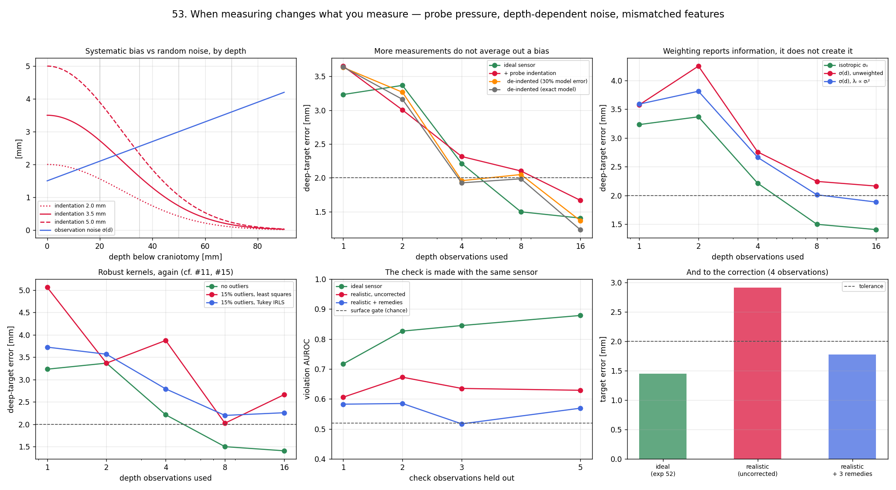

### 54. Closed-loop needle steering (`scripts/54_closed_loop_needle.py`)
#48 cancelled needle bending with a 180° bevel flip at 29.3% of the insertion, and VERIFICATION.md has
carried the residual ever since: *"bending compensation is open-loop; tissue inhomogeneity changes
curvature. Needs tip tracking."* This closes that loop — and the answer is not the one the note assumed.

**Why open loop worked at all.** The optimal flip satisfies `F(d_f) = F(L)/2` with
`F(d) = ∫₀^d (L−u)·κ(u) du` — flip when half the accumulated bending moment has been spent. For a
*constant* κ this reduces to `L(1−1/√2)` and **κ cancels**, which is why #48 never needed to know the
curvature. Put a tissue boundary in and it stops cancelling: the optimum now depends on the layer ratio
r = κ₂/κ₁, moving from 17% (r=0.4) to 38% (r=2.5) of the insertion. At the nominal 29.3% an r=2.5
patient misses by 1.15 mm.

**The bind.** κ₂ is only observable past the boundary, and tip *position* is the second integral of
curvature, so its information grows as (S−s_b)²/2. At the moment you must decide (20.5 mm) the estimate
has σ(κ̂₂) ≈ 35 /m against a population prior of 0.49 /m. And because r>1 pulls the optimum *earlier*,
waiting to learn means you have already passed it.

**The ablation is the point.** Adding a fourth and fifth baseline — plan from the population mean r̄ with
*no measurement*, and simply flip at the decision depth with *no estimate* — separates information from
everything else:

| policy | median | p90 | over 1 mm |
|--|--:|--:|--:|
| open loop, nominal r=1 (#48) | 0.42 | 0.98 mm | 9% |
| **prior only** (mean r̄, zero measurements) | 0.29 | **0.49 mm** | 0% |
| timing only (flip at 25 mm, no estimate) | 0.21 | 0.50 mm | 0% |
| measured, least squares | 0.52 | 0.75 mm | 0% |
| measured + prior (MAP) | 0.29 | **0.50 mm** | 0% |
| oracle (true r) | 0.01 | 0.01 mm | 0% |

The closed loop looks like a win — 0.98 → 0.50 mm — and **essentially none of it comes from the
measurement**. A policy that takes zero measurements scores the same. The gain is a better default
(r=1 → r̄=1.45) plus the timing constraint. Reported without the ablation, this would have been written
up as feedback working. Giving the sensor orientation as well as position (a 5-DOF EM tracker, where
information grows as (S−s_b) rather than squared) improves it to 0.47 mm — 6% of the way to the oracle.

**The bottleneck was actuation.** A single flip spends all the authority at once. Switch to #48's other
policy, duty cycling, which sets the effective curvature continuously — same sensor, same estimator:

| | median | p90 |
|--|--:|--:|
| duty, replan ×1 @22 mm | 0.23 | 0.47 mm |
| duty, replan ×2 | 0.13 | 0.39 mm |
| duty, replan ×4 | **0.09** | **0.37 mm** |
| duty ×4 given the *true* κ | 0.01 | 0.36 mm |

Note the first row: **duty with one replan is exactly the flip policy**, because the command saturates
at u = −1. The gain is not from steering differently, it is from being able to steer *again*. The
information was never late — the opportunity to use it was singular.

**And the bottleneck moves again.** Handing the controller the true κ improves p90 only 0.37 → 0.36 mm,
and making the tip sensor 10× quieter moves it 0.38 → 0.37 mm. Estimation has stopped being the limit;
what remains is replanning granularity, command saturation and the small-angle model. The place to spend
the next effort has changed — which is the same lesson as #42's error budget, arriving from the other side.

- Honest scope: two layers with a known boundary depth, curvature as a function of depth only,
  tip measurements as direct observations with isotropic noise and pure lag. Duty cycling is modelled as
  a proportional effective curvature, which ignores the tissue damage and torsional windup that make real
  duty cycling costly.

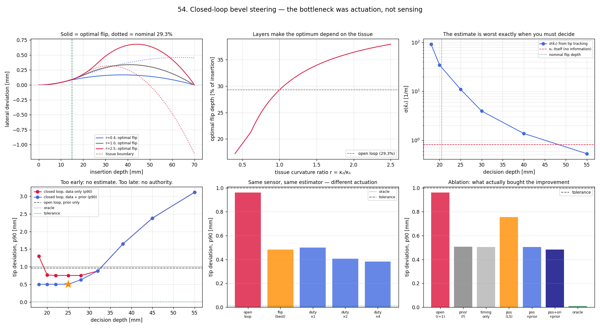

### 55. Correspondence search (`scripts/55_correspondence_search.py`)
Every deformable-registration experiment above (#51–#54) was handed the **correspondences**: which model
point each probe sample came from. In reality you have to find them, usually by nearest point. This
removes that last given, and the cost is not just another error term — it is structural.

Split the deformation into two parts. The **normal** component moves the surface in or out, changing its
shape, so nearest-point search can see it. The **tangential** component slides the surface *along
itself* — and a smooth surface slid along itself is the same surface. Nearest point cannot see it, and it
leaves no residual. This is the **aperture problem** of optical flow, appearing on a deforming anatomical
surface.

| tangential slide | correspondence error | surface residual | normal component recovered |
|--:|--:|--:|--:|
| 0 mm | 0.48 mm | 0.92 mm | 92% |
| 2 mm | 0.60 mm | 0.89 mm | 93% |
| 5 mm | 0.93 mm | 1.07 mm | 92% |
| 8 mm | **1.53 mm** | **1.17 mm** | 94% |

The correspondence error tracks the slide; the measurable residual barely moves. **What can be seen is
recovered well, and what cannot leaves almost no trace.**

> **Corrected by #64.** This paragraph originally read *"leaves no trace at all"*, and that overstatement
> kept an open item alive for nine experiments. The table above says 27%, not zero: **insensitive is not
> blind.** Scored as a detector across a realistic mix of visible and invisible deformation, the surface
> residual reaches **AUROC 0.94** — better than the replacement #55 proposed. The right conclusion from
> this section is that the *correction* cannot recover the tangential part, not that the *alarm* cannot
> see it.

**Finding correspondences costs 2.6×** — 0.54 mm with ground truth, 1.41 mm with nearest point (over 10
seeds, deep-target error). That is the size of the assumption #51–#54 were carrying. And the three
standard remedies all fail:

- **Point-to-plane makes it worse** (1.75 mm) while *lowering* the surface residual (0.55 vs 0.99 mm) —
  the measurable metric betraying the true one yet again. Discarding the whole tangential residual is
  correct when that residual is pure noise; here nearest point has already annihilated most of the slide,
  so what remains contains real signal.
- **A handful of identifiable landmarks does nothing** — 2 to 16 curvature-distinctive anchors give
  1.37–1.80 mm. The bias is spread across the *entire* window, and a few anchors cannot cover a field.
- **A robust kernel is nearly powerless** (1.76 → 1.62 mm), for a reason particular to this failure:
  displace an observation by 6–15 mm and nearest point obligingly finds *a different surface point near
  where it landed*. The correspondence is wrong but the displacement vector is small and plausible, so a
  residual-based kernel has nothing to look at — exactly the case #53 flagged as harder than random
  outliers. **A gross outlier is wrong data; tangential slide is absent data. Different diseases.**

So the useful question is not which estimator to use but **what fraction of correspondences must come
from non-geometric evidence** (cortical vessel patterns via stereovision, implanted markers):

| fixed by non-geometric evidence | 0% | 10% | 25% | 50% | 100% |
|--|--:|--:|--:|--:|--:|
| deep-target error | 1.41 | 1.23 | 1.13 | 0.74 | 0.54 mm |

Roughly linear. **There is no cheap fix** — not a few landmarks, but correspondence across the whole
exposed surface.

- Honest scope: the field is synthetic and split cleanly into normal and tangential parts; on a highly
  curved surface a tangential slide *does* change geometry and becomes partly observable, so this pushes
  the effect to its extreme. Feature correspondences are given as ground truth (with landmark noise);
  the nearest-point step is computed once rather than iterated to convergence, which would recover a
  little more of the normal component and none of the tangential.

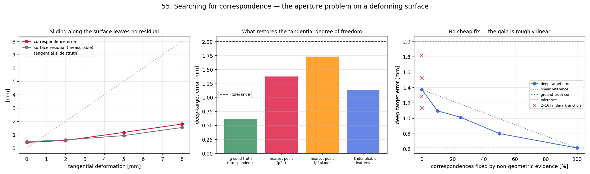

### 56. A jittery, lossy channel (`scripts/56_jittery_channel.py`)
Experiment 50 showed wave variables stable out to 200 ms of delay, and the passivity proof behind that
result assumes the delay is **constant**. Real networks jitter, drop packets and reorder them. This keeps
#50's plant exactly and changes only the channel.

Passivity is measured where the claim lives — in wave coordinates, where the channel's stored energy is
exact:

    E_ch(t) = ∫ ½[ u_sent² + w_sent² − u_recv² − w_recv² ] dτ

With constant delay and no loss this is the energy currently on the wire, so it is ≥ 0 by construction.
Negative means the channel manufactured energy.

**First result: nothing happened.** At #50's settings, ±40 ms of jitter and 40% packet loss left the
channel effectively passive (violation ~10⁻⁵ mJ) and the oscillation *smaller*, not larger. Three reasons
are in the channel: a delay increase starves the receiver into replaying a wave (creating energy) but a
delay decrease makes it discard a stale packet (destroying energy), and for zero-mean jitter the two
cancel; loss destroys energy *inside* the channel, so it cannot break passivity; and dropping the packet
rate from 1 kHz to 50 Hz changes nothing measurable either — **1 kHz is what the local control loop
needs, not what the channel has to carry.** (The hand's felt force is wrong by ~3 N at the puncture
instant at *every* rate: that is delay, not rate.)

The fourth reason is the one that matters. Under tissue load #50's drift-correction gain leaves a
steady-state error of |f_e|/(D_S·λ), so **the tool stops at 34.8 mm and never reaches the 55 mm
target.** The channel was barely being excited. *A test the system cannot fail is not a test.*

Raise the gain until the task completes and the same jitter bites:

| drift gain λ [1/s] | depth reached | energy created by ±20 ms jitter |
|--:|--:|--:|
| 3 (exp 50) | 34.7 mm | 0.006 mJ |
| 6 | 35.8 mm | 0.006 mJ |
| 24 | 50.8 mm | **4.87 mJ** |
| 48 | 51.3 mm | 3.37 mJ |

**860× more, from the same channel defect.** Generation scales with signal energy; the flaw was there all
along and the test could not excite it. And the location was structurally predictable: the drift term
λ(x_m − x_s) sits **outside the wave transform**, so the passivity proof never covered it. *The proof was
true the whole time and was not covering the part doing the work.*

That reframes the fix. The textbook answer is a **de-jitter (playout) buffer** — convert jitter into extra
constant delay, which #50 already priced as cheap. It does restore passivity, and it costs more than the
latency:

| de-jitter buffer | starved steps | energy created | settled oscillation | master–tool error |
|--:|--:|--:|--:|--:|
| 0 ms | 82% | 3.70 mJ | 0.21 mm | 1.95 mm |
| 20 ms | 6.7% | 0 | 1.15 mm | 2.97 mm |
| 45 ms | 7.3% | 0 | **1.60 mm** | **3.61 mm** |

**The buffer buys the proof and sells the performance** — because the added latency lands on exactly the
position loop that the guarantee excludes. Passive and well-behaved are not the same property.

What works instead is to pay only when something is actually missing. Transmit, alongside each wave
sample, the **cumulative energy** put into the channel; the receiver may hold the last sample but only
extract what that budget allows, scaling it by β = √(budget/demand):

| on a missing sample | energy created | depth reached | oscillation | attenuator duty |
|---|--:|--:|--:|--:|
| hold last (ZOH) | 1.02 mJ | 50.8 mm | 0.22 mm | — |
| zero-fill | 0 | **9.4 mm** | 1.07 mm | — |
| energy budget (TDPA) | **0** | 50.8 mm | **0.15 mm** | 5.7% |

Zero-fill is the safe-and-useless corner: the tool never clears the tissue surface. The budget restores
passivity **without** the buffer's latency and posts the lowest oscillation of the three, with the damper
on 6% of the time; when the budget dries up it decays toward zero-fill on its own, i.e. it degrades
safe. **The buffer pays latency continuously, the budget pays only on the event** — the same shape as
#54's ablation argument.

And loss tolerance turns out to be a property of the *payload*, not the algorithm:

| packet loss | 0% | 10% | 20% | 40% |
|---|--:|--:|--:|--:|
| duty / depth, sending cumulative energy | 5.1% / 50.8 mm | 5.3% / 50.8 mm | 5.7% / 50.8 mm | 6.0% / 50.8 mm |
| duty / depth, sending increments | 95% / 36.3 mm | 96% / 36.5 mm | 96% / 36.3 mm | 96% / 36.4 mm |

A lost increment is gone forever, so the budget reads permanently low and the attenuator never releases.
A cumulative total is **monotone**, so one received packet restores the entire history. Same algorithm,
different payload.

Two more results worth keeping:

- **Raising the wave impedance does not help.** b = 10 → 60 leaves the channel active (0.43 mJ), raises
  the oscillation (0.22 → 1.28 mm) and pays transparency even when nothing is wrong (0.42 → 0.70 N). #53's
  "a remedy only fixes the error term it aims at", now in the communication layer.
- **#50 measured the safety number at the wrong end.** With the forbidden-zone wall rendered locally, the
  master penetrates it by 0.16–0.21 mm regardless of jitter — but while the hand is against the wall the
  **tool sits 2.2–2.4 mm behind it**, and the buffer makes that worse (2.46 mm). #50's "168× less
  penetration" is a true statement about the surgeon's hand. Here the tool lags, so the wall errs toward
  over-protection; in a layout where the tool *leads*, the same instrumentation would report safety while
  the patient was harmed. **Measure the safety metric where the harm occurs** — #41's FRE ≠ TRE, one layer
  out.

- Honest scope: jitter is zero-mean uniform and loss is independent Bernoulli; real networks have a long
  late tail and bursty loss, and the cancellation argument above leans on that symmetry. The receiver is
  fixed as keep-newest/discard-stale, which is what produces the cancellation — a receiver that plays out
  everything would compress waves when the delay shrinks. The operator follows a planned trajectory and
  never slows down in response to jitter, which is probably the largest stabilizer in a real system. And
  λ = 24 is "the gain that finishes the task" for this plant; clinical systems use a separate position
  channel or a hybrid architecture rather than pushing this term.

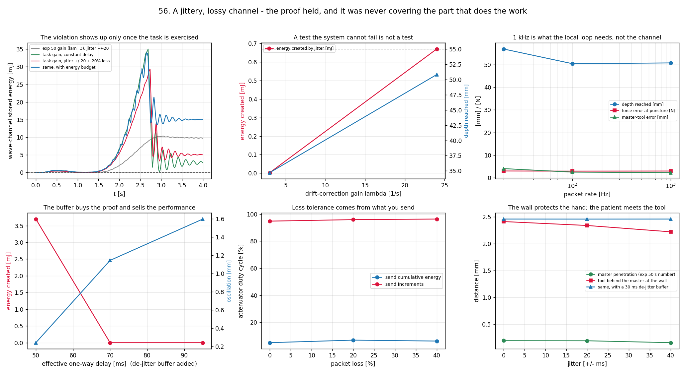

### 57. Bursty loss and a heavy delay tail (`scripts/57_bursty_channel.py`)
Experiment 56 explained its own null result: jitter that *increases* the delay starves the receiver into
replaying a wave (creating energy), a *decrease* makes it discard a stale packet (destroying energy), and
for zero-mean jitter the two cancel. Its limits block flagged that this leans on the symmetry. Closing
#56, I predicted that removing the symmetry would shrink its conclusion.

**The prediction was wrong**, and finding out why was worth more than the prediction. Same plant, same
controller, same ledger — only the channel changes: delay is nominal + a Pareto tail (α = 1.8, so the
variance is infinite and there is no maximum), and loss follows a Gilbert–Elliott two-state model so
burstiness can be varied at a **fixed** average loss rate. Both comparisons are made at a **matched mean
one-way delay** (the tail's mean is subtracted from the nominal), because otherwise you measure added
latency rather than shape — the same trap #55 hit when two deformation fields disagreed.

**What the metrics can and cannot see.** Four conditions at matched mean delay and matched loss rate:

| condition | E_min | max drawdown | longest outage | worst blind travel |
|---|--:|--:|--:|--:|
| #56's condition (uniform ±20 ms, independent 10%) | −1.89 mJ | 30.9 mJ | 235 ms | 11.30 mm |
| heavy tail only (no loss) | −0.87 mJ | 32.2 mJ | 30 ms | 2.18 mm |
| bursty loss only (10%, L = 40) | −1.94 mJ | 41.7 mJ | 171 ms | 3.66 mm |
| heavy tail + bursty loss | −23.2 mJ | **54.2 mJ** | 175 ms | 4.26 mm |

Only the **max drawdown** orders these by severity. `E_min` is masked by the energy sitting in the pipe,
and the outage/blind-travel columns are largest for #56's *jitter* condition — not because it blacks out
longer but because ±20 ms of jitter already starves ~80% of steps per direction and a step is only whole
when **both** directions deliver. Those two columns are counting jitter's dense small holes, not
blackouts. (#52/#53's max-versus-RMS problem, again: you have to pick a metric that can see the thing
you want to claim.)

**Clumping at a fixed loss rate does almost nothing — and the reason is the plant.** Sweeping mean burst
length from 1 to 80 samples at a fixed 10% loss, the longest outage grows 4 → 351 ms by construction, but
total blind tool travel *falls* (17.5 → 6.6 mm) and neither energy measure trends. Holding a stale
command turns out to be **self-limiting**: the stale command has an equilibrium, so the follower converges
to it and stops. Measuring travel per starved step by age within the hold:

| mean burst L | first 5 steps of a hold | beyond 60 steps |
|--:|--:|--:|
| 10 | 22.8 µm | 3.0 µm |
| 40 | 20.5 µm | 6.7 µm |
| 80 | 16.2 µm | 4.9 µm |

Past ~60 ms of holding the tool crawls at a third of its initial speed, so the worst single episode
saturates instead of growing with the blackout.

**And the term that provides that brake is the one #56 called a defect.** The energy budget governs only
the wave channel, so it does not stop the tool; what actually holds the follower is the drift correction
λ(x_m − x_s), a position servo toward a stale but *bounded* setpoint. Gating that term on the same budget
signal — the obvious fix — makes things **worse**:

| mean burst | hold last | energy budget | budget + gating the drift term |
|--:|--:|--:|--:|
| 10 ms | 4.32 mm | 3.22 mm | 3.64 mm |
| 40 ms | 4.26 mm | 3.36 mm | 4.17 mm |
| 160 ms | 4.14 mm | 4.72 mm | **6.53 mm** |

So #56's H24 was half right. **The same term breaks the passivity guarantee and does safety work the
guaranteed part does not.** The rule that follows is not "remove what the proof does not cover" but
"replace what it is silently doing first." A real "stop when communication is lost" function is still
missing here; budget exhaustion supplies the *decision instant* without a tuned threshold, but it does not
enforce the stop.

**What actually broke is buffer sizing.** #56 could say "buy 45 ms of playout buffer and be done" because
uniform jitter has a maximum. A Pareto tail has none, so the buffer becomes a quantile choice — and
imposing a playout deadline **manufactures loss the network never had**:

| buffer | effective one-way delay | delay turned into loss | oscillation |
|---|--:|--:|--:|
| none | 50 ms | 0% | 0.30 mm |
| p50 (9 ms) | 59 ms | **41%** | 0.38 mm |
| p90 (22 ms) | 72 ms | 8.8% | 0.63 mm |
| p99 (77 ms) | 127 ms | 0.9% | 1.54 mm |
| p99.9 (278 ms) | 328 ms | 0.1% | **1.90 mm** |

An undersized buffer is dominated — it pays latency *and* converts 41% of a 5%-loss link into drops,
buying nothing. A large one removes the drops and pays 328 ms of standing latency, which lands on the
same uncovered position loop #56 identified (oscillation 0.30 → 1.90 mm). There is no sufficient buffer;
the trade-off has to be resolved from outside the system, by what latency the procedure tolerates.

Two smaller results: the energy budget still restores passivity under bursts (duty 5.3% → 7.7%, of which
6.3% is effectively muted), so #56's "nearly free" mostly survives but was measured on independent loss;
and zero-fill collapses further under bursts (depth 22.0 mm of a 55 mm target).

- Honest scope: the self-limiting behaviour is a property of **this** plant — a heavy, well-damped axis
  pushing into resisting tissue. On a light, low-friction axis (the needle spin that made #47's impedance
  controller diverge) a stale hold need not be self-limiting, so this must not be generalised across axes.
  Gilbert–Elliott is a two-state geometric model where real wireless/WAN loss is self-similar with longer
  correlation; the two directions are independent here where in reality they share a path and congest
  together. And long bursts mean few events: a 4 s run holds only 5–6 bursts at L = 80, so the realised
  loss rate swings 7–13% and the self-limiting ratio varies 1.7–3.3× across seeds.

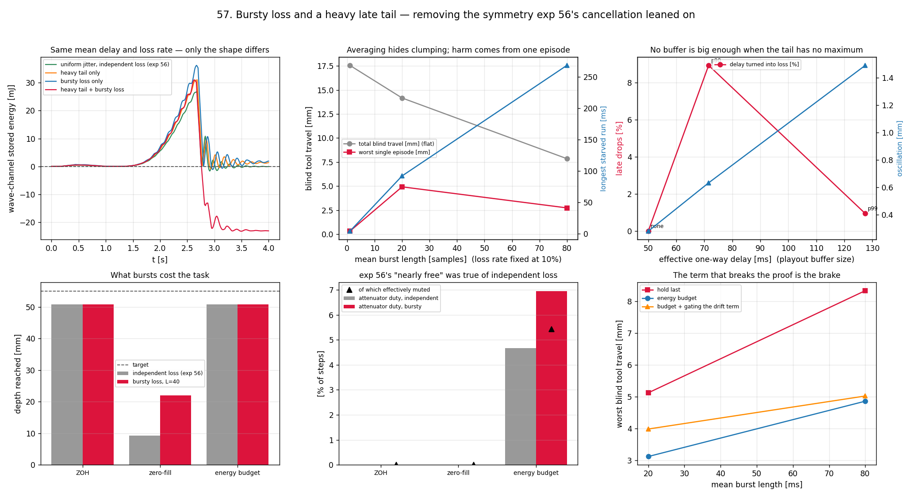

### 58. Stop when the link is lost (`scripts/58_stop_when_lost.py`)
Experiment 57 ended with a rule and an admission. The rule: identify and replace what an
out-of-guarantee term is silently doing before suppressing it. The admission: a real "communication
lost → stop" function was still missing, and the bound currently protecting the patient — that holding a
stale command is self-limiting — belongs to this heavy, well-damped axis rather than to the design. This
experiment tests that admission and then closes it.

**First, is the bound designed or accidental?** Same channel, same blackouts, ablating one contributor at a
time with no stop present:

| configuration | worst blind tool travel | travel per step, early → late in a hold |
|---|--:|--:|
| all present (#57's condition) | 4.14 mm | 21 → 5 µm |
| − tissue resistance (free-space approach) | 2.14 mm | 16 → 4 µm |
| − drift correction λ (#50's wave scheme) | 2.62 mm | 9 → 7 µm |
| − local damping ×0.5 | 9.72 mm | 47 → 11 µm |
| − local damping ×0.3 | **28.86 mm** | 118 → 65 µm |
| − tissue − λ (both) | 3.33 mm | 13 → 13 µm |

**2.1 to 28.9 mm depending on which term happens to survive** — and the early→late decay that #57 called
self-limiting fades as the damping is cut. The bound was an accident of the plant, exactly as #57
suspected. (This is the ablation discipline of H20/R15, applied to a *safety* property rather than to a
performance claim.)

**The stop.** Two design commitments:

- **The trigger comes from the error budget, not from the network.** Integrate the tool's motion while no
  fresh sample has arrived, and stop when that exceeds a margin the chain already declares (#45's 2.17 mm
  shaft clearance, #48's 1.25 mm corridor). My first attempt used the physically exact instant instead —
  β = 0, the energy budget allowing nothing — and it fired constantly, because a jittery channel starves
  ~80% of steps per direction (#57 §A): the stop engaged **98.5%** of the time and the tool never left
  4 mm. The instantaneous state was right; what mattered was how far the tool went while in it.
- **Enforcement is local.** The follower holds *its own* position with a spring-damper, needing no packet
  to work — the same principle as #50's "a virtual wall must be rendered locally", now applied to the
  failure path. Being a dissipative pull toward a fixed point, it cannot create energy (verified: the
  wave-channel ledger stays ≥ 0).

| configuration | no stop | with the local stop |
|---|--:|--:|
| all present | 4.14 mm | 1.91 mm |
| − tissue | 2.14 mm | 1.25 mm |
| − drift term λ | 2.62 mm | 1.19 mm |
| − damping ×0.5 | 9.72 mm | 2.65 mm |
| − damping ×0.3 | 28.86 mm | **2.75 mm** |
| − tissue − λ | 3.33 mm | 1.17 mm |

The point is not the mean, it is that the **spread collapses from 2.1–28.9 mm to 1.2–2.8 mm**: the bound
no longer depends on which term survives. It sits at roughly 2× the declared margin, and the excess is the
stopping distance — itself a plant property, so it belongs in the margin calculation. And the task still
reaches 50.8 mm of its 55 mm target, so this is not #56's zero-fill corner (safe and useless).

**Now #57's failed remedy works.** Gating the drift term on the passivity budget made blind travel worse in
#57 (4.72 → 6.53 mm). With the replacement in place, the same gate is harmless:

| | worst blind travel |
|---|--:|
| budget only (#56) | 4.72 mm |
| + gate λ (#57's failure) | 6.53 mm |
| + local stop | 1.91 mm |
| + local stop + gate λ | **1.68 mm** |

That is R20 tested rather than asserted: **replace first, then you may suppress.**

**What it costs.** Two prices, both of which have to be paid by someone outside the algorithm:

| declared margin | blind travel | time stopped | stops per run |
|--:|--:|--:|--:|
| 0.5 mm | 1.51 mm | 56% | 5.2 |
| 1.0 mm | 1.91 mm | 42% | 3.8 |
| 2.0 mm | 2.82 mm | 15% | 1.3 |
| 4.0 mm | 4.59 mm | 12% | 1.0 |

**The declared margin buys the stop rate** — a narrow corridor stops often, a generous one almost never,
with the same code on the same network. And resumption is the most dangerous moment: releasing immediately
peaks at 155 mm/s, while a 200 ms ramp brings that to ~90 mm/s and raises the time stopped from 9% to 73%.
Same shape as #47's breakthrough lunge, same conclusion — the operating point is chosen by the clinical
constraint. One property came free: the ramp advances only on steps where information actually arrives, so
a worse link resumes more cautiously.

- Honest scope: the stop holds the arm **where it is**; inside tissue that means stopping while embedded,
  not retracting to a safe state, and which of those is correct is a clinical decision this does not make.
  The network threshold is gone but the declared margin and the resume ramp are still choices — they just
  come from anatomy and actuator limits, so whoever picks them has grounds. The master keeps moving while
  the follower is held (the operator is a modelled impedance), which is why resumption is violent; a real
  system also locks or cues the master, and that needs a human in the loop. Finally, the trigger reads
  β from the energy ledger, so if the ledger is wrong the stop fires at the wrong time — the same kind of
  dependence #53 flagged when the check shares a sensor with the thing it checks.

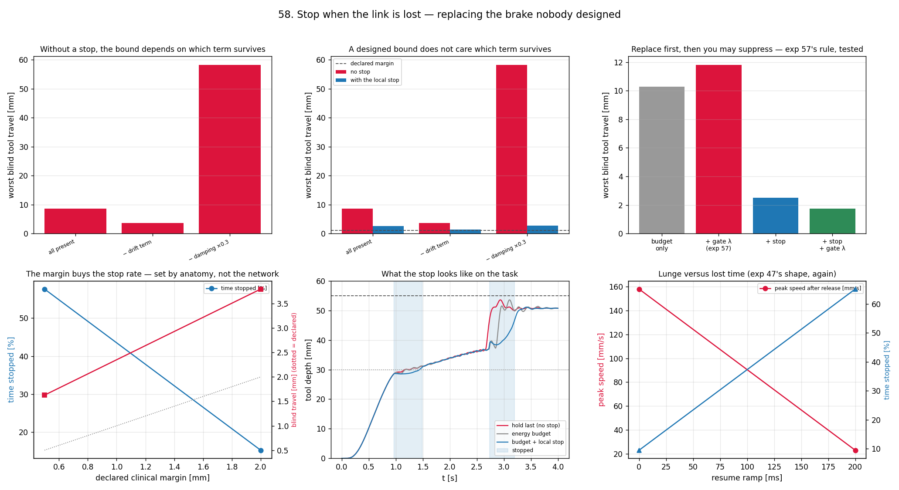

### 59. Is stopping a safe state? (`scripts/59_what_is_safe_state.py`)
Experiment 58 closed with two admissions: the stop **holds** rather than retracts, so inside tissue it
stops while embedded; and nothing happens on the operator's side, which is why resumption peaks at
155 mm/s. Both look like control questions. **Both turned out to be model questions**, and that is the
result.

**You cannot compare policies a model cannot express.** Asking "is holding dangerous?" requires the patient
to move during the stop, so I added periodic tissue motion. Almost nothing changed — because the tissue
model this chain has used since #47 is *cutting force + friction* with **no post-puncture elasticity**, so
a tissue moving onto a stationary tool produces no load. The cleanest way to see it is to take the tissue
model on its own — no channel, no controller — hold the tool at depth and move the surface:

| patient motion | cutting + friction | + stick-slip grip | grip's own share |
|--:|--:|--:|--:|
| 2 mm | 0.048 N | 0.648 N | 0.60 N |
| 5 mm | 0.120 N | **1.620 N** (14×) | 1.50 N |
| 10 mm | 0.240 N | 1.840 N | 1.60 N |
| 20 mm | 1.184 N | 1.984 N | 0.80 N |

Adding the standard stick-slip grip term — the tissue holds the shaft elastically until the force exceeds
a slip limit, so it reduces to the old model whenever the tool is advancing — makes the hazard appear, and
its share saturates near 2 × the slip limit because the tissue lets go. **"No difference" from a model that
cannot represent the effect is silence, not a result.**

**Then the answer is a negative anyway.** With the grip term in, retraction does reduce what holding puts
on the tissue (1.68 → 0.89 N) but costs **3.6×** the blind travel (2.01 → 7.28 mm), because retraction is
itself motion without information. In this tissue, **holding is right** — and the condition that would flip
it is explicit: a higher slip limit (tissue that does not let go) or a smaller cutting baseline. **Which
tissue you are in chooses the policy**, and that number has to come from measurement, not from here.

**On the operator side the sign of the intervention flips.** Locking the master during the stop is the
obvious move, and it is wrong in *both* operator models:

| operator | master | mismatch at release | peak speed on resume |
|---|---|--:|--:|
| fixed impedance (#50–#58) | free | 7.40 mm | 120.1 mm/s |
| fixed impedance | locked | 4.45 mm | **133.1 mm/s** |
| + 200 ms reaction | free | 6.18 mm | **68.0 mm/s** |
| + 200 ms reaction | locked | 3.80 mm | 125.7 mm/s |

The lock reduces the mismatch, as it must, and makes resumption *faster* — because it does not remove the
operator's intent, it stores it in the hand's spring, and worse, **it hides the very cue the operator would
react to** (the tool falling behind the hand). What actually helps is letting the operator react: one rule —
"if the tool lags, stop pushing after a reaction time" — takes the median resume peak from 120 to 68 mm/s.
Honestly stated, that gain is **not universal**: paired by seed it is a median 25% reduction and 11 of 16
seeds improve. Comparing medians of two right-skewed distributions overstates a paired effect, which is the
same mistake #52 had to fix when it swapped detection-at-fixed-false-alarm for AUROC.

So: **an operator-side measure cannot be evaluated with a non-adaptive operator model.** #50 recorded
"the surgeon is a fixed impedance" as a limitation; here that limitation flips the sign of a conclusion.
The recommended combination is **hold + a reacting operator** — blind travel 1.80 mm, resume 68 mm/s,
passivity and task completion unchanged.

- **Corrected by #62.** The reaction rule froze the operator's *hand* while the underlying intent kept
  advancing with wall time — so on release the target had run ahead. #62 made the operator's internal clock
  stop while frozen, which is what "the surgeon paused" actually means. The conclusion survives (paired
  over 12 seeds, 120 → 66 mm/s, 8/12 improved) but the numbers moved, and at this chain's usual 4 s the
  rule now leaves the task **incomplete** (44.5 mm) — which is #56's R18 applying to #59 in hindsight, so
  the figures above should be read in the completion-matched condition #62 uses.
- Honest scope: **the §B verdict rests directly on grip parameters that are order-of-magnitude guesses, not
  measurements** — so the claim is not "holding is right" but "which tissue you are in decides it". The grip
  is axial 1-DOF where real interaction adds circumferential grip, lateral support and viscoelasticity
  (relaxation after pressing — still the open item #53 named). Patient motion is a single sinusoid; real
  respiration is asymmetric with pulsation on top, and a head fixed in a frame moves far less than the 5 mm
  used here. The reacting operator is *one* rule with a reaction delay; unlike the gain-carrying visual loop
  #50 discarded it does not destabilise, but it is still a model. Retraction stops at the surface — full
  withdrawal is a separate clinical decision.

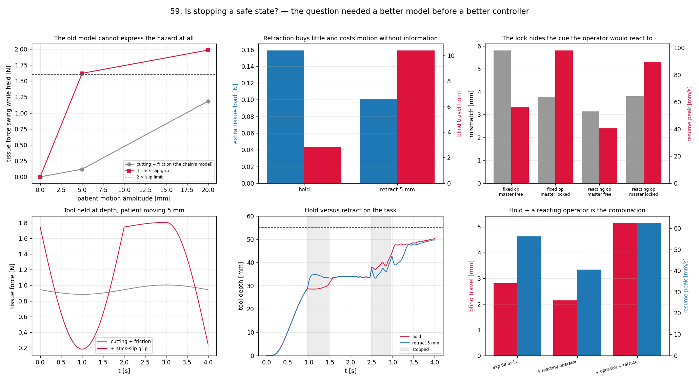

### 60. Is that measurement worth making? (`scripts/60_measure_to_decide.py`)
#59 ended by admitting that its verdict rested on grip parameters that were order-of-magnitude
guesses, and I wrote that the next step was to go and measure them. **Before spending a measurement,
compute whether it would change a decision.** That is this experiment, and the answer was no.

**A. The decision map.** Hold and retract are scored on two axes — the force swing the tissue receives
while stopped, and the blind travel bought with it. Trading one for the other needs an **exchange rate
in mm per N**, which is a *clinical* number, so it is swept rather than fixed (the same slot as #58's
declared margin and #57's tolerable latency). Retraction needs at least **15 mm/N** before it wins
anywhere, and in **13 of 15** tissue/motion combinations it is worse on *both* axes.
*(These two numbers were 8 mm/N and 6 of 15 as first published; #61 found that the load metric
aggregated the force swing across every stop in a run, so a stop spanning the puncture pinned it to
`F_PUNC`. Measured per stop, the conclusion is unchanged and stronger.)*

**B. So the information is worth nothing here.** Below ~5 mm/N the decision is *hold* for every slip
limit from 0.4 to 6.4 N. The binding unknown was never the tissue — it is the exchange rate, and that
is declared, not measured. Two further things fell out:

- **#59's stated flip condition was backwards.** It said a *larger* slip limit would favour retracting.
  It is the opposite: retracting drags against the same grip, and the drag is exactly `F_slip`. #59
  reasoned only about the holding side and missed that retraction pays the same term.
- **F_slip = 3.2 N and 6.4 N give identical numbers to three decimals.** The grip saturates at
  `K_grip × relative motion`, and above that the parameter has no effect on the system at all.

**C. If it is ever needed, a normal insertion cannot give it.** While advancing, the tissue is
continuously slipping, so the grip enters as a constant: the fitted intercept equals `F_cut + F_slip`
**to three decimals** at every value tested. It is perfectly confounded — not noisy, *absent*. The
insertion is not wasted, though: its **slope** is a clean friction estimate (12.0 N/m against a true 12,
independent of F_slip) that then corrects the dwell fit. Separating what a record cannot give from what
it can is the whole of identification design.

**D. So stop and let the tissue move — but only a large enough motion works.** Both sides slip only if
the excursion exceeds `2·F_slip/K_grip`, which cannot be chosen in advance because it depends on the
unknown. The fix is an **amplitude ladder**: climb until the estimate stops growing. That recovers every
value exactly (0.4 → 6.4 N, 0.0% error) and the converged amplitude tracks the predicted requirement
within one rung. **Convergence is knowable without knowing the truth.** Breathing alone caps the estimate
at `K_grip × A / 2 = 1.50 N` *for any tissue* — a stiff tissue returns a plausible wrong number that is
really the breathing amplitude. Sensor noise then biases the estimate **upward only** (+8% at 0.01 N,
+83% at 0.10 N for a 0.4 N grip), because a peak-to-peak measure absorbs noise on one side.

**The result that ties A–D together:** the same product `K_grip × relative motion` caps both the harm
and the observability. Above it the parameter is neither dangerous nor identifiable — **the reason it
cannot be measured is the reason it does not matter.**

- Honest scope: the decision map is one scenario (#59's channel, stop policy and 1 mm margin). Harm is
  scored as a force **swing**; if the real injury is dose or duration the value of the measurement changes
  — a metric choice decides what information is worth. The first metric tried, the increment since the stop
  instant, was **sensitive to the breathing phase at which the stop landed** and produced the absurdity of
  *less* load from *more* patient motion; that is now pinned by a test. Identification assumes this model
  is true, and real tissue relaxes (still #53's open item), which would tilt the plateau the estimator
  reads. The 20–60 mm excursions are a **bench specification for a phantom or excised tissue**, not
  something to do during a procedure.

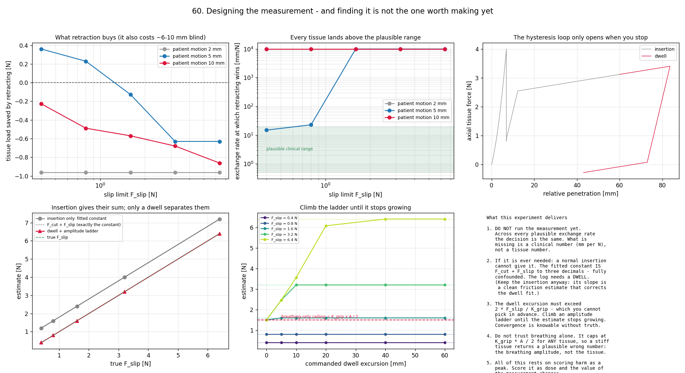

### 61. Tissue relaxes (`scripts/61_tissue_relaxes.py`)
#60 shipped a protocol and a verdict, and wrote a weakness under each: *"real tissue relaxes, so the
plateau will not be flat"* and *"if harm is dose rather than peak, the value of the information changes."*
**Viscoelasticity is the physics that links both**, so it tests #60 against #60's own stated doubts —
and closes the oldest open item in this chain, the one #53 named. It is added as a Maxwell element: the
grip's elastic anchor creeps toward the tool with time constant τ, so held deformation persists while
the force decays. τ = ∞ reproduces #60 exactly (test-pinned).

**I made two predictions going in. Both were wrong, and that is the experiment.**

**Prediction 1 — dose would flip the verdict. It did not.** Scoring harm as `∫|F| dt` while stopped moves
every number: retract's force side is now better in *every* cell, because a peak metric sees the
retraction transient while dose sees the lower steady state that follows it. But the *shape* is
unchanged — below some exchange rate the answer is "hold" for every slip limit, and the binding unknown
is still a **declared** rate, now in mm per N·s instead of mm per N. A metric change moves the window
and the units, not the conclusion.

**Prediction 2 — the amplitude ladder would converge cleanly at a wrong value. It cannot.** At fixed
frequency, raising amplitude also raises velocity (`v = A·ω`), so the viscous ceiling `K·v·τ` and the
geometric ceiling `K·A` **both climb with the ladder**. Every ceiling except `F_slip` itself rises, so a
false plateau is structurally impossible: the ladder either lands on the truth or honestly reports
non-convergence. #60's criterion covered relaxation for a reason #60 did not know. What relaxation costs
is not correctness but **amplitude** — at τ = 0.2 s and 0.11 Hz a 3.2 N grip is still unresolved at
60 mm, where the elastic case converged at 20 mm. Raising the frequency is the cheap fix (40 mm at
1.1 Hz), and the two requirements merge into a **velocity** spec: `A > 2·F_slip/K_grip` **and**
`A·ω > F_slip/(K_grip·τ)`.

**What did break — and it was not what I was looking for.** Two metric defects, both in quantities #60
introduced:

- **#60's peak metric was measuring the stop controller, not the tissue.** The control is trivial and I
  should have run it there: hold with the patient **perfectly still**. It reads **2.17 N**, and it is
  identical for every slip limit and every τ — it is the hold controller settling onto its target.
  Patient motion adds only 0.5 N on top. Dose, by contrast, responds to both (1.50 → 1.67 N·s across
  slip limits; 1.67 vs 2.08 with and without relaxation). #60 swapped the increment metric for the peak
  to fix a phase-sensitivity problem and imported a different blindness. **Redrawn on the metric that can
  see the tissue, #60's conclusion still holds** — which makes it more trustworthy than it was.
- **The swing was aggregated across every stop in a run.** One stop spanning the puncture pins it to
  `F_PUNC`, so half the seeds read exactly 4.00 N regardless of the tissue. Now measured **per stop**;
  #60's published numbers move accordingly (8 → 15 mm/N, 6 → 13 of 15) and its conclusion strengthens.

**The one real protocol break** is the insertion intercept. #60 showed it equals `F_cut + F_slip` to
three decimals; with relaxation it is `F_cut + min(F_slip, K·v·τ)`, predicted to within 0.6% across five
τ. A slow insertion therefore measures the **insertion speed** wearing the tissue's clothes — the
confounding set grew by one, and the two wrong answers are equally plausible.

- Honest scope: relaxation is a single Maxwell element; real soft tissue has a broad relaxation spectrum
  and QLV is the standard model, so the question answered here is "what breaks if relaxation exists", not
  "what is τ". The cutting baseline is not relaxed (axial friction during a hold really does, so this is
  optimistic). Dose includes the cutting baseline, which dilutes the policy difference. And relaxing
  tissue holds its **deformation** after the force is gone — if injury is strain or ischaemic time rather
  than force, a third metric is needed and this experiment does not have it.

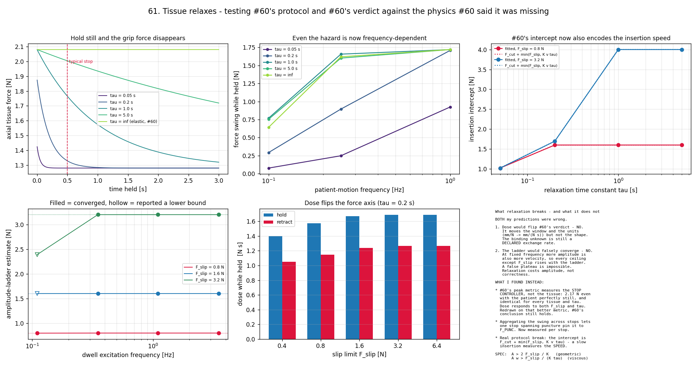

### 62. An operator who feels, learns and backs off (`scripts/62_adaptive_operator.py`)
#59 showed the sign of an operator-side measure flips with the operator model, and wrote the rule:
**an operator-side claim can only be evaluated against an operator that adapts.** It then listed three
things its own operator lacked — **force perception, learning, reversal**. With the tissue side closed
by #60 and #61, this is the last modelling gap on this track.

One of those omissions was strange in hindsight. **#50 built wave variables to *transmit* force and then
modelled an operator who never used it.** For twelve experiments this chain was sending force to someone
who could not feel it.

**A. The tier ladder — and my own rule catching me.** Each tier adds exactly one thing to the last:
fixed impedance (#50) → visual reaction (#59) → **force perception** → **learning** (move-and-wait: an
internal clock that slows after each adverse event) → **reversal** (pull back rather than freeze). At the
chain's usual 4 s the ladder looks like a clean win — resume peak **120 → 41 mm/s**. But depth reached
falls **50.3 → 34.7 mm** against a 55 mm target. #56 found almost exactly that number, discovered its
test *could not fail*, and wrote **R18**: report a robustness result only where the task completes, with
the completion measure beside it. **My own operator model broke my own rule.** A cautious surgeon was not
buying safety; they were not finishing.

**B. Given time to finish — and I was wrong again, the same way as before.** With 3× the time every tier
completes (~50.2 mm). On 6-seed medians the story read "force perception adds nothing". It does not: this
metric is *noisy* (47–192 mm/s in one condition), and **#59 had already caught me comparing medians of
medians on this exact quantity.** Paired by seed over 12 seeds:

| operator | paired Δ vs T0 | seeds improved |
|---|--:|--:|
| + visual reaction | −29.7 mm/s | 8/12 |
| + force perception | −34.6 mm/s | **11/12** |
| + learning | −32.3 mm/s | 9/12 |
| + reversal | **−60.9 mm/s** | 11/12 |

**Force perception buys reliability, not magnitude.** Per seed the mechanism is exact: visual reaction
alone loses on 4 seeds, and force perception **rescues 3 of them**; on the 5 seeds where visual already
won, the two are **bit-identical** — the force cue never became the binding one. A redundant cue on a
*different physical channel* does not raise the ceiling, it removes the cases where the first cue misses.
That is the same logic as this repo's independent-cross-check habit, now inside the operator.

Learning adds nothing once the task has to finish — and at 4 s it was the thing that stopped it
finishing. **Reversal is the largest single gain**, and its cost is *not* blind travel (paired, −0.04 mm):
it is **+3 interruptions (10/12)** and **+0.33 N of held tissue force (7/12)**, because backing off widens
the hand-to-tool gap that triggered the rule, so the rule fires again. Freezing has no such feedback.

**C. #59's master-lock verdict, re-run against all five operators.** Locking is worse in every tier
(paired Δ +19 to +40 mm/s), while genuinely reducing the mismatch at release. **My prediction failed
here too**: I expected a force-perceiving operator to be rescued by the lock, since the lock's own
resistance is itself a cue — and I made the felt force include it, so the test was fair. It does not
help. The lock does not remove the operator's intent, it stores it in the hand. Honest caveat, as in #59:
this holds on about two-thirds of seeds, not all.

**D. The human sits outside the passivity proof.** #56–#58 found the proof covered only the wave block
and that the term outside it was load-bearing; the operator is another such term, and now a *feedback*
one. Channel energy stays non-negative in every tier — because these reactions are **rules** (freeze the
target, retract it), not gains. #50 discarded a gain-carrying visual loop precisely because the human
loop diverged. **The boundary is not whether the human reacts, but the form of the reaction.**

- Honest scope: the operator is still a model — one perception threshold, one learning scalar, one fixed
  reversal distance; a real surgeon builds a predictive model and switches strategy. Learning is entered
  as a slowed internal clock, a first-order stand-in for move-and-wait, where the real thing is
  *segmented* move-then-wait. The completion comparison assumes **time is free**, which for a real
  procedure is another declared number this repo does not have. Force perception is a magnitude threshold
  only; people also react to force *rate*. And the passivity ledger is still the wave block's.

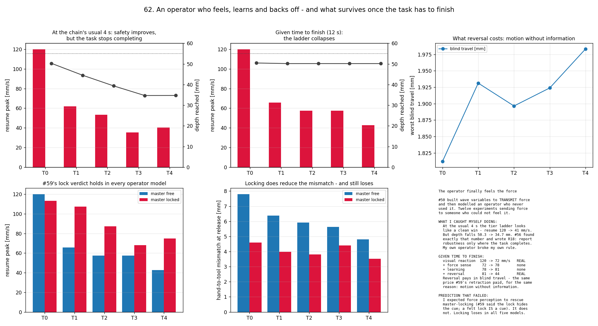

### 63. Harm is not force (`scripts/63_harm_is_not_force.py`)
#61 put one item on its limitations list and flagged it as **the only kind this repo's own checks could
not catch**: *"relaxing tissue keeps its deformation after the force is gone. Every metric here —
increment, peak swing, dose — is built from force."* Three metric swaps, each fixing the previous one's
defect, all on **one axis**. If that axis is wrong, all three are wrong together and they agree with each
other while being wrong. So this experiment changes the axis.

**What it counts.** When the needle drags tissue, the grip's anchor follows — when it slips, and when
relaxation lets it creep. The anchor's **total travel** is irrecoverable deformation: unlike elastic
strain it does not come back, and it persists after the force is gone. Force cannot see it for a
structural reason: **during steady slip the force is pinned at `F_slip` while the anchor keeps moving.**
Force constant, damage accruing — no force metric can differentiate that out. Holding still under
breathing, the force settles to ~0.9 N while drag climbs past 17 mm.

**My prediction was wrong.** I expected retraction to win here — holding drags on every breath, retracting
drags once. It does not: **retracting drags 5 mm of tissue by itself**, so on drag the winner is still
*hold* (4/12 seeds for retract). Opening a new axis produced no new answer.

**But reading the table the other way is worse.** The four metrics split **2–2**: increment and dose say
retract (9/12, 11/12), swing and drag say hold (3/12, 4/12). Adding an axis did not resolve the
disagreement that #61 had already found *within* the force family. "Which metric" is a decision, not a
detail. (Drag is at least new information, not a repackaged duration: its correlation with held time is
−0.21.)

**The real result is that #60's verdict was axis-conditional.** #60 concluded the tissue's slip limit was
not worth measuring because the decision does not depend on it. On the drag axis it does:

| `F_slip` | held force swing | drag, hold | drag, retract | winner on drag |
|--:|--:|--:|--:|:--|
| 0.4 N | 2.125 N | 9.18 mm | 13.05 mm | hold |
| 0.8 N | 2.125 N | 7.77 mm | 8.19 mm | hold |
| 1.6 N | 2.125 N | 6.49 mm | 4.63 mm | **retract** |
| 6.4 N | 2.125 N | 6.50 mm | 4.63 mm | **retract** |

The force swing is **flat to three decimals** across the entire range — #60 and #61's saturation, exactly
as they reported. Drag falls and then saturates, and **the policy winner flips between 0.8 and 1.6 N**.
And the *sign* is inverted: on force a stronger grip is at best irrelevant, on deformation it is
**protective**, because tissue that grips harder takes the motion up elastically instead of slipping.

So: the policy ranking did not flip (my prediction), but **the value of the information did** (the more
important claim). #60's "this measurement changes no decision" was never a fact about the tissue — it was
a fact about the force axis. Rank correlations confirm the axes are distinct: force metrics correlate
0.48–0.81 with each other and −0.23 to 0.15 with drag. **Agreement inside a metric family is evidence of a
shared axis, not of being right.**

- Honest scope: "irrecoverable deformation = total anchor travel" is a definition inside this 1-DOF model;
  real injury is a nonlinear function of strain, strain rate and cycle count, and sub-threshold dragging
  may be harmless. **Ischaemic time is still unmeasured** — perfusion is a pressure-field question that an
  axial 1-DOF model cannot express, so this opens one non-force axis, not all of them. Anchor travel also
  includes ordinary cutting during insertion, which is the procedure rather than a harm, so only the
  held-interval share is used for policy comparison. Relaxation is still a single τ and the grip
  parameters are still not measured.

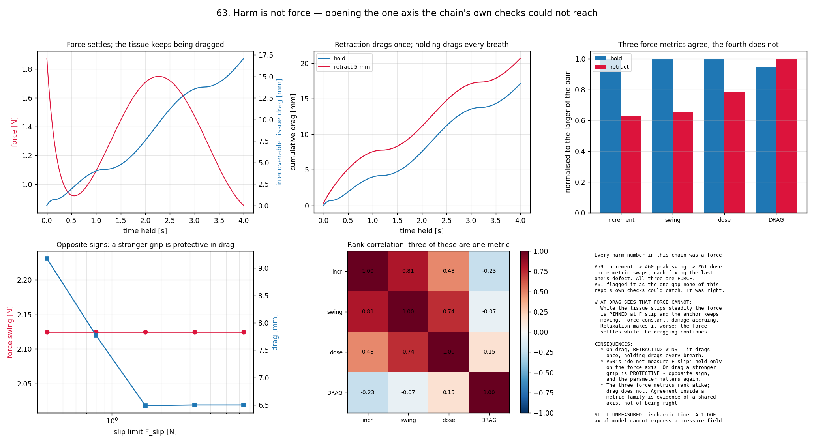

### 64. Can anything see what the residual cannot? (`scripts/64_residual_free_detection.py`)
#55 ended by naming the next move: *"detect wrong correspondences without going through the residual —
by checking whether independently matched subsets agree, the same idea as the multi-start consistency in
#11 and #15."* It stayed open for nine experiments. **It was open because of a sentence, not a number.**

**The idea.** Split the surface around the craniotomy into K sectors, fit a correction from each sector
alone, and measure how far their predictions disagree at the deep targets. Each sector has a different
local invariance direction, so tangential error should leak out as disagreement even where the residual
stays flat.

**The control comes first** (R26, from #61): a correction fitted from one sector is ill-conditioned at
depth, so the sectors may disagree **even with perfect correspondences** — in which case the statistic
measures conditioning, not misregistration. #55 carries ground-truth correspondences, so the control is
free. It matters: with true correspondences the disagreement floor is **0.59 mm**, so an absolute
threshold would have read conditioning as error.

**I then set myself a test that could not fail.** Varying *only* the tangential component, the residual
scored **AUROC 1.00** — with one varying factor, anything correlated with it is perfect. That is #56's
"a test that cannot fail", now in a detection experiment. Making the task real means varying the normal
component independently too, so the residual moves for **harmless** reasons as well (a large but
well-corrected surface deformation).

**The result is a negative, and it corrects #55's headline.**

| statistic | AUROC |
|---|--:|
| surface residual | **0.94** |
| subset agreement | 0.76 |
| agreement ÷ residual | 0.65 |

#55's own table shows the residual going 0.92 → 1.17 mm as the correspondence error triples — a 27% rise
that the prose rendered as *"leaves no trace at all"*. **Insensitive is not blind.** Reproduced here
(0.90 → 1.09 mm) and scored as a *ranking* statistic, it is the best detector available. The proposed
replacement is worse, and with ρ = 0.47 between them it is not even a distinct axis in #63's sense. Note
this is a different failure from #52's surface gate at AUROC 0.52 — there the deep mode left **no**
surface signature; here the tangential slide leaves a faint one.

So the item closes as **"the detector we already had is better than the phrase suggested"** — and finding
that out required measuring an AUROC rather than re-reading a sentence.

- Honest scope: sector splitting can only work where the geometry around the window is asymmetric. On a
  locally symmetric surface every sector slides the same way and they **agree on the same wrong answer** —
  that is #52's genuine unobservability, which no detector fixes. One real MR surface, one window. And
  detection is an alarm, not a correction: knowing the registration is wrong does not say what to do.

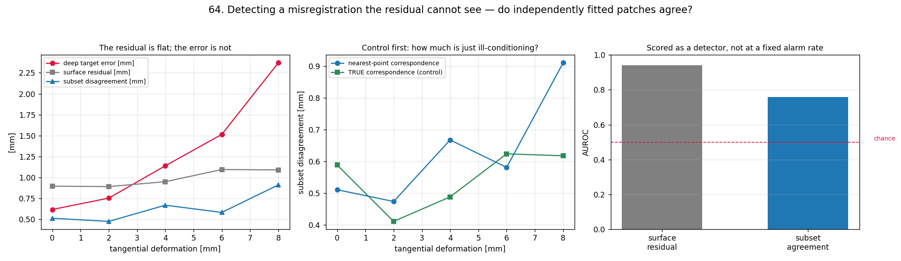

## Why this bridges to robotics (and my background)
- **DSP → estimation**: the KF is optimal linear filtering — the same innovation /
  gain / covariance machinery, now in state space.
- **Embedded → real-time**: the filter is a handful of small matrix ops per step,
  trivially real-time on an MCU.
- **DSP → nonlinear estimation**: EKF (linearize) and UKF (sigma points) extend the same
  machinery to nonlinear robot models — the bridge to real robotics state estimation.

## Quickstart
```bash
pip install numpy matplotlib scipy pytest    # scipy: KD-trees, sparse solves, filtering
                                             # (torch is optional — only experiment 16)
python scripts/01_tracking.py       # linear KF tracking
python scripts/02_imu_fusion.py     # position + IMU fusion with outage
python scripts/03_ctrv_ekf_ukf.py   # nonlinear CTRV: EKF vs UKF
python scripts/04_imu_bias.py       # online IMU bias estimation
python scripts/05_ekf_slam.py       # EKF-SLAM: localization + mapping
python scripts/06_loop_closure.py   # loop closure corrects accumulated drift
python scripts/07_pose_graph_slam.py # graph SLAM: pose-graph optimization
python scripts/08_vio.py             # visual-inertial odometry
python scripts/09_safe_autonomy.py   # uncertainty-aware safe-stop (No-Fly-Zone)
python scripts/10_vio_graph_slam.py  # modern SLAM: VIO front-end + graph back-end
python scripts/11_robust_slam.py     # robust SLAM: reject false loop closures
python scripts/12_graph_slam_landmarks.py  # full graph SLAM (joint pose+landmark BA)
python scripts/13_pose_graph_3d.py   # 3D SE(3) pose-graph SLAM
python scripts/14_g2o_benchmark.py --file data_cache/intel.g2o   # real g2o benchmark
python scripts/15_robust_g2o.py      # robust SLAM on real Intel + false loop closures
python scripts/16_learned_imu_frontend.py  # learned IMU denoiser (torch, optional)
python scripts/17_fixed_lag_slam.py   # online SLAM: fixed-lag vs batch
python scripts/18_full_slam_system.py # full system: front-end + robust back-end
python scripts/19_plan_control.py     # planning (A*) + control (pure-pursuit)
python scripts/20_dwa_dynamic.py      # dynamic obstacle avoidance (DWA)
python scripts/21_icp_scan_matching.py  # ICP scan-matching LiDAR odometry
python scripts/22_surgical_tremor.py  # surgical tremor cancellation (medical)
python scripts/23_lidar_slam.py       # full 2D LiDAR SLAM (ICP + pose-graph)
python scripts/24_mpc_tracking.py     # MPC trajectory tracking vs pure-pursuit
python scripts/25_occupancy_mapping.py  # occupancy-grid mapping (scan-to-map)
python scripts/26_mpc_obstacle.py     # obstacle-avoiding MPC
python scripts/27_gait_estimation.py  # gait-phase estimation (rehab exoskeleton)
python scripts/28_full_navigation.py  # navigation capstone: A* + obstacle-aware MPC
python scripts/29_lidar_slam_3d.py    # 3D LiDAR SLAM (point-to-plane ICP + SE(3))
python scripts/30_domain_randomization.py  # domain randomization (sim-to-real)
python scripts/31_simopt_loop.py      # SimOpt: closing the sim-to-real loop
python scripts/32_reward_shaping.py   # reward design & reward hacking
python scripts/33_residual_rl.py      # residual RL: classical base + learned correction
python scripts/34_synthetic_labeling.py  # synthetic data & auto-labeling (sim-to-real)
python scripts/35_incremental_smoothing.py  # incremental smoothing (iSAM-style)
python scripts/36_particle_filter.py  # Monte Carlo Localization (particle filter)
python scripts/37_error_state_kf.py   # error-state KF (ESKF) for attitude
python scripts/38_model_based_rl.py   # model-based RL (learned dynamics + MPC)
python scripts/39_manipulator_kinematics.py  # manipulator FK/Jacobian/IK/singularity
python scripts/40_manipulator_dynamics.py    # manipulator dynamics + computed torque
python scripts/41_surgical_registration.py   # surgical patient-to-image registration (ICP)
python scripts/42_image_guided_targeting.py  # capstone: registration→IK→control error budget
python scripts/43_sim_to_real_arm.py         # sim-to-real loop: identify payload/friction (UR5 params)
python scripts/44_registration_real_scans.py # real Stanford Bunny scans (downloads to data_cache/)
python scripts/45_image_guided_6dof.py       # 6-DOF: spatial UR5 + real-scan phantom
python scripts/46_closing_structural_gap.py  # extend the model the loop said was missing
python scripts/47_needle_impedance.py        # tissue contact: position vs impedance control
python scripts/48_flexible_needle.py         # needle bending and spin compensation
python scripts/49_registration_real_anatomy.py  # real human MR scan (downloads to data_cache/)
python scripts/50_teleoperation_delay.py     # teleoperation: delay, passivity, virtual fixtures
python scripts/51_deformable_registration.py # deformable registration: brain shift, priors, model bias
python scripts/52_probing_the_prior.py       # checking the prior with sub-surface observations
python scripts/53_measurement_changes_it.py  # non-ideal ultrasound: probe pressure, depth noise, outliers
python scripts/54_closed_loop_needle.py      # closed-loop needle steering: estimate vs control authority
python scripts/55_correspondence_search.py   # finding correspondences: the aperture problem on a surface
python scripts/56_jittery_channel.py         # jitter and packet loss: passivity vs the part it never covered
python scripts/57_bursty_channel.py          # bursty loss + heavy tail: the leak that was also the brake
python scripts/58_stop_when_lost.py          # stop when the link is lost: replacing an accidental bound
python scripts/59_what_is_safe_state.py      # is stopping safe? the model had to be fixed before asking
python scripts/60_measure_to_decide.py       # is that measurement worth making? (no) + the protocol if it ever is
python scripts/61_tissue_relaxes.py          # tissue relaxes: does #60's protocol - or its verdict - survive?
python scripts/62_adaptive_operator.py       # an operator who feels, learns and backs off - what survives completion?
python scripts/63_harm_is_not_force.py       # harm as deformation, not force - the axis the chain could not see
python scripts/64_residual_free_detection.py # can independently fitted patches see what the residual cannot?
pytest -q
```

## Layout
```
src/sensor_fusion/
  kalman.py   generic linear Kalman filter (multi-sensor update)
  ekf.py      extended KF (Jacobian linearization)
  ukf.py      unscented KF (scaled sigma points, angle-aware hooks)
  sim.py      2D trajectory + noisy position/IMU sensors
scripts/
  01_tracking.py      CV tracking vs raw / moving average
  02_imu_fusion.py    position + IMU fusion with outage
  03_ctrv_ekf_ukf.py  nonlinear turning-target tracking, EKF vs UKF
  04_imu_bias.py      online IMU bias estimation (state augmentation)
  05_ekf_slam.py      EKF-SLAM: joint localization + landmark mapping
  06_loop_closure.py  loop closure: revisiting the start corrects drift
  07_pose_graph_slam.py  graph SLAM: pose-graph (Gauss-Newton) optimization
  08_vio.py           visual-inertial odometry (IMU + monocular bearing)
  09_safe_autonomy.py    uncertainty-aware safe-stop (surgical No-Fly-Zone analog)
  10_vio_graph_slam.py   modern SLAM: VIO front-end + factor-graph back-end
  11_robust_slam.py      robust back-end: Huber kernel rejects false loop closures
  12_graph_slam_landmarks.py  full graph SLAM: joint pose+landmark optimization (2D BA)
  13_pose_graph_3d.py    3D SE(3) pose-graph SLAM (Lie-group manifold optimization)
  14_g2o_benchmark.py    standard g2o benchmark loader + sparse optimizer (2D/3D)
  15_robust_g2o.py       robust kernels (Huber/DCS) on real Intel + false loop closures
  16_learned_imu_frontend.py  learned 1D-CNN IMU denoiser front-end (ML+estimation)
  17_fixed_lag_slam.py   online SLAM: fixed-lag smoother vs full batch (speed/consistency)
  18_full_slam_system.py  integrated: fixed-lag front-end + robust global back-end
  19_plan_control.py     beyond estimation: A* planning + pure-pursuit control (nav)
  20_dwa_dynamic.py      dynamic obstacle avoidance (Dynamic Window Approach)
  21_icp_scan_matching.py  ICP scan-matching LiDAR odometry (classic SLAM front-end)
  22_surgical_tremor.py  surgical physiological-tremor cancellation (medical; DSP+estimation)
  23_lidar_slam.py       full 2D LiDAR SLAM: ICP front-end + pose-graph back-end + loop closure
  24_mpc_tracking.py     model-predictive control trajectory tracking vs pure-pursuit
  25_occupancy_mapping.py  occupancy-grid mapping: log-odds ray casting + scan-to-map
  26_mpc_obstacle.py     obstacle-avoiding MPC (soft-barrier collision avoidance)
  27_gait_estimation.py  gait-phase estimation for a rehab exoskeleton (IMU + ZUPT)
  28_full_navigation.py  navigation capstone: A* global + obstacle-aware MPC local
  29_lidar_slam_3d.py    3D LiDAR SLAM: point-to-plane ICP + SE(3) pose-graph
  30_domain_randomization.py  domain randomization for sim-to-real (CEM policy search)
  31_simopt_loop.py      SimOpt: system-ID loop closing the sim-to-real gap
  32_reward_shaping.py   reward design & reward hacking (pendulum swing-up)
  33_residual_rl.py      residual RL: classical LQR base + learned CEM correction
  34_synthetic_labeling.py  synthetic data & auto-labeling for sim-to-real perception
  35_incremental_smoothing.py  incremental smoothing (iSAM-style) vs batch
  36_particle_filter.py  Monte Carlo Localization (nonparametric, range-only)
  37_error_state_kf.py   error-state KF (ESKF) for 3D attitude (gyro+accel+mag)
  38_model_based_rl.py   model-based RL: learned dynamics model + MPC planning
  39_manipulator_kinematics.py  3R arm: FK, Jacobian, DLS-IK, singularity, redundancy
  40_manipulator_dynamics.py    2-link arm dynamics + computed-torque control
  41_surgical_registration.py   patient-to-image registration via point-to-plane ICP (FRE vs TRE)
  42_image_guided_targeting.py  capstone: registration→plan→IK→computed torque, error budget + safety gate
  43_sim_to_real_arm.py         sim-to-real loop: deploy→detect→identify→redeploy (UR5 published params)
  44_registration_real_scans.py registration on real Stanford Bunny scans (gate transfer test)
  45_image_guided_6dof.py       6-DOF targeting: spatial UR5 + real-scan phantom, tool-shaft safety
  46_closing_structural_gap.py  extend friction structure + low-speed excitation (separable LS)
  47_needle_impedance.py        needle–tissue contact: position vs operational-space impedance
  48_flexible_needle.py         bevel-induced bending (beam solve) + spin compensation
  49_registration_real_anatomy.py  real human MR scan: landmark+surface registration, where to probe
  50_teleoperation_delay.py     teleoperation under delay: bilateral control, passivity, virtual fixtures
  51_deformable_registration.py deformable registration: TPS vs physics prior, model bias, depth reach
  52_probing_the_prior.py       checking the prior: an unobservable deformation mode and iUS depth checks
  53_measurement_changes_it.py  non-ideal iUS: probe indentation bias, depth-dependent noise, robust fit
  54_closed_loop_needle.py      closed-loop bevel steering: online curvature ID, ablation, duty cycling
  55_correspondence_search.py   correspondence search under deformation: tangential slide is unobservable
  56_jittery_channel.py         jitter/loss channel: wave-domain passivity ledger, de-jitter buffer, TDPA
  57_bursty_channel.py          bursty loss + Pareto delay tail: playout-buffer sizing, self-limiting holds
  58_stop_when_lost.py          designed loss-of-link stop: ablate the accidental brake, then replace it
  59_what_is_safe_state.py      hold vs retract, and the operator side: model expressiveness first
  60_measure_to_decide.py       value of information, confounding, and an excitation ladder
  61_tissue_relaxes.py          viscoelasticity vs #60: two failed predictions, two metric defects
  62_adaptive_operator.py       force perception, learning, reversal - and my own R18 violation
  63_harm_is_not_force.py       irrecoverable tissue drag: a fourth metric on a different axis
  64_residual_free_detection.py subset agreement vs the surface residual, scored as a detector
src/sensor_fusion/ur5.py       UR5 6-DOF kinematics/Jacobian/IK + dynamics (Lagrangian & RNEA)
src/sensor_fusion/se3.py       SO(3)/SE(3) exp·log; posegraph3d.py  SE(3) optimizer
ros2/kalman_fusion/            colcon-buildable ROS2 package (ROS-free core + rclpy-guarded node)
ros2/kalman_fusion_sim/        Gazebo sim front-end + no-Gazebo mock driver (feeds the fusion node)
src/sensor_fusion/posegraph.py  SE(2) pose-graph core
tests/
```

## ROS2 integration (`ros2/kalman_fusion/`)

A real, `colcon`-buildable ROS2 (ament_python) package that wraps the linear Kalman filter as a node —
fusing a position sensor with an IMU into a published state estimate (the same idea as
`scripts/02_imu_fusion.py`, packaged for a robot middleware).

**ROS-free core.** The estimation lives in `kalman_fusion/fusion_core.py` (`FusionCore`) — pure Python +
NumPy, **no `rclpy`**. The node (`fusion_node.py`) imports `rclpy` and the message types behind a guard, so
the module imports (and the core is unit-testable) on a machine with **no ROS2 installed**.

| dir | topic | type | meaning |
|-----|-------|------|---------|
| sub | `/position` | `geometry_msgs/PointStamped` | noisy position fix (GPS-like) |
| sub | `/imu` | `sensor_msgs/Imu` | linear acceleration |
| pub | `/fused_odom` | `nav_msgs/Odometry` | fused pose (x,y) + twist (vx,vy) |

```bash
source /opt/ros/humble/setup.bash
colcon build --packages-select kalman_fusion && source install/setup.bash
ros2 run kalman_fusion fusion_node          # or: ros2 launch kalman_fusion fusion.launch.py
```

**Honest note.** The estimation core is CI-tested headless (`tests/test_ros2_core.py`: fuses a simulated
position+IMU sequence with a sensor outage, beats the raw measurements, and confirms `fusion_node` imports
without `rclpy`). A full end-to-end ROS2 spin needs an actual ROS2 (Humble/Jazzy) install — the build/run path
above is documented, not faked.

## Gazebo simulation (`ros2/kalman_fusion_sim/`)

A simulation front-end that produces the sensor topics the `kalman_fusion` node consumes, two ways (the
estimation is unchanged — this package only *drives* it):

- **Run path A — full Gazebo** (needs Gazebo Harmonic/Ionic + ROS2 with `ros_gz_sim`/`ros_gz_bridge`): a modern
  **gz sim** world (`worlds/fusion_world.sdf`) with a differential-drive robot carrying an **IMU** + odometry
  publisher; `ros_gz_bridge` maps the gz topics into ROS2 and a small relay converts odometry into the
  `/position` the fusion node expects. `ros2 launch kalman_fusion_sim sim_fusion.launch.py`.
- **Run path B — no-Gazebo mock** (needs only ROS2): a pure-Python synthetic sensor source replayed onto `/imu`
  + `/position`, so the pipeline runs with just `rclpy`. `ros2 run kalman_fusion_sim mock_driver`.

**Honest CI note.** The mock sensor core and the sim→fusion contract are CI-tested headless
(`tests/test_gazebo_mock.py`: feeds `MockSensorSource` into `FusionCore`, asserts the fused estimate beats the
raw noisy position through a sensor outage, and that the sim nodes import without `rclpy`). The full Gazebo path
is **not** run in CI — it needs a real Gazebo + ROS2 install; the SDF/bridge/launch files are validated only for
well-formedness.

## Roadmap
- [x] Linear KF, CV tracking, position+IMU fusion, outage robustness
- [x] EKF + UKF for nonlinear models (CTRV turning target)
- [x] Online IMU bias estimation via state augmentation
- [x] EKF-SLAM (joint localization + landmark mapping, compass-aided)
- [x] Loop closure (revisit anchors corrects drift; gate-exempt closure updates)
- [x] Graph-based SLAM (pose-graph optimization) — full-trajectory loop closure
- [x] Visual-inertial odometry (IMU + monocular bearing fusion)
- [x] Uncertainty-aware safe autonomy (surgical No-Fly-Zone analog)
- [x] Modern SLAM stack: VIO front-end + factor-graph back-end (24x drift reduction)
- [x] Robust back-end (Huber kernel) rejecting false loop closures
- [x] Full graph SLAM: landmarks in the graph, joint pose+landmark BA
- [x] 3D SE(3) pose-graph SLAM (Lie-group manifold optimization)
- [x] Validated on standard g2o benchmarks (Intel 2D, parking-garage 3D)
- [x] Robust kernels (Huber, DCS) on real g2o benchmark with injected outliers
- [x] Learned IMU front-end (1D-CNN denoiser feeding dead-reckoning)
- [x] Online SLAM: fixed-lag smoother (constant per-step cost) vs full batch
- [x] Planning + control: A* + pure-pursuit (reach goal, avoid no-go zone)
- [x] Dynamic obstacle avoidance (DWA local planner, moving obstacles)
- [x] ICP scan-matching for LiDAR odometry (classic SLAM front-end)
- [x] Medical application: surgical physiological-tremor cancellation (DSP+estimation)
- [x] Full 2D LiDAR SLAM: ICP scan-matching front-end + pose-graph back-end + loop closure
- [x] Model-predictive control (MPC) trajectory tracking (vs pure-pursuit, actuator limits)
- [x] Interactive in-browser demos (pose-graph SLAM, surgical-tremor cancellation)
- [x] Occupancy-grid mapping (log-odds ray casting + scan-to-map refinement)
- [x] Obstacle-avoiding MPC (soft-barrier collision avoidance, moving obstacles)
- [x] Wearable/rehab: gait-phase estimation + ZUPT stride length (foot IMU)
- [x] Navigation capstone: A* global plan + obstacle-aware MPC local (dynamic world)
- [x] 3D LiDAR SLAM: point-to-plane ICP front-end + SE(3) pose-graph back-end
- [x] Learning-based control & sim-to-real: domain randomization, SimOpt loop, reward design
- [x] Residual RL: classical base controller + learned correction (model-based + learning hybrid)
- [x] Five interactive in-browser demos (pose-graph SLAM, tremor cancellation, sim-to-real, particle-filter
      MCL, image-guided registration) — the last one headless-verified by `tests/guided_demo_check.js`
- [x] Error-state KF (ESKF) for attitude — the indirect formulation used in real VIO/INS
- [x] Medical-robotics blog post tying safe autonomy + tremor + gait (blog/05)
- [x] Synthetic data & auto-labeling for sim-to-real perception (domain randomization on labels)
- [x] Incremental smoothing (iSAM-style): relinearize-on-demand, near-batch at a fraction of compute
- [x] Monte Carlo Localization (particle filter): nonparametric, multimodal, global/kidnapped
- [x] ROS2 node wrapping the filter (`ros2/kalman_fusion/` — ROS-free testable core + rclpy-guarded node)
- [x] Gazebo simulation front-end (`ros2/kalman_fusion_sim/` — gz sim world + no-Gazebo mock driver)
- [x] Model-based RL: learned dynamics model + MPC planning (sample-efficiency vs model-free)
- [x] Manipulator kinematics: FK, analytic Jacobian, DLS inverse kinematics, singularities, null-space redundancy
- [x] Manipulator dynamics + computed-torque control (Lagrangian M/C/g, model-error sensitivity)
- [x] Medical: surgical patient-to-image registration via point-to-plane ICP (FRE vs TRE, convergence basin)
- [x] Image-guided targeting capstone: end-to-end error budget + covariance/consistency safety gate
- [x] Sim-to-real loop on the arm: deploy → detect → identify (linear-in-parameters) → redeploy, on UR5 specs
- [x] Registration validated on real laser scans (Stanford Bunny) — safety-gate transfer test
- [x] 6-DOF upgrade: spatial UR5 (published DH/inertia, Lagrangian + RNEA) driving the image-guided chain
- [x] Closing the structural gap: extended friction model + low-speed excitation (separable least squares)
- [x] Contact: needle–tissue interaction model, position vs operational-space impedance control
- [x] Flexible needle: bevel-induced bending (beam solve) and spin-based compensation (flip / duty cycling)
- [x] Registration on a real human MR scan: landmark→surface workflow, where-to-probe, verification-point gate
- [x] Verification & risk analysis of the image-guided chain: requirements, hazards, traceability to tests
- [x] Teleoperation under delay: bilateral architectures, wave-variable passivity, virtual-fixture stiffness limit

## License
MIT — see [LICENSE](LICENSE). Personal learning project; synthetic data only.
