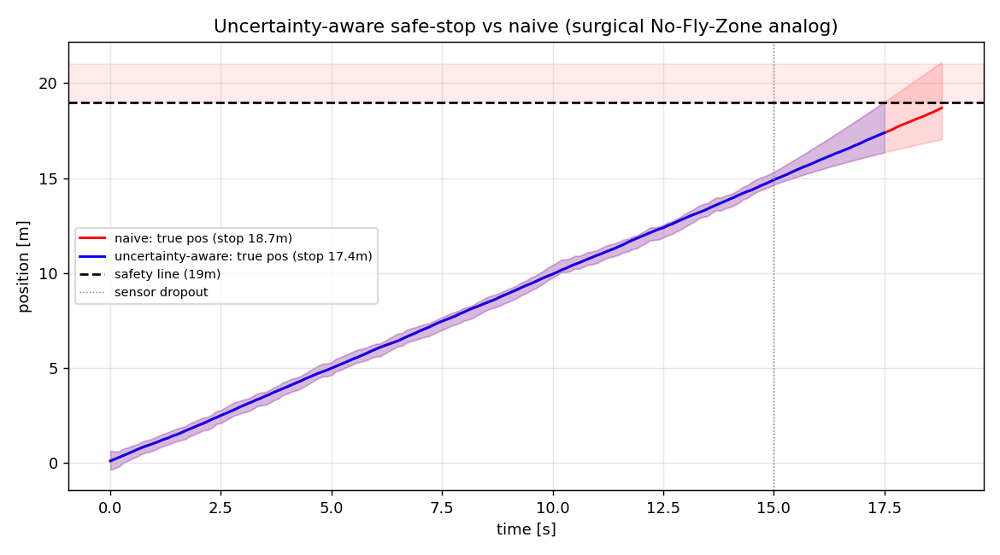

# 안전한 자율성 — 수술 로봇의 No-Fly-Zone을 상태추정으로 만들다

> 2026년 로봇 시장의 화두는 **자율성(autonomy)** 이다. 특히 의료·수술 로봇은
> "Task Autonomy"(반복 하위작업을 사람 감독 하 자율 수행)로 이동 중이고, 규제(FDA
> PCCP)는 *검증된, 점진적* 자율성을 요구한다. 그 핵심 안전장치가 실시간 **"No-Fly
> Zone"** — 중요 구조물(신경·혈관) 근처에서 자동 동작을 막는 것이다. 이 글은 그
> 안전 원리를 **상태추정 문제**로 환원해 밑바닥부터 구현한다.

## No-Fly-Zone의 본질은 "불확실성 관리"다

수술 로봇이 금지구역을 침범하는 이유는 대개 "위치를 잘못 알아서"다. 센서가 가려지거나
잡음이 커지면 로봇의 **자기 위치 추정 불확실도**가 커진다. 그런데 순진한 시스템은 그
불확실도를 무시하고 *추정 평균값만* 보고 "아직 여유 있다"고 판단한다 — 추정이 드리프트
하면 실제로는 금지구역에 들어가 있는데도.

핵심 통찰: **안전한 자율성 = 추정값 + 불확실도를 존중하는 마진.** "모를 때는 멈춘다."

## 실험 — 불확실도-인지 세이프스톱

자율 로봇이 금지구역 경계(19m 안전선)로 접근한다. 15m 지점부터 위치 센서가 끊겨 추정
불확실도(공분산)가 커진다. 두 정지 규칙을 300회 몬테카를로로 비교했다.

- **naive**: 추정 위치가 안전선에 닿으면 정지 (불확실도 무시)
- **uncertainty-aware**: 추정 위치 **+ k·σ**(불확실도 마진)가 안전선에 닿으면 정지

| 정지 규칙 | 금지구역 침범률 |
|-----------|----------------:|
| naive | **60%** |
| **uncertainty-aware** | **0%** |

센서가 끊긴 뒤 불확실도 밴드(음영)가 급격히 넓어진다. naive(빨강)는 드리프트한 추정을
믿고 안전선을 넘지만, uncertainty-aware(파랑)는 넓어진 σ만큼 마진을 키워 **~1.3m 일찍
멈춰** 침범을 100% 막는다. 대가는 약간의 보수성(더 일찍 정지) — 정확히 임상이 받아들이는
트레이드오프다.

## 왜 이게 내 경로의 핵심인가

이 데모는 세 가지를 한 점에 모은다:
1. **상태추정**(이 저장소의 EKF/SLAM/VIO) — 불확실도를 정량화하는 능력
2. **불확실도 게이팅**([signal-ml-lab](https://github.com/YeonkyunLee/signal-ml-lab)의
   앙상블 안전게이트·선택적 진단) — "모를 때 넘긴다"
3. **안전·규제 관점** — 검증·안전이 자율 시스템 배포의 관문

2026 시장이 원하는 것과 정확히 겹친다:
- 수술 로봇 CAGR 16.5%, "Task Autonomy" + No-Fly-Zone으로 이동
- FDA PCCP로 *검증된* 자율성 확장
- 임상·진단 랩 자동화 최고 성장(ABB×Roche 등)

DSP·임베디드·ML·상태추정·안전 설계를 **한 몸에** 가진 사람은 드물다. 그 교집합이 바로
"안전하고 배포 가능한 의료·진단 자율 시스템"이다.

## 남은 길
- 불확실도 마진을 실제 비용(침범 위험 vs 조기정지 손실)으로 보정
- VIO/SLAM 추정 공분산을 그대로 안전 게이트에 연결(엔드투엔드)
- 의료·랩 자동화 등 인접 문제로 확장(공개 데이터·시뮬 기반)

---
*데이터는 합성. 코드: `sensor-fusion-lab`, `scripts/09_safe_autonomy.py`,
`scripts/08_vio.py`. 개인 사이드 프로젝트 — 공개/합성 데이터만 사용.*
